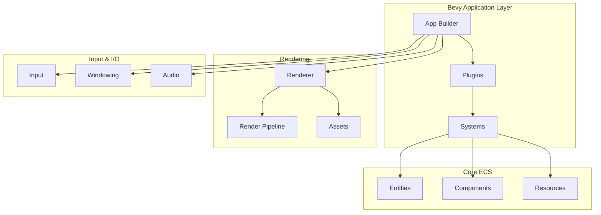

Bevy is a refreshingly simple data-driven game engine built in Rust that prioritizes developer productivity, performance, and modularity. As an open-source project, Bevy provides a complete game development framework that's both approachable for beginners and powerful for experienced developers. The engine leverages Rust's ownership system and type safety while offering data-oriented architecture through the Entity Component System (ECS) paradigm [README.md](/README.md#L6-L30).


## Core Philosophy and Design Goals

Bevy's architecture is built around six fundamental design principles that guide its development: **capability**, **simplicity**, **data focus**, **modularity**, **speed**, and **productivity**. These goals manifest in a system that offers complete 2D and 3D feature sets, uses an ECS for data-oriented design, allows selective feature adoption, enables parallel execution, and prioritizes fast compile times [README.md](/README.md#L18-L26). The engine's data-focused approach means game logic operates on collections of data rather than complex object hierarchies, enabling efficient memory access patterns and cache-friendly operations.

The modular design extends to Bevy's crate structure, where the main `bevy` crate serves as a container that re-exports subcrates. This allows developers to use the full-featured default configuration or selectively include only the functionality they need, from individual components like `bevy_ecs` and `bevy_render` to specialized systems for animation, audio, or UI [src/lib.rs](/src/lib.rs#L35-L45).

## Architecture Overview

At its foundation, Bevy employs an Entity Component System (ECS) architecture that separates data from behavior. Entities are unique identifiers, components are pure data structures, and systems are functions that operate on queries of entities with specific component combinations [crates/bevy_ecs/src/lib.rs](/crates/bevy_ecs/src/lib.rs#L48-L72). This design enables high-performance, cache-efficient operations while maintaining code flexibility.



The engine organizes functionality through a plugin system where plugins configure and register systems, resources, and events. Applications start by creating an `App` builder, adding plugins like `DefaultPlugins` for standard functionality, registering systems with schedules like `Startup` or `Update`, and then running the application [examples/3d/3d_scene.rs](/examples/3d/3d_scene.rs#L6-L11). Systems are the primary unit of game logic, executing according to configurable schedules that determine execution order and parallelization opportunities.

## Feature Set Capabilities

Bevy provides a comprehensive set of features organized into modular subsystems that can be combined or excluded based on project requirements:

| Feature Category | Description | Key Crates |
|-----------------|-------------|------------|
| **2D Rendering** | Sprite rendering, sprite sheets, 2D cameras, picking | `bevy_sprite`, `bevy_sprite_render` |
| **3D Rendering** | PBR materials, lighting, shadows, glTF support | `bevy_pbr`, `bevy_gltf`, `bevy_light` |
| **User Interface** | Declarative UI widgets, layout systems, interaction | `bevy_ui`, `bevy_ui_widgets` |
| **Animation** | Keyframe animation, blend trees, state machines | `bevy_animation` |
| **Audio** | Spatial audio, streaming, multiple format support | `bevy_audio`, `bevy_gilrs` |
| **Physics & Math** | Vector math, transforms, collision detection | `bevy_math`, `bevy_transform` |
| **Asset System** | Hot reloading, custom asset types, dependency tracking | `bevy_asset`, `bevy_scene` |
| **Development Tools** | Debugging, diagnostics, gizmos, inspector | `bevy_dev_tools`, `bevy_diagnostic` |

The rendering system is particularly noteworthy, built on top of wgpu for cross-platform graphics support with features like PBR materials, anti-aliasing, post-processing effects, and efficient batching [crates/bevy_render/src/lib.rs](/crates/bevy_render/src/lib.rs#L1-L15). Bevy supports multiple rendering backends and graphics APIs through wgpu, including Vulkan, DirectX, Metal, and WebGL/WebGPU, enabling deployment to desktop, mobile, and web platforms.

## Project Structure

The Bevy repository is organized as a monorepo containing multiple crates that implement different engine subsystems:


```
bevy/
├── crates/              # Core engine crates
│   ├── bevy_app/        # Application builder and plugins
│   ├── bevy_ecs/        # Entity Component System
│   ├── bevy_render/     # Rendering engine
│   ├── bevy_asset/      # Asset loading and management
│   ├── bevy_input/      # Input handling
│   ├── bevy_window/     # Window management
│   ├── bevy_sprite/     # 2D sprite functionality
│   ├── bevy_pbr/        # 3D PBR rendering
│   ├── bevy_ui/         # UI system
│   └── ...              # Additional feature crates
├── examples/            # Example applications
├── assets/              # Example assets and branding
└── docs/                # Additional documentation
```

Each crate in the `crates/` directory implements a distinct piece of engine functionality and can be used independently. The main `bevy` crate aggregates these subcrates, providing a convenient import path through the prelude [crates/bevy_app/src/lib.rs](/crates/bevy_app/src/lib.rs#L53-L68). This modularity enables developers to reduce binary size and compile times by only including the features they need.

<CgxTip>
Bevy's modular architecture allows you to enable only the features you need via Cargo features. For example, `bevy = { version = "0.18", default-features = false, features = ["2d"] }` includes only 2D functionality, significantly reducing compile times and binary size compared to the full default feature set [docs/cargo_features.md](/docs/cargo_features.md#L15-L24).
</CgxTip>

## Getting Started with Examples

The fastest way to understand Bevy is through its extensive collection of examples that demonstrate core concepts and patterns. The simplest example shows the basic structure of a Bevy application:

```rust
use bevy::prelude::*;

fn main() {
    App::new()
        .add_systems(Update, hello_world_system)
        .run();
}

fn hello_world_system() {
    println!("hello world");
}
```

[examples/hello_world.rs](/examples/hello_world.rs#L1-L12)

This demonstrates the fundamental pattern: create an `App`, add systems with schedules, and run the application. More complex examples show rendering scenes, handling input, loading assets, and implementing game logic [examples/2d/sprite.rs](/examples/2d/sprite.rs#L1-L19).

## Cross-Platform and Modular Features

Bevy supports multiple platforms through its modular feature system, enabling deployment to Windows, macOS, Linux, Web (WASM), Android, and iOS. Cargo features control platform support, functionality inclusion, and performance optimizations [docs/cargo_features.md](/docs/cargo_features.md#L1-L10). The feature system is organized into profiles (high-level feature groups), collections (mid-level feature groups), and individual features for fine-grained control.

For example, the `2d` profile includes core framework, 2D functionality, UI, scenes, audio, and picking, while excluding 3D-specific features. This selective compilation approach makes Bevy suitable for everything from simple 2D games to complex 3D applications and even headless server applications that don't require rendering at all [docs/cargo_features.md](/docs/cargo_features.md#L16-L28).

<CgxTip>
During development, enable the `dev` feature (`bevy = { features = ["dev"] }`) to get asset hot-reloading, debugging tools, and other development-time improvements. Remember to disable this before publishing your application to avoid unnecessary dependencies and larger binaries [docs/cargo_features.md](/docs/cargo_features.md#L34-L38).
</CgxTip>

## Next Steps

This overview provides a foundation for understanding Bevy's architecture and capabilities. To continue your journey:

- Follow the **[Quick Start](2-quick-start)** guide for step-by-step setup and your first Bevy application
- Learn about **[Installation and Development Environment](3-installation-and-development-environment)** to configure your workspace
- Understand the **[Entity Component System (ECS)](9-entity-component-system-ecs)** architecture that powers Bevy
- Explore the **[App and Plugin System](10-app-and-plugin-system)** for organizing application logic

Bevy's combination of Rust's safety guarantees, ECS performance, and a passionate community makes it an excellent choice for game development whether you're building your first game or a complex commercial application [README.md](/README.md#L85-L95).
