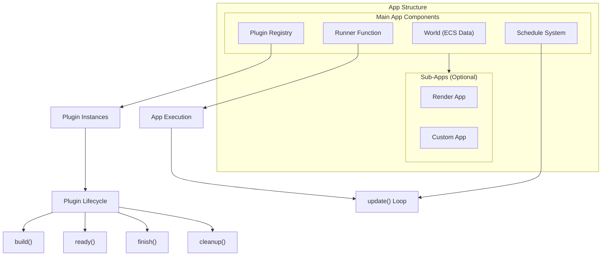
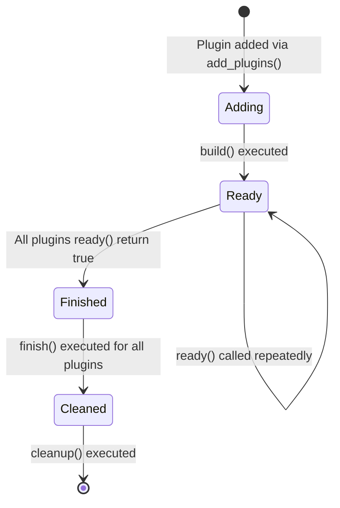
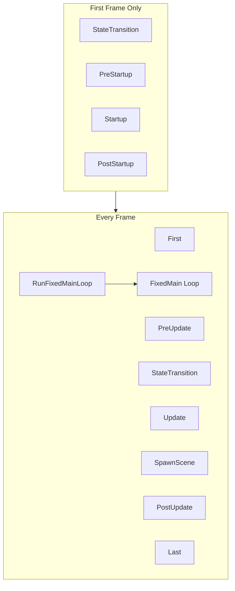

The App and Plugin System forms the architectural foundation of Bevy applications, providing a modular, composable framework for building complex applications through plugins and hierarchical application structure. This system enables code organization, lifecycle management, and flexible execution patterns while maintaining Bevy's core principles of modularity and extensibility.

## Architecture Overview

Bevy's application architecture centers around the `App` type, which serves as the primary API for configuring and running applications. The system follows a plugin-oriented design where all engine features—including rendering, input handling, and physics—are implemented as plugins that can be selectively enabled and configured.



Sources: [app.rs](crates/bevy_app/src/app.rs#L57-L95), [plugin.rs](crates/bevy_app/src/plugin.rs#L5-L92), [sub_app.rs](crates/bevy_app/src/sub_app.rs#L64-L80)

### Core Components

**App**: The central application type that orchestrates plugins, schedules, and ECS worlds. An App contains a main `SubApp` and can optionally contain additional `SubApp` instances for specialized processing (such as rendering on a separate thread). The App manages the application lifecycle through a runner function, which can be customized for different execution patterns.

Sources: [app.rs](crates/bevy_app/src/app.rs#L84-L95)

**SubApp**: A secondary application with its own `World` that can run independently of the main app. SubApps are essential for scenarios requiring separate processing contexts, such as rendering pipelines that need to operate on their own world while extracting data from the main world.

Sources: [sub_app.rs](crates/bevy_app/src/sub_app.rs#L20-L63)

**Plugin**: The fundamental unit of modularity in Bevy. Plugins encapsulate related functionality—components, resources, systems, and configuration—and follow a defined lifecycle that ensures proper initialization and cleanup.

Sources: [plugin.rs](crates/bevy_app/src/plugin.rs#L57-L92)

## Plugin Lifecycle

Plugins in Bevy follow a sophisticated four-phase lifecycle that enables complex initialization sequences and inter-plugin dependencies:



Sources: [plugin.rs](crates/bevy_app/src/plugin.rs#L16-L22), [app.rs](crates/bevy_app/src/app.rs#L234-L298)

### Lifecycle Phases

**Build Phase**: When a plugin is added to an App via `add_plugins()`, the `build()` method is immediately invoked. This is where plugins register their systems, resources, and configuration. The build phase is the only mandatory phase—all other methods have default implementations.

Sources: [plugin.rs](crates/bevy_app/src/plugin.rs#L58-L60)

**Ready Phase**: After all plugins have been built, the App repeatedly calls `ready()` on each plugin. Plugins return `true` when their initialization is complete. This enables asynchronous initialization patterns where plugins might need to wait for external resources (such as a renderer initialization).

Sources: [plugin.rs](crates/bevy_app/src/plugin.rs#L61-L66)

**Finish Phase**: Once all plugins report readiness, the App calls `finish()` on each plugin. This phase enables plugins to perform setup that depends on other plugins being fully initialized, such as establishing connections between subsystems.

Sources: [plugin.rs](crates/bevy_app/src/plugin.rs#L68-L72)

**Cleanup Phase**: The final lifecycle phase occurs just before the app begins executing its schedules. Plugins can remove temporary resources or transfer data to other threads. This is particularly useful for resources needed during plugin setup but not during runtime execution.

Sources: [plugin.rs](crates/bevy_app/src/plugin.rs#L74-L78)

## Creating Plugins

Plugins can be created in three distinct patterns, each suited to different use cases:

### Function-Based Plugins

The simplest form of plugin is a function that takes a mutable reference to an App. Any function with the signature `fn(&mut App)` automatically implements the `Plugin` trait.

```rust
use bevy::prelude::*;

fn my_plugin(app: &mut App) {
    app.add_systems(Update, hello_world_system);
}

fn hello_world_system() {
    println!("Hello from a function plugin!");
}

fn main() {
    App::new()
        .add_plugins(my_plugin)
        .run();
}
```

Sources: [plugin.rs](crates/bevy_app/src/plugin.rs#L26-L37)

### Struct-Based Plugins

For plugins requiring configuration or state, define a struct and implement the `Plugin` trait:

```rust
use bevy::prelude::*;
use core::time::Duration;

struct PrintMessagePlugin {
    wait_duration: Duration,
    message: String,
}

impl Plugin for PrintMessagePlugin {
    fn build(&self, app: &mut App) {
        let state = PrintMessageState {
            message: self.message.clone(),
            timer: Timer::new(self.wait_duration, TimerMode::Repeating),
        };
        app.insert_resource(state)
            .add_systems(Update, print_message_system);
    }
}

#[derive(Resource)]
struct PrintMessageState {
    message: String,
    timer: Timer,
}

fn print_message_system(mut state: ResMut<PrintMessageState>, time: Res<Time>) {
    if state.timer.tick(time.delta()).is_finished() {
        info!("{}", state.message);
    }
}

fn main() {
    App::new()
        .add_plugins(PrintMessagePlugin {
            wait_duration: Duration::from_secs(1),
            message: "Custom plugin message".to_string(),
        })
        .run();
}
```

Sources: [plugin.rs](crates/bevy_app/src/plugin.rs#L39-L56), [plugin.rs](examples/app/plugin.rs#L24-L40)

### Advanced Plugin Patterns

Plugins can control their uniqueness behavior and provide custom names for debugging:

```rust
struct ConfigurablePlugin {
    id: String,
}

impl Plugin for ConfigurablePlugin {
    fn build(&self, app: &mut App) {
        app.insert_resource(PluginId(self.id.clone()));
    }

    fn name(&self) -> &str {
        &self.id
    }

    fn is_unique(&self) -> bool {
        false // Allow multiple instances with different ids
    }
}
```

Sources: [plugin.rs](crates/bevy_app/src/plugin.rs#L81-L92)

## Plugin Groups

Plugin Groups provide a structured way to bundle multiple plugins together while maintaining the ability to customize their configuration, order, and enable/disable status. Bevy provides two built-in groups: `DefaultPlugins` (comprehensive engine features) and `MinimalPlugins` (core functionality only).

Sources: [plugin_group.rs](crates/bevy_app/src/plugin_group.rs#L200-L215)

### Creating Plugin Groups

Implement the `PluginGroup` trait by using `PluginGroupBuilder`:

```rust
use bevy::{app::PluginGroupBuilder, prelude::*};

pub struct HelloWorldPlugins;

impl PluginGroup for HelloWorldPlugins {
    fn build(self) -> PluginGroupBuilder {
        PluginGroupBuilder::start::<Self>()
            .add(PrintHelloPlugin)
            .add(PrintWorldPlugin)
    }
}

struct PrintHelloPlugin;
impl Plugin for PrintHelloPlugin {
    fn build(&self, app: &mut App) {
        app.add_systems(Update, print_hello_system);
    }
}

struct PrintWorldPlugin;
impl Plugin for PrintWorldPlugin {
    fn build(&self, app: &mut App) {
        app.add_systems(Update, print_world_system);
    }
}

fn main() {
    App::new()
        .add_plugins((DefaultPlugins, HelloWorldPlugins))
        .run();
}
```

Sources: [plugin_group.rs](examples/app/plugin_group.rs#L26-L35)

### Plugin Group Customization

`PluginGroupBuilder` provides powerful customization methods:

| Method | Purpose | Example |
|--------|---------|--------|
| `add<T>()` | Add plugin to end of group | `.add(MyPlugin)` |
| `add_before<Target>()` | Insert before specific plugin | `.add_before::<TargetPlugin>(MyPlugin)` |
| `add_after<Target>()` | Insert after specific plugin | `.add_after::<TargetPlugin>(MyPlugin)` |
| `disable<T>()` | Disable a plugin in the group | `.disable::<LogPlugin>()` |
| `set<T>()` | Replace an existing plugin | `.set(MyPlugin::new())` |

```rust
App::new()
    .add_plugins(
        DefaultPlugins
            .build()
            .disable::<LogPlugin>()
            .add_before::<WindowPlugin>(MyCustomPlugin),
    )
    .run();
```

Sources: [plugin_group.rs](crates/bevy_app/src/plugin_group.rs#L228-L396)

### Using the plugin_group! Macro

For simpler cases, the `plugin_group!` macro generates plugin group code with automatic documentation:

```rust
plugin_group! {
    /// Physics plugin group with all necessary components
    pub struct PhysicsPlugins {
        :TickratePlugin,
        collision::capsule:::CapsuleCollisionPlugin,
        velocity:::VelocityPlugin,
        #[cfg(feature = "external_forces")]
        features:::ForcePlugin,
        #[plugin_group]
        audio:::AudioPlugins,
    }
}
```

Sources: [plugin_group.rs](crates/bevy_app/src/plugin_group.rs#L12-L198)

## Main Schedule System

The main schedule defines the standard execution order for systems in a Bevy application. This schedule is automatically configured by the `MainSchedulePlugin` when you create an App.



Sources: [main_schedule.rs](crates/bevy_app/src/main_schedule.rs#L13-L48)

### Schedule Phases

| Schedule | Purpose | Typical Use Cases |
|----------|---------|-------------------|
| `PreStartup` | Before startup systems | Register components, setup initial state |
| `Startup` | Application initialization | Load resources, spawn initial entities |
| `PostStartup` | After startup systems | Validate initialization, cleanup temporary data |
| `First` | First in frame | Global state updates, message processing |
| `PreUpdate` | Preparation for Update | Process input events, update resources |
| `StateTransition` | State machine transitions | Handle state changes, run OnEnter/OnExit |
| `RunFixedMainLoop` | Fixed timestep management | Accumulate time, run FixedMain multiple times |
| `FixedUpdate` | Fixed-rate game logic | Physics, AI, networking |
| `Update` | Main game logic | Most gameplay systems |
| `SpawnScene` | Scene spawning | Load and instantiate scene data |
| `PostUpdate` | Reaction to changes | Update derived data, cleanup |
| `Last` | End of frame | Final updates, cleanup |

Sources: [main_schedule.rs](crates/bevy_app/src/main_schedule.rs#L59-L176)

### Fixed Timestep System

Bevy provides a sophisticated fixed timestep system through the `RunFixedMainLoop` schedule. This enables consistent physics simulation and network synchronization regardless of rendering framerate:

```rust
// Systems in FixedUpdate run at a fixed rate
App::new()
    .add_systems(FixedUpdate, physics_step)
    .add_systems(FixedUpdate, ai_update)
    .add_systems(Update, rendering) // Runs at variable framerate
    .run();
```

Sources: [main_schedule.rs](crates/bevy_app/src/main_schedule.rs#L94-L134)

## App Execution and Runners

The execution model of a Bevy application is controlled by its "runner" function. This function determines how and when the app's `update()` method is called, enabling support for different platforms and use cases.

Sources: [app.rs](crates/bevy_app/src/app.rs#L186-L228)

### Default Execution Patterns

Bevy provides plugins that configure runners for common scenarios:

**Windowed Applications** (`WinitPlugin`): Creates an OS-level window and runs an event loop that continuously updates the app at the display refresh rate. This is the default runner when using `DefaultPlugins`.

**Headless Applications** (`ScheduleRunnerPlugin`): Runs without windowing, either once or in a loop at a specified rate. Ideal for server applications, benchmarks, or CLI tools.

```rust
use bevy::{app::ScheduleRunnerPlugin, prelude::*};
use core::time::Duration;

// Run once and exit
App::new()
    .add_plugins(DefaultPlugins.set(ScheduleRunnerPlugin::run_once()))
    .add_systems(Update, process_once)
    .run();

// Run at 60 FPS without rendering
App::new()
    .add_plugins(
        DefaultPlugins
            .set(ScheduleRunnerPlugin::run_loop(Duration::from_secs_f64(1.0 / 60.0)))
            .disable::<LogPlugin>(),
    )
    .add_systems(Update, server_logic)
    .run();
```

Sources: [headless.rs](examples/app/headless.rs#L26-L46)

### Custom Runners

For complete control over application execution, provide a custom runner function:

```rust
use bevy::{app::AppExit, prelude::*};
use std::io;

#[derive(Resource)]
struct Input(String);

fn my_runner(mut app: App) -> AppExit {
    // Finalize plugin lifecycle
    app.finish();
    app.cleanup();

    println!("Type commands (type 'exit' to quit)");
    for line in io::stdin().lines() {
        {
            let mut input = app.world_mut().resource_mut::<Input>();
            input.0 = line.unwrap();
        }
        app.update();

        if let Some(exit) = app.should_exit() {
            return exit;
        }
    }

    AppExit::Success
}

fn main() -> AppExit {
    App::new()
        .insert_resource(Input(String::new()))
        .set_runner(my_runner)
        .add_systems(Update, (process_input, check_exit))
        .run()
}
```

Sources: [custom_loop.rs](examples/app/custom_loop.rs#L10-L49)

<CgxTip>When implementing custom runners, always call `app.finish()` and `app.cleanup()` before entering the update loop. These methods complete the plugin lifecycle, ensuring all plugins are properly initialized before the first update.</CgxTip>

## Sub-Apps and Data Extraction

Sub-Apps enable architectural separation by providing independent ECS worlds with their own schedules, while still allowing controlled data exchange through extraction functions.

Sources: [sub_app.rs](crates/bevy_app/src/sub_app.rs#L20-L63)

### Creating Sub-Apps

```rust
use bevy::{app::AppLabel, prelude::*};

#[derive(Debug, Clone, Copy, Hash, PartialEq, Eq, AppLabel)]
struct RenderApp;

#[derive(Resource, Default)]
struct MainData {
    value: i32,
}

#[derive(Resource, Default)]
struct RenderData {
    value: i32,
}

fn main() {
    App::new()
        .insert_resource(MainData { value: 100 })
        .add_systems(Update, modify_main_data)
        // Create and configure a sub-app
        .add_sub_app(RenderApp, |sub_app| {
            sub_app
                .update_schedule = Some(Main.intern())
                .insert_resource(RenderData { value: 0 })
                .set_extract(|main_world, render_world| {
                    // Copy data from main world to render world
                    let main_data = main_world.resource::<MainData>();
                    render_world.resource_mut::<RenderData>().value = main_data.value;
                })
                .add_systems(Main, render_system);
        })
        .run();
}

fn modify_main_data(mut data: ResMut<MainData>) {
    data.value += 1;
}

fn render_system(data: Res<RenderData>) {
    println!("Render sees value: {}", data.value);
}
```

Sources: [sub_app.rs](crates/bevy_app/src/sub_app.rs#L27-L63)

### Advanced Extraction Patterns

Sub-Apps provide the `take_extract()` method for composing extraction functions, essential when working with Bevy's built-in render app:

```rust
// When integrating with bevy_render's extraction
let mut default_extract = render_app.take_extract();

render_app.set_extract(move |main, render| {
    // Custom pre-extraction logic
    // ...
    
    // Call Bevy's default extraction
    if let Some(f) = default_extract.as_mut() {
        f(main, render);
    }
    
    // Custom post-extraction logic
    // ...
});
```

Sources: [sub_app.rs](crates/bevy_app/src/sub_app.rs#L174-L199)

## Advanced Plugin Patterns

### Plugin Inspection and Configuration

Bevy provides methods for inspecting and modifying plugins that have already been added:

```rust
#[derive(Default)]
struct ConfigurablePlugin {
    enabled: bool,
}

impl Plugin for ConfigurablePlugin {
    fn build(&self, app: &mut App) {
        if self.enabled {
            app.add_systems(Update, feature_system);
        }
    }
}

fn main() {
    let mut app = App::new();
    app.add_plugins(ConfigurablePlugin::default());
    
    // Check if plugin was added
    assert!(app.is_plugin_added::<ConfigurablePlugin>());
    
    // Access plugin configuration
    let plugins = app.get_added_plugins::<ConfigurablePlugin>();
    println!("Plugin enabled: {}", plugins[0].enabled);
}
```

Sources: [app.rs](crates/bevy_app/src/app.rs#L554-L585)

### Conditional Plugin Registration

Use the plugin state system to conditionally register plugins based on existing registrations:

```rust
fn add_optional_plugin(app: &mut App) {
    if !app.is_plugin_added::<PhysicsPlugin>() {
        app.add_plugins(FallbackPhysicsPlugin);
    }
}
```

### Error Handling in Plugins

The `add_boxed_plugin` method provides structured error handling for plugin registration failures:

```rust
// Duplicate detection prevents accidental double-registration
app.add_plugins(MyPlugin); // Works
app.add_plugins(MyPlugin); // Panics with "duplicate plugin" error
```

Sources: [app.rs](crates/bevy_app/src/app.rs#L508-L551)

<CgxTip>For plugins that may legitimately need multiple instances (such as per-region network handlers), override the `is_unique()` method to return `false`. Otherwise, duplicate detection will prevent registration.</CgxTip>

## Resource and Message Management

Apps manage global state through resources and messages, which are registered through the App API.

Sources: [app.rs](crates/bevy_app/src/app.rs#L416-L506)

### Resources

```rust
#[derive(Resource)]
struct GameState {
    score: u32,
    lives: u8,
}

impl Default for GameState {
    fn default() -> Self {
        GameState { score: 0, lives: 3 }
    }
}

App::new()
    .insert_resource(GameState { score: 100, lives: 5 }) // Override default
    .init_resource::<GameState>() // Use FromWorld/Default
    .add_systems(Update, game_logic);
```

### Messages

Messages provide event-like communication between systems without direct coupling:

```rust
use bevy_ecs::message::Message;

#[derive(Message)]
struct PlayerJump {
    player_id: u32,
    height: f32,
}

App::new()
    .add_message::<PlayerJump>()
    .add_systems(Update, handle_jumps);
```

Sources: [app.rs](crates/bevy_app/src/app.rs#L394-L414)

## Best Practices for Advanced Users

### Plugin Composition Guidelines

1. **Single Responsibility**: Design plugins around cohesive functionality. A plugin should do one thing well and depend on other plugins for related concerns.

2. **Configuration Over Code**: Use struct fields for plugin configuration rather than feature flags or environment variables. This enables multiple plugin instances with different settings.

3. **Lifecycle Awareness**: Respect the plugin lifecycle phases. Don't perform expensive initialization in `build()` that could block the plugin loading phase. Use `ready()` for asynchronous setup and `finish()` for inter-plugin dependencies.

4. **Plugin Group Organization**: Group related plugins together using `PluginGroup`. This provides a clean API surface while allowing internal reordering and customization.

### Performance Considerations

1. **System Placement**: Place systems in the appropriate schedule phase based on their dependencies. Input processing belongs in `PreUpdate`, not `Update`. Post-update cleanup belongs in `PostUpdate`, not `Update`.

2. **Sub-App Overhead**: Sub-Apps add complexity and extraction overhead. Only use them when true separation of concerns is needed, such as for rendering or background processing.

3. **Runner Selection**: Choose the appropriate runner for your platform. Windowed apps need `WinitPlugin`, servers need `ScheduleRunnerPlugin`, and custom scenarios may need custom runners.

### Testing Strategies

1. **Plugin Unit Tests**: Test plugin behavior by creating test apps and inspecting the resulting state:

```rust
#[cfg(test)]
mod tests {
    use super::*;

    #[test]
    fn test_plugin_registers_systems() {
        let mut app = App::new();
        app.add_plugins(MyPlugin);
        
        // Verify systems were registered
        let schedule = app.world().schedule(Update).unwrap();
        assert!(schedule.systems().len() > 0);
    }
}
```

2. **Sub-App Integration Tests**: Test extraction logic by manually calling extract and verifying data flow between worlds.

## Next Steps

With a solid understanding of the App and Plugin System, explore these related concepts:

- **[System Scheduling and Execution](11-system-scheduling-and-execution)**: Deep dive into the schedule system, system sets, and execution strategies.
- **[Entity Component System (ECS)](9-entity-component-system-ecs)**: Understanding the data model that underlies the App's World and SubApps.
- **[Change Detection System](12-change-detection-system)**: Learn how Bevy tracks state changes and efficiently updates resources.
- **[Rendering Architecture](13-rendering-architecture)**: See how the render SubApp uses extraction for pipelined rendering.

The App and Plugin System is the foundation that ties all of Bevy's features together. Master it, and you'll be equipped to build complex, modular applications that scale with your needs.
