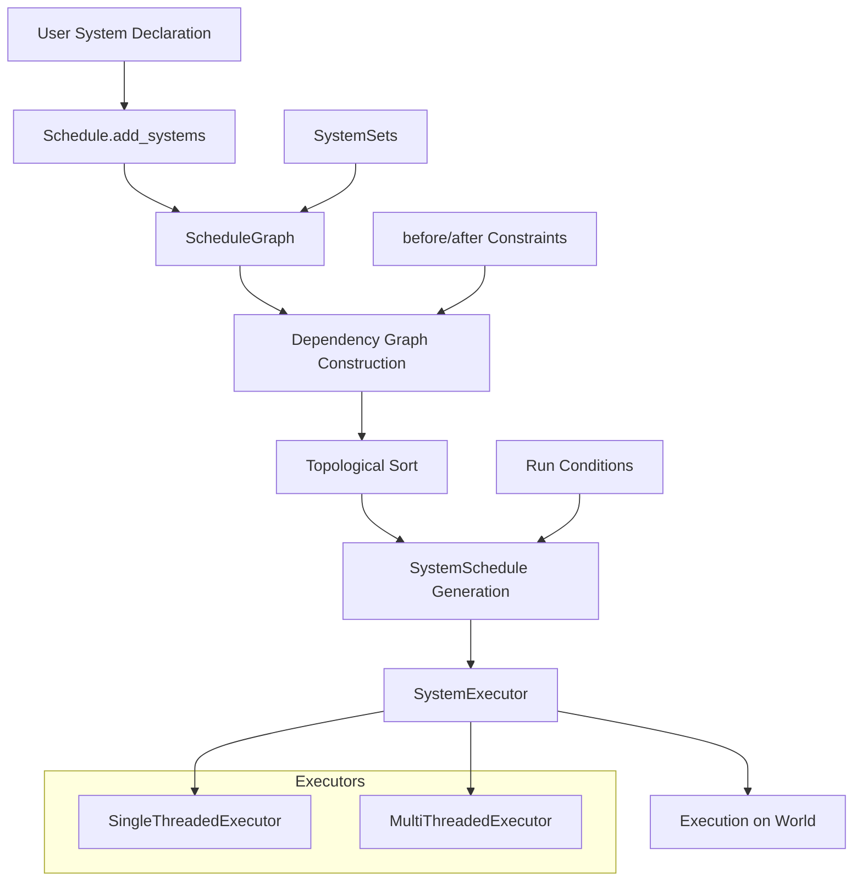
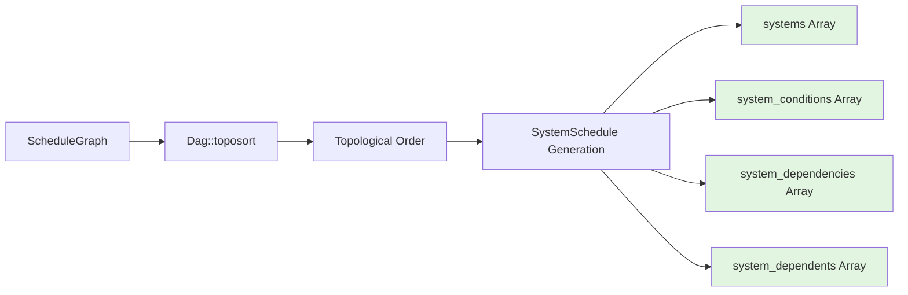
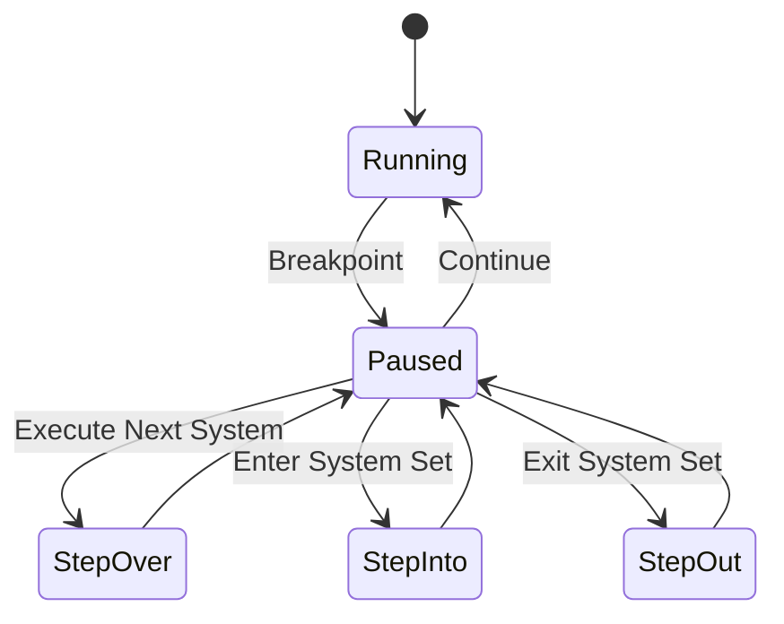

The system scheduling and execution model in Bevy represents a sophisticated dependency-aware architecture that orchestrates thousands of systems across the application lifecycle. This architecture transforms system declarations into optimized execution graphs, managing parallelism, resource contention, and conditional execution with minimal overhead.

## Schedule Architecture Overview

Bevy's scheduling system operates through a layered architecture that separates system declaration, dependency resolution, and execution concerns. At its core, the `Schedule` struct manages a `ScheduleGraph` for dependency relationships and a `SystemSchedule` for optimized execution, orchestrated by pluggable executors that implement the `SystemExecutor` trait. This separation enables declarative system ordering with imperative execution strategies.

The scheduling pipeline transforms user-defined systems through multiple phases: configuration processing, dependency graph construction, topological sorting, and executor preparation. The `ScheduleGraph` maintains metadata about system sets, hierarchical relationships, and explicit ordering constraints, while the dependency graph uses a directed acyclic graph (DAG) to encode precedence constraints between systems and sets.



The executor abstraction provides two primary execution strategies: `SingleThreadedExecutor` for sequential execution and `MultiThreadedExecutor` for parallel execution when system access patterns permit. Executors receive a fully-resolved `SystemSchedule` containing systems sorted in topological order, along with dependency information for parallelization decisions.
Sources: [schedule.rs](crates/bevy_ecs/src/schedule/schedule.rs#L350-L400), [executor/mod.rs](crates/bevy_ecs/src/schedule/executor/mod.rs#L25-L60)

## System Registration and Configuration

System registration occurs through the `add_systems` API, which accepts variadic system arguments and optional configuration modifiers. Each system is wrapped in a `ScheduleSystem` and added to the `ScheduleGraph`, where it receives a unique `SystemKey` for identification within the schedule. The graph maintains a registry of system types, system sets, and their relationships through `GraphInfo` metadata attached to each node.

The configuration system supports fluent chaining through `IntoScheduleConfigs`, enabling developers to specify ordering constraints (`before`, `after`), run conditions, and system set membership in a single expression. Systems are automatically assigned to a `SystemTypeSet` based on their function type, allowing individual system addressing in configuration expressions.

```rust
// Example: System configuration with ordering and conditions
schedule.add_systems((
    player_movement
        .in_set(PhysicsSet::Movement)
        .after(InputSet::Processing),
    physics_update
        .in_set(PhysicsSet::Simulation)
        .before(PhysicsSet::Collision),
    collision_detection
        .run_if(in_state(GameState::Playing))
        .ambiguous_with(player_movement),
));
```

System sets provide hierarchical grouping that enables bulk configuration and logical organization. Sets can be derived types implementing `SystemSet` or anonymous sets created dynamically. The hierarchy system maintains parent-child relationships, allowing constraints to propagate through the set tree. When a set is configured, its constraints apply to all member systems unless explicitly overridden at the system level.
Sources: [schedule.rs](crates/bevy_ecs/src/schedule/schedule.rs#L380-L420), [node.rs](crates/bevy_ecs/src/schedule/node.rs), [set.rs](crates/bevy_ecs/src/schedule/set.rs)

## Dependency Graph Construction

The dependency graph emerges from a complex process of constraint resolution and graph optimization. The `ScheduleGraph` aggregates three types of relationships: hierarchical memberships in set hierarchies, explicit ordering constraints (before/after), and ambiguity annotations that suppress conflict detection. These relationships are stored as edges in a DAG, where nodes represent systems or system sets.

The graph construction phase processes all configuration entries and builds a unified representation of scheduling constraints. This includes expanding system sets to their member systems, resolving transitive relationships, and detecting cycles. The `Dag` structure maintains the topological ordering as a cached property, recomputing only when the graph becomes dirty due to modifications.

<CgxTip>Graph optimization occurs through transitive reduction, which removes redundant edges that are implied by other paths. This reduces the complexity of dependency checking during execution while preserving the essential ordering constraints. The optimization is performed after topological sort validates the graph's acyclic nature.</CgxTip>

The dependency resolution algorithm handles multiple edge types:
- **Hierarchy edges**: Represent system membership in sets
- **Before/After edges**: Explicit ordering constraints between systems or sets
- **Ambiguity edges**: Suppress conflict detection between specified systems

The graph supports both direct constraints (system-to-system) and indirect constraints (system-to-set, set-to-system, set-to-set), with the latter being expanded to their constituent systems during graph processing.
Sources: [dag.rs](crates/bevy_ecs/src/schedule/graph/dag.rs#L1-L100), [graph/mod.rs](crates/bevy_ecs/src/schedule/graph/mod.rs), [schedule.rs](crates/bevy_ecs/src/schedule/schedule.rs#L600-L800)

## Topological Sorting and SystemSchedule Generation

The topological sort phase transforms the dependency graph into a linear execution order that respects all constraints. The `Dag` structure implements Kahn's algorithm for topological sorting, detecting cycles and returning `DiGraphToposortError` if the graph cannot be linearized. The sort produces a vector of node IDs that represents a valid execution sequence.

The `SystemSchedule` is the execution-ready representation containing systems, conditions, and dependency information in indexed arrays. Arrays are ordered identically, enabling O(1) access through node indices. Key structures include:
- `systems`: Vector of `SystemWithAccess` containing the system and its access pattern
- `system_conditions`: Vector of condition predicates for each system
- `system_dependencies`: Count of immediate predecessors for dependency-based execution
- `system_dependents`: List of immediate successors for parallelization decisions
- `sets_with_conditions_of_systems`: Bitset tracking set conditions affecting each system



Conditions are evaluated in hierarchical order, with system sets evaluated before their member systems. If a set's condition fails, all member systems are skipped without individual evaluation. This optimization reduces condition evaluation overhead for large schedules with complex condition hierarchies.
Sources: [dag.rs](crates/bevy_ecs/src/schedule/graph/dag.rs#L100-L200), [executor/mod.rs](crates/bevy_ecs/src/schedule/executor/mod.rs#L60-L120)

## Execution Strategies

Bevy provides two executor implementations with fundamentally different execution models. The executor is selected via `ExecutorKind`, which defaults to `MultiThreaded` on platforms with threading support and `SingleThreaded` on Wasm or when `std` is unavailable.

### Single-Threaded Execution

The `SingleThreadedExecutor` iterates through the topologically sorted systems sequentially, evaluating conditions and executing systems when all conditions pass. This executor provides deterministic execution order and minimal overhead, making it ideal for:
- Wasm environments without threading
- Debugging scenarios requiring predictable execution
- Systems with heavy resource contention that would not benefit from parallelization

The executor processes systems in the order specified by the `SystemSchedule.system_ids` array, checking all conditions before execution. After each system runs, the executor decrements dependency counters for successor systems, enabling them to run when all dependencies are satisfied.

```rust
// Simplified single-threaded execution flow
for system_id in &schedule.system_ids {
    if !evaluate_conditions(system_id, schedule, world) {
        continue;
    }
    
    schedule.systems[system_id].system.run(world);
    
    // Mark as completed for dependent systems
    for dependent in &schedule.system_dependents[system_id] {
        schedule.system_dependencies[*dependent] -= 1;
    }
}
```

Sources: [executor/single_threaded.rs](crates/bevy_ecs/src/schedule/executor/single_threaded.rs)

### Multi-Threaded Execution

The `MultiThreadedExecutor` implements work-stealing parallel execution using a thread pool. Systems are partitioned into independent batches that can execute concurrently based on their access patterns. The executor analyzes the dependency graph to identify systems with no conflicting resource access and schedules them in parallel across available threads.

The parallelization algorithm uses the dependency counts (`system_dependencies`) to determine when a system is ready for execution. Systems are placed in a work queue when their dependency count reaches zero, and worker threads continuously dequeue and execute ready systems. This approach maximizes parallelism while respecting ordering constraints and data races.

The executor employs `FixedBitSet` for efficient system skipping, enabling conditional execution without synchronization overhead. Systems that fail conditions or belong to disabled sets are marked in the bitset, and workers skip them without evaluation.

<CgxTip>Multi-threaded execution automatically applies deferred system parameters (`Commands`, `Deref` buffers) between systems when dependencies exist. If system B depends on system A and A uses Commands, the executor automatically applies A's buffers before B executes, ensuring visibility of changes without explicit `ApplyDeferred` nodes.</CgxTip>

Sources: [executor/multi_threaded.rs](crates/bevy_ecs/src/schedule/executor/multi_threaded.rs), [executor/mod.rs](crates/bevy_ecs/src/schedule/executor/mod.rs#L120-L200)

## Command Buffer Management

The `ApplyDeferred` system provides automatic command buffer flushing at strategic points in the schedule. Commands represent deferred world mutations (entity spawning, component insertion) that must be applied explicitly to maintain query consistency. The scheduling system automatically inserts `ApplyDeferred` nodes based on system access patterns and dependencies.

By default, `ApplyDeferred` nodes are inserted:
1. Between systems with dependencies when the predecessor uses deferred buffers
2. At the end of the schedule if any system used deferred buffers
3. At points explicitly requested via `.before(ApplyDeferred)` or `.after(ApplyDeferred)`

The `auto_insert_apply_deferred` build pass analyzes the dependency graph and inserts `ApplyDeferred` nodes where needed. This pass can be disabled via `ScheduleBuildSettings` for manual control over command buffer application points.

```rust
// Explicit ApplyDeferred configuration
schedule.add_systems((
    system_with_commands,
    ApplyDeferred,
    system_reading_commands_results,
));

// Or disable automatic insertion for manual control
schedule.set_build_settings(ScheduleBuildSettings {
    auto_insert_apply_deferred: false,
    ..default()
});
```

Command buffer management is critical for system correctness, as queries cannot observe unapplied mutations. The automatic insertion ensures correct ordering with minimal developer intervention, while manual control enables optimization for specific use cases.
Sources: [executor/mod.rs](crates/bevy_ecs/src/schedule/executor/mod.rs#L130-L150), [auto_insert_apply_deferred.rs](crates/bevy_ecs/src/schedule/auto_insert_apply_deferred.rs)

## Ambiguity Detection and Resolution

The ambiguity detection system identifies systems with conflicting access patterns but indeterminate execution order. Two systems are ambiguous if they access the same components or resources in a conflicting manner (read/write, write/write) but have no ordering constraints between them. Ambiguities can lead to non-deterministic behavior and race conditions in parallel execution.

The detection algorithm builds a conflict matrix from system access patterns, marking systems with conflicting access. It then checks the dependency graph to determine if an ordering constraint exists, and reports ambiguous pairs as warnings. Developers can resolve ambiguities by:
1. Adding explicit ordering constraints (`.before()`, `.after()`)
2. Placing systems in system sets with defined ordering
3. Explicitly ignoring ambiguities via `.ambiguous_with()`

```rust
// Resolving ambiguities
schedule.add_systems((
    physics_system.ambiguous_with(rendering_system), // Explicit acknowledgment
    input_system.before(physics_system),            // Explicit ordering
));

// Global ambiguity suppression
world.resource_mut::<Schedules>()
    .ignore_ambiguity::<Transform>(PhysicsUpdate, Rendering);
```

The `Schedules` resource provides global ambiguity suppression for specific component or resource types across all schedules. This is useful when ambiguities are acceptable (e.g., independent systems that happen to share read access) or when introduced by third-party plugins that cannot be directly modified.
Sources: [schedule.rs](crates/bevy_ecs/src/schedule/schedule.rs#L100-L150), [schedule.rs](crates/bevy_ecs/src/schedule/schedule.rs#L420-L450)

## System Stepping and Debugging

The stepping system enables fine-grained control over system execution for debugging purposes. When the `bevy_debug_stepping` feature is enabled, schedules accept stepping commands that control execution granularity. This supports breakpoints, single-stepping, and selective system execution.

Stepping is implemented through a `FixedBitSet` that specifies which systems should execute. The executor checks this bitset before each system, skipping marked systems. Integration with the debugging system allows breakpoints and step commands to update the bitset dynamically during execution.



This debugging capability provides powerful inspection of system behavior without requiring extensive logging or print statements. Developers can inspect world state between system executions, track query results, and verify ordering constraints.
Sources: [stepping.rs](crates/bevy_ecs/src/schedule/stepping.rs), [schedule.rs](crates/bevy_ecs/src/schedule/schedule.rs#L500-L550)

## Schedule Build Pipeline and Customization

The schedule build process is extensible through `ScheduleBuildPass` traits, enabling custom transformations of the schedule before execution. Build passes are stored in a `TypeIdMap` and executed in registration order, allowing plugin authors to inject custom processing into the schedule construction pipeline.

Default build passes include `AutoInsertApplyDeferredPass`, which analyzes command buffer usage and inserts automatic flush points. Additional passes can be added via `Schedule::add_build_pass`, enabling custom validation, optimization, or instrumentation logic.

```rust
// Custom build pass example
pub struct ValidationPass;

impl ScheduleBuildPass for ValidationPass {
    fn apply(&self, schedule: &mut ScheduleGraph, world: &mut World) {
        // Custom validation logic
        for (key, system) in &schedule.systems {
            if system.has_forbidden_components() {
                warn!("System {:?} accesses forbidden components", key);
            }
        }
    }
}

schedule.add_build_pass(ValidationPass);
```

The `ScheduleBuildSettings` control build pass behavior and other configuration options. Settings include executor kind, automatic deferred insertion, and resource allocation hints. These settings are applied globally via `Schedules::configure_schedules` or per-schedule via `Schedule::set_build_settings`.
Sources: [pass.rs](crates/bevy_ecs/src/schedule/pass.rs), [auto_insert_apply_deferred.rs](crates/bevy_ecs/src/schedule/auto_insert_apply_deferred.rs), [config.rs](crates/bevy_ecs/src/schedule/config.rs)

## Performance Considerations

The scheduling system is designed for high performance with thousands of systems, but several factors affect execution efficiency:

**Graph construction overhead**: Dependency resolution occurs only when the graph is dirty, typically during initialization or after system addition/modification. The topological sort is cached and reused across schedule runs until modifications occur.

**Condition evaluation**: Conditions are evaluated for every system on every run, so complex conditions can become bottlenecks. Hierarchical conditions (set-level conditions) optimize evaluation by skipping entire subtrees when parent conditions fail.

**Memory allocation**: The scheduling system extensively uses `Vec` and index-based storage to minimize allocations during execution. System parameters and queries are pre-allocated during initialization.

**Parallelization overhead**: Multi-threaded execution introduces work-stealing overhead that may outweigh benefits for systems with short execution times. Benchmarking is recommended when choosing between single and multi-threaded executors.

**Access pattern optimization**: Using `ReadOnly` query parameters and minimizing resource conflicts increases parallelization opportunities. The `ParamSet` API enables non-conflicting access to the same data type within a single system.

## Integration with App and Plugin System

The scheduling system integrates with the app architecture through the `Schedules` resource, which maintains a registry of labeled schedules. The app lifecycle methods (`update`, `fixed_update`, `post_update`) correspond to standard schedule labels, but custom schedules can be created for specific purposes (e.g., startup, cleanup, rendering).

Plugins extend the scheduling system by adding systems to existing schedules or defining new schedules. The plugin system ensures systems are added in deterministic order based on plugin registration, enabling predictable composition of third-party systems.

```rust
// Plugin adding systems to custom schedule
struct MyPlugin;

impl Plugin for MyPlugin {
    fn build(&self, app: &mut App) {
        app.add_schedule(MyCustomSchedule)
           .add_systems(MyCustomSchedule, custom_system)
           .add_systems(Update, regular_system);
    }
}
```

This integration enables modular system organization while maintaining the performance characteristics of the centralized scheduling system.
Sources: [schedule.rs](crates/bevy_ecs/src/schedule/schedule.rs#L50-L100), [lib.rs](crates/bevy_ecs/src/lib.rs)

## Next Steps

Understanding system scheduling provides the foundation for advanced ECS patterns. For deeper exploration:

- Learn about [Query Patterns and Filters](25-query-patterns-and-filters) to understand system access patterns
- Explore [Change Detection System](12-change-detection-system) to understand system parameter change tracking
- Study [Observers and Events](27-observers-and-events) for event-driven system execution
- Review [Entity Component System (ECS)](9-entity-component-system-ecs) for foundational ECS concepts

The scheduling system's flexibility enables sophisticated game logic organization while maintaining high performance. Mastering its capabilities allows building complex, maintainable systems that scale with application complexity.
