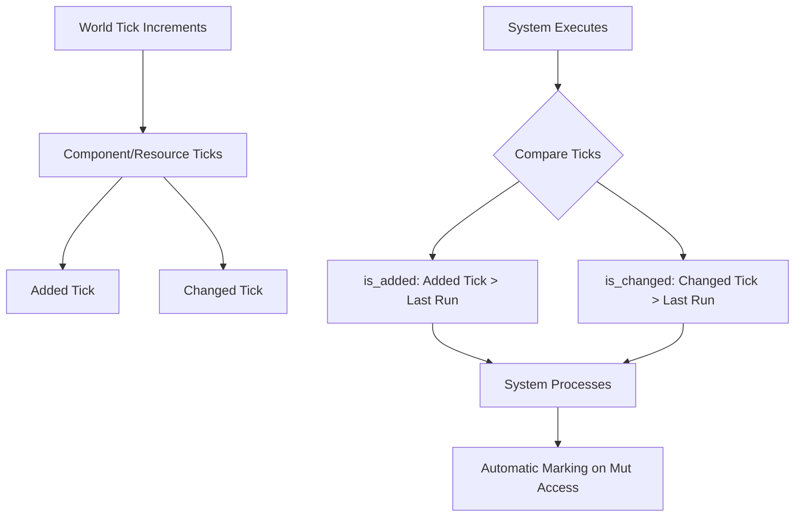

The Change Detection System in Bevy provides a sophisticated mechanism for tracking when components and resources are modified, enabling efficient, reactive game logic. Rather than continuously checking every entity, systems can selectively process only what has changed since their last execution, dramatically improving performance in complex scenarios.

## Core Architecture

At its foundation, the system uses a **tick-based tracking mechanism** where every component and resource records two critical timestamps: when it was added and when it was last modified. These timestamps are compared against a system's last execution tick to determine if changes occurred.



The system centers on the `Tick` type, which wraps a `u32` value representing a moment in time relative to the world's progression [change_detection/tick.rs#L18-L20](crates/bevy_ecs/src/change_detection/tick.rs#L18-L20). These ticks automatically wrap around using modular arithmetic, with periodic clamping operations preventing false positives from overflow [change_detection/mod.rs#L13-L26](crates/bevy_ecs/src/change_detection/mod.rs#L13-L26).

## Component and Resource Ticks

Each tracked piece of data maintains a `ComponentTicks` structure containing two tick values [change_detection/tick.rs#L137-L143](crates/bevy_ecs/src/change_detection/tick.rs#L137-L143):

- **added**: Records when the component or resource was first inserted into the world
- **changed**: Records when the component or resource was last mutably dereferenced

The comparison logic uses the `is_newer_than` method, which handles tick wraparound correctly by comparing the elapsed time relative to the current run [change_detection/tick.rs#L52-L62](crates/bevy_ecs/src/change_detection/tick.rs#L52-L62). This ensures accurate detection even when ticks overflow, a critical property for long-running applications.

<CgxTip>
The system uses a `MAX_CHANGE_AGE` constant (approximately 518 million ticks) to limit how long changes remain detectable. After this threshold, changes are considered "expired" to prevent integer overflow in tick comparisons. This allows the engine to run for years at 1000 ticks per second without false positives.</CgxTip>

## Smart Pointer Types

The change detection system is exposed through several smart pointer types that provide both data access and change tracking information.

### Immutable Access Types

**Ref\<T\>** provides shared access to components with change detection capability:

```rust
fn system(query: Query<Ref<MyComponent>>) {
    for component in &query {
        if component.is_added() {
            println!("New component!");
        }
        if component.is_changed() {
            println!("Modified component!");
        }
    }
}
```

**Res\<T\>** provides the same functionality for resources [change_detection/params.rs#L99-L102](crates/bevy_ecs/src/change_detection/params.rs#L99-L102). Both implement the `DetectChanges` trait, offering methods like `is_added()`, `is_changed()`, `last_changed()`, `added()`, and `changed_by()` [change_detection/traits.rs#L27-L53](crates/bevy_ecs/src/change_detection/traits.rs#L27-L53).

### Mutable Access Types

**Mut\<T\>** provides unique mutable access with automatic change tracking. Whenever you dereference or mutate through this pointer, the changed tick automatically updates [change_detection/params.rs#L415-L418](crates/bevy_ecs/src/change_detection/params.rs#L415-L418):

```rust
fn system(mut query: Query<Mut<MyComponent>>) {
    for mut component in query.iter_mut() {
        component.value = new_value; // Automatically marks as changed
        println!("Last changed at: {:?}", component.last_changed());
    }
}
```

**ResMut\<T\>** provides the same behavior for resources [change_detection/params.rs#L172-L175](crates/bevy_ecs/src/change_detection/params.rs#L172-L175). Both implement `DetectChangesMut`, which extends `DetectChanges` with control methods like `set_changed()`, `bypass_change_detection()`, and `set_if_neq()` [change_detection/traits.rs#L87-L130](crates/bevy_ecs/src/change_detection/traits.rs#L87-L130).

The table below summarizes the primary smart pointer types:

| Type | Access Pattern | Use Case | Change Detection |
|------|----------------|----------|------------------|
| `Ref<T>` | Immutable component access | Read queries needing change info | Read-only |
| `Mut<T>` | Mutable component access | Queries that modify components | Auto-tracks on mutation |
| `Res<T>` | Immutable resource access | Read-only resource access | Read-only |
| `ResMut<T>` | Mutable resource access | Modifying resources | Auto-tracks on mutation |
| `NonSend<T>` | Immutable non-Send resource | Non-thread-safe resources | Read-only |
| `NonSendMut<T>` | Mutable non-Send resource | Modifying non-Send resources | Auto-tracks on mutation |

## Query Filters

Bevy provides built-in query filters for efficient change-based iteration, allowing systems to process only entities with recent modifications.

### Added Filter

The `Added<T>` filter matches entities where component `T` was added since the system last ran [change_detection/filter.rs#L220-L237](crates/bevy_ecs/src/query/filter.rs#L220-L237):

```rust
fn system(query: Query<&MyComponent, Added<MyComponent>>) {
    // Only iterates entities with MyComponent added since last run
    for component in &query {
        println!("Component was added!");
    }
}
```

### Changed Filter

The `Changed<T>` filter matches entities where component `T` was modified since the system last ran [change_detection/filter.rs#L239-L256](crates/bevy_ecs/src/query/filter.rs#L239-L256):

```rust
fn system(query: Query<&Transform, Changed<Transform>>) {
    // Only iterates entities with Transform modified since last run
    for transform in &query {
        println!("Transform was modified!");
    }
}
```

These filters are archetypal—the engine can skip entire archetypes based on component addition/modification status, enabling O(1) filtering complexity rather than O(n).

## Manual Change Control

While the system automatically tracks changes through mutable dereferencing, you sometimes need explicit control.

### Bypassing Change Detection

The `bypass_change_detection()` method allows mutations without updating the changed tick [change_detection/traits.rs#L124-L130](crates/bevy_ecs/src/change_detection/traits.rs#L124-L130):

```rust
fn system(mut resource: ResMut<MyResource>) {
    // Modify without triggering change detection
    resource.bypass_change_detection().internal_value = 42;
}
```

This is useful for synchronizing representations or avoiding infinite recursion when multiple systems update the same data.

### Conditional Changes

The `set_if_neq()` method updates a value only if it differs, preventing unnecessary change triggers [change_detection/traits.rs#L178-L192](crates/bevy_ecs/src/change_detection/traits.rs#L178-L192):

```rust
fn system(mut resource: ResMut<Score>) {
    // Only marks as changed if the value actually changes
    resource.set_if_neq(Score(0));
}
```

For complex structs with multiple fields, you can use `map_unchanged()` to modify only specific portions without triggering full-component change detection [change_detection/traits.rs#L138-L142](crates/bevy_ecs/src/change_detection/traits.rs#L138-L142).

### Manual Change Marking

For components using interior mutability (like `RefCell` or `Mutex`), you must manually call `set_changed()` since the engine cannot detect mutations through these patterns [change_detection/traits.rs#L93-L99](crates/bevy_ecs/src/change_detection/traits.rs#L93-L99):

```rust
fn system(mut resource: ResMut<InteriorMutableResource>) {
    resource.value.borrow_mut().data = 42;
    resource.set_changed(); // Must manually report the change
}
```

## Location Tracking

When the `track_location` feature is enabled, the system records where each change originated through the `changed_by()` method, which returns a `MaybeLocation` containing the source code location [change_detection/maybe_location.rs#L11-L19](crates/bevy_ecs/src/change_detection/maybe_location.rs#L11-L19). This is invaluable for debugging unexpected state changes [change_detection/traits.rs#L51-L52](crates/bevy_ecs/src/change_detection/traits.rs#L51-L52).

The `MaybeLocation` type is a zero-cost abstraction—when the feature is disabled, it becomes a zero-sized type and all tracking code is removed by the optimizer [change_detection/maybe_location.rs#L11-L19](crates/bevy_ecs/src/change_detection/maybe_location.rs#L11-L19).

## Tick Management and Overflow Prevention

The tick system uses a `u32` counter that eventually wraps around. To handle this safely, the engine periodically runs `check_change_ticks()`, which clamps tick values older than `MAX_CHANGE_AGE` [change_detection/mod.rs#L121-L149](crates/bevy_ecs/src/change_detection/mod.rs#L121-L149). This prevents false positives from overflow.

The system emits a `CheckChangeTicks` event to allow custom data structures to participate in this maintenance process [change_detection/tick.rs#L88-L121](crates/bevy_ecs/src/change_detection/tick.rs#L88-L121).

<CgxTip>
The automatic tick clamping means changes older than approximately 518 million ticks (roughly 6 days at 1000 ticks/second, or 100 days at 60 ticks/second) will no longer be detected. For most games and real-time applications, this is more than sufficient. If you need longer-term change tracking, implement custom storage with manual tick management.</CgxTip>

## Practical Example

The following example demonstrates the full change detection workflow, simulating a population where systems selectively process only relevant entities [examples/change_detection.rs](crates/bevy_ecs/examples/change_detection.rs):

```rust
fn main() {
    let mut world = World::new();
    world.insert_resource(EntityCounter { value: 0 });
    let mut schedule = Schedule::default();
    
    schedule.add_systems((
        spawn_entities.in_set(SimulationSystems::Spawn),
        print_counter_when_changed.after(SimulationSystems::Spawn),
        age_all_entities.in_set(SimulationSystems::Age),
        print_changed_entities.after(SimulationSystems::Age),
    ));
    
    for iteration in 1..=10 {
        println!("Simulating frame {iteration}/10");
        schedule.run(&mut world);
    }
}

fn spawn_entities(mut commands: Commands, mut entity_counter: ResMut<EntityCounter>) {
    if rand::rng().random_bool(0.6) {
        commands.spawn(Age::default());
        entity_counter.value += 1; // Automatically triggers change detection
    }
}

fn print_counter_when_changed(entity_counter: Res<EntityCounter>) {
    if entity_counter.is_changed() {
        println!("Total entities spawned: {}", entity_counter.value);
    }
}

fn print_changed_entities(
    entities_with_added: Query<Entity, Added<Age>>,
    entities_with_changed: Query<(Entity, &Age), Changed<Age>>,
) {
    for entity in &entities_with_added {
        println!("{entity} has its first birthday!");
    }
    for (entity, age) in &entities_with_changed {
        println!("{entity} is now {age:?} frames old");
    }
}
```

## Integration with Other Systems

The change detection system integrates seamlessly with Bevy's broader architecture:

- **System Scheduling**: Changed systems can be run conditionally using `run_if` with resource change checks
- **Events**: The `CheckChangeTicks` event allows custom structures to participate in tick maintenance [change_detection/tick.rs#L88-L121](crates/bevy_ecs/src/change_detection/tick.rs#L88-L121)
- **Reflection**: Change ticks can be reflected for debugging and tooling purposes [change_detection/tick.rs#L13-L17](crates/bevy_ecs/src/change_detection/tick.rs#L13-L17)

## Next Steps

Now that you understand the Change Detection System, explore how it enables efficient game patterns:

- [Query Patterns and Filters](25-query-patterns-and-filters) - Learn advanced filtering techniques including change-based queries
- [System Scheduling and Execution](11-system-scheduling-and-execution) - Understand how change detection fits into system ordering and conditional execution
- [Observers and Events](27-observers-and-events) - Discover how change detection works with Bevy's reactive event system

For hands-on experimentation with change detection concepts, refer to the [change_detection example](crates/bevy_ecs/examples/change_detection.rs) in the bevy_ecs crate.
