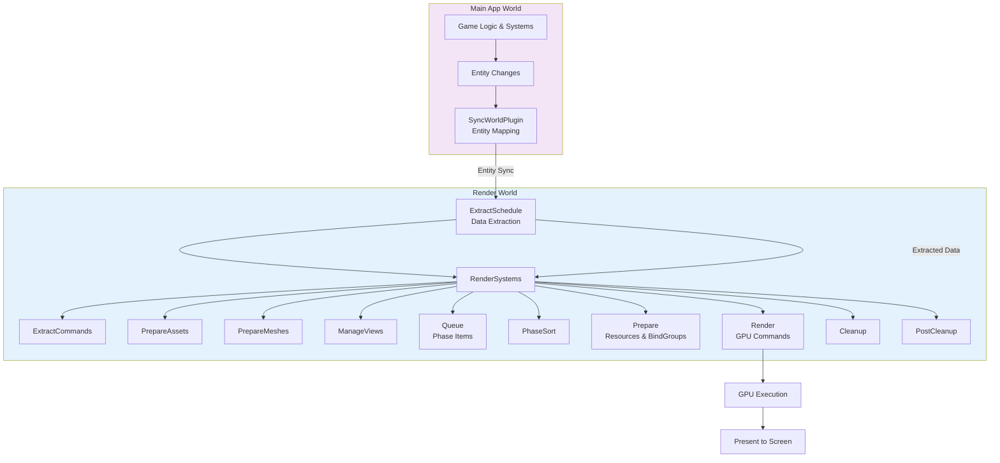

Bevy's rendering architecture is designed as a highly modular, parallel-capable system that separates game logic from GPU operations. This document explores the architectural foundations that enable the renderer to operate efficiently while maintaining clean separation of concerns between the main application world and the render world.

## Architectural Overview

At its core, Bevy employs a **dual-world architecture** where rendering operates in a separate ECS `World` that runs independently from the main application logic. This separation enables pipelined rendering—allowing frame N's simulation to run concurrently with frame N-1's rendering. The render world communicates with the main world through a structured extraction process that copies only the data needed for rendering each frame.

Sources: [crates/bevy_render/src/lib.rs](crates/bevy_render/src/lib.rs#L113-L120), [crates/bevy_render/src/pipelined_rendering.rs](crates/bevy_render/src/pipelined_rendering.rs#L68-L79)

The complete rendering pipeline can be visualized as:

## The Render World Concept

The render world exists as a separate `SubApp` created by the `RenderPlugin`. This isolation provides several architectural benefits:

- **Parallelism**: The render schedule can execute on a different thread from main app logic
- **Memory Separation**: Render-specific data doesn't pollute the main game state
- **Performance**: Only rendering-relevant components are extracted and processed
- **Safety**: Main world can continue processing while GPU commands are being built

The render world is initialized in `initialize_render_app`, which sets up both the `ExtractSchedule` and the main `Render` schedule with all necessary systems and resources. The render world maintains its own resources including the `RenderDevice`, `RenderQueue`, and GPU-specific resource caches.

Sources: [crates/bevy_render/src/lib.rs](crates/bevy_render/src/lib.rs#L402-L463)

## The Extraction Process

Extraction is the bridge between the main world and render world. During the `ExtractSchedule`, data is selectively copied from the main world to the render world. This process is designed to be fast and minimal to maximize pipelining potential.

### Component Extraction

Components that need to be rendered implement the `ExtractComponent` trait, typically via the `ExtractComponentPlugin`. This trait defines how to transform main-world component data into render-world equivalents. The `ExtractComponentPlugin` automatically manages the `SyncToRenderWorld` marker component, which enables entity synchronization between worlds.

Sources: [crates/bevy_render/src/extract_component.rs](crates/bevy_render/src/extract_component.rs#L1-L100)

### Resource Extraction

Global state and singleton resources implement `ExtractResource`, which provides a similar pattern for resource-level data. The `extract_resource` system checks for changes and only updates the render world when necessary, avoiding redundant copies.

Sources: [crates/bevy_render/src/extract_resource.rs](crates/bevy_render/src/extract_resource.rs#L14-L70)

### Entity Synchronization

The `SyncWorldPlugin` runs as the first step each frame, maintaining a bidirectional mapping between main world entities and their render world counterparts. This is achieved through `RenderEntity` and `MainEntity` marker components that store the corresponding entity IDs. Only entities with the `SyncToRenderWorld` component are synchronized, allowing selective synchronization.

Sources: [crates/bevy_render/src/sync_world.rs](crates/bevy_render/src/sync_world.rs#L17-L89)

## Pipelined Rendering

The `PipelinedRenderingPlugin` enables the render world to execute on a separate thread, allowing the main app to proceed with the next frame's simulation while the current frame renders. This creates a pipeline where frame N's simulation runs concurrently with frame N-1's rendering.

When enabled, the rendering timeline shifts:

```mermaid
gantt
    title Pipelined Rendering Timeline
    dateFormat X
    axisFormat %s
    
    section Main Thread
    Frame N Simulation      :active, 0, 16
    Frame N+1 Simulation    :16, 32
    Frame N+2 Simulation    :32, 48
    
    section Render Thread
    Frame N-1 Rendering     :0, 16
    Frame N Rendering       :active, 16, 32
    Frame N+1 Rendering     :32, 48
```

Pipelined rendering requires careful coordination through `RenderAppChannels`, which manage the transfer of the render app state between threads. The plugin ensures thread safety by blocking until the render app is available and handling cleanup properly on shutdown.

Sources: [crates/bevy_render/src/pipelined_rendering.rs](crates/bevy_render/src/pipelined_rendering.rs#L20-L54)

## Render Systems Schedule

The main render schedule is organized into a sequence of system sets, each with a specific responsibility in the rendering pipeline:

| System Set | Purpose |
|------------|---------|
| `ExtractCommands` | Applies commands generated during extraction |
| `PrepareAssets` | Prepares GPU representations of modified assets |
| `PrepareMeshes` | Processes mesh data for GPU upload |
| `ManageViews` | Creates and manages render targets (cameras, shadow maps) |
| `Queue` | Queues visible entities as phase items |
| `PhaseSort` | Sorts phase items for optimal rendering order |
| `Prepare` | Creates GPU resources and bind groups |
| `Render` | Issues actual GPU draw commands |
| `Cleanup` | Cleans up temporary resources |
| `PostCleanup` | Final cleanup and temporary entity despawning |

Sources: [crates/bevy_render/src/lib.rs](crates/bevy_render/src/lib.rs#L143-L191)

## Render Phases

Render phases are the primary abstraction for organizing draw calls. Each view (camera, shadow-casting light, etc.) can have multiple phases (opaque, transparent, shadow, etc.) with different sorting and batching requirements.

### Phase Items

Entities to be rendered are represented as `PhaseItem` objects, which contain the minimum information needed to render that entity. Two main types exist:

- **`SortedPhaseItem`**: Requires precise ordering (e.g., transparent objects sorted back-to-front)
- **`BinnedPhaseItem`**: Can be grouped into bins for batched rendering (e.g., opaque objects)

Phase items store batch metadata including the `CachedRenderPipelineId`, `DrawFunctionId`, and per-instance data necessary for rendering.

Sources: [crates/bevy_render/src/render_phase/mod.rs](crates/bevy_render/src/render_phase/mod.rs#L1-L26)

### Binned vs Sorted Rendering

The render phase system supports two rendering strategies:

**Binned Rendering**: Groups entities into bins based on shared properties (pipeline, material, mesh). Each bin can be rendered with a single draw call through instancing or indirect draws. This is ideal for opaque geometry where exact ordering isn't critical.

**Sorted Rendering**: Maintains a precise ordering of entities based on sorting criteria (distance, transparency). Used for transparent objects where rendering order affects the final image.

Sources: [crates/bevy_render/src/render_phase/mod.rs](crates/bevy_render/src/render_phase/mod.rs#L78-L150)

## Batching System

Batching is the process of combining multiple draw calls into fewer GPU commands, significantly reducing rendering overhead. Bevy implements sophisticated batching strategies with both CPU and GPU preprocessing options.

### Batching Criteria

Two draw commands can be batched together when they share:
- The same `CachedRenderPipelineId` (shader, pipeline state)
- The same `DrawFunctionId` (render command sequence)
- The same dynamic uniform offset (if applicable)
- Matching user data (material properties, per-instance uniforms)

The `BatchMeta` structure encapsulates these comparison criteria for determining batch compatibility.

Sources: [crates/bevy_render/src/batching/mod.rs](crates/bevy_render/src/batching/mod.rs#L28-L70)

### GPU Preprocessing

For platforms with storage buffer support, Bevy can offload batch preparation work to the GPU. This involves:
1. CPU collects instance data and prepares buffers
2. GPU culls and prepares indirect draw parameters
3. Renderer issues indirect draw commands

This approach reduces CPU overhead and enables better parallelism between data preparation and rendering.

Sources: [crates/bevy_render/src/batching/gpu_preprocessing.rs](crates/bevy_render/src/batching/mod.rs#L21-L22)

### NoAutomaticBatching Component

The `NoAutomaticBatching` component can be added to entities to disable automatic batching. This is useful for special-case rendering where individual draw calls are necessary (e.g., debugging visualization, custom rendering passes).

Sources: [crates/bevy_render/src/batching/mod.rs](crates/bevy_render/src/batching/mod.rs#L24-L26)

## Render Resources

Render resources provide a wgpu-based abstraction for GPU objects, enabling cross-platform graphics programming. These include:

- **Buffers**: Vertex buffers, index buffers, uniform buffers, storage buffers
- **Textures**: 2D textures, cube maps, render targets
- **Pipelines**: Render pipelines, compute pipelines, pipeline layouts
- **BindGroups**: Grouped resource bindings for shaders
- **Samplers**: Texture sampling configuration

The `RenderResource` module re-exports wgpu types and adds Bevy-specific abstractions like `GpuArrayBuffer` and specialized buffer types for efficient GPU data management.

Sources: [crates/bevy_render/src/render_resource/mod.rs](crates/bevy_render/src/render_resource/mod.rs#L1-L86)

## Render Asset Preparation

Assets that require GPU preparation (meshes, textures, materials) implement the `RenderAsset` trait, which defines the transformation from main-world assets to GPU-ready representations.

### The RenderAsset Lifecycle

1. **Extraction**: `RenderAsset::take_gpu_data` moves GPU-relevant data from the source asset
2. **Preparation**: `RenderAsset::prepare_asset` transforms extracted data into GPU resources
3. **Usage**: Prepared assets are referenced by render phases during rendering
4. **Cleanup**: `RenderAsset::unload_asset` handles resource cleanup

### Asset Preparation Error Handling

The `PrepareAssetError` enum handles cases where asset preparation cannot complete immediately, allowing retry in the next frame. This is useful for assets that depend on asynchronous operations or GPU resource availability.

Sources: [crates/bevy_render/src/render_asset.rs](crates/bevy_render/src/render_asset.rs#L40-L100)

## RenderContext and Command Submission

The `RenderContext` system parameter provides access to command encoders and the render device for issuing GPU commands within render systems. It manages command buffer lifecycle automatically, ensuring correct submission order and efficient buffer reuse.

The `PendingCommandBuffers` resource collects all command buffers generated during the render schedule, which are then submitted to the GPU queue in the main `render_system`. This design allows systems to issue commands independently while maintaining proper ordering.

Sources: [crates/bevy_render/src/renderer/render_context.rs](crates/bevy_render/src/renderer/render_context.rs#L127-L150), [crates/bevy_render/src/renderer/mod.rs](crates/bevy_render/src/renderer/mod.rs#L42-L109)

## Camera and View Management

Cameras in Bevy are represented by the `Camera` component, which defines render targets, viewport configurations, and rendering parameters. The `CameraPlugin` manages camera extraction and sorting.

Each camera's view is managed through:
- **`ExtractedCamera`**: Render-world representation of camera state
- **`ExtractedView`**: Per-view rendering data including uniforms and attachments
- **`RenderVisibleEntities`**: Entities visible to each view after culling

Views are sorted by render target dependencies to ensure correct rendering order when multiple cameras write to the same output.

Sources: [crates/bevy_render/src/camera.rs](crates/bevy_render/src/camera.rs#L51-L83)

## Debugging and Diagnostics

The rendering system includes built-in debugging capabilities through environment variables:

| Environment Variable | Purpose |
|---------------------|---------|
| `WGPU_DEBUG=1` | Enables debug labels for GPU resources |
| `WGPU_VALIDATION=0` | Disables validation layers (useful for spammy errors) |
| `WGPU_FORCE_FALLBACK_ADAPTER=1` | Forces software rendering |
| `WGPU_ADAPTER_NAME` | Selects specific GPU adapter by name |
| `VERBOSE_SHADER_ERROR=1` | Provides detailed WGSL compilation errors |

Sources: [crates/bevy_render/src/lib.rs](crates/bevy_render/src/lib.rs#L1-L12)

<CgxTip>
When implementing custom render phases, carefully consider whether to use `SortedRenderPhase` or `BinnedRenderPhase`. Sorted phases are necessary for transparent rendering where order matters, while binned phases offer significantly better performance for opaque geometry by enabling batching and instancing.
</CgxTip>

<CgxTip>
The extraction schedule should be kept as short as possible to maximize pipelining benefits. Avoid heavy computation during extraction—defer complex operations to the `Prepare` systems in the render schedule where they can run in parallel with the next frame's simulation.
</CgxTip>

## Next Steps

Now that you understand Bevy's rendering architecture, you can explore specific rendering subsystems:

- [2D Rendering Engine](14-2d-rendering-engine) - Learn how sprite rendering is implemented using these architectural foundations
- [3D and PBR Rendering](15-3d-and-pbr-rendering) - Explore mesh rendering, materials, and PBR lighting
- [Post-Processing Effects](16-post-processing-effects) - Understand how post-processing passes integrate into the render graph
- [Shaders and Materials](17-shaders-and-materials) - Dive into shader specialization and material systems
