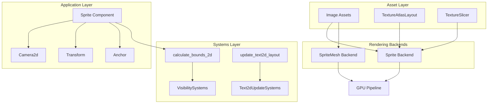

The 2D Rendering Engine in Bevy provides a comprehensive, performant solution for creating two-dimensional graphics and games. Built on top of the ECS (Entity Component System) architecture, it offers flexible rendering backends, advanced sprite manipulation capabilities, and seamless integration with Bevy's asset and camera systems. Whether you're building platformers, user interfaces, or data visualizations, the 2D rendering pipeline delivers the tools needed for both simple sprites and complex, optimized rendering scenarios.

Sources: [lib.rs](crates/bevy_sprite/src/lib.rs#L9-L10), [sprite.rs](crates/bevy_sprite/src/sprite.rs#L14-L19)

## Architecture Overview

The 2D rendering engine operates through a layered architecture that separates concerns between application-level components and rendering-specific systems. At its core, the SpritePlugin provides the necessary systems for calculating bounds, updating visibility, and managing texture atlases, while rendering backends handle the actual GPU operations.



This architecture enables multiple rendering strategies: the traditional sprite backend optimized for batched rendering, and the mesh-based SpriteMesh backend that provides greater flexibility for custom rendering scenarios. Both backends share the same component-level API, allowing developers to switch implementations without changing entity structure.

Sources: [lib.rs](crates/bevy_sprite/src/lib.rs#L64-L104), [sprite_mesh.rs](crates/bevy_sprite/src/sprite_mesh.rs#L12-L16)

## Core Components

### Sprite Component

The `Sprite` component serves as the primary interface for 2D rendering. It automatically requires Transform, Visibility, VisibilityClass, and Anchor components, ensuring complete rendering state management with minimal configuration.

```rust
#[derive(Component, Debug, Default, Clone, Reflect)]
#[require(Transform, Visibility, VisibilityClass, Anchor)]
pub struct Sprite {
    pub image: Handle<Image>,
    pub texture_atlas: Option<TextureAtlas>,
    pub color: Color,
    pub flip_x: bool,
    pub flip_y: bool,
    pub custom_size: Option<Vec2>,
    pub rect: Option<Rect>,
    pub image_mode: SpriteImageMode,
}
```

The component supports multiple construction patterns for common use cases. `Sprite::from_image()` creates sprites from texture handles, `Sprite::from_atlas_image()` incorporates texture atlas support, and `Sprite::from_color()` generates solid-colored sprites without requiring image assets.

Sources: [sprite.rs](crates/bevy_sprite/src/sprite.rs#L14-L41), [sprite.rs](crates/bevy_sprite/src/sprite.rs#L43-L76)

### SpriteMesh Component

For scenarios requiring fine-grained control over rendering behavior, the `SpriteMesh` component provides a mesh-based alternative. It mirrors the Sprite API but adds alpha mode configuration and uses the mesh rendering backend instead of the specialized sprite pipeline.

The key distinction lies in the `alpha_mode` field, which defaults to `Mask(0.5)` for optimal performance. When rendering sprites with translucency, setting this to `Blend` enables proper transparency blending at the cost of reduced performance due to increased draw call overhead.

Sources: [sprite_mesh.rs](crates/bevy_sprite/src/sprite_mesh.rs#L12-L45)

### Camera2d and Projection

The 2D rendering pipeline utilizes `Camera2d`, a specialized camera component that automatically configures orthographic projection. Unlike 3D cameras, 2D cameras use `OrthographicProjection`, which provides parallel projection lines without perspective distortion.

The projection system supports both built-in projection types and custom projections through the `CameraProjection` trait. For 2D rendering, the orthographic projection is particularly well-suited as it maintains consistent scale regardless of depth, making it ideal for UI elements and tile-based games.

Sources: [lib.rs](crates/bevy_camera/src/lib.rs#L33-L40), [projection.rs](crates/bevy_camera/src/projection.rs#L195-L219)

## Sprite Image Modes

The `SpriteImageMode` enum provides sophisticated control over how sprites scale and repeat within their bounding rectangles. This system enables common UI patterns like 9-slice scaling, tiling backgrounds, and various fit modes without requiring custom shaders.

| Mode | Description | Use Cases |
|------|-------------|-----------|
| **Auto** | Default stretching based on image size or custom_size | Simple sprites that stretch uniformly |
| **Scale** | Proportional scaling with multiple alignment options | Icons, thumbnails, maintaining aspect ratio |
| **Sliced** | 9-slice scaling with corner preservation | UI panels, buttons, resizable windows |
| **Tiled** | Texture repetition beyond stretch threshold | Backgrounds, large surfaces, terrain |

The Scale mode offers six sub-modes that define how textures align within their bounds: FillCenter, FillStart, FillEnd (covering the rectangle while maintaining aspect ratio), and FitCenter, FitStart, FitEnd (fitting within the rectangle while maintaining aspect ratio). These correspond to common image scaling behaviors found in UI frameworks.

Sources: [sprite.rs](crates/bevy_sprite/src/sprite.rs#L164-L250)

## Texture Atlas System

Texture atlases enable efficient batched rendering by combining multiple sprites into a single texture, reducing draw calls and improving performance. The system supports both manual atlas definitions and automatic generation from sprite folders.

The `TextureAtlas` component references a `TextureAtlasLayout` that defines sprite regions within the combined texture. When using atlases with sprites, the rect property is automatically offset by the atlas's minimal corner position, allowing seamless coordinate mapping.

```rust
// Load multiple sprites into a texture atlas
let (texture_atlas, sources, texture) = create_texture_atlas(
    loaded_folder,
    padding: Some(UVec2::new(6, 6)),  // Padding to prevent bleeding
    sampler: Some(ImageSampler::nearest()),
    &mut textures,
);
```

Padding between atlas sprites prevents "bleeding" where neighboring sprite pixels appear at edges due to texture filtering or scaling. The example demonstrates creating atlases with padding and nearest-neighbor sampling for crisp pixel art rendering.

Sources: [texture_atlas.rs](examples/2d/texture_atlas.rs#L1-L9), [texture_atlas.rs](examples/2d/texture_atlas.rs#L78-L84)

## Anchor and Pivot System

The `Anchor` component defines the pivot point for sprite transformations, specified as normalized coordinates relative to sprite dimensions. This system provides convenient constants for common positions: BOTTOM_LEFT, BOTTOM_CENTER, BOTTOM_RIGHT, CENTER_LEFT, CENTER, CENTER_RIGHT, TOP_LEFT, TOP_CENTER, TOP_RIGHT.

```rust
#[derive(Component, Debug, Clone, Copy, PartialEq, Deref, DerefMut, Reflect)]
pub struct Anchor(pub Vec2);
```

Anchors are particularly useful for precise positioning, rotation, and alignment. For example, a sprite with `Anchor::BOTTOM_LEFT` will rotate around its bottom-left corner, while `Anchor::CENTER` (the default) rotates around the sprite's geometric center. Custom pivot points can be specified using normalized Vec2 values, enabling rotation around any arbitrary point within or outside the sprite.

Sources: [sprite.rs](crates/bevy_sprite/src/sprite.rs#L252-L292)

## Rendering Pipeline

### Bounds Calculation System

The rendering pipeline automatically calculates axis-aligned bounding boxes (AABB) for sprites through the `calculate_bounds_2d` system. This system operates in the `VisibilitySystems::CalculateBounds` set during PostUpdate, ensuring bounds are computed after sprite modifications but before culling operations.

The system handles multiple sprite types, querying entities with either `Mesh2d` components or `Sprite` components with `Handle<Image>` references. It respects culling exclusions through `NoFrustumCulling` and `NoAutoAabb` components, allowing explicit control over automatic bounds calculation.

Sources: [lib.rs](crates/bevy_sprite/src/lib.rs#L106-L150)

### Visibility and Frustum Culling

Sprites automatically integrate with Bevy's visibility system through the `VisibilityClass` component. The visibility plugin updates frusta for cameras during the `VisibilitySystems::UpdateFrusta` set, which occurs after transform propagation but before rendering.

The frustum culling system uses computed AABBs to determine which sprites are visible within the camera's view frustum, efficiently culling off-screen entities. For UI elements or sprites that should always render, the `NoFrustumCulling` marker component disables this optimization.

Sources: [lib.rs](crates/bevy_sprite/src/lib.rs#L80-L85), [projection.rs](crates/bevy_camera/src/projection.rs#L19-L28)

## Advanced Features

### Texture Slicing

The `TextureSlicer` enables 9-slice scaling, a technique where textures are divided into a 3×3 grid with corners preserved and edges stretched proportionally. This is ideal for UI elements like panels and buttons that need to resize while maintaining consistent border widths.

```rust
pub struct TextureSlicer {
    pub border: BorderRect,      // Defines the nine-slice regions
    pub center_scale_mode: SliceScaleMode,  // How center stretches
    pub sides_scale_mode: SliceScaleMode,  // How sides stretch
    pub max_corner_scale: f32,   // Maximum corner scaling
}
```

The slicer works in conjunction with `SpriteImageMode::Sliced`, automatically computing the appropriate UV coordinates and vertex positions based on the sprite's custom_size. This eliminates the need for custom shader code for common UI resizing scenarios.

Sources: [mod.rs](crates/bevy_sprite/src/texture_slice/mod.rs)

### Sprite Sheets and Animation

Texture atlases enable efficient sprite sheet animation by storing multiple frames in a single texture. The `TextureAtlas` component tracks the current frame index, while systems can update this index based on time to create smooth animations.

When combining sprite sheets with the `rect` property, the rectangle is automatically offset by the atlas's top-left corner position, simplifying frame selection logic. This allows switching between frames by simply changing the atlas index without needing to recalculate texture coordinates.

Sources: [sprite.rs](crates/bevy_sprite/src/sprite.rs#L22-L23), [sprite.rs](crates/bevy_sprite/src/sprite.rs#L36-L37)

### Pixel-Perfect Rendering

For pixel art games, Bevy supports pixel-perfect rendering through the `ImageSampler::nearest()` texture sampler, which disables bilinear filtering. Combined with integer-based scaling and careful camera positioning, this ensures crisp pixel edges without blurring.

The `pixel_grid_snap` example demonstrates snapping sprite positions to pixel grids to prevent sub-pixel rendering artifacts, which is particularly important for pixel art styles where consistent scaling is essential for visual clarity.

Sources: [texture_atlas.rs](examples/2d/texture_atlas.rs#L14-L15)

## Performance Considerations

### Rendering Backends

Choosing between Sprite and SpriteMesh backends involves trade-offs. The Sprite backend is optimized for batched rendering, automatically grouping sprites with similar materials to minimize draw calls. This is ideal for scenes with many sprites sharing the same texture.

The SpriteMesh backend provides flexibility at the cost of reduced batching efficiency. It's suitable for scenarios requiring per-sprite alpha modes, custom mesh manipulation, or integration with mesh-based features like meshlet rendering.

<CgxTip>
For optimal performance in games with hundreds of sprites, prefer the Sprite backend with texture atlases to maximize batching. Reserve SpriteMesh for specialized cases requiring mesh-level control or when alpha blending requirements prevent batching.
</CgxTip>

### Alpha Modes and Transparency

The SpriteMesh component's `alpha_mode` field controls transparency handling. `SpriteAlphaMode::Mask(0.5)` uses alpha testing, discarding pixels below the threshold and enabling proper sorting within opaque batches. This provides excellent performance but doesn't support partial transparency.

For sprites requiring smooth gradients or partial transparency, `SpriteAlphaMode::Blend` enables proper alpha blending at the cost of reduced batching efficiency and increased sorting overhead. Use sparingly and only where visually necessary.

Sources: [sprite_mesh.rs](crates/bevy_sprite/src/sprite_mesh.rs#L41-L44)

## Common Patterns

### Basic Sprite Rendering

The simplest 2D rendering setup involves spawning a Camera2d and one or more Sprite entities:

```rust
fn setup(mut commands: Commands, asset_server: Res<AssetServer>) {
    commands.spawn(Camera2d);
    
    commands.spawn(Sprite::from_image(
        asset_server.load("branding/bevy_bird_dark.png"),
    ));
}
```

This minimal example demonstrates automatic camera projection handling and asset loading, providing the foundation for more complex 2D scenes.

Sources: [sprite.rs](examples/2d/sprite.rs#L12-L18)

### Sprite from Color

Creating sprites without texture assets is useful for debugging, placeholders, or simple shapes:

```rust
let colored_sprite = Sprite::from_color(
    Color::srgb(1.0, 0.0, 0.0),  // Red
    Vec2::new(100.0, 100.0),     // Size
);
```

This generates a solid-colored sprite without requiring image files, making it ideal for prototyping and visual debugging.

Sources: [sprite.rs](crates/bevy_sprite/src/sprite.rs#L69-L76)

### Custom Size and Rect

Combining `custom_size` with `rect` enables rendering sprite regions at arbitrary dimensions:

```rust
let sprite = Sprite {
    image: texture_handle,
    custom_size: Some(Vec2::new(200.0, 150.0)),
    rect: Some(Rect::new(0.0, 0.0, 64.0, 64.0)),
    ..default()
};
```

This pattern extracts a 64×64 region from the source texture and scales it to 200×150 world units, useful for sprite sheet frames and UI elements.

Sources: [sprite.rs](crates/bevy_sprite/src/sprite.rs#L30-L38)

## Integration with Other Systems

The 2D rendering engine integrates seamlessly with other Bevy systems. Sprites automatically participate in picking through the `SpritePickingPlugin` when the bevy_picking feature is enabled. Text rendering via `Text2d` follows the same patterns as sprites, using similar anchor and transform components.

<CgxTip>
When integrating 2D content with 3D scenes, use the `Camera::order` field to control rendering order. Lower-order cameras render first, enabling 2D HUDs overlaid on 3D content by giving the 2D camera a higher order value.
</CgxTip>

The sprite system also integrates with Bevy's reflection system, enabling serialization and deserialization through the `Reflect` derive macro. This facilitates save/load systems, editor tools, and runtime modification of sprite properties.

Sources: [lib.rs](crates/bevy_sprite/src/lib.rs#L87-L102), [lib.rs](crates/bevy_sprite/src/lib.rs#L101-L102)

## Next Steps

Now that you understand the 2D rendering engine fundamentals, explore these related topics:

- [3D and PBR Rendering](15-3d-and-pbr-rendering) - Learn how 2D and 3D rendering coexist and share infrastructure
- [Shaders and Materials](17-shaders-and-materials) - Custom shader creation for advanced sprite effects
- [Asset Loading and Management](18-asset-loading-and-management) - Comprehensive guide to texture and atlas asset workflows
- [Picking System](24-picking-system) - Interactive sprite selection and mouse input handling
- [Animation System](31-animation-system) - Creating smooth sprite animations beyond simple sprite sheets

The 2D rendering engine provides a solid foundation for games and applications, with extensibility through custom components, systems, and render backends when standard approaches don't meet specific requirements.
