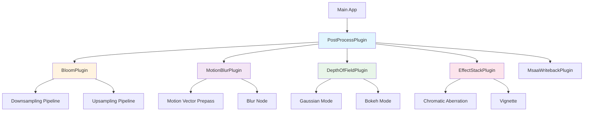
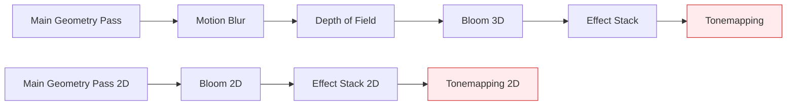

Post-processing effects transform rendered images after scene geometry has been rasterized, enabling cinematic and artistic visual enhancements that simulate real-world camera behavior, optical artifacts, and stylized visual presentations. Bevy's post-processing architecture provides a composable, component-based system where effects are added as components to camera entities, with each effect executing in a controlled pipeline stage during the render graph.

Sources: [lib.rs](/crates/bevy_post_process/src/lib.rs#L1-L40)

## Architecture Overview

The post-processing system operates within Bevy's render pipeline as a set of specialized render nodes that process the camera's output after the main geometry pass but before tonemapping and final presentation. The `PostProcessPlugin` serves as the entry point, registering individual effect plugins that handle their own render resources, shader pipelines, and scheduling requirements.



Each effect follows a consistent pattern: the main world component holds configuration parameters, an `ExtractComponentPlugin` transfers this data to the render world, specialized render pipelines compile appropriate WGSL shaders, and render nodes execute the GPU work in the `Core3d` or `Core2d` schedules. Effects are automatically skipped when disabled (intensity = 0) to avoid unnecessary GPU work.

Sources: [lib.rs](/crates/bevy_post_process/src/lib.rs#L41-L55), [bloom/mod.rs](/crates/bevy_post_process/src/bloom/mod.rs#L43-L86)

## Available Effects

### Bloom

Bloom creates glowing halos around bright scene regions by extracting high-frequency brightness information, downsampling it through a mip chain, and upsampling with weighted blending back into the main image. The effect requires HDR rendering and works exceptionally well with emissive materials.

**Key Parameters:**

| Parameter | Range | Default | Purpose |
|-----------|-------|---------|---------|
| `intensity` | 0.0-1.0 (energy-conserving), >0 (additive) | 0.15 | Overall glow strength |
| `low_frequency_boost` | 0.0-1.0 | 0.7 | Enhanced sideways scattering |
| `low_frequency_boost_curvature` | 0.0-1.0 | 0.95 | Transition sharpness between frequencies |
| `high_pass_frequency` | 0.0-1.0 | 1.0 | Scattering tightness control |
| `max_mip_dimension` | ≥128 | 512 | Texture resolution cap for quality vs performance |
| `scale` | Vec2 | (1.0, 1.0) | Anisotropic stretch for cinematic effects |

**Preset Configurations:**

```rust
// Natural, physically-accurate bloom
Bloom::NATURAL

// Horizontal stretch (cinematic anamorphic look)
Bloom::ANAMORPHIC

// Classic 2000s game aesthetic with thresholding
Bloom::OLD_SCHOOL

// Heavy blur across entire screen
Bloom::SCREEN_BLUR
```

<CgxTip>Bloom uses a parametric curve blending algorithm based on the described implementation at https://starlederer.github.io/bloom/. The curve defines how different mip levels contribute to the final result, with `low_frequency_boost` amplifying the lowest frequency (largest blur) contribution.</CgxTip>

**Implementation Details:**

The bloom pipeline executes in two phases: downsampling (generating progressively smaller mip levels from the HDR color buffer) and upsampling (reconstructing with weighted contributions). The downsampling first pass reads directly from the main view texture, while subsequent passes read from previous mip levels. Upsampling blends each level with the next higher resolution, controlled by the parametric curve parameters.

Sources: [settings.rs](/crates/bevy_post_process/src/bloom/settings.rs#L32-L126), [mod.rs](/crates/bevy_post_process/src/bloom/mod.rs#L88-L200), [bloom_3d.rs](/examples/3d/bloom_3d.rs#L22-L36)

### Depth of Field

Depth of field simulates camera lens focus behavior by blurring objects based on their distance from the focal plane. Bevy implements two modes with different visual characteristics and performance costs.

**Configuration Parameters:**

| Parameter | Range | Default | Description |
|-----------|-------|---------|-------------|
| `mode` | Gaussian/Bokeh | Gaussian | Visual appearance mode |
| `focal_distance` | >0.0 meters | Varies | Distance to focus point |
| `sensor_height` | >0.0 meters | 0.01866 (Super 35) | Physical sensor size |
| `aperture_f_stops` | 0.05+ | Varies | Lens aperture (lower = more blur) |
| `max_circle_of_confusion_diameter` | 1.0+ pixels | Varies | Quality/performance clamp |
| `max_depth` | >0.0 meters | ∞ | Distance clamp for background objects |

**Mode Comparison:**

| Aspect | Gaussian | Bokeh |
|--------|----------|-------|
| **Visual Quality** | Standard blur | Light spots with accurate bokeh |
| **Performance** | Lower bandwidth | Higher memory usage |
| **Platform Support** | Native + WebGPU | Native only (WebGL2/WebGPU excluded) |
| **Use Case** | Performance-sensitive | Cinematic quality |

The effect calculates circle of confusion (CoC) per-pixel based on depth, with CoC diameter derived from physical parameters: `coc = (focal_length² / (sensor_height × f_stops)) × |(1/focal_distance) - (1/object_depth)|`. Gaussian mode applies bilateral blur weighted by CoC, while bokeh mode generates authentic light shapes through a more expensive gather operation.

<CgxTip>Depth of field requires depth texture access and integrates with the main render pass. The `max_depth` parameter is crucial for skyboxes and background colors, which are otherwise treated as infinitely distant, causing unnatural blur clamping.</CgxTip>

Sources: [mod.rs](/crates/bevy_post_process/src/dof/mod.rs#L1-L200), [depth_of_field.rs](/examples/3d/depth_of_field.rs#L70-L84)

### Motion Blur

Motion blur simulates the visual streaking caused by object or camera movement during frame exposure. Bevy's implementation uses per-pixel motion vectors generated by the motion vector prepass to sample along the motion trajectory.

**Configuration:**

| Parameter | Range | Default | Effect |
|-----------|-------|---------|--------|
| `shutter_angle` | 0.0-1.0 (physical), >1.0 (artistic) | 0.5 | Exposure duration relative to frame time |
| `samples` | 0+ | 1 | Sample count per direction (total = samples×2+1) |

The `shutter_angle` represents the fraction of a frame the shutter remains open. For 24fps film, 0.5 (180°) corresponds to 1/48 second exposure. Values above 1.0 stretch blur beyond the actual motion distance—artistic but potentially distracting. The `samples` parameter controls quality: 0 disables the effect, 1 provides 3 samples, 3 provides 7 samples, with diminishing returns at higher values.

**Known Limitations:**

- Fast objects moving against stationary backgrounds show edge artifacts (no background exposure to reveal)
- Transparent objects lack motion vectors and thus don't blur
- Implementation uses reconstruction-filter-free approach for simplicity over perfect correctness

Sources: [mod.rs](/crates/bevy_post_process/src/motion_blur/mod.rs#L1-L120)

### Auto Exposure

Auto exposure automatically adjusts camera exposure to maintain consistent apparent brightness across varying lighting conditions, simulating human eye adaptation. The effect builds a 64-bin luminance histogram from the rendered scene and adjusts exposure toward a middle-gray target.

**Configuration Parameters:**

| Parameter | Type | Default | Purpose |
|-----------|------|---------|---------|
| `range` | RangeInclusive<f32> | -8.0..=8.0 | Histogram min/max exposure values (EV) |
| `filter` | RangeInclusive<f32> | 0.10..=0.90 | Ignore darkest/brightest percentiles |
| `speed_brighten` | f32 | 3.0 | Adaptation rate: dark→bright (stops/sec) |
| `speed_darken` | f32 | 1.0 | Adaptation rate: bright→dark (stops/sec) |
| `exponential_transition_distance` | f32 | 1.5 | Transition point from linear to exponential adaptation |
| `metering_mask` | Handle<Image> | White | Weighting mask for selective metering |
| `compensation_curve` | Handle<AutoExposureCompensationCurve> | Flat | Exposure adjustment curve |

The adaptation curve uses linear interpolation near the target exposure and exponential approach for larger changes, reducing jitter from small luminance fluctuations while maintaining smooth adaptation for major scene changes. The metering mask enables zone-based exposure weighting (e.g., center-weighted or face-tracking), using the red channel where 0.0 excludes pixels and 1.0 includes them fully.

<CgxTip>Auto exposure requires compute shaders and is incompatible with WebGL2. The histogram uses 64 bins quantized to 16 discrete levels for the metering mask due to compute shader limitations. Combine with bloom for best results—bloom naturally emerges from the HDR pipeline exposure.</CgxTip>

Sources: [mod.rs](/crates/bevy_post_process/src/auto_exposure/mod.rs#L1-L83), [settings.rs](/crates/bevy_post_process/src/auto_exposure/settings.rs#L27-L91)

### Chromatic Aberration

Chromatic aberration adds rainbow-colored fringing at object edges by offsetting color channels based on radial distance from the screen center. Bevy's implementation uses a customizable lookup texture to define the color gradient pattern.

**Configuration:**

| Parameter | Type | Default | Description |
|-----------|------|---------|-------------|
| `color_lut` | Option<Handle<Image>> | 3×1 RGB texture | Color gradient definition |
| `intensity` | f32 | 0.02 | Fringe size as screen fraction |
| `max_samples` | u32 | 8 | Texture sample cap (quality vs performance) |

The default LUT is a 3×1 texture with red, green, and blue pixels in sequence, producing classic RGB fringing. Custom LUTs enable artistic effects—thermal vision tints, horror game spectral aberration, or sci-fi scanner patterns. The LUT is sampled at its vertical center, so height should typically be 1 pixel.

Sources: [chromatic_aberration.rs](/crates/bevy_post_process/src/effect_stack/chromatic_aberration.rs#L48-L74)

### Vignette

Vignette darkens image corners and edges relative to the center, creating a focus-directing effect that mimics natural lens fall-off or artistic framing techniques.

**Configuration:**

| Parameter | Range | Default | Effect |
|-----------|-------|---------|--------|
| `intensity` | 0.0-1.0 | 1.0 | Darkening strength (0=none, 1=full black) |
| `radius` | 0.0-2.0+ | 0.75 | Size of unvignetted center |
| `smoothness` | 0.01-1.0+ | 5.0 | Edge transition softness |
| `roundness` | 0.01+ | 1.0 | Shape from oval to circle |
| `center` | Vec2 (0.0-1.0) | (0.5, 0.5) | Vignette center position |
| `edge_compensation` | 0.0-1.0 | 1.0 | Fit to screen aspect ratio |
| `color` | Color | Black | Tint color |

The effect computes radial distance from `center`, applies shape modification via `roundness`, and uses smoothstep for the `smoothness` falloff. `edge_compensation` adjusts for non-square aspect ratios to maintain consistent vignette shape across resolutions.

Sources: [vignette.rs](/crates/bevy_post_process/src/effect_stack/vignette.rs#L41-L87)

## Pipeline Integration and Scheduling

All post-processing effects execute in the render world within the `Core3d` or `Core2d` schedules. The scheduling order is carefully defined to ensure correct intermediate buffer handling and avoid unnecessary passes:



This ordering ensures:
1. **Motion blur** applies before depth-based effects to preserve motion vector accuracy
2. **Depth of field** processes the clean motion-blurred image
3. **Bloom** extracts bright regions from the depth-processed image
4. **Effect stack** (chromatic aberration, vignette) applies to the final HDR image
5. **Tonemapping** converts HDR to displayable range

Effects are automatically skipped when their intensity is zero or when required preconditions aren't met (e.g., HDR disabled), optimizing performance.

Sources: [mod.rs](/crates/bevy_post_process/src/effect_stack/mod.rs#L161-L166), [mod.rs](/crates/bevy_post_process/src/motion_blur/mod.rs#L154-L159)

## Usage Examples

### Basic Bloom Setup

```rust
use bevy::prelude::*;
use bevy::post_process::bloom::Bloom;

fn setup(mut commands: Commands) {
    commands.spawn((
        Camera3d::default(),
        Hdr,                          // Required for bloom
        Tonemapping::TonyMcMapface,   // Recommended tonemapper
        Bloom::NATURAL,               // Enable bloom with default settings
    ));
}
```

Sources: [bloom_3d.rs](/examples/3d/bloom_3d.rs#L27-L36)

### Combined Post-Processing Stack

```rust
use bevy::prelude::*;
use bevy::post_process::{
    bloom::Bloom,
    dof::DepthOfField,
    effect_stack::{ChromaticAberration, Vignette},
    motion_blur::MotionBlur,
};

fn cinematic_camera(mut commands: Commands) {
    commands.spawn((
        Camera3d::default(),
        Hdr,
        
        // Cinematic anamorphic bloom
        Bloom::ANAMORPHIC,
        
        // Shallow depth of field with bokeh
        DepthOfField {
            mode: DepthOfFieldMode::Bokeh,
            focal_distance: 5.0,
            aperture_f_stops: 2.8,
            sensor_height: 0.01866,  // Super 35
            ..default()
        },
        
        // Subtle motion blur for 24fps feel
        MotionBlur {
            shutter_angle: 0.5,  // 180 degrees
            samples: 1,
        },
        
        // Artistic chromatic aberration
        ChromaticAberration {
            intensity: 0.015,
            ..default()
        },
        
        // Focus-enhancing vignette
        Vignette {
            intensity: 0.6,
            radius: 0.8,
            ..default()
        },
    ));
}
```

Sources: [post_processing.rs](/examples/3d/post_processing.rs#L72-L95)

### Dynamic Parameter Adjustment

```rust
#[derive(Resource)]
struct PostProcessSettings {
    bloom_intensity: f32,
    focal_distance: f32,
}

fn update_bloom(
    mut settings: ResMut<PostProcessSettings>,
    mut bloom_query: Query<&mut Bloom>,
    input: Res<ButtonInput<KeyCode>>,
) {
    if input.pressed(KeyCode::ArrowUp) {
        settings.bloom_intensity = (settings.bloom_intensity + 0.01).clamp(0.0, 1.0);
    }
    
    for mut bloom in bloom_query.iter_mut() {
        bloom.intensity = settings.bloom_intensity;
    }
}
```

Sources: [post_processing.rs](/examples/3d/post_processing.rs#L162-L200)

## Performance Considerations

**GPU Bandwidth:**
- Bloom and depth of field are bandwidth-intensive due to multiple texture reads/writes per pixel
- Reduce `max_mip_dimension` for bloom, increase `max_circle_of_confusion_diameter` for DoF to lower quality for better performance
- Motion blur quality scales linearly with `samples` parameter

**Platform Compatibility:**
| Effect | WebGL2 | Native | WebGPU |
|--------|--------|--------|--------|
| Bloom | ❌ | ✅ | ✅ |
| Auto Exposure | ❌ | ✅ | ✅ |
| Depth of Field (Gaussian) | ✅ | ✅ | ✅ |
| Depth of Field (Bokeh) | ❌ | ✅ | ❌ |
| Motion Blur | ✅ | ✅ | ✅ |
| Chromatic Aberration | ✅ | ✅ | ✅ |
| Vignette | ✅ | ✅ | ✅ |

**Effect Combination Best Practices:**
- Auto exposure + bloom: natural emergent glow from dynamic exposure
- Depth of field + bloom: highlights depth separation through selective glow
- Chromatic aberration + motion blur: enhances speed/disorientation effects
- Avoid combining all effects simultaneously—visual and performance costs compound

Sources: [settings.rs](/crates/bevy_post_process/src/bloom/settings.rs#L19-L23), [mod.rs](/crates/bevy_post_process/src/dof/mod.rs#L127-L143)

## Advanced Customization

### Custom Chromatic Aberration Gradients

```rust
// Create thermal-vision style gradient
let thermal_lut: Vec<u8> = vec![
    0, 255, 0, 255,    // Green center
    255, 255, 0, 255,  // Yellow
    255, 0, 0, 255,    // Red edges
];

let texture = Image::new(
    Extent3d { width: 3, height: 1, depth_or_array_layers: 1 },
    TextureDimension::D2,
    thermal_lut,
    TextureFormat::Rgba8UnormSrgb,
    RenderAssetUsages::RENDER_WORLD,
);

commands.spawn((
    Camera3d::default(),
    ChromaticAberration {
        color_lut: Some(asset_server.add(texture)),
        intensity: 0.03,
        ..default()
    },
));
```

Sources: [chromatic_aberration.rs](/crates/bevy_post_process/src/effect_stack/chromatic_aberration.rs#L14-L19), [chromatic_aberration.rs](/crates/bevy_post_process/src/effect_stack/chromatic_aberration.rs#L52-L60)

### Auto Exposure Metering Masks

```rust
// Center-weighted metering mask
let center_weight: Vec<u8> = (0..256*256)
    .map(|i| {
        let x = (i % 256) as f32 / 256.0;
        let y = (i / 256) as f32 / 256.0;
        let dx = x - 0.5;
        let dy = y - 0.5;
        let dist = (dx*dx + dy*dy).sqrt();
        ((1.0 - dist * 2.0).clamp(0.0, 1.0) * 255.0) as u8
    })
    .collect();

let mask_texture = Image::new(
    Extent3d { width: 256, height: 256, depth_or_array_layers: 1 },
    TextureDimension::D2,
    center_weight,
    TextureFormat::R8Unorm,
    RenderAssetUsages::RENDER_WORLD,
);

commands.spawn((
    Camera3d::default(),
    AutoExposure {
        metering_mask: asset_server.add(mask_texture),
        ..default()
    },
));
```

Sources: [settings.rs](/crates/bevy_post_process/src/auto_exposure/settings.rs#L69-L85)

## Integration with Related Systems

Post-processing effects integrate seamlessly with Bevy's broader rendering architecture. Key dependencies and related systems include:

- **[Tonemapping](17-shaders-and-materials)**: Required after HDR post-processing for displayable output. Bloom pairs particularly well with desaturating tonemappers like TonyMcMapface
- **[HDR Rendering](15-3d-and-pbr-rendering)**: Most post-processing effects (bloom, auto exposure) require HDR-enabled cameras via the `Hdr` component
- **[Emissive Materials](15-3d-and-pbr-rendering)**: Emissive materials provide the bright regions that bloom amplifies
- **[Motion Vector Prepass](22-input-handling-system)**: Automatically enabled by motion blur via the `#[require(DepthPrepass, MotionVectorPrepass)]` attribute
