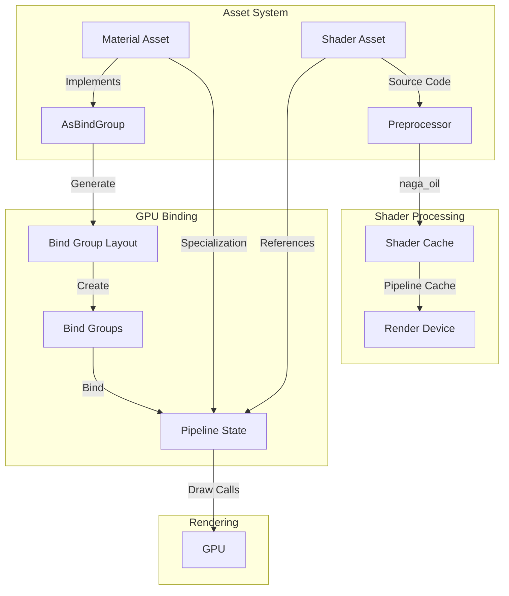

This guide covers Bevy's shader and material systems, explaining how to create custom rendering effects, bind data to shaders, and leverage GPU resources for advanced graphics programming. The material system provides a high-level abstraction over shader management while maintaining flexibility for custom rendering needs.

## Architecture Overview

The shader and material system in Bevy consists of several coordinated components that bridge CPU-side asset management with GPU-side rendering:



The system operates through a separation of concerns: **shaders** define GPU computation logic as assets, **materials** configure shader parameters and binding layouts, and the **render pipeline** orchestrates their interaction with the GPU.

### Core Crates

| Crate | Purpose | Key Types |
|-------|---------|-----------|
| `bevy_shader` | Shader asset management and caching | `Shader`, `ShaderCache`, `ShaderDefVal` |
| `bevy_material` | Material trait and binding infrastructure | `Material`, `AsBindGroup`, `MaterialProperties` |
| `bevy_pbr` | Standard PBR materials and rendering | `StandardMaterial`, `ExtendedMaterial` |
| `bevy_render` | Render resource abstraction | `RenderPipeline`, `BindGroup`, `StorageBuffer` |

Sources: [crates/bevy_shader/src/lib.rs](crates/bevy_shader/src/lib.rs#L1-L40), [crates/bevy_material/src/lib.rs](crates/bevy_material/src/lib.rs#L1-L80)

## Shader Assets

Shaders in Bevy are managed as assets through the `Shader` type. Shaders can be written in WGSL (WebGPU Shading Language), GLSL, or SPIR-V, with WGSL being the primary format for Bevy.

### Shader Structure

The `Shader` struct encapsulates shader source code and metadata:

```rust
pub struct Shader {
    pub path: String,
    pub source: Source,
    pub import_path: ShaderImport,
    pub imports: Vec<ShaderImport>,
    pub shader_defs: Vec<ShaderDefVal>,
    pub file_dependencies: Vec<Handle<Shader>>,
    pub validate_shader: ValidateShader,
}
```

Key features include:
- **Import system**: Shaders can import other shader modules using `#import` directives
- **Shader definitions**: Conditional compilation flags for creating shader permutations
- **Dependency tracking**: Automatic management of shader dependencies
- **Validation**: Optional runtime safety checks for untrusted shaders

Sources: [crates/bevy_shader/src/shader.rs](crates/bevy_shader/src/shader.rs#L30-L60)

### Loading Shaders

Shaders are typically loaded from the assets directory:

```rust
use bevy::prelude::*;
use bevy::shader::ShaderRef;

// Reference to a shader file in assets/
const SHADER_PATH: &str = "shaders/custom_material.wgsl";

impl Material for CustomMaterial {
    fn fragment_shader() -> ShaderRef {
        SHADER_PATH.into()
    }
}
```

The `ShaderRef` enum allows flexibility in shader references:
- `ShaderRef::Path(path)` - Load from asset file
- `ShaderRef::Default` - Use built-in default shader
- `ShaderRef::Handle(handle)` - Use specific shader handle

### Shader Preprocessor

Bevy uses `naga_oil` for shader preprocessing, supporting:
- Module imports: `#import "bevy_pbr::forward_io"`
- Conditional compilation: `#ifdef SHADER_DEF`
- Standard library access: Bevy's core shader modules

Example WGSL shader with imports:
```wgsl
#import bevy_pbr::forward_io::VertexOutput
#import "shaders/custom_material_import.wgsl"::COLOR_MULTIPLIER

@group(2) @binding(0) var<uniform> material_color: vec4<f32>;

@fragment
fn fragment(mesh: VertexOutput) -> @location(0) vec4<f32> {
    return material_color * COLOR_MULTIPLIER;
}
```

Sources: [assets/shaders/custom_material.wgsl](assets/shaders/custom_material.wgsl#L1-L15), [examples/shader/shader_material.rs](examples/shader/shader_material.rs#L1-L64)

## Materials

Materials provide a high-level interface for configuring how meshes are rendered. They define what data gets passed to shaders and how that data is bound to the GPU.

### Creating Custom Materials

Custom materials are created by implementing the `Material` trait:

```rust
use bevy::prelude::*;
use bevy::render::render_resource::AsBindGroup;
use bevy::shader::ShaderRef;
use bevy::reflect::TypePath;

#[derive(Asset, TypePath, AsBindGroup, Debug, Clone)]
struct CustomMaterial {
    #[uniform(0)]
    color: LinearRgba,
    #[texture(1)]
    #[sampler(2)]
    color_texture: Option<Handle<Image>>,
    alpha_mode: AlphaMode,
}

impl Material for CustomMaterial {
    fn fragment_shader() -> ShaderRef {
        "shaders/custom_material.wgsl".into()
    }
    
    fn alpha_mode(&self) -> AlphaMode {
        self.alpha_mode
    }
}
```

The `Material` trait requires minimal implementation:
- `fragment_shader()` - Returns the shader for fragment processing
- `vertex_shader()` - Optional, defaults to mesh vertex shader
- `alpha_mode()` - Controls transparency handling
- `specialize()` - Optional, enables shader specialization

Sources: [examples/shader/shader_material.rs](examples/shader/shader_material.rs#L1-L64), [crates/bevy_pbr/src/material.rs](crates/bevy_pbr/src/material.rs#L50-L100)

### Registering Materials

Materials must be registered with a plugin:

```rust
fn main() {
    App::new()
        .add_plugins((DefaultPlugins, MaterialPlugin::<CustomMaterial>::default()))
        .add_systems(Startup, setup)
        .run();
}
```

This sets up the rendering pipeline for the material type, including bind group allocation and pipeline caching.

### Using Materials

Apply materials to meshes using component bundles:

```rust
fn setup(
    mut commands: Commands,
    mut meshes: ResMut<Assets<Mesh>>,
    mut materials: ResMut<Assets<CustomMaterial>>,
) {
    commands.spawn((
        Mesh3d(meshes.add(Cuboid::default())),
        MeshMaterial3d(materials.add(CustomMaterial {
            color: LinearRgba::BLUE,
            color_texture: None,
            alpha_mode: AlphaMode::Opaque,
        })),
        Transform::from_xyz(0.0, 0.5, 0.0),
    ));
}
```

## Bind Groups and AsBindGroup

The `AsBindGroup` derive macro automatically generates the boilerplate for binding material data to GPU resources. It processes struct attributes to create proper bind group layouts.

### Binding Attributes

| Attribute | Purpose | Example |
|-----------|---------|---------|
| `#[uniform(index)]` | Uniform buffer binding | `#[uniform(0)] color: Vec3` |
| `#[texture(index)]` | Texture binding | `#[texture(1)] image: Handle<Image>` |
| `#[sampler(index)]` | Sampler binding | `#[sampler(2)] sampler: Handle<Image>` |
| `#[storage(index, read_only)]` | Storage buffer | `#[storage(0, read_only)] buffer: Handle<ShaderBuffer>` |

### Storage Buffer Example

Storage buffers enable passing large arrays of data to shaders:

```rust
#[derive(Asset, TypePath, AsBindGroup, Debug, Clone)]
struct CustomMaterial {
    #[storage(0, read_only)]
    colors: Handle<ShaderBuffer>,
}
```

In WGSL:
```wgsl
@group(2) @binding(0) var<storage, read> colors: array<vec4<f32>>;
```

This pattern is useful for dynamic data that changes frequently, such as particle systems or animation data.

Sources: [examples/shader/storage_buffer.rs](examples/shader/storage_buffer.rs#L1-L112), [crates/bevy_render/macros/src/as_bind_group.rs](crates/bevy_render/macros/src/as_bind_group.rs#L1-L100)

## Shader Specialization

Shader specialization allows creating optimized shader variants at runtime by enabling conditional features through shader definitions.

### Specialization Keys

Define a key type to identify shader permutations:

```rust
#[derive(Asset, TypePath, AsBindGroup, Debug, Clone)]
#[bind_group_data(CustomMaterialKey)]
struct CustomMaterial {
    #[uniform(0)]
    color: LinearRgba,
    is_red: bool,
}

#[derive(Eq, PartialEq, Hash, Copy, Clone)]
struct CustomMaterialKey {
    is_red: bool,
}

impl From<&CustomMaterial> for CustomMaterialKey {
    fn from(material: &CustomMaterial) -> Self {
        Self { is_red: material.is_red }
    }
}
```

### Implementing Specialization

Override the `specialize` method to inject shader defs:

```rust
impl Material for CustomMaterial {
    fn specialize(
        pipeline: &MaterialPipeline<Self>,
        descriptor: &mut RenderPipelineDescriptor,
        layout: &MeshVertexBufferLayoutRef,
        key: MaterialPipelineKey<Self>,
    ) -> Result<(), SpecializedMeshPipelineError> {
        if key.bind_group_data.is_red {
            let fragment = descriptor.fragment.as_mut().unwrap();
            fragment.shader_defs.push("IS_RED".into());
        }
        Ok(())
    }
}
```

In the shader:
```wgsl
#ifdef IS_RED
    return vec4<f32>(1.0, 0.0, 0.0, 1.0);
#else
    return material.color;
#endif
```

This enables Bevy to cache specialized pipeline variants, avoiding runtime branching for static variations.

Sources: [examples/shader/shader_defs.rs](examples/shader/shader_defs.rs#L1-L102), [assets/shaders/shader_defs.wgsl](assets/shaders/shader_defs.wgsl#L1-L19)

## Extended Materials

Extended materials allow modifying built-in materials like `StandardMaterial` while preserving PBR functionality.

### Creating Extensions

Define an extension struct implementing `MaterialExtension`:

```rust
use bevy::pbr::{ExtendedMaterial, MaterialExtension};

#[derive(Asset, AsBindGroup, Reflect, Debug, Clone)]
struct MyExtension {
    #[uniform(100)]
    quantize_steps: u32,
}

impl MaterialExtension for MyExtension {
    fn fragment_shader() -> ShaderRef {
        "shaders/extended_material.wgsl".into()
    }
    
    // Optional: override other methods
}
```

### Using Extended Materials

```rust
fn setup(
    mut commands: Commands,
    mut meshes: ResMut<Assets<Mesh>>,
    mut materials: ResMut<Assets<ExtendedMaterial<StandardMaterial, MyExtension>>>,
) {
    commands.spawn((
        Mesh3d(meshes.add(Sphere::new(1.0))),
        MeshMaterial3d(materials.add(ExtendedMaterial {
            base: StandardMaterial {
                base_color: RED.into(),
                ..default()
            },
            extension: MyExtension { quantize_steps: 4 },
        })),
        Transform::from_xyz(0.0, 0.5, 0.0),
    ));
}
```

Register with `MaterialPlugin::<ExtendedMaterial<StandardMaterial, MyExtension>>::default()`.

<CgxTip>Extension bindings should start from index 100 or higher to avoid conflicts with the base material's bindings (0-99 reserved for StandardMaterial).</CgxTip>

Sources: [examples/shader/extended_material.rs](examples/shader/extended_material.rs#L1-L109)

## Compute Shaders

Compute shaders enable GPU-based computation for tasks like physics simulation, particle systems, or procedural generation.

### Compute Shader Example

Implement a compute shader for Conway's Game of Life:

```rust
use bevy::render::{
    render_resource::{binding_types::*, *},
    renderer::{RenderContext, RenderDevice},
    Render, RenderApp,
};

const WORKGROUP_SIZE: u32 = 8;

struct GameOfLifeComputePlugin;

impl Plugin for GameOfLifeComputePlugin {
    fn build(&self, app: &mut App) {
        app.add_plugins(ExtractResourcePlugin::<GameOfLifeImages>::default());
        
        let render_app = app.sub_app_mut(RenderApp);
        render_app
            .add_systems(Render, queue_compute)
            .add_systems(Render, run_compute);
    }
}

fn queue_compute(
    mut commands: Commands,
    compute_pipeline: Res<GameOfLifePipeline>,
) {
    commands.spawn((
        GameOfLifeCompute,
        compute_pipeline.clone(),
    ));
}

fn run_compute(
    query: Query<&GameOfLifePipeline>,
    mut compute_pass: ResMut<ComputePass>,
) {
    let pipeline = query.single();
    compute_pass.set_pipeline(&pipeline.0);
    compute_pass.dispatch_workgroups(
        SIZE.x / WORKGROUP_SIZE,
        SIZE.y / WORKGROUP_SIZE,
        1,
    );
}
```

Compute shader WGSL:
```wgsl
@group(0) @binding(0) var<storage, read> input: array<vec4<f32>>;
@group(0) @binding(1) var<storage, read_write> output: array<vec4<f32>>;

@compute @workgroup_size(8, 8)
fn compute(@builtin(global_invocation_id) id: vec3<u32>) {
    // Game of Life logic
    let index = id.y * SIZE.x + id.x;
    // ... neighbor counting and state update
}
```

Sources: [examples/shader/compute_shader_game_of_life.rs](examples/shader/compute_shader_game_of_life.rs#L1-L100)

## Advanced Patterns

### Array Textures

Sample from multiple texture layers using `MeshTag` to select the layer:

```rust
#[derive(Asset, TypePath, AsBindGroup, Debug, Clone)]
struct ArrayTextureMaterial {
    #[texture(0)]
    #[sampler(1)]
    array_texture: Handle<Image>,
}
```

WGSL:
```wgsl
@group(2) @binding(0) var array_texture: texture_2d_array<f32>;
@group(2) @binding(1) var array_sampler: sampler;

@fragment
fn fragment(mesh: VertexOutput) -> @location(0) vec4<f32> {
    let layer = u32(mesh.custom_data.x);
    return textureSample(array_texture, array_sampler, mesh.uv, layer);
}
```

Sources: [examples/shader/array_texture.rs](examples/shader/array_texture.rs#L1-L103)

### Dynamic Uniforms

Access global uniforms like time for animated effects:

```wgsl
#import bevy_render::globals

@fragment
fn fragment(mesh: VertexOutput) -> @location(0) vec4<f32> {
    let time = globals.time;
    return vec4<f32>(sin(time), 0.0, 0.0, 1.0);
}
```

Sources: [examples/shader/animate_shader.rs](examples/shader/animate_shader.rs#L1-L45)

### Custom Render Phases

For complete control over rendering, create custom render phase items:

```rust
#[derive(Clone, Component, ExtractComponent)]
#[require(VisibilityClass)]
struct CustomRenderedEntity;

struct DrawCustomPhaseItem;

impl<P> RenderCommand<P> for DrawCustomPhaseItem {
    fn render<'w>(
        item: &P,
        view: ROQueryItem<'w, '_, Self::ViewQuery>,
        entity: Option<ROQueryItem<'w, '_, Self::ItemQuery>>,
        buffers: SystemParamItem<'w, '_, Self::Param>,
        pass: &mut TrackedRenderPass<'w>,
    ) -> RenderCommandResult {
        // Custom draw logic
        pass.set_vertex_buffer(0, buffers.vertices.buffer().unwrap().slice(..));
        pass.draw_indexed(0..3, 0, 0..1);
        RenderCommandResult::Success
    }
}
```

This approach enables arbitrary GPU commands within Bevy's structured render pipeline.

Sources: [examples/shader_advanced/custom_phase_item.rs](examples/shader_advanced/custom_phase_item.rs#L1-L100)

## Performance Considerations

<CgxTip>Shader specialization creates pipeline variants cached by the `PipelineCache`. Keep specialization keys small and hashable to minimize memory overhead.</CgxTip>

Key performance guidelines:
- **Bindless resources** reduce draw call overhead for large object counts
- **Storage buffers** are more efficient than uniform buffers for large arrays
- **Shader specialization** trades memory for reduced runtime branching
- **Pipeline caching** avoids redundant shader compilation

## Next Steps

Explore related rendering concepts:
- [Rendering Architecture](13-rendering-architecture) - Deeper dive into Bevy's render pipeline
- [3D and PBR Rendering](15-3d-and-pbr-rendering) - Standard PBR material usage
- [Post-Processing Effects](16-post-processing-effects) - Screen-space shader techniques
- [Asset Loading and Management](18-asset-loading-and-management) - Asset system fundamentals
