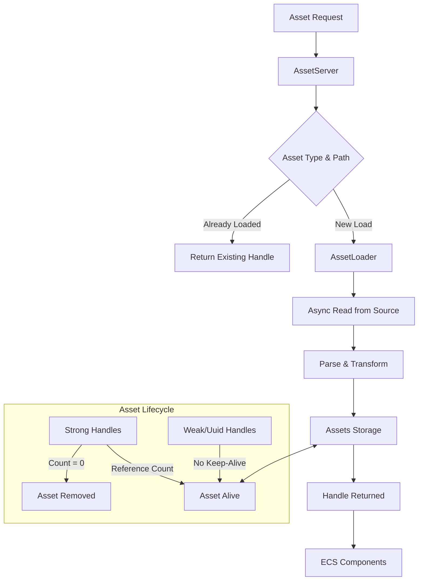

Bevy's asset system provides a robust, type-safe, and asynchronous framework for loading, managing, and tracking game resources. This system addresses two fundamental challenges in game development: efficient memory usage through asset sharing and non-blocking asset loading to maintain smooth gameplay experiences.

## Core Architecture

The asset system is built around three primary components working in concert:

- **AssetServer**: The central resource that coordinates asset loading from various sources. It manages the loading lifecycle, tracks load states, and handles hot reloading [crates/bevy_asset/src/lib.rs#L30-L35](crates/bevy_asset/src/lib.rs#L30-L35)
- **Assets<T>**: A strongly-typed ECS resource that stores loaded asset data in a generational index-based storage system, enabling efficient lookup and memory management [crates/bevy_asset/src/assets.rs#L1-L50](crates/bevy_asset/src/assets.rs#L1-L50)
- **Handle<T>**: A reference-counted identifier that points to assets in the Assets collection, allowing cheap sharing without duplicating data [crates/bevy_asset/src/handle.rs#L66-L95](crates/bevy_asset/src/handle.rs#L66-L95)



This architecture enables a clean separation of concerns: the AssetServer manages orchestration, AssetLoaders handle type-specific parsing, and Assets storage provides centralized access with automatic memory management through reference counting.

## Loading Assets from Disk

### Basic Asset Loading

The most common way to load assets is through the AssetServer's `load` method. This initiates an asynchronous load operation and returns a Handle immediately, without blocking the game thread:

```rust
fn setup(mut commands: Commands, asset_server: Res<AssetServer>) {
    // Load a mesh asset - returns Handle<Mesh3d> immediately
    let cube_handle = asset_server.load("models/cube.gltf");
    
    // Load with label (for multi-asset files like GLTF)
    let mesh_handle = asset_server.load(
        GltfAssetLabel::Primitive { mesh: 0, primitive: 0 }
            .from_asset("models/character.gltf")
    );
    
    // Use the handle to spawn entities
    commands.spawn((
        Mesh3d(cube_handle),
        MeshMaterial3d(material_handle),
        Transform::from_xyz(0.0, 0.0, 0.0),
    ));
}
```

[examples/asset/asset_loading.rs#L20-L35](examples/asset/asset_loading.rs#L20-L35)

The AssetServer automatically deduplicates loads: calling `load()` multiple times with the same path returns the same Handle instance, preventing redundant work [crates/bevy_asset/src/server/mod.rs#L289-L305](crates/bevy_asset/src/server/mod.rs#L289-L305).

### Loading Folders

For bulk loading, the `load_folder` method loads all assets within a directory in parallel, returning a Handle to a `LoadedFolder` asset containing handles to all discovered assets:

```rust
let _loaded_folder: Handle<LoadedFolder> = asset_server.load_folder("models/torus");
```

[examples/asset/asset_loading.rs#L45-L51](examples/asset/asset_loading.rs#L45-L51)

The LoadedFolder maintains dependencies on its contained assets, meaning you can wait for the folder to load (via `is_loaded_with_dependencies`) to ensure all contents are ready.

### Loading with Custom Settings

Asset loaders often expose configuration options through Settings types. You can apply these settings in two ways:

1. **Using .meta files**: Place a `.asset-name.ext.meta` file alongside the asset file containing RON-formatted settings
2. **Using load_with_settings**: Provide a closure that mutates the default settings at load time

```rust
// Load with nearest-neighbor filtering (ideal for pixel art)
let handle = asset_server.load_with_settings(
    "pixel_art.png",
    |settings: &mut ImageLoaderSettings| {
        settings.sampler = ImageSampler::nearest();
    },
);
```

[examples/asset/asset_settings.rs#L50-L61](examples/asset/asset_settings.rs#L50-L61)

Note that if the same asset is loaded multiple times with different settings, only the first load's settings take effect—the AssetServer caches by path, not by configuration.

## Tracking Load States

Since loading is asynchronous, you'll often need to check whether assets are ready before use. Bevy provides multiple approaches:

### Load State Types

The AssetServer tracks three levels of load state:

| State Type | Purpose | Use Case |
|------------|---------|----------|
| `LoadState` | Direct asset load status | Checking if the specific asset is loaded |
| `DependencyLoadState` | Direct dependencies only | Ensuring immediate child assets are ready |
| `RecursiveDependencyLoadState` | All nested dependencies | Complete readiness for complex assets |

[crates/bevy_asset/src/server/mod.rs#L1180-L1250](crates/bevy_asset/src/server/mod.rs#L1180-L1250)

### Checking Load States

```rust
fn check_asset_readiness(asset_server: Res<AssetServer>, mut state: ResMut<LoadingState>) {
    // Check if main asset is loaded
    if asset_server.is_loaded(&state.handle) {
        info!("Asset loaded!");
    }
    
    // Check if asset and all dependencies are ready
    if asset_server.is_loaded_with_dependencies(&state.handle) {
        info!("Asset fully ready - can use!");
        // Transition to next game state
        next_state.set(GameState::Playing);
    }
}
```

The `is_loaded_with_dependencies` method is particularly important for assets like GLTF models that reference textures and materials—ensuring the entire dependency tree is loaded prevents visual glitches or missing assets.

### Asset Events

For a more reactive approach, listen to `AssetEvent<T>` messages which indicate lifecycle changes:

```rust
fn listen_to_asset_events(
    mut events: EventReader<AssetEvent<Image>>,
    images: Res<Assets<Image>>,
) {
    for event in events.read() {
        match event {
            AssetEvent::LoadedWithDependencies { id } => {
                if let Some(image) = images.get(*id) {
                    info!("Image fully loaded: {}x{}", image.width(), image.height());
                }
            }
            AssetEvent::Failed { id, error } => {
                error!("Failed to load image: {}", error);
            }
            _ => {}
        }
    }
}
```

[crates/bevy_asset/src/event.rs#L39-L66](crates/bevy_asset/src/event.rs#L39-L66)

## Procedural Asset Creation

Not all assets come from files. You can create assets at runtime—such as procedural materials, generated textures, or dynamically constructed meshes—and add them to the asset system:

```rust
fn create_procedural_asset(mut materials: ResMut<Assets<StandardMaterial>>) {
    let material_handle = materials.add(StandardMaterial {
        base_color: Color::srgb(0.8, 0.7, 0.6),
        metallic: 0.5,
        roughness: 0.8,
        ..default()
    });
    
    // The handle can be used just like a loaded asset
    commands.spawn((
        Mesh3d(mesh_handle),
        MeshMaterial3d(material_handle),
    ));
}
```

[examples/asset/asset_loading.rs#L55-L62](examples/asset/asset_loading.rs#L55-L62)

<CgxTip>Procedural assets are not deduplicated by value—calling `add()` for identical assets creates separate storage allocations. For frequently reused procedural content, store the handle and reuse it rather than recreating the asset.</CgxTip>

## Handle Management and Reference Counting

Understanding handle lifecycle is critical for memory management:

### Handle Types

Bevy provides two handle variants with different semantics:

| Handle Type | Keeps Asset Alive | Use Case |
|------------|------------------|----------|
| `Handle::Strong` | Yes (reference counted) | Most game objects, components |
| `Handle::Uuid` | No | Global asset references, lookups |

[crates/bevy_asset/src/handle.rs#L66-L95](crates/bevy_asset/src/handle.rs#L66-L95)

Strong handles increment the asset's reference count when cloned and decrement when dropped. When the count reaches zero, the asset is automatically removed from the `Assets` storage and memory is freed.

### Common Pitfalls

**Never dropping handles**: Storing handles in persistent collections (like a Resource manifest) prevents unloading, leading to unbounded memory growth in long-running games. Consider weak handles or periodic cleanup.

**Dropping handles too early**: Assets disappearing mid-game typically means all strong handles were dropped while the asset was still in use. Ensure at least one strong handle exists as long as the asset is needed—often by storing the handle on the entity component itself.

```rust
// ✅ GOOD: Handle stored on component keeps asset alive
commands.spawn((
    Mesh3d(mesh_handle),  // Strong handle stored here
    Transform::default(),
));

// ❌ BAD: Handle dropped, asset may be unloaded prematurely
let mesh = asset_server.load("model.gltf");
commands.spawn((
    Mesh3d(mesh_handle),  // Wait, mesh not mesh_handle!
    Transform::default(),
)); // mesh_handle dropped here
```

## Custom Asset Types

When Bevy's built-in asset types don't meet your needs, you can implement custom loaders for game-specific formats.

### Implementing the Asset Trait

```rust
#[derive(Asset, TypePath, Debug, Deserialize)]
struct CustomLevel {
    name: String,
    entities: Vec<EntityDefinition>,
}

#[derive(Default, TypePath)]
struct CustomLevelLoader;

impl AssetLoader for CustomLevelLoader {
    type Asset = CustomLevel;
    type Settings = ();
    type Error = CustomLevelLoaderError;

    async fn load(
        &self,
        reader: &mut dyn Reader,
        _settings: &(),
        _load_context: &mut LoadContext<'_>,
    ) -> Result<Self::Asset, Self::Error> {
        let mut bytes = Vec::new();
        reader.read_to_end(&mut bytes).await?;
        let level = ron::de::from_bytes::<CustomLevel>(&bytes)?;
        Ok(level)
    }

    fn extensions(&self) -> &[&str] {
        &["level"]
    }
}
```

[examples/asset/custom_asset.rs#L9-L58](examples/asset/custom_asset.rs#L9-L58)

### Registering Custom Assets

After defining the asset and loader, register them with your app:

```rust
fn main() {
    App::new()
        .add_plugins(DefaultPlugins)
        .init_asset::<CustomLevel>()           // Register asset type
        .init_asset_loader::<CustomLevelLoader>() // Register loader
        .add_systems(Startup, setup)
        .run();
}
```

The `Asset` derive macro automatically implements required traits like `VisitAssetDependencies` for dependency tracking. If your asset references other assets (like a level file referencing texture handles), use the `#[dependency]` attribute on handle fields to automatically track those dependencies.

## Asset Reloading

During development, hot reloading allows you to modify assets on disk and see changes immediately without restarting the game:

```rust
// Enable with file_watcher feature
AssetPlugin {
    file_path: "assets".to_string(),
    watch_for_changes_override: Some(true), // Enable hot reload
    ..default()
}
```

When an asset file changes, the AssetServer detects the modification, reloads the asset, and updates all entities using the affected handle automatically [crates/bevy_asset/src/server/mod.rs#L850-L900](crates/bevy_asset/src/server/mod.rs#L850-L900). This is invaluable for iterating on textures, meshes, or materials rapidly.

## Best Practices

1. **Wait for dependencies before scene transitions**: Use `is_loaded_with_dependencies` combined with Bevy's state system to prevent popping assets when entering new levels or scenes.

2. **Load in layers**: Load critical assets (UI, player character) early in startup, then load environment assets as needed. The `load_folder` pattern works well for level-based loading.

3. **Store handles wisely**: Keep handles on components for entity-bound assets. Use Resources for global assets (fonts, UI styles). Consider `AssetServer::get_handle()` to retrieve existing handles by path instead of maintaining custom handle caches.

4. **Handle errors gracefully**: Subscribe to `AssetLoadFailedEvent<T>` to log failures and provide fallbacks or user feedback when assets fail to load.

5. **Profile asset memory**: Use Bevy's diagnostics tools to track asset memory usage, especially for games with large numbers of assets or frequent loading/unloading cycles.

## Next Steps

- For live asset updates during development, explore [Asset Hot-Reloading](19-asset-hot-reloading)
- To implement game-specific formats, see [Custom Asset Types](20-custom-asset-types)
- For loading complete game levels, understand the [Scene System](21-scene-system)
- Deepen your understanding of dependency tracking in the [App and Plugin System](10-app-and-plugin-system)

The asset system's design prioritizes developer convenience while maintaining the performance characteristics needed for production games. By leveraging its async loading, automatic dependency management, and type-safe handles, you can build games with rich content without compromising on frame rates or memory efficiency.
