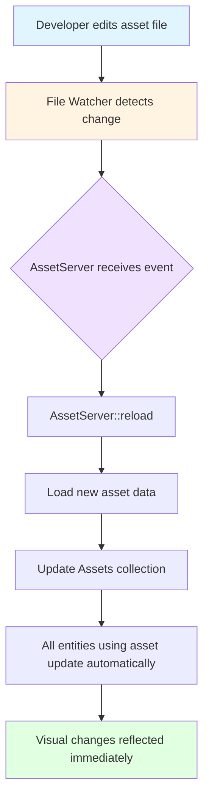
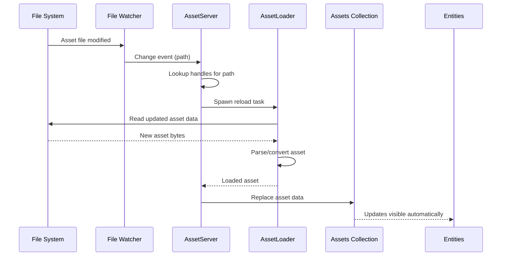
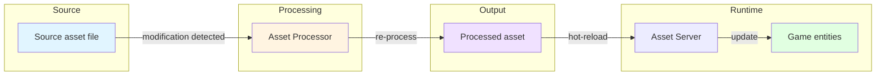

Asset hot-reloading is a powerful development feature that enables you to modify game assets during runtime without restarting your application. This capability dramatically accelerates the development workflow by allowing immediate visual feedback when tweaking textures, shaders, models, or other asset types.

## Understanding Hot-Reloading Architecture

The hot-reloading system in Bevy operates through a sophisticated file watching mechanism integrated directly into the asset loading pipeline. When enabled, the `AssetServer` monitors your asset source directories for changes, automatically triggering reload operations when files are modified.

The architecture consists of three key components working in concert:

1. **File Watcher Layer**: Monitors the filesystem for change events using platform-specific implementations
2. **Asset Server Layer**: Processes change events and initiates reload operations for affected assets
3. **Asset Storage Layer**: Updates in-memory asset data, automatically propagating changes to all entities using the modified assets

This design ensures that asset modifications flow seamlessly from disk to your running game without manual intervention.



Sources: [lib.rs](crates/bevy_asset/src/lib.rs#L55-L63), [mod.rs](crates/bevy_asset/src/server/mod.rs#L189-L192)

## Enabling Hot-Reloading

### Cargo Feature Configuration

Hot-reloading is controlled through cargo features. To enable it on desktop platforms, add the `file_watcher` feature to your `Cargo.toml`:

```toml
[dependencies]
bevy = { version = "0.14", features = ["file_watcher"] }
```

This feature flag activates the necessary file watching infrastructure and enables hot-reloading by default.

### Runtime Configuration Override

For scenarios where you need more granular control, the `AssetPlugin` provides a `watch_for_changes_override` field that allows you to toggle hot-reloading at runtime, independent of the cargo feature settings.

Sources: [lib.rs](crates/bevy_asset/src/lib.rs#L240-L246)

| Configuration Method | Scope | Use Case |
|---------------------|-------|----------|
| `file_watcher` cargo feature | Compile-time | Standard development builds |
| `watch_for_changes_override` field | Runtime | Conditional enabling/disabling based on build profiles or user preferences |
| `None` (default) | Feature-based | Automatically enables if `file_watcher` or `watch` features are active |

The `watch_for_changes_override` parameter accepts three possible values:

- **`None`** (default): Hot-reloading follows feature flag configuration
- **`Some(true)`**: Force-enable hot-reloading regardless of features
- **`Some(false)`**: Force-disable hot-reloading even if features are enabled

Sources: [lib.rs](crates/bevy_asset/src/lib.rs#L337-L338)

## How Hot-Reloading Works

### Detection Phase

When the file watcher detects a modification to an asset file, it generates a change event that propagates to the `AssetServer`. The server maintains a mapping of file paths to active asset handles, allowing it to quickly identify which assets need reloading.

### Reload Process

The reload operation (`AssetServer::reload`) follows a systematic approach:

1. **Handle Lookup**: The server queries its internal registry for all handles associated with the modified path
2. **Reload Initiation**: For each handle, an asynchronous reload task is spawned
3. **Asset Loading**: The `AssetLoader` for the asset type loads the updated data
4. **Storage Update**: The new asset data replaces the old data in the `Assets` collection
5. **Automatic Propagation**: All entities referencing the asset through handles immediately see the updated data

This process occurs in the background using async tasks, ensuring that hot-reloading doesn't block your game's main thread.



Sources: [mod.rs](crates/bevy_asset/src/server/mod.rs#L878-L928)

<CgxTip>
The reload operation is idempotent and safe to call multiple times. If the asset is already being reloaded, the server intelligently manages concurrent reload operations to prevent conflicts.
</CgxTip>

## Behavior with Asset Handles

One of the most powerful aspects of Bevy's hot-reloading system is its integration with the handle-based reference system. When an asset is hot-reloaded, all entities using that asset automatically reflect the changes without requiring manual updates.

This behavior occurs because:

- Handles are essentially **smart pointers** into the `Assets` collection
- The asset data stored in `Assets` is mutated in-place during reload
- All existing handles continue to point to the same asset ID
- The underlying data changes, but the handle references remain valid

This design contrasts with other approaches that might require replacing handles or recreating entities when assets change.

## Platform Considerations

### Desktop Platforms

Hot-reloading is fully supported on desktop platforms (Windows, macOS, Linux) through the `file_watcher` feature. This uses efficient filesystem monitoring APIs to detect changes with minimal overhead.

### Web Platforms

Browser-based deployments lack direct filesystem access, making traditional hot-reloading impossible. However, you can achieve similar results through:

- Hot module replacement during development
- Manual asset reloading triggered by UI controls
- Developer tools that intercept asset requests

Sources: [lib.rs](crates/bevy_asset/src/lib.rs#L292-L294)

### Mobile Platforms

Mobile platforms typically don't support hot-reloading due to sandbox restrictions and the nature of app deployment. Consider using alternative workflows like custom asset reload triggers during development builds.

## Integration with Asset Processing

When using the `Processed` asset mode in combination with the `asset_processor` feature, hot-reloading becomes even more powerful. In this configuration:

1. Changes to source assets are detected by the file watcher
2. The asset processor automatically re-processes the modified assets
3. The processed output triggers a hot-reload of the final assets
4. Your game sees the fully processed, updated assets

This workflow enables you to iterate on source formats (like glTF models or raw textures) while automatically handling all conversion and optimization steps.



Sources: [lib.rs](crates/bevy_asset/src/lib.rs#L309-L315)

## Best Practices

### Development Workflow

For optimal development experience:

1. Enable `file_watcher` feature in development builds
2. Organize assets with clear directory structures
3. Use meaningful file names for easier debugging
4. Test asset changes incrementally rather than bulk modifications
5. Monitor console output for reload status messages

### Asset Type Considerations

Different asset types have varying reload characteristics:

| Asset Type | Reload Speed | Notes |
|-----------|--------------|-------|
| Images/Textures | Fast | Immediate visual feedback |
| Shaders | Fast | Compilation may add slight delay |
| Audio | Medium | May restart sound playback |
| 3D Models | Slower | Sub-assets and materials also reload |
| Scripts | Varies | Depends on loader implementation |

### Performance Impact

Hot-reloading is designed for development use with minimal performance impact:

- File watching adds negligible CPU overhead
- Reload operations use async tasks to avoid blocking the main thread
- Only modified assets are reloaded, not the entire asset cache
- In production builds, you should disable hot-reloading entirely

Sources: [lib.rs](crates/bevy_asset/src/lib.rs#L57-L60)

## Common Use Cases

### Iterative Design

Hot-reloading excels when fine-tuning visual elements:

- Adjusting material colors and properties
- Tweaking shader parameters for visual effects
- Modifying sprite sheet animations
- Experimenting with texture mappings and UVs

### Level Design

Game level designers benefit from:

- Instant feedback on layout changes
- Real-time collision box adjustments
- Dynamic lighting and environment modifications
- Quick iteration on entity placement

### Audio Engineering

Sound designers can:

- Adjust volume levels and mix
- Fine-tune sound effect timing
- Test music transitions
- Verify audio spatialization

## Limitations and Considerations

### Asset Dependency Reloads

Assets with dependencies (like glTF models with embedded textures) require special consideration:

- The main asset reloads automatically
- Dependencies reload based on loader implementation
- Not all loaders support full dependency hot-reloading
- Complex assets may have multiple files triggering sequential reloads

Sources: [lib.rs](crates/bevy_asset/src/lib.rs#L105-L114)

### Handle Lifetime

Hot-reloading preserves handle references, but be aware of these edge cases:

- If all handles to an asset are dropped before reload, the asset is removed from memory
- New loads after complete unloading treat it as a fresh asset
- Weak handles don't prevent asset unloading during reload delays
- Ensure at least one strong handle exists for assets you want to hot-reload

<CgxTip>
For assets with critical runtime state, consider implementing custom reload logic to preserve game state while updating visual data.
</CgxTip>

### Custom Asset Loaders

If implementing custom asset loaders, ensure they support hot-reloading by:

- Handling the `reload` parameter correctly in `load_internal`
- Avoiding caching assumptions that prevent re-reading source data
- Properly updating asset dependencies during reload
- Maintaining compatibility with existing handles

## Debugging Hot-Reloading

When hot-reloading doesn't behave as expected, verify:

1. The `file_watcher` feature is enabled (check `AssetServer::watching_for_changes()`)
2. Asset paths are correctly registered with the server
3. File system permissions allow change detection
4. The asset loader implements proper reload support
5. Handles remain alive during the reload operation

The `AssetServer` logs reload operations, providing visibility into the reload process.

Sources: [mod.rs](crates/bevy_asset/src/server/mod.rs#L923-L925)

## Next Steps

For deeper understanding of the asset system, explore:

- [Asset Loading and Management](18-asset-loading-and-management) for fundamental asset operations
- [Custom Asset Types](20-custom-asset-types) to create assets with hot-reload support
- [Scene System](21-scene-system) for asset composition patterns

Understanding hot-reloading provides a foundation for efficient Bevy development workflows, enabling rapid iteration without restart cycles.
