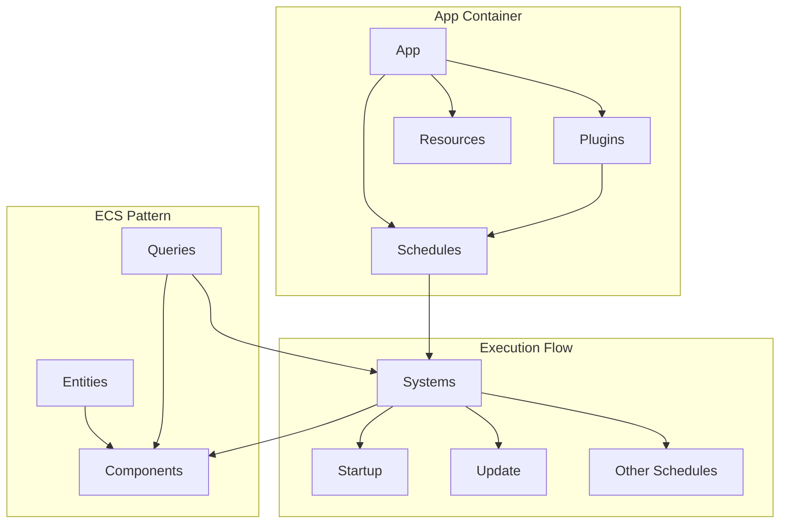

Welcome to the Bevy Quick Start guide! This page will walk you through creating your first Bevy applications, from a simple console "Hello World" to interactive 2D and 3D scenes. By the end, you'll understand Bevy's core concepts and be ready to explore more advanced features.

Sources: [README.md](README.md#L1-L133)

## Your First Bevy App

Let's start with the simplest possible Bevy application that outputs "hello world" to the console. This example demonstrates Bevy's fundamental building blocks: the `App` and **systems**.

```rust
use bevy::prelude::*;

fn main() {
    App::new()
        .add_systems(Update, hello_world_system)
        .run();
}

fn hello_world_system() {
    println!("hello world");
}
```

**Key Concepts:**

- `App::new()`: Creates a new Bevy application, which is the container for your entire game or app
- `add_systems(Update, hello_world_system)`: Registers a system to run every frame during the `Update` schedule
- `.run()`: Starts the game loop and runs your app
- **System**: A regular Rust function that Bevy executes automatically as part of the game loop

Run this example from the Bevy repository:

```bash
cargo run --example hello_world
```

Sources: [examples/hello_world.rs](examples/hello_world.rs#L1-L12)

## Understanding Bevy's Architecture

Bevy is built on three core pillars that work together to create games:



### Core Building Blocks

| Concept | Description | Example |
|---------|-------------|---------|
| **App** | The main container that manages everything in your game | `App::new()` |
| **System** | A function that runs each frame (or on specific schedules) | `fn my_system() { ... }` |
| **Component** | Data attached to entities | `#[derive(Component)] struct Player` |
| **Resource** | Global data accessible by systems | `struct Score(usize)` |
| **Plugin** | Reusable bundles of systems and resources | `DefaultPlugins` |

Sources: [README.md](README.md#L12-L18)

## Creating a Windowed Application

To create a graphical application, you'll need to add Bevy's `DefaultPlugins`, which includes window management, rendering, input handling, and asset loading.

### Minimal Windowed App

```rust
use bevy::prelude::*;

fn main() {
    App::new()
        .add_plugins(DefaultPlugins)
        .run();
}
```

This opens a blank window with all default functionality enabled. The `DefaultPlugins` bundle includes everything you need for most applications: rendering, asset loading, input handling, audio, and more.

Sources: [examples/app/empty.rs](examples/app/empty.rs#L1-L8), [README.md](README.md#L78-L85)

### 2D Rendering Example

Let's create a 2D scene with a sprite. This demonstrates spawning entities, using assets, and setting up a 2D camera:

```rust
use bevy::prelude::*;

fn main() {
    App::new()
        .add_plugins(DefaultPlugins)
        .add_systems(Startup, setup)
        .run();
}

fn setup(mut commands: Commands, asset_server: Res<AssetServer>) {
    // Add a 2D camera
    commands.spawn(Camera2d);

    // Spawn a sprite from an image
    commands.spawn(Sprite::from_image(
        asset_server.load("branding/bevy_bird_dark.png"),
    ));
}
```


**Key Concepts Demonstrated:**

- **Startup Systems**: Run once when the app starts (perfect for initialization)
- **Commands**: API for spawning entities, modifying components, and more
- **AssetServer**: Loads external assets (images, models, audio)
- **Camera2d**: Bevy's built-in 2D camera component
- **Sprite**: A 2D image that can be rendered

Sources: [examples/2d/sprite.rs](examples/2d/sprite.rs#L1-L19)

### 3D Rendering Example

Now let's create a 3D scene with lighting, meshes, and a camera:

```rust
use bevy::prelude::*;

fn main() {
    App::new()
        .add_plugins(DefaultPlugins)
        .add_systems(Startup, setup)
        .run();
}

fn setup(
    mut commands: Commands,
    mut meshes: ResMut<Assets<Mesh>>,
    mut materials: ResMut<Assets<StandardMaterial>>,
) {
    // Circular base (plane rotated flat)
    commands.spawn((
        Mesh3d(meshes.add(Circle::new(4.0))),
        MeshMaterial3d(materials.add(Color::WHITE)),
        Transform::from_rotation(Quat::from_rotation_x(-std::f32::consts::FRAC_PI_2)),
    ));

    // Cube
    commands.spawn((
        Mesh3d(meshes.add(Cuboid::new(1.0, 1.0, 1.0))),
        MeshMaterial3d(materials.add(Color::srgb_u8(124, 144, 255))),
        Transform::from_xyz(0.0, 0.5, 0.0),
    ));

    // Point light with shadows
    commands.spawn((
        PointLight {
            shadow_maps_enabled: true,
            ..default()
        },
        Transform::from_xyz(4.0, 8.0, 4.0),
    ));

    // 3D camera
    commands.spawn((
        Camera3d::default(),
        Transform::from_xyz(-2.5, 4.5, 9.0).looking_at(Vec3::ZERO, Vec3::Y),
    ));
}
```


**New Concepts:**

- **Mesh3d/MeshMaterial3d**: Bundles for 3D rendering with meshes and materials
- **Assets<Mesh>/Assets<StandardMaterial>**: Resource types for managing assets
- **Transform**: Position, rotation, and scale component
- **PointLight**: Light source for 3D scenes
- **Camera3d**: Perspective camera for 3D rendering
- **Querying Resources**: `ResMut` allows mutable access to global assets

Sources: [examples/3d/3d_scene.rs](examples/3d/3d_scene.rs#L1-L44)

## Handling Input

Bevy provides comprehensive input handling for keyboard, mouse, gamepad, and touch input. Here's a keyboard input example:

```rust
use bevy::{input::keyboard::Key, prelude::*};

fn main() {
    App::new()
        .add_plugins(DefaultPlugins)
        .add_systems(Update, keyboard_input_system)
        .run();
}

fn keyboard_input_system(
    keyboard_input: Res<ButtonInput<KeyCode>>,
    key_input: Res<ButtonInput<Key>>,
) {
    // KeyCode: Physical key location (same across layouts)
    if keyboard_input.just_pressed(KeyCode::KeyA) {
        info!("'A' just pressed");
    }

    // Key: Logical key value (layout-independent)
    let key = Key::Character("?".into());
    if key_input.just_pressed(key) {
        info!("'?' just pressed");
    }
}
```

**Input States:**

| Method | Description |
|--------|-------------|
| `pressed()` | Key is currently held down |
| `just_pressed()` | Key was pressed this frame |
| `just_released()` | Key was released this frame |

<CgxTip>
Use `KeyCode` when you need physical key locations (like WASD movement), and `Key` when you need logical values (like "?" for help menus or "+"/-" for zooming).
</CgxTip>

Sources: [examples/input/keyboard_input.rs](examples/input/keyboard_input.rs#L1-L44)

## Building Interactive Movement

Let's create an example where one entity smoothly follows another. This demonstrates interpolation, component marking, and system chaining:

```rust
use bevy::{math::prelude::*, prelude::*};

#[derive(Component)]
struct TargetSphere;

#[derive(Component)]
struct FollowingSphere;

fn main() {
    App::new()
        .add_plugins(DefaultPlugins)
        .add_systems(Startup, setup)
        .add_systems(Update, (move_target, move_follower).chain())
        .run();
}

fn move_follower(
    mut following: Single<&mut Transform, With<FollowingSphere>>,
    target: Single<&Transform, (With<TargetSphere>, Without<FollowingSphere>)>,
    time: Res<Time>,
) {
    let delta_time = time.delta_secs();
    
    // Smoothly interpolate towards target
    following.translation
        .smooth_nudge(&target.translation, 2.0, delta_time);
}
```

**Advanced Concepts:**

- **Component Markers**: Empty structs used to tag entities for queries
- **Query Filters**: `With<T>`, `Without<T>` filter query results
- **Single<T, Filter>`**: Query type that expects exactly one matching entity
- **System Chaining**: `.chain()` ensures systems run in order
- **Time Resource**: Access to delta time for frame-rate independent movement
- **smooth_nudge**: Bevy's interpolation method for smooth movement

Sources: [examples/movement/smooth_follow.rs](examples/movement/smooth_follow.rs#L1-L133)

## Customizing Your Build

Bevy uses Cargo features to let you customize exactly what you include. This can dramatically reduce compile times and binary size.

### Feature Profiles

| Profile | Description | Use Case |
|---------|-------------|----------|
| `default` | Full Bevy experience (2D + 3D + UI) | General-purpose games |
| `2d` | 2D rendering, UI, audio, picking | 2D games, UI apps |
| `3d` | 3D rendering, UI, audio, picking | 3D games |
| `ui` | UI framework only | UI-focused applications |

### Custom Dependencies

```toml
[dependencies.bevy]
version = "0.19"
default-features = false
features = [
    "bevy_winit",        # Windowing
    "bevy_render",      # Rendering
    "bevy_sprite",      # 2D sprites
    "bevy_asset",       # Asset loading
]
```

Sources: [docs/cargo_features.md](docs/cargo_features.md#L1-L100), [Cargo.toml](Cargo.toml#L1-L14)

## Next Steps

You've now seen the fundamentals of Bevy! Here's what to explore next:

### Immediate Next Steps

1. **[Installation and Development Environment](3-installation-and-development-environment)** - Set up your development environment for optimal Bevy development
2. **[Fast Compile Configuration](4-fast-compile-configuration)** - Configure Bevy for rapid iteration during development
3. **Explore Examples** - Bevy has hundreds of examples covering every feature:
   ```bash
   # List all examples
   cargo run --example
   
   # Run a specific example
   cargo run --example 2d_shapes
   ```

### Deep Dive into Core Concepts

4. **[Entity Component System (ECS)](9-entity-component-system-ecs)** - Understand Bevy's data-oriented architecture in depth
5. **[App and Plugin System](10-app-and-plugin-system)** - Learn how to structure large applications with plugins
6. **[System Scheduling and Execution](11-system-scheduling-and-execution)** - Control when and how systems run

### Building Your First Game

7. **[2D Rendering Engine](14-2d-rendering-engine)** - Master 2D game development
8. **[Input Handling System](22-input-handling-system)** - Comprehensive input management
9. **[Query Patterns and Filters](25-query-patterns-and-filters)** - Advanced ECS querying techniques

### Example Roadmap

| Category | Example | What You'll Learn |
|----------|---------|-------------------|
| **Basics** | `hello_world`, `app/empty` | App structure, systems |
| **2D** | `2d/sprite`, `2d/move_sprite`, `2d/sprite_sheet` | Sprites, animation, transforms |
| **3D** | `3d/3d_scene`, `3d/lighting`, `3d/pbr` | Meshes, materials, lighting |
| **Input** | `input/keyboard_input`, `input/mouse_input` | Input handling patterns |
| **ECS** | `ecs/ecs_guide`, `ecs/iterators` | ECS query patterns |
| **Games** | `games/breakout`, `games/alien_cake_addict` | Complete game examples |

<CgxTip>
Start by copying the example that closest matches what you want to build, then modify it incrementally. Bevy's examples are designed to be learning resources and starting points.
</CgxTip>

### Community Resources

- **Bevy Examples**: [github.com/bevyengine/bevy/tree/latest/examples](https://github.com/bevyengine/bevy/tree/latest/examples)
- **API Documentation**: [docs.rs/bevy](https://docs.rs/bevy)
- **Discord Community**: [discord.gg/bevy](https://discord.gg/bevy)
- **Learning Resources**: [bevy.org/assets/#learning](https://bevy.org/assets/#learning)
