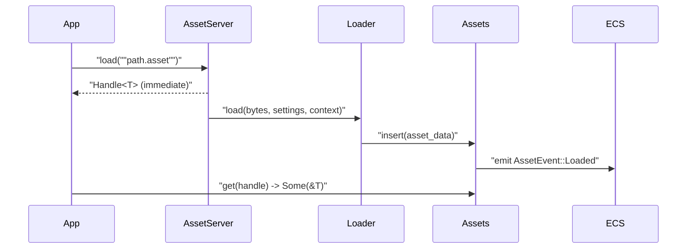
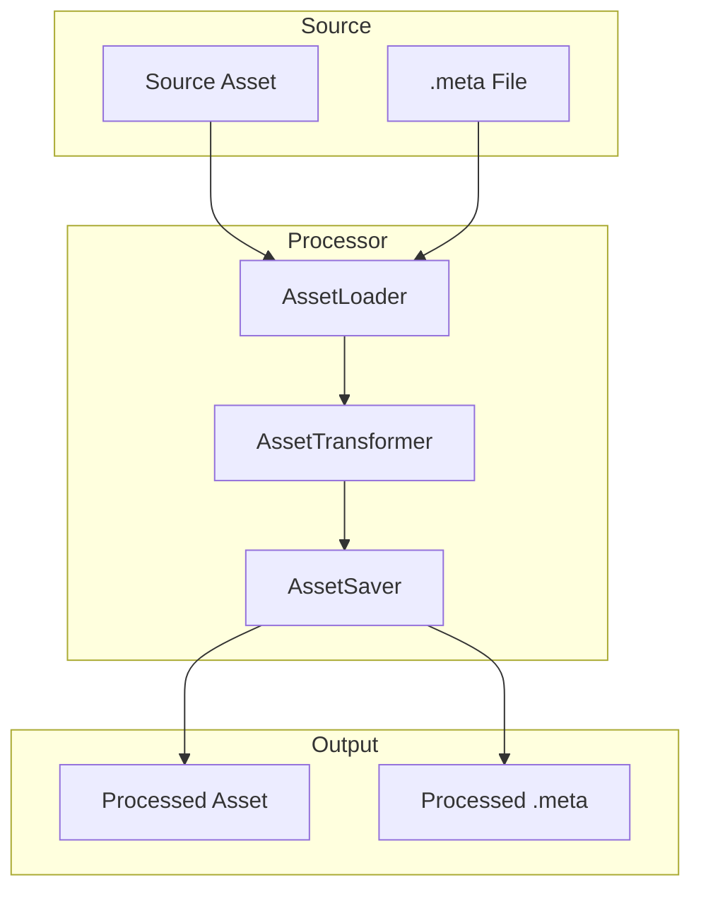

Custom asset types enable you to extend Bevy's asset system to support proprietary, game-specific, or unusual data formats that aren't covered by the built-in asset implementations. This capability is essential when working with custom file formats, specialized data structures, or when you need optimized asset loading strategies tailored to your game's unique requirements. Bevy's asset system is designed to be extensible through a trait-based architecture that separates concerns between the asset data itself, the logic to load it from bytes, and the metadata that configures how it should be processed.

Sources: [lib.rs](/crates/bevy_asset/src/lib.rs#L1-L150)

## Core Concepts

### Asset Trait Implementation

The foundation of any custom asset type is the `Asset` trait, which provides the necessary type information and dependency tracking capabilities. For simple use cases, you can derive both `Asset` and `Reflect` traits—the derive macro automatically implements required supertraits including `TypePath` for metadata and `VisitAssetDependencies` for tracking asset dependencies. More complex scenarios require manual implementation to control how dependencies are discovered and managed.

The `Asset` trait enables your type to be stored in Bevy's `Assets<T>` resource collection, which uses dense vector storage optimized for runtime access. Each asset is identified by an `AssetIndex` containing a generation counter and index, providing efficient memory management through recycling of dropped asset slots. This design prevents memory fragmentation while ensuring that stale handles cannot accidentally reference reallocated assets.

Sources: [assets.rs](/crates/bevy_asset/src/assets.rs#L1-L150), [lib.rs](/crates/bevy_asset/src/lib.rs#L1-L150)

### Asset Loader Pattern

The `AssetLoader` trait defines how to convert raw bytes into your asset type. A critical architectural decision is that `AssetLoader` should not be implemented directly on your asset type—instead, create a separate loader type that stores configuration and loading logic while your asset type serves as the associated `Asset` type. This separation enables multiple loader implementations with different `Settings` types for the same asset, supporting various loading strategies or format variants.

Every `AssetLoader` must define three associated types: `Asset` (the type being loaded), `Settings` (configuration parameters that implement `Settings`, `Default`, `Serialize`, and `Deserialize`), and `Error` (which must convert into `BevyError`). The `load` method receives a mutable `Reader` for accessing bytes, a reference to the settings, and a `LoadContext` for tracking dependencies and managing nested asset loads.

```rust
#[derive(Asset, TypePath, Debug, Deserialize)]
struct CustomAsset {
    value: i32,
}

#[derive(Default, TypePath)]
struct CustomAssetLoader;

impl AssetLoader for CustomAssetLoader {
    type Asset = CustomAsset;
    type Settings = ();
    type Error = CustomAssetLoaderError;
    
    async fn load(
        &self,
        reader: &mut dyn Reader,
        _settings: &(),
        _load_context: &mut LoadContext<'_>,
    ) -> Result<Self::Asset, Self::Error> {
        let mut bytes = Vec::new();
        reader.read_to_end(&mut bytes).await?;
        let custom_asset = ron::de::from_bytes::<CustomAsset>(&bytes)?;
        Ok(custom_asset)
    }
    
    fn extensions(&self) -> &[&str] {
        &["custom"]
    }
}
```

Sources: [custom_asset.rs](/examples/asset/custom_asset.rs#L1-L60), [loader.rs](/crates/bevy_asset/src/loader.rs#L1-L100)

## Asset System Architecture

### Registration and Lifecycle

The asset system follows a registration-based architecture where asset types and loaders must be explicitly registered with your application. The registration process occurs in your app's plugin setup using the `init_asset`, `init_asset_loader`, or `register_asset_loader` methods on `App`. When you call `init_asset::<CustomAsset>()`, Bevy creates the `Assets<CustomAsset>` resource and sets up the infrastructure for managing that asset type.

The lifecycle of an asset begins when you request a handle through `AssetServer::load()`, which returns immediately with a `Handle<T>` before the asset is actually loaded. Bevy's asynchronous task system handles the actual loading in the background, allowing your game to continue without blocking. The asset becomes available once the loading task completes, at which point you can access it through the `Assets<T>` resource using the handle as a key.



Sources: [loader.rs](/crates/bevy_asset/src/loader.rs#L100-L200), [assets.rs](/crates/bevy_asset/src/assets.rs#L150-L300)

### Dependency Management

Assets can depend on other assets—for example, a level format might reference texture handles, or a 3D model might embed material references. The asset system automatically tracks these dependencies through the `VisitAssetDependencies` trait, which enables automatic reloading when dependencies change. Use the `#[dependency]` attribute on fields that contain handles to automatically derive the correct dependency tracking logic.

The `LoadContext` provides methods for declaring and loading dependencies during the asset loading process. When you load a dependency through the context, it's tracked as a loader dependency, meaning the dependent asset's hash incorporates the dependency's content. This ensures that if a dependency changes, the parent asset is marked as needing reload. For runtime-only references (handles you use but don't process), you don't need to load them through the context—just store the handles normally.

Sources: [loader.rs](/crates/bevy_asset/src/loader.rs#L200-L300), [asset_processing.rs](/examples/asset/processing/asset_processing.rs#L1-L150)

## Advanced Features

### Labeled Assets

Complex assets often contain multiple sub-assets that benefit from being addressable independently. Bevy supports labeled assets through the `LoadContext::labeled_asset_scope` method, which allows you to register named sub-assets during the loading process. Each labeled asset receives its own handle and can be loaded independently, while still being tracked as part of the parent asset's lifecycle.

Labeled assets are particularly useful for formats that bundle multiple related resources—such as a sprite sheet containing multiple sprites, or a font atlas with embedded character images. The parent asset's handle doesn't directly reference any particular labeled asset; instead, you use path-based access like `"path/to/asset#label"` to load specific labeled assets.

Sources: [loader.rs](/crates/bevy_asset/src/loader.rs#L200-L300)

### Asset Processing Pipeline

For projects that need optimized runtime loading, Bevy provides an asset processing pipeline that transforms source assets into optimized formats during build time. The pipeline consists of three main components: `AssetLoader` for reading source formats, `AssetTransformer` for converting between internal representations, and `AssetSaver` for writing optimized output formats. This enables you to store assets in author-friendly formats (like JSON or RON) while shipping optimized binary formats to players.

The processing mode is configured through `AssetPlugin::mode` with `AssetMode::Processed`. When enabled, the `AssetProcessor` watches source files, runs them through configured processors, and writes results to an `imported_assets` directory. The processor automatically creates `.meta` files alongside source assets, which you can edit to customize processing settings for individual assets.



Sources: [asset_processing.rs](/examples/asset/processing/asset_processing.rs#L1-L150), [meta.rs](/crates/bevy_asset/src/meta.rs#L1-L150)

### Reflection Integration

Custom assets integrate with Bevy's reflection system through the `ReflectAsset` type, which provides runtime type-erased access to asset operations. This enables advanced use cases like asset editing tools, serialization systems, and dynamic asset management where the concrete asset type isn't known at compile time. Register your asset for reflection using `register_asset_reflect` to enable these capabilities.

The reflection system mirrors the `Assets<T>` API with methods like `get`, `get_mut`, `add`, and `remove`, but operates on `dyn Reflect` references rather than concrete types. This is particularly useful when building editor tools or asset management systems that need to operate generically across multiple asset types without hardcoding type-specific logic.

Sources: [reflect.rs](/crates/bevy_asset/src/reflect.rs#L1-L150)

## Change Detection and Events

### Asset Change Tracking

Bevy provides two mechanisms for detecting when assets change: the `AssetChanged` query filter and `AssetEvent` events. The `AssetChanged` filter works similarly to ECS's `Changed` filter but operates on asset data—whenever an asset's content is modified (either through hot-reloading or direct mutation), all entities with handles to that asset are matched by queries using `AssetChanged<T>`. This enables reactive systems that respond to asset updates without manual invalidation logic.

The `AssetEvent` enum provides three event variants: `Loaded` (emitted when an asset finishes loading), `Modified` (emitted when asset content changes), and `Removed` (emitted when an asset is dropped from the `Assets` collection). These events are emitted by the asset system's internal systems and can be queried in your own systems to trigger game logic based on asset lifecycle changes.

<CgxTip>
The `AssetChanged` filter detects changes to the underlying asset data, not changes to handles themselves. Use `Changed<Handle<T>>` when you want to detect when a component's handle reference changes, and `AssetChanged<T>` when you want to detect when the loaded asset content changes.</CgxTip>

Sources: [asset_changed.rs](/crates/bevy_asset/src/asset_changed.rs#L1-L100)

## Implementation Patterns

### Simple Text-Based Assets

For simple text-based formats like configuration files or game data, the pattern is straightforward: define a struct with `Deserialize` derive, implement a loader that parses the bytes, and register the loader. Use format-specific libraries like `ron`, `serde_json`, or `toml` based on your needs. The loader's `extensions` method should return the file extensions your format uses, enabling automatic loader discovery.

When working with text formats, consider providing a `Settings` type that allows users to override parsing behavior—such as customizing JSON parsing options or specifying encoding parameters. The settings are serialized in the `.meta` file, providing per-asset configuration without code changes.

Sources: [custom_asset.rs](/examples/asset/custom_asset.rs#L1-L60)

### Binary Asset Formats

Binary formats require more care in error handling and endianness considerations. The loader should read bytes into appropriate buffer types, then parse according to your format's specification. Common patterns include using the `byteorder` crate for multi-byte integers or custom parsing logic for complex structures.

<CgxTip>
For binary formats that may have multiple versions, include version information in the asset header and map it to a versioned loader. This enables backward compatibility by dispatching to the appropriate parsing logic based on the detected version.</CgxTip>

Sources: [custom_asset.rs](/examples/asset/custom_asset.rs#L60-L160)

### Asset with Embedded Resources

Some formats embed resources directly in the file rather than referencing them externally. The loading pattern involves parsing the main structure, extracting embedded resources, creating assets from them through the `LoadContext`, and storing handles in the main asset structure. Use `LoadContext::begin_labeled_asset_scope` to create labeled sub-assets for embedded resources that should be independently addressable.

When extracting embedded resources, be careful about memory management—each embedded resource becomes a separate asset with its own lifecycle. Consider whether embedded resources should be deduplicated across multiple parent assets, and implement appropriate caching strategies if needed.

Sources: [asset_processing.rs](/examples/asset/processing/asset_processing.rs#L1-L150)

## Best Practices

### Error Handling

Asset loaders should convert all errors into the associated `Error` type, which must implement `Into<BevyError>`. Provide descriptive error messages that include the asset path and context of the failure. Use `#[non_exhaustive]` on error enums to allow adding error variants without breaking compatibility. For I/O errors, implement `From<std::io::Error>` to automatically wrap low-level errors.

### Performance Optimization

Asset loading is inherently I/O-bound, but you can optimize through several strategies: use asynchronous I/O throughout your loader, implement parallel loading for assets with independent sub-parts via `begin_labeled_asset`, and consider asset processing for expensive parsing operations. Profile your loaders with the `bevy_dev_tools` cargo feature to identify bottlenecks.

### Type Safety

Leverage Rust's type system to prevent asset confusion—use different types for semantically different assets even if they share internal structure. For example, use `Texture` vs `Cubemap` rather than a single `Image` type with a format flag. This enables compile-time verification that assets are used in appropriate contexts.

Sources: [loader.rs](/crates/bevy_asset/src/loader.rs#L1-L100), [asset_processing.rs](/examples/asset/processing/asset_processing.rs#L1-L150)

## Next Steps

With custom asset types implemented, you may want to explore related asset system capabilities:

- [Asset Hot-Reloading](19-asset-hot-reloading) for development workflows
- [Asset Loading and Management](18-asset-loading-and-management) for broader asset system patterns
- [Scene System](21-scene-system) for asset composition and hierarchical structures

For deeper architectural understanding, consult the [Asset Loading and Management](18-asset-loading-and-management) documentation which covers the asset server, handle lifecycle, and dependency resolution in detail.
