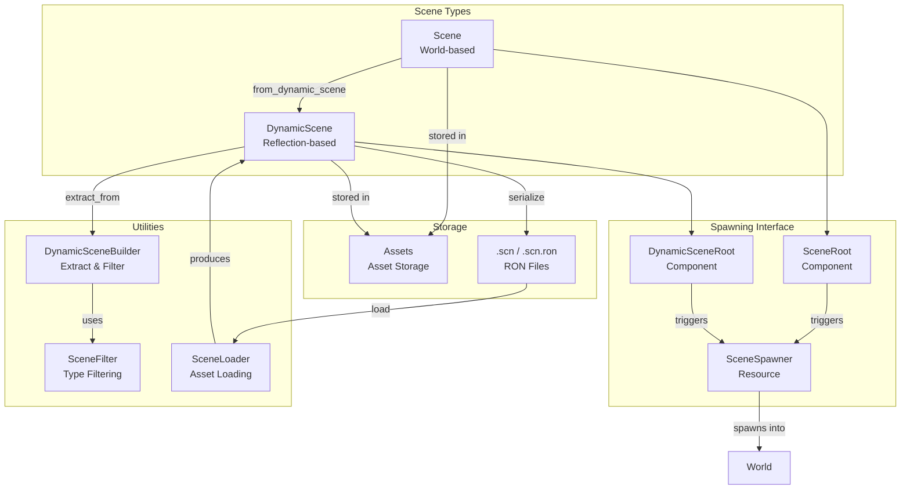
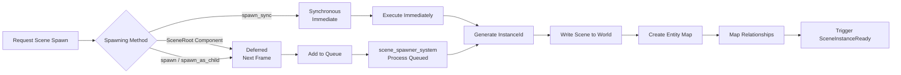
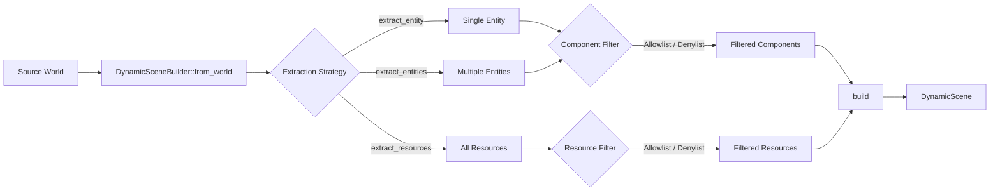

The Scene System provides a powerful framework for serializing, loading, and instantiating entity hierarchies in Bevy. It enables you to save game states to files, create reusable level templates, and dynamically compose your world from pre-built asset files. Built on Bevy's reflection infrastructure, scenes bridge the gap between runtime ECS data and persistent storage formats.

## Core Architecture Overview

The Scene System operates through a three-tier architecture that separates data storage from instantiation logic. At the foundation, scenes leverage Bevy's type reflection system to serialize components and resources into a format-agnostic representation. The spawner resource manages the lifecycle of scene instances, handling entity mapping and hot reloading automatically. This design allows for both synchronous scene operations for immediate effects and deferred batch processing for performance optimization.



The system supports two primary scene representations, each optimized for different use cases. `Scene` contains a complete `World` instance with full ECS data, while `DynamicScene` uses reflection to store a serializable representation that can be written to disk. Both implement the `Asset` trait, enabling integration with Bevy's asset pipeline and hot reloading capabilities.

Sources: [lib.rs](crates/bevy_scene/src/lib.rs#L8-L14), [scene.rs](crates/bevy_scene/src/scene.rs#L14-L27), [dynamic_scene.rs](crates/bevy_scene/src/dynamic_scene.rs#L18-L30)

## Scene Types: Scene vs DynamicScene

Understanding the distinction between `Scene` and `DynamicScene` is critical for effective scene management. While both represent entity collections, their internal structure and use cases differ significantly.

| Aspect | Scene | DynamicScene |
|--------|-------|--------------|
| **Internal Storage** | Complete `World` instance | `Vec<DynamicEntity>` + `Vec<PartialReflect>` resources |
| **Serialization** | Requires conversion to DynamicScene | Directly serializable |
| **Use Case** | In-memory composition, scene references | File I/O, network transfer, dynamic composition |
| **Performance** | Faster cloning of World data | Slower due to reflection overhead |
| **File Format** | Not directly serializable | `.scn` / `.scn.ron` (RON format) |

`Scene` serves as a bridge between the ECS architecture and the scene system, containing a full `World` instance that can be cloned and manipulated using standard ECS operations. The `write_to_world_with` method enables writing scene data to another world while maintaining entity relationships through an `EntityHashMap`.

Sources: [scene.rs](crates/bevy_scene/src/scene.rs#L14-L50), [dynamic_scene.rs](crates/bevy_scene/src/dynamic_scene.rs#L18-L60)

`DynamicScene` represents a reflection-powered serializable format where each entity contains a vector of boxed components implementing `PartialReflect`. This design enables complete serialization without requiring type-specific code, making it ideal for asset pipelines and save systems.

Sources: [dynamic_scene.rs](crates/bevy_scene/src/dynamic_scene.rs#L18-L60)

## Scene Spawning Mechanisms

Bevy provides multiple spawning strategies ranging from synchronous immediate execution to deferred batched processing. The `SceneSpawner` resource coordinates these operations, tracking spawned instances and managing entity mappings between scene and world entities.



### Component-Based Spawning

The most convenient spawning method uses `SceneRoot` and `DynamicSceneRoot` components. Adding these components to any entity triggers automatic scene spawning on the next frame, creating a parent-child relationship where the scene's entities become children of the root entity. Both components automatically require `Transform` and `Visibility` components, ensuring proper rendering integration.

Sources: [components.rs](crates/bevy_scene/src/components.rs#L13-L29)

```rust
// Spawn a scene as a child of an entity
commands.spawn(DynamicSceneRoot(asset_server.load("scenes/level_1.scn.ron")));
```

### SceneSpawner API

For direct programmatic control, the `SceneSpawner` resource offers both deferred and synchronous methods:

**Deferred Methods** (queued for next frame):
- `spawn()` / `spawn_as_child()` - Spawn Scene instances
- `spawn_dynamic()` / `spawn_dynamic_as_child()` - Spawn DynamicScene instances
- `despawn()` / `despawn_dynamic()` - Queue despawn operations

**Synchronous Methods** (immediate execution):
- `spawn_sync()` / `spawn_dynamic_sync()` - Immediate spawning
- `despawn_sync()` / `despawn_dynamic_sync()` - Immediate despawning
- `update_spawned_scenes()` / `update_spawned_dynamic_scenes()` - Reload modified scenes

Sources: [scene_spawner.rs](crates/bevy_scene/src/scene_spawner.rs#L75-L98), [scene_spawner.rs](crates/bevy_scene/src/scene_spawner.rs#L150-L230)

<CgxTip>When spawning scenes as children, the `SceneInstanceReady` event provides notification when instantiation completes, allowing you to perform post-spawn initialization or retrieve the generated instance ID.</CgxTip>

## DynamicSceneBuilder: Extracting and Building Scenes

The `DynamicSceneBuilder` offers fine-grained control over scene creation by extracting entities and resources from an existing `World`. You can selectively include or exclude specific component and resource types using filters, enabling precise control over scene composition.

Sources: [dynamic_scene_builder.rs](crates/bevy_scene/src/dynamic_scene_builder.rs#L30-L90)



The builder supports three filtering strategies managed by `SceneFilter`:

| Filter Mode | Behavior | Use Case |
|-------------|----------|----------|
| `Unset` | All types allowed (default) | Standard scene extraction |
| `Allowlist(HashSet<TypeId>)` | Only specified types included | Minimal scenes, selective export |
| `Denylist(HashSet<TypeId>)` | All types except specified ones | Excluding runtime data |

Sources: [scene_filter.rs](crates/bevy_scene/src/scene_filter.rs#L11-L45)

Common filtering scenarios include excluding transient components like velocity or health that shouldn't be persisted, or allowing only visual components for asset export.

Sources: [dynamic_scene_builder.rs](crates/bevy_scene/src/dynamic_scene_builder.rs#L44-L85)

## Scene Serialization and File Format

The Scene System uses RON (Rusty Object Notation) for serialization, providing a human-readable format that preserves type information. Scene files contain two main sections: `resources` for world resources and `entities` for entity-component mappings.

Sources: [scene_loader.rs](crates/bevy_scene/src/scene_loader.rs#L17-L45)

Example RON scene format from the `load_scene_example.scn.ron`:

```ron
(
  resources: {
    "scene::ResourceA": (
      score: 1,
    ),
  },
  entities: {
    4294967297: (
      components: {
        "bevy_ecs::name::Name": "joe",
        "scene::ComponentA": (
          x: 1.0,
          y: 2.0,
        ),
      },
    ),
    4294967298: (
      components: {
        "scene::ComponentA": (
          x: 3.0,
          y: 4.0,
        ),
      },
    ),
  },
)
```

Sources: [load_scene_example.scn.ron](assets/scenes/load_scene_example.scn.ron#L1-L36)

The serialization process requires proper type registration. Components must derive `Reflect` with the `#[reflect(Component)]` attribute, and resources need `#[reflect(Resource)]`. The `AppTypeRegistry` resource must contain all reflected types used in the scene.

Sources: [scene.rs](examples/scene/scene.rs#L59-L115)

## Type Registration and Reflection Requirements

Scene serialization relies entirely on Bevy's reflection system. Any component or resource intended for scene inclusion must:

1. Derive the `Reflect` trait
2. Add the appropriate reflection attribute (`#[reflect(Component)]` or `#[reflect(Resource)]`)
3. Be registered with the app using `app.register_type::<T>()`

Sources: [scene.rs](examples/scene/scene.rs#L59-L115)

```rust
#[derive(Component, Reflect, Default)]
#[reflect(Component)] // Required for scene serialization
struct MyComponent {
    pub value: f32,
}

#[derive(Resource, Reflect, Default)]
#[reflect(Resource)] // Required for resource serialization
struct MyResource {
    pub count: u32,
}

// In app setup
fn main() {
    App::new()
        .add_plugins(DefaultPlugins)
        .register_type::<MyComponent>()
        .register_type::<MyResource>()
        .run();
}
```

Skipping serialization for specific fields is possible using `#[reflect(skip_serializing)]`, which is useful for runtime-only data like cached values or computed properties.

Sources: [scene.rs](examples/scene/scene.rs#L68-L90)

## Entity Mapping and Relationship Preservation

Scene spawning maintains entity relationships through an `EntityHashMap` that maps scene entity IDs to world entity IDs. This mapping ensures that components referencing other entities (such as `ChildOf` relationships) correctly resolve to the instantiated entities rather than stale scene IDs.

Sources: [scene.rs](crates/bevy_scene/src/scene.rs#L110-L135)

The `SceneEntityMapper` handles this translation during the `write_to_world_with` process, applying entity mapping recursively through component relationships. This enables complex hierarchical structures to be faithfully reconstructed across scene instantiations.

Sources: [scene.rs](crates/bevy_scene/src/scene.rs#L135-L160)

## Scene Lifecycle and Instance Management

Each scene spawn operation generates a unique `InstanceId` that tracks the spawned entities. The `SceneSpawner` maintains mappings from scene assets to their instances and from instance IDs to their entity mappings and parent relationships.

Sources: [scene_spawner.rs](crates/bevy_scene/src/scene_spawner.rs#L52-L65)

### Instance Despawning

Despawning can be performed at multiple granularities:

- **Scene-level**: `despawn()` removes all instances of a given scene asset
- **Instance-level**: `despawn_instance()` removes a specific instance while leaving others intact
- **Manual**: Despawn the root entity directly to remove only entities still in the hierarchy

Sources: [scene_spawner.rs](crates/bevy_scene/src/scene_spawner.rs#L209-L238)

The system automatically handles cleanup through component hooks. When a `SceneRoot` or `DynamicSceneRoot` component is removed, the associated scene instance is unregistered, preventing memory leaks from orphaned instance data.

Sources: [lib.rs](crates/bevy_scene/src/lib.rs#L58-L92)

## Hot Reloading and Asset Event Handling

The Scene System includes built-in hot reloading capabilities, automatically respawning scene instances when underlying assets are modified. To prevent performance issues during asset loading (particularly with GLTF subassets), the system debounces asset modification events, ignoring changes that occur within a short timeframe.

Sources: [scene_spawner.rs](crates/bevy_scene/src/scene_spawner.rs#L101-L112)

The hot reload process despawns existing instances and respawns them with updated data, maintaining parent-child relationships and instance IDs. This enables iterative development workflows where scene files can be edited and reloaded without restarting the application.

Sources: [scene_spawner.rs](crates/bevy_scene/src/scene_spawner.rs#L357-L385)

## Error Handling

The Scene System provides comprehensive error reporting through `SceneSpawnError`, covering various failure modes:

| Error Type | Cause | Resolution |
|------------|-------|------------|
| `UnregisteredComponent` | Component not registered for reflection | Add `#[reflect(Component)]` and `app.register_type()` |
| `UnregisteredResource` | Resource not registered for reflection | Add `#[reflect(Resource)]` and `app.register_type()` |
| `UnregisteredType` | Type not in type registry | Register with `app.register_type()` |
| `NoRepresentedType` | Dynamic type missing type representation | Use `set_represented_type()` on dynamic values |
| `NonExistentScene` | Scene asset not found | Ensure asset path is correct and asset loaded |

Sources: [scene_spawner.rs](crates/bevy_scene/src/scene_spawner.rs#L114-L148)

## Practical Example: Complete Scene Workflow

The following example demonstrates a complete scene workflow including type registration, scene loading, modification detection, and scene saving:

Sources: [scene.rs](examples/scene/scene.rs#L1-L236)

```rust
use bevy::prelude::*;
use std::fs::File;
use std::io::Write;

#[derive(Component, Reflect, Default)]
#[reflect(Component)]
struct ComponentA {
    pub x: f32,
    pub y: f32,
}

#[derive(Component, Reflect)]
#[reflect(Component)]
struct ComponentB {
    pub value: String,
    #[reflect(skip_serializing)]
    pub _runtime_data: Duration,
}

#[derive(Resource, Reflect, Default)]
#[reflect(Resource)]
struct ResourceA {
    pub score: u32,
}

fn main() {
    App::new()
        .add_plugins(DefaultPlugins)
        .register_type::<ComponentA>()
        .register_type::<ComponentB>()
        .register_type::<ResourceA>()
        .add_systems(Startup, (load_scene_system, save_scene_system))
        .add_systems(Update, log_system)
        .run();
}

fn load_scene_system(mut commands: Commands, asset_server: Res<AssetServer>) {
    commands.spawn(DynamicSceneRoot(
        asset_server.load("scenes/level.scn.ron")
    ));
}

fn save_scene_system(world: &mut World) {
    let mut scene_world = World::new();
    let type_registry = world.resource::<AppTypeRegistry>().clone();
    scene_world.insert_resource(type_registry);
    
    scene_world.spawn((
        ComponentA { x: 1.0, y: 2.0 },
        Transform::IDENTITY,
        Name::new("Entity1"),
    ));
    
    scene_world.insert_resource(ResourceA { score: 100 });
    
    let scene = DynamicScene::from_world(&scene_world);
    let type_registry = world.resource::<AppTypeRegistry>();
    let type_registry = type_registry.read();
    let serialized = scene.serialize(&type_registry).unwrap();
    
    // Write to file (non-WASM platforms only)
    #[cfg(not(target_arch = "wasm32"))]
    IoTaskPool::get().spawn(async move {
        let mut file = File::create("scenes/new_level.scn.ron").unwrap();
        file.write_all(serialized.as_bytes()).unwrap();
    });
}

fn log_system(query: Query<&ComponentA, Changed<ComponentA>>) {
    for component in &query {
        info!("Component changed: x={}, y={}", component.x, component.y);
    }
}
```

This workflow demonstrates scene loading via `DynamicSceneRoot`, change detection using `Changed` query filters, and scene serialization to RON format for persistence.

Sources: [scene.rs](examples/scene/scene.rs#L116-L236)

<CgxTip>When working with scene files, note that the serialization process on WASM is limited due to lack of filesystem access. Cross-platform compatibility requires conditional compilation or alternative persistence strategies for web targets.</CgxTip>

## Performance Considerations

Scene operations vary significantly in performance characteristics depending on the chosen approach:

- **Scene Spawning**: DynamicScene spawning involves reflection overhead but enables asset loading. Scene spawning is faster for in-memory composition but requires conversion for persistence.
- **Hot Reloading**: Full despawn-respawn cycles are expensive; consider manual updates for high-frequency modifications.
- **Filtering**: SceneFilter type checks add overhead during extraction; prefer coarse-grained filters over fine-grained per-component checks.
- **Entity Mapping**: Large scenes with complex hierarchies incur mapping costs; `InstanceId` tracking enables selective updates without full regeneration.

The deferred spawning system batches operations into a single system execution, reducing the overhead of multiple scene operations within a frame. For maximum performance in hot paths, synchronous spawning methods provide immediate control at the cost of manual scheduling.

Sources: [scene_spawner.rs](crates/bevy_scene/src/scene_spawner.rs#L75-L98)

## Integration with Other Bevy Systems

The Scene System integrates seamlessly with Bevy's asset pipeline, enabling [Asset Hot-Reloading](19-asset-hot-reloading) for rapid iteration. Scene hierarchies automatically leverage the [Relationships and Hierarchy](29-relationships-and-hierarchy) system through entity mapping, and scene components can include references to other scene assets for nested composition.

For rendering integration, scenes loaded through `SceneRoot` and `DynamicSceneRoot` automatically include required `Transform` and `Visibility` components, ensuring proper integration with Bevy's rendering pipeline. The [Reflection System](33-reflection-system) provides the foundation for scene serialization, and custom asset types can be made scene-compatible through proper reflection registration.
