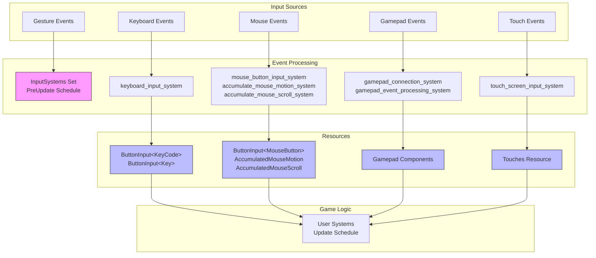

Bevy's Input Handling System provides a comprehensive, event-driven architecture for managing user input across multiple device types. The system abstracts platform-specific input sources into a unified API, supporting keyboard, mouse, gamepad, touch, and gesture inputs through a resource-based ECS integration that processes events during the PreUpdate schedule.

## Architecture Overview

The input system operates as a multi-layered pipeline that converts raw input events from the window system into game-ready resources. Events are emitted by the window backend (typically winit), processed by input systems, and stored as resources that game logic can query efficiently.



The InputPlugin automatically initializes all necessary resources and systems based on enabled Cargo features [InputPlugin::build](crates/bevy_input/src/lib.rs#L96-L152). Input systems run in the PreUpdate schedule, ensuring input state is ready before game logic executes in Update.

Sources: [lib.rs](crates/bevy_input/src/lib.rs#L96-L152), [InputPlugin](crates/bevy_input/src/lib.rs#L88-L90)

## Core Input Types

### ButtonInput Resource

The `ButtonInput<T>` resource is the foundation for binary input handling, tracking the state of pressable elements across any input type. It maintains three collections: currently pressed buttons, just pressed buttons (this frame only), and just released buttons (this frame only).

| Method | Purpose | Complexity |
|--------|---------|------------|
| `pressed(input)` | Check if button is currently held | O(1)~ |
| `just_pressed(input)` | Check if button was pressed this frame | O(1)~ |
| `just_released(input)` | Check if button was released this frame | O(1)~ |
| `any_pressed(inputs)` | Check if any of multiple buttons are pressed | O(m)~ |
| `get_pressed()` | Get all currently pressed buttons | O(n) |

The resource is generic, allowing typed input handling: `ButtonInput<KeyCode>`, `ButtonInput<MouseButton>`, or custom types. Each frame, the input systems call `clear()` to reset transient state before processing events [button_input.rs](crates/bevy_input/src/button_input.rs#L1-L150).

Sources: [button_input.rs](crates/bevy_input/src/button_input.rs#L1-L150)

### Axis Resource

The `Axis<T>` resource handles analog input values, storing position data as f32 values with automatic clamping between -1.0 and 1.0. This is ideal for thumbsticks, triggers, and other continuous inputs. For unclamped values (useful for camera zoom or scroll distance), `get_unclamped()` retrieves raw values outside the normal range.

```rust
// Accessing analog input
fn gamepad_axis_system(gamepads: Query<&Gamepad>) {
    for gamepad in &gamepads {
        let left_stick = gamepad.get(GamepadAxis::LeftStickX).unwrap();
        if left_stick.abs() > 0.01 {
            info!("Left stick X: {}", left_stick);
        }
    }
}
```

Sources: [axis.rs](crates/bevy_input/src/axis.rs#L1-L137)

## Keyboard Input

Bevy provides two distinct keyboard input types to handle different use cases:

- **KeyCode**: Represents physical key locations independent of keyboard layout. Use this when you want consistent behavior regardless of layout (e.g., WASD movement)
- **Key**: Represents logical keys considering keyboard layout. Use this for character-based input (e.g., '?' for help menus)

Both types maintain separate `ButtonInput` resources: `ButtonInput<KeyCode>` and `ButtonInput<Key>`. The system automatically handles window focus state—when the window loses focus, all key states are cleared to prevent stuck inputs [keyboard.rs](crates/bevy_input/src/keyboard.rs#L109-L150).

```rust
fn keyboard_system(
    keycode_input: Res<ButtonInput<KeyCode>>,
    key_input: Res<ButtonInput<Key>>,
) {
    // Physical key for movement
    if keycode_input.pressed(KeyCode::KeyW) {
        // Move forward
    }
    
    // Logical key for text-based input
    let help_key = Key::Character("?".into());
    if key_input.just_pressed(help_key) {
        // Show help menu
    }
}
```

The system also provides the `KeyboardInput` event for lower-level access, including text content and repeat state information. This event contains the physical key code, logical key, state, optional text output, repeat flag, and the window entity that received the input [keyboard.rs](crates/bevy_input/src/keyboard.rs#L109-L150).

Sources: [keyboard.rs](crates/bevy_input/src/keyboard.rs#L109-L150), [keyboard_input.rs](examples/input/keyboard_input.rs)

## Mouse Input

Mouse input combines button state tracking with motion and scroll accumulation. The system provides three primary resources:

- `ButtonInput<MouseButton>`: Tracks left, right, middle, back, forward, and numbered buttons
- `AccumulatedMouseMotion`: Sums all `MouseMotion` events into a single delta per frame
- `AccumulatedMouseScroll`: Accumulates scroll events with unit conversion support

Mouse wheel events can be reported in lines or pixels, with a conversion factor of 100.0 pixels per line for consistent scaling across platforms [mouse.rs](crates/bevy_input/src/mouse.rs#L98-L115).

```rust
fn mouse_system(
    mouse_input: Res<ButtonInput<MouseButton>>,
    motion: Res<AccumulatedMouseMotion>,
    scroll: Res<AccumulatedMouseScroll>,
) {
    if mouse_input.just_pressed(MouseButton::Left) {
        info!("Left button clicked");
    }
    
    if motion.delta != Vec2::ZERO {
        info!("Mouse moved: {}", motion.delta);
    }
    
    if scroll.delta != Vec2::ZERO {
        info!("Scrolled: {} units", scroll.delta);
    }
}
```

<CgxTip>
Mouse motion and scroll resources reset to zero every frame, so always read them in your systems even if the value appears to be zero. This ensures you don't miss input when multiple systems check these resources.
</CgxTip>

Sources: [mouse.rs](crates/bevy_input/src/mouse.rs#L1-L200), [mouse_input.rs](examples/input/mouse_input.rs)

## Gamepad Input

Gamepad support is provided through the `bevy_gilrs` crate integration, representing each connected gamepad as an entity with `Gamepad` component. The system handles connection/disconnection events and maps button and axis inputs to the `GamepadButton` and `GamepadAxis` enums.

Gamepad buttons can have both digital states (pressed/released) and analog values (0.0 to 1.0). The `GamepadSettings` resource allows customization of dead zones, button behavior, and axis sensitivity:

```rust
fn gamepad_system(gamepads: Query<(Entity, &Gamepad)>) {
    for (entity, gamepad) in &gamepads {
        // Digital button press
        if gamepad.just_pressed(GamepadButton::South) {
            info!("{}: South button pressed", entity);
        }
        
        // Analog trigger value
        let trigger = gamepad.get(GamepadButton::RightTrigger2).unwrap();
        if trigger.abs() > 0.01 {
            info!("{}: Trigger at {}", entity, trigger);
        }
        
        // Thumbstick axis
        let stick_x = gamepad.get(GamepadAxis::LeftStickX).unwrap();
        if stick_x.abs() > 0.01 {
            info!("{}: Left stick X at {}", entity, stick_x);
        }
    }
}
```

The system emits multiple event types: `GamepadEvent` (unified), `GamepadConnectionEvent` (connection state), `GamepadButtonChangedEvent` (button changes), and `GamepadAxisChangedEvent` (axis changes) [gamepad.rs](crates/bevy_input/src/gamepad.rs#L1-L200).

Sources: [gamepad.rs](crates/bevy_input/src/gamepad.rs#L1-L200), [gamepad_input.rs](examples/input/gamepad_input.rs)

## Touch and Gesture Input

### Touch Input

Touch input tracks multi-touch interactions through the `Touches` resource and `TouchInput` events. Each touch has a unique identifier that persists from `TouchPhase::Started` through `TouchPhase::Moved` until `TouchPhase::Ended` or `TouchPhase::Canceled`.

The system supports pressure-sensitive touches through the `ForceTouch` enum, which can report either calibrated force (iOS) or normalized force values. This enables pressure-based interactions like varying brush sizes in drawing applications.

```rust
fn touch_system(touches: Res<Touches>) {
    for touch in touches.iter() {
        match touch.phase() {
            TouchPhase::Started => {
                info!("Touch {} started at {}", touch.id(), touch.position());
            }
            TouchPhase::Moved => {
                info!("Touch {} moved, delta: {}", touch.id(), touch.delta());
            }
            TouchPhase::Ended => {
                info!("Touch {} ended, traveled: {}", 
                      touch.id(), touch.distance());
            }
            TouchPhase::Canceled => {
                info!("Touch {} was canceled", touch.id());
            }
        }
    }
}
```

Sources: [touch.rs](crates/bevy_input/src/touch.rs#L1-L200)

### Gesture Input

Gestures provide high-level interaction patterns for touch devices. Currently available on macOS and iOS:

- **PinchGesture**: Two-finger magnification (positive = zoom in, negative = zoom out)
- **RotationGesture**: Two-finger rotation (positive = counterclockwise)
- **DoubleTapGesture**: Quick double-tap detection
- **PanGesture**: Multi-touch pan movement

Gestures must be enabled on iOS and are automatically available on macOS [gestures.rs](crates/bevy_input/src/gestures.rs#L1-L91).

Sources: [gestures.rs](crates/bevy_input/src/gestures.rs#L1-L91)

## Input Focus System

The `bevy_input_focus` crate provides a UI-centric focus management system that routes non-pointer inputs to specific entities. The `InputFocus` resource tracks which entity currently has focus, with `InputFocusVisible` controlling whether focus indicators should be shown.

The system supports bubbling events from the focused entity up through its hierarchy to the window, enabling hierarchical input handling. The `FocusedInput<M>` generic event wraps any message type and dispatches it to the focused entity:

```rust
fn set_focus_system(mut input_focus: ResMut<InputFocus>, query: Query<Entity>) {
    // Set focus to first interactive element
    if let Some(entity) = query.iter().next() {
        input_focus.set(entity);
    }
}

fn focused_input_system(mut events: EventReader<FocusedInput<KeyboardInput>>) {
    for event in events.read() {
        // Process keyboard input directed to focused element
    }
}
```

Navigation frameworks like `tab_navigation` and `directional_navigation` automate focus movement between entities based on keyboard or gamepad input [lib.rs](crates/bevy_input_focus/src/lib.rs#L1-L200).

Sources: [lib.rs](crates/bevy_input_focus/src/lib.rs#L1-L200)

## Common Run Conditions

The `bevy_input::common_conditions` module provides pre-built run conditions that simplify input-driven system execution:

| Condition | Purpose | Usage |
|-----------|---------|-------|
| `input_pressed(key)` | Run while button is held | Continuous movement |
| `input_just_pressed(key)` | Run once when pressed | Jump action |
| `input_just_released(key)` | Run once when released | Release-grapple |
| `input_toggle_active(default, key)` | Toggle state on press | Pause menu |

```rust
fn setup_systems(app: &mut App) {
    app.add_systems(Update, 
        jump.run_if(input_just_pressed(KeyCode::Space))
    )
    .add_systems(Update,
        continuous_fire.run_if(input_pressed(MouseButton::Left))
    )
    .add_systems(Update,
        pause_menu.run_if(input_toggle_active(false, KeyCode::Escape))
    );
}
```

<CgxTip>
For stateful toggles that need to be accessible from multiple systems, create a dedicated Resource or use Bevy's state system instead of `input_toggle_active`, which maintains internal closure state that isn't queryable.
</CgxTip>

Sources: [common_conditions.rs](crates/bevy_input/src/common_conditions.rs#L1-L123)

## Event System Integration

Bevy's input system integrates with the ECS message system, allowing flexible event handling patterns. Input events are defined as `Message` types and can be read using `MessageReader<T>`:

- **KeyboardInput**: Low-level keyboard events with text and repeat info
- **MouseButtonInput**: Button state changes
- **MouseMotion**: Raw mouse motion deltas
- **MouseWheel**: Scroll events with unit information
- **TouchInput**: Touch phase and position events
- **GamepadEvent**: Unified gamepad events
- **PinchGesture/RotationGesture/DoubleTapGesture/PanGesture**: Gesture events

Events are emitted during window event processing and consumed by input systems that update the stateful resources. Systems can also read events directly for custom behavior not provided by the resource abstraction.

## Performance Considerations

The input system is designed for efficiency with clear complexity characteristics:

- **ButtonInput operations**: Most common operations are O(1)~ amortized
- **Axis lookups**: HashMap-based O(1)~ for device-specific queries
- **Event processing**: Linear in number of events per frame
- **Change detection**: Bypass change detection when clearing resources to avoid unnecessary system runs

The system uses `bypass_change_detection()` when clearing resources to prevent spurious change ticks, ensuring systems using `resource_changed()` conditions only run when actual input occurs [button_input.rs](crates/bevy_input/src/button_input.rs#L130-L145).

Sources: [button_input.rs](crates/bevy_input/src/button_input.rs#L130-L145)

## Platform Considerations

Different platforms have varying input capabilities:

- **Desktop**: Full keyboard/mouse support with gamepad via GilRs
- **Web**: Keyboard/mouse with limited gamepad support, gestures not available
- **Mobile**: Touch input with gestures (iOS requires enablement), virtual keyboard support
- **Console**: Gamepad primary, touch not available

The input system abstracts these differences, but developers should design input schemes that work across target platforms. The `GamepadSettings` resource allows platform-specific tuning of dead zones and sensitivity.

## Integration with Other Bevy Systems

The input system integrates seamlessly with other Bevy subsystems:

- **Window System**: Events are generated by window resize and focus changes
- **ECS System**: Resources are standard ECS resources compatible with queries
- **State System**: Input can trigger state transitions using run conditions
- **UI System**: Input focus routes keyboard and gamepad events to UI elements
- **Picking System**: Mouse events can be combined with entity picking for 3D interactions

For deeper integration with UI widgets and element-specific input routing, see [Input Focus System](22-input-handling-system#input-focus-system). For managing windows and their focus states, see [Window Management](23-window-management). For 3D interaction patterns using input with entity selection, see [Picking System](24-picking-system).
