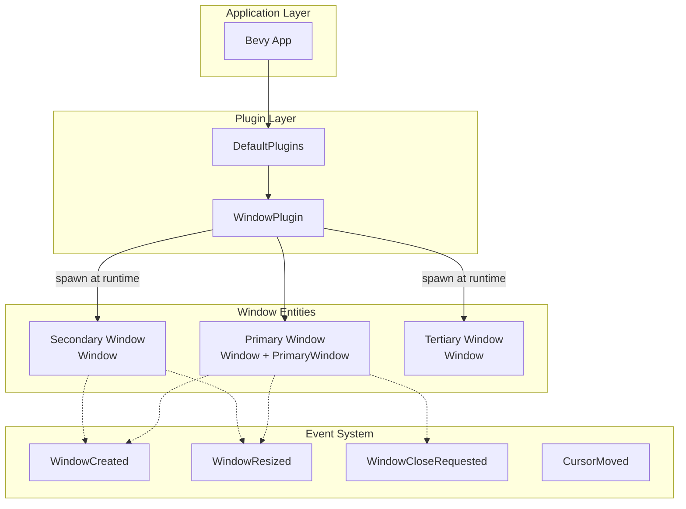

Bevy's window management system provides a platform-agnostic interface for creating, configuring, and managing application windows. Built on top of the winit library through `bevy_winit`, it offers a component-based ECS approach that integrates seamlessly with Bevy's architecture. Whether you need a single window application or complex multi-window setups, the system provides flexible control over window behavior, appearance, and lifecycle management.

## Core Architecture

The window management system is built around three fundamental concepts: the `WindowPlugin`, the `Window` component, and window-specific events. This architecture leverages Bevy's ECS to treat windows as entities, enabling powerful patterns like querying, filtering, and reactive systems. The `WindowPlugin` configures global window behavior and spawns the primary window by default, while individual windows are represented as entities with `Window` components.



Sources: [lib.rs](crates/bevy_window/src/lib.rs#L1-L174), [window.rs](crates/bevy_window/src/window.rs#L1-L153)

## Window Plugin Configuration

The `WindowPlugin` serves as the entry point for window management in your application. It configures global window parameters and spawns the primary window when initialized through `DefaultPlugins`. The plugin offers three key configuration options that control application lifecycle and window behavior.

The `primary_window` field determines whether a main window should be created. Setting it to `Some(Window::default())` spawns the primary window with the `PrimaryWindow` marker component, while `None` creates a headless application suitable for server-side or background processing. The `exit_condition` enum defines when your application should terminate: `OnAllClosed` exits when every window is closed, `OnPrimaryClosed` exits when just the primary window closes, and `DontExit` keeps the application running regardless of window state. Finally, `close_when_requested` controls whether clicking the window's close button actually closes the window or requires custom handling.

Sources: [lib.rs](crates/bevy_window/src/lib.rs#L38-L67), [lib.rs](crates/bevy_window/src/lib.rs#L72-L174)

## Window Component

The `Window` component is the heart of window management, storing all configuration for individual windows. When added to an entity, it creates a new window; when removed or the entity is despawned, the window closes. This component is synchronized with winit through `bevy_winit`, meaning changes you make to its fields are reflected in the actual window, and external changes (like user resizing) update the component's state.

Key configuration fields include:
- **present_mode**: Controls rendering synchronization (`AutoVsync`, `AutoNoVsync`, `Fifo`, `Immediate`, `Mailbox`)
- **mode**: Sets window display mode (`Windowed`, `Fullscreen`, `BorderlessFullscreen`)
- **position**: Determines window placement (`Automatic`, `At(IVec2)`, `Centered`)
- **resolution**: Defines window dimensions via `WindowResolution`
- **title**: Sets the window title text
- **resizable**: Controls whether users can resize the window
- **decorations**: Toggles window decorations (minimize, maximize, close buttons)
- **transparent**: Enables window transparency for visual effects

The component includes numerous platform-specific fields for macOS (titlebar customization, shadow control), iOS (gesture recognition, home indicator), Windows (taskbar integration), and Web (canvas integration, event handling).

Sources: [window.rs](crates/bevy_window/src/window.rs#L150-L349), [window.rs](crates/bevy_window/src/window.rs#L361-L500)

## Creating and Managing Windows

### Primary Window Setup

The primary window is automatically spawned by `WindowPlugin` and marked with the `PrimaryWindow` component. This window serves as the default rendering target for cameras and UI. You can customize it through the plugin configuration:

```rust
use bevy::prelude::*;

App::new()
    .add_plugins(DefaultPlugins.set(WindowPlugin {
        primary_window: Some(Window {
            title: "My Application".to_owned(),
            resolution: (1280.0, 720.0).into(),
            mode: WindowMode::Windowed,
            ..default()
        }),
        ..default()
    }))
    .run();
```

Sources: [lib.rs](crates/bevy_window/src/lib.rs#L72-L100), [window_settings.rs](examples/window/window_settings.rs#L18-L44)

### Multi-Window Applications

Creating additional windows is as simple as spawning entities with `Window` components. Each window becomes a separate rendering target that cameras can render to. The `WindowRef::Entity(entity)` type lets you reference specific windows for cameras and UI.

```rust
fn setup_scene(mut commands: Commands) {
    // Spawn a second window
    let second_window = commands
        .spawn(Window {
            title: "Second window".to_owned(),
            ..default()
        })
        .id();

    // Create a camera that renders to the second window
    commands.spawn((
        Camera3d::default(),
        Transform::from_xyz(6.0, 0.0, 0.0).looking_at(Vec3::ZERO, Vec3::Y),
        RenderTarget::Window(WindowRef::Entity(second_window)),
    ));
}
```

Sources: [multiple_windows.rs](examples/window/multiple_windows.rs#L1-L66), [window.rs](crates/bevy_window/src/window.rs#L66-L127)

## Window Events

Bevy's window system emits numerous events that allow you to react to window state changes. These events use Bevy's message system and can be read through `MessageReader` in your systems.

### Window Lifecycle Events

- **WindowCreated**: Emitted when a new window entity is spawned
- **WindowClosing**: Emitted when a window is in the process of closing (after `WindowCloseRequested`)
- **WindowClosed**: Emitted when a window has been closed and its entity despawned
- **WindowCloseRequested**: Emitted when the user clicks the close button
- **WindowDestroyed**: Emitted when the underlying window system destroys the window

```rust
fn handle_window_events(
    mut resize_reader: MessageReader<WindowResized>,
    mut close_requested: EventReader<WindowCloseRequested>,
    mut windows: Query<&mut Window>,
) {
    for event in resize_reader.read() {
        println!("Window resized: {}x{}", event.width, event.height);
    }
    
    for event in close_requested.read() {
        if let Ok(mut window) = windows.get_mut(event.window) {
            // Custom close handling logic
        }
    }
}
```

Sources: [event.rs](crates/bevy_window/src/event.rs#L1-L150), [system.rs](crates/bevy_window/src/system.rs#L1-L59)

### Interaction Events

The window system also provides events for user interactions:
- **CursorMoved**: Track mouse position within the window
- **CursorEntered/CursorLeft**: Detect when cursor enters/exits window bounds
- **WindowFocused**: Respond to window focus changes
- **WindowMoved**: Detect window position changes
- **FileDragAndDrop**: Handle file drag-and-drop operations

Sources: [event.rs](crates/bevy_window/src/event.rs#L150-L726)

## Resolution and Resizing

### Programmatic Resolution Control

Window resolution is managed through the `WindowResolution` structure, which tracks both logical and physical dimensions. You can change resolution programmatically by modifying the `resolution` field:

```rust
fn toggle_resolution(
    keys: Res<ButtonInput<KeyCode>>,
    mut window: Single<&mut Window>,
    resolution: Res<ResolutionSettings>,
) {
    if keys.just_pressed(KeyCode::Digit1) {
        window.resolution.set(640.0, 360.0);
    }
    if keys.just_pressed(KeyCode::Digit2) {
        window.resolution.set(1280.0, 720.0);
    }
}
```

### Responding to Resize Events

The `WindowResized` event provides real-time notification when the window size changes, either through user action or programmatic modification:

```rust
fn on_resize_system(
    mut text: Single<&mut Text, With<ResolutionText>>,
    mut resize_reader: MessageReader<WindowResized>,
) {
    for e in resize_reader.read() {
        text.0 = format!("Resolution: {:.1} x {:.1}", e.width, e.height);
    }
}
```

Sources: [window_resizing.rs](examples/window/window_resizing.rs#L1-L84)

## Cursor Management

Bevy provides extensive cursor customization through the `CursorOptions` component and `CursorIcon` enum. You can control cursor visibility, grab mode (confining or locking cursor), and appearance.

### Cursor Configuration

```rust
fn setup_cursor(mut commands: Commands, window: Single<Entity, With<Window>>) {
    commands.entity(*window).insert(CursorOptions {
        visible: true,
        grab_mode: CursorGrabMode::None,
        hit_test: true,
    });
}
```

### Cursor Icons

The `CursorIcon` enum supports both system cursor icons and custom images. System icons include `Default`, `Pointer`, `Wait`, `Text`, and many others. With the `custom_cursor` feature enabled, you can use `CustomCursor::Image(CustomCursorImage)` to create custom cursors from loaded textures.

```rust
fn cycle_cursor_icon(
    mut cursor: Single<&mut CursorIcon>,
    input: Res<ButtonInput<MouseButton>>,
    mut index: Local<usize>,
    cursor_icons: Res<CursorIcons>,
) {
    if input.just_pressed(MouseButton::Left) {
        *index = (*index + 1) % cursor_icons.0.len();
        **cursor = cursor_icons.0[*index].clone();
    }
}
```

Sources: [mod.rs](crates/bevy_window/src/cursor/mod.rs#L1-L65), [window_settings.rs](examples/window/window_settings.rs#L140-L201)

## Window Modes and Fullscreen

Windows can be displayed in three modes: `Windowed`, `Fullscreen`, and `BorderlessFullscreen`. Fullscreen mode requires specifying monitor selection through `MonitorSelection::Current`, `Primary`, or `Entity(Entity)` for targeting specific monitors.

```rust
fn toggle_window_mode(mut window: Query<&mut Window, With<PrimaryWindow>>) {
    let Ok(mut window) = window.single_mut() else { return };
    
    window.mode = match window.mode {
        WindowMode::Windowed => {
            WindowMode::Fullscreen(
                MonitorSelection::Current,
                VideoModeSelection::Current,
            )
        }
        _ => WindowMode::Windowed,
    };
}
```

Sources: [change_window_mode.rs](tests/window/change_window_mode.rs#L1-L63), [monitor.rs](crates/bevy_window/src/monitor.rs#L1-L81)

## Monitor Management

Bevy provides access to available monitors through the `Monitor` component, which contains information about physical size, position, scale factor, and supported video modes. The `PrimaryMonitor` marker component identifies the primary display. This information is useful for multi-monitor applications and when positioning windows relative to specific displays.

Sources: [monitor.rs](crates/bevy_window/src/monitor.rs#L1-L81)

## Platform-Specific Considerations

The window system includes numerous platform-specific fields and behaviors:

- **Windows**: Window class names via the `name` field, taskbar integration with `skip_taskbar`, child window clipping with `clip_children`
- **macOS**: Titlebar customization (`titlebar_shown`, `titlebar_transparent`, `fullsize_content_view`), shadow control (`has_shadow`), movable background (`movable_by_window_background`)
- **iOS**: Gesture recognition for pinch, rotation, double-tap, and pan gestures, home indicator and status bar control
- **Web**: Canvas element selection via `canvas`, parent fitting with `fit_canvas_to_parent`, event handling control with `prevent_default_event_handling`

Sources: [window.rs](crates/bevy_window/src/window.rs#L200-L349)

## Application Lifecycle Control

The `WindowPlugin` provides systems for managing application termination based on window state. The `exit_on_all_closed` system closes the application when all windows are closed, while `exit_on_primary_closed` closes when just the primary window is closed. The `close_when_requested` system responds to `WindowCloseRequested` events by despawning window entities.

You can disable automatic closing behavior by setting `close_when_requested` to `false` in the plugin configuration, but you must then manually handle `WindowCloseRequested` events to close windows or the application will continue running as a headless process.

Sources: [system.rs](crates/bevy_window/src/system.rs#L1-L59), [lib.rs](crates/bevy_window/src/lib.rs#L127-L174)

<CgxTip>When implementing custom window close handling, always ensure you either despawn the window entity or send `AppExit` events. Failing to do so creates headless processes that continue running even when no windows are visible, potentially surprising users with background processes consuming resources.</CgxTip>

## Best Practices

Use `Single<&mut Window, With<PrimaryWindow>>` for querying the primary window, which provides compile-time guarantees about single-window queries. For multi-window applications, use regular queries or filter with specific components. When responding to resize events, separate layout recalculation from rendering to avoid performance bottlenecks during rapid resizing.

<CgxTip>For applications requiring invisible startup windows, create windows with `visible: false` and toggle visibility after the GPU is ready (typically 2-3 frames). This prevents the brief white flash that occurs before rendering begins on some platforms.</CgxTip>
