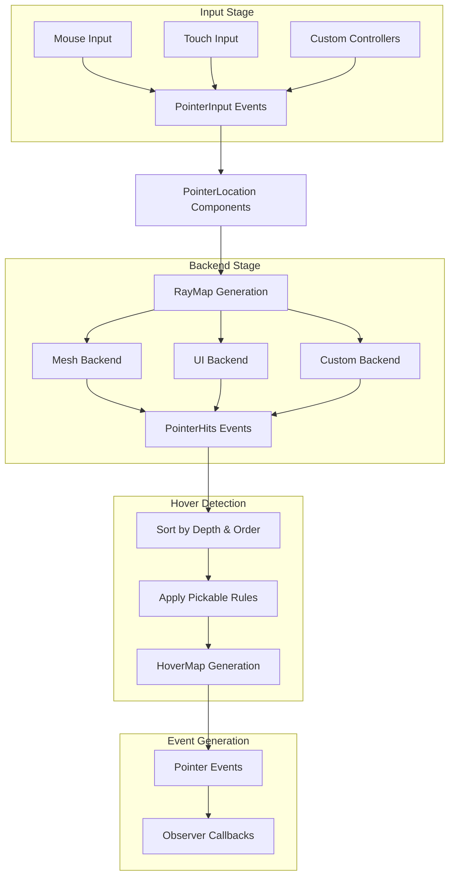
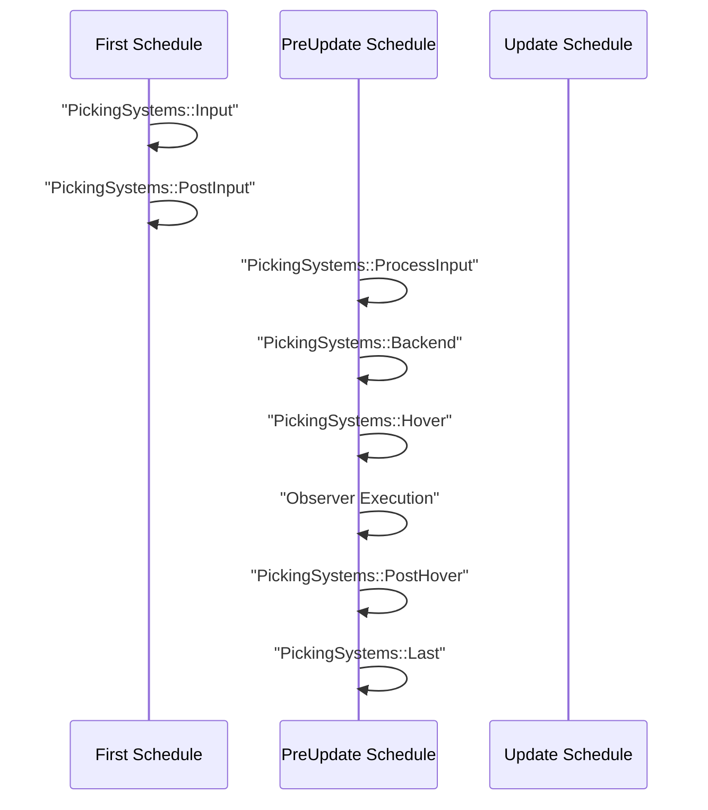

The Picking System provides a robust, modular framework for detecting and responding to pointer interactions with entities in a Bevy application. It abstracts the complexity of hit testing across different input devices (mouse, touch, pens, custom controllers) and rendering contexts (2D UI, 3D meshes, sprites), while providing a unified event model that integrates seamlessly with Bevy's ECS and observer system.

## Architecture Overview

The picking system operates as a multi-stage pipeline that transforms raw input into high-level interaction events. This design enables remarkable flexibility—you can mix and match different backends for different entity types, support multiple pointers simultaneously, and extend the system with custom implementations while maintaining clean separation of concerns.



Sources: [lib.rs](crates/bevy_picking/src/lib.rs#L1-L100), [backend.rs](crates/bevy_picking/src/backend.rs#L1-L50)

## Pipeline Stages

### Stage 1: Pointer Input

The pipeline begins with gathering inputs from various pointer devices. The system generates `PointerInput` events that capture pointer movements, button states, and other interactions. These events are processed to update `PointerLocation` components for each active pointer.

This stage is completely device-agnostic. Whether you're using mouse, touch, pen, or a custom gamepad-controlled virtual pointer, the same abstraction applies. The `PointerId` uniquely identifies each pointer, enabling simultaneous multi-touch scenarios and multiple independent cursors.

Sources: [pointer.rs](crates/bevy_picking/src/pointer.rs), [input.rs](crates/bevy_picking/src/input.rs)

### Stage 2: Backend Hit Testing

Backends are responsible for determining which entities intersect with each pointer. The system provides the `PointerLocation` for each pointer, and backends respond with `PointerHits` events containing entities and their hit data.

For raycasting backends (such as 3D mesh picking), the `RayMap` resource automatically constructs world-space rays for all pointer-camera combinations, handling viewports, DPI, and coordinate transformations. This makes implementing a raycasting backend extremely simple—just iterate over the rays and test against your scene geometry.

Multiple backends can operate simultaneously. For example, you might have one backend for UI elements, another for 3D meshes, and a third for physics objects. All their results are combined and sorted to produce a unified hit list.

Sources: [backend.rs](crates/bevy_picking/src/backend.rs#L50-L150)

### Stage 3: Hover Determination

The hover system takes all `PointerHits` from all backends and determines which entities are actually being hovered. This involves:

- Sorting hits by depth (distance from camera) and backend order
- Applying `Pickable` component rules to determine blocking behavior
- Generating the `HoverMap` that tracks the hover state for each pointer

The `Pickable` component controls whether an entity can be hovered and whether it blocks entities beneath it from being picked. This enables sophisticated interaction patterns like allowing clicks to pass through invisible UI overlays or creating multi-layer hover detection.

Sources: [hover.rs](crates/bevy_picking/src/hover.rs), [lib.rs](crates/bevy_picking/src/lib.rs#L201-L250)

### Stage 4: Event Generation

Finally, the system generates high-level pointer events based on hover state changes and pointer actions. Events bubble up the entity hierarchy, allowing you to attach observers at any level and handle interactions in a declarative, component-based way.

The event system is comprehensive, covering all common interaction patterns:

- **Hover events**: `Over`, `Move`, `Out`—track pointer movement over entities
- **Click events**: `Press`, `Release`, `Click`—handle button interactions
- **Drag events**: `DragStart`, `Drag`, `DragEnd`—track dragging operations
- **Drop events**: `DragEnter`, `DragOver`, `DragLeave`, `DragDrop`—implement drag-and-drop patterns

Sources: [events.rs](crates/bevy_picking/src/events.rs#L1-L200)

## Core Components

### Pickable Component

The `Pickable` component gives you fine-grained control over entity picking behavior:

| Field | Default | Description |
|-------|---------|-------------|
| `should_block_lower` | `true` | If true, entities beneath this one cannot be picked. If false, the pointer can pass through to entities below. |
| `is_hoverable` | `true` | If true, this entity can emit pointer events. If false, it blocks lower entities but emits no events itself. |

This enables patterns like:
```rust
// Entity that passes all clicks through
commands.spawn(Pickable::IGNORE);

// Entity that blocks below but doesn't react
commands.spawn(Pickable {
    should_block_lower: true,
    is_hoverable: false,
    ..default()
});
```

Sources: [lib.rs](crates/bevy_picking/src/lib.rs#L148-L220)

### Pointer Events

All pointer events are wrapped in a `Pointer<E>` struct that provides common metadata:

```rust
pub struct Pointer<E> {
    pub entity: Entity,           // Target entity
    pub pointer_id: PointerId,    // Which pointer triggered it
    pub pointer_location: Location, // Position data
    pub event: E,                 // Event-specific data
}
```

Using observers to handle these events provides a clean, entity-local API:

```rust
commands.spawn(MyEntity)
    .observe(|mut event: On<Pointer<Click>>| {
        println!("Clicked entity {}", event.entity);
        // Stop propagation to prevent parent from receiving
        event.propagate(false);
    });
```

Sources: [events.rs](crates/bevy_picking/src/events.rs#L50-L150)

## Configuration

### Picking Settings

Control the picking system globally with `PickingSettings`:

| Setting | Default | Purpose |
|---------|---------|---------|
| `is_enabled` | `true` | Master switch for all picking features |
| `is_input_enabled` | `true` | Enable/disable input collection |
| `is_hover_enabled` | `true` | Enable/disable interaction state updates |
| `is_window_picking_enabled` | `true` | Enable picking for window entities |

You can configure these in your app setup:

```rust
App::new()
    .insert_resource(PickingSettings {
        is_enabled: true,
        is_input_enabled: true,
        is_hover_enabled: true,
        is_window_picking_enabled: false, // Disable window picking
        ..default()
    })
    .add_plugins(DefaultPickingPlugins);
```

Sources: [lib.rs](crates/bevy_picking/src/lib.rs#L275-L350)

### System Sets

The picking system uses labeled system sets for ordering:

| Set | Schedule | Purpose |
|-----|----------|---------|
| `PickingSystems::Input` | `First` | Generate pointer input events |
| `PickingSystems::ProcessInput` | `PreUpdate` | Process pointer inputs |
| `PickingSystems::Backend` | `PreUpdate` | Run backend hit tests |
| `PickingSystems::Hover` | `PreUpdate` | Update hover state and events |
| `PickingSystems::PostHover` | `PreUpdate` | Run after hover systems |

These sets chain together to ensure proper ordering, but you can add your own systems at specific stages if you need to integrate custom logic.

Sources: [lib.rs](crates/bevy_picking/src/lib.rs#L222-L273)

## Practical Usage

### Basic Click Handler

The simplest interaction is responding to clicks:

```rust
commands.spawn(SpriteBundle {
    // ... sprite configuration
})
.observe(|click: On<Pointer<Click>>| {
    println!("Sprite clicked!");
});
```

### Drag to Rotate

Drag events provide delta information for smooth interactions:

```rust
commands.spawn(MeshBundle {
    // ... mesh configuration
})
.observe(|drag: On<Pointer<Drag>>, mut transforms: Query<&mut Transform>| {
    if let Ok(mut transform) = transforms.get_mut(drag.entity) {
        transform.rotate_local_y(drag.delta.x / 50.0);
    }
});
```

### Hover Effects

Combine hover and out events for visual feedback:

```rust
commands.spawn(TextBundle {
    // ... text configuration
})
.observe(|over: On<Pointer<Over>>, mut texts: Query<&mut TextColor>| {
    let mut color = texts.get_mut(over.entity).unwrap();
    color.0 = Color::CYAN;
})
.observe(|out: On<Pointer<Out>>, mut texts: Query<&mut TextColor>| {
    let mut color = texts.get_mut(out.entity).unwrap();
    color.0 = Color::WHITE;
});
```

Sources: [simple_picking.rs](examples/picking/simple_picking.rs)

### Drag and Drop

Implement drag-and-drop with the drop event type:

```rust
commands.spawn(drop_zone)
    .observe(|drop: On<Pointer<DragDrop>>| {
        println!(
            "Dropped entity {:?} onto zone",
            drop.dropped
        );
    });
```

## Advanced Patterns

### Event Propagation Control

Events bubble up the entity hierarchy by default. You can stop this at any point:

```rust
commands.spawn(child)
    .observe(|mut event: On<Pointer<Click>>| {
        // Handle click locally
        event.propagate(false); // Don't send to parent
    });
```

This pattern is powerful for creating UI components that consume clicks without triggering parent behaviors.

Sources: [events.rs](crates/bevy_picking/src/events.rs#L80-L120)

### Multi-Pointer Support

The system handles multiple pointers simultaneously, enabling complex multi-touch scenarios:

```rust
commands.spawn(entity)
    .observe(|drag: On<Pointer<Drag>>| {
        // Each pointer gets its own drag event
        println!(
            "Pointer {:?} dragging entity {:?}",
            drag.pointer_id,
            drag.entity
        );
    });
```

### Backend Composition

Different backends can specialize for different use cases:

| Backend | Best For | Features |
|---------|----------|----------|
| `MeshPickingPlugin` | 3D meshes | Ray casting, backface culling |
| UI Backend | 2D UI | Node-based hit testing |
| Sprite Backend | 2D sprites | ABB/circle intersection |
| Custom Backends | Specialized needs | Full control over hit testing |

Mix and match these to get optimal performance and behavior for your scene:

```rust
App::new()
    .add_plugins((
        DefaultPickingPlugins,
        MeshPickingPlugin,    // 3D meshes
        SpritePickingPlugin, // 2D sprites
    ))
    .run();
```

<CgxTip>When using multiple backends, ensure camera order is properly configured. The `order` field in `PointerHits` determines which backend's results take precedence when entities overlap across different rendering contexts.</CgxTip>

## System Scheduling

The picking pipeline operates across multiple Bevy schedules to ensure proper integration with other systems:



Observers for picking events execute during the sync point between `pointer_events` and `update_interactions` in the `Hover` set, ensuring they run before the hover state is finalized.

Sources: [lib.rs](crates/bevy_picking/src/lib.rs#L352-L450)

## Next Steps

To deepen your understanding of the picking system:

- Explore [Entity Component System (ECS)](9-entity-component-system-ecs) for the foundational concepts behind the component-based architecture
- Study [Observers and Events](27-observers-and-events) to understand the event propagation system in detail
- Review [Input Handling System](22-input-handling-system) to learn about the broader input framework
- Examine the picking examples in the Bevy repository for practical implementations

The picking system's modular design means you can start with simple click detection and progressively add features like drag-and-drop, multi-touch support, and custom backends as your application requirements evolve.
