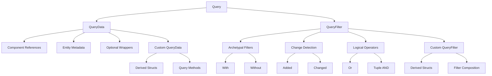

Query patterns and filters form the backbone of data retrieval in Bevy's Entity Component System, enabling precise, efficient access to entity data through a declarative API. This guide explores the architecture, patterns, and practical applications of queries for intermediate-level Bevy developers.

## Query Fundamentals

A Query is a typed view into your ECS world that iterates over entities matching specific component compositions. Queries consist of two parts: **QueryData** (what to fetch) and **QueryFilter** (which entities to include). This separation allows for fine-grained control over data access patterns.

```rust
fn simple_system(query: Query<&Transform>) {
    for transform in &query {
        // Iterate over all entities with Transform component
    }
}
```

The Query trait leverages Rust's type system to ensure compile-time safety while enabling runtime optimizations. The architecture is built around the `WorldQuery` trait, which serves as the foundation for both data fetching and filtering operations.

Sources: [mod.rs](crates/bevy_ecs/src/query/mod.rs#L6-L29), [world_query.rs](crates/bevy_ecs/src/query/world_query.rs#L44-L134)

## Component Access Patterns

### Basic References

The most common query pattern fetches components by reference. Immutable references (`&T`) provide read-only access, while mutable references (`&mut T`) allow modification:

```rust
fn movement_system(mut query: Query<(&Velocity, &mut Transform)>) {
    for (velocity, mut transform) in &mut query {
        transform.translation += velocity.0;
    }
}
```

<CgxTip>Bevy's Query system automatically handles parallelization when queries don't conflict. Mutable access to a component creates a data dependency, preventing other systems from mutably accessing that component simultaneously.</CgxTip>

### Optional Component Access

Use `Option<T>` to query entities that may or may not have a specific component:

```rust
fn scoring_system(query: Query<(&Player, Option<&Score>)>) {
    for (player, score) in &query {
        match score {
            Some(score) => println!("{}: {}", player.name, score.value),
            None => println!("{}: no score yet", player.name),
        }
    }
}
```

The `AnyOf<T>` filter provides shorthand for queries where at least one component from a set must be present:

```rust
fn render_system(query: Query<AnyOf<(&Sprite, &Mesh3D)>>) {
    for visual in &query {
        // visual is Option<&Sprite> or Option<&Mesh3D>
    }
}
```

Sources: [fetch.rs](crates/bevy_ecs/src/query/fetch.rs#L26-L57)

## Filter Types

### Archetypal Filters: With and Without

Archetypal filters operate at the archetype level, providing compile-time and structural optimizations. `With<T>` selects entities containing component T, while `Without<T>` selects entities without it:

```rust
fn targeting_system(
    targets: Query<&Target>, 
    mut projectiles: Query<&mut Projectile, With<Ready>>
) {
    // Only iterates over projectiles with Ready component
}
```

These filters are evaluated before iteration, making them the most performant filtering mechanism. The `IS_ARCHETYPAL` constant indicates whether a filter can be resolved purely by archetype matching.

Sources: [filter.rs](crates/bevy_ecs/src/query/filter.rs#L115-L217)

### Change Detection Filters: Added and Changed

Change detection filters respond to component mutations, enabling reactive system patterns:

```rust
fn health_system(
    mut query: Query<(&mut Health, &mut MaxHealth), Changed<Health>>
) {
    for (mut health, max_health) in &mut query {
        // Only entities whose Health component changed this frame
        if health.value > max_health.value {
            health.value = max_health.value;
        }
    }
}
```

The `Added<T>` filter selects entities that received the component within the current frame:

```rust
fn spawn_system(query: Query<Entity, Added<Player>>) {
    for entity in &query {
        println!("Player spawned: {:?}", entity);
    }
}
```

These filters require runtime bookkeeping but enable powerful reactive patterns without explicit events.

Sources: [change_detection.rs](examples/ecs/change_detection.rs#L71-L106)

### Logical Composition: Or and Tuples

Combine filters using tuples for AND logic, and `Or<T>` for OR logic:

```rust
fn update_system(
    query: Query<&Transform, Or<(Changed<Position>, Changed<Rotation>)>>
) {
    // Entities where either Position OR Rotation changed
}
```

Tuple composition performs AND operations:

```rust
fn enemy_system(
    query: Query<(&Health, &Enemy), (With<Player>, Without<Invincible>)>
) {
    // Entities with Health AND Enemy components,
    // that also have Player but NOT Invincible components
}
```

Sources: [filter.rs](crates/bevy_ecs/src/query/filter.rs#L320-L568)

## Advanced Query Patterns

### Change Detection Wrappers

Use `Ref<T>` and `Mut<T>` to access change detection metadata without filtering:

```rust
fn debug_system(query: Query<Ref<Transform>>) {
    for transform in &query {
        if transform.is_changed() {
            println!("Transform changed for entity");
            if let Some(location) = transform.changed_by() {
                println!("Changed at: {}", location);
            }
        }
    }
}
```

`Mut<T>` provides mutable access with change detection:

```rust
fn careful_update(mut query: Query<Mut<Health>>) {
    for mut health in &mut query {
        if health.value > 100 {
            health.set_if_neq(Health(100)); // Only changes if different
        }
    }
}
```

Sources: [fetch.rs](crates/bevy_ecs/src/query/fetch.rs#L50-L55)

### Entity Metadata Queries

Query entity metadata using `Entity`, `EntityLocation`, and `SpawnDetails`:

```rust
fn entity_tracking_system(
    query: Query<(Entity, EntityLocation, SpawnDetails)>
) {
    for (entity, location, spawn_details) in &query {
        println!("Entity {:?} at {:?}, spawned at tick {}", 
                 entity, location, spawn_details.0);
    }
}
```

### Flexible Entity Access

`EntityRef` and `EntityMut` provide dynamic component access:

```rust
fn dynamic_system(query: Query<EntityRef>) {
    for entity_ref in &query {
        if let Some(transform) = entity_ref.get::<Transform>() {
            // Access transform without requiring it in query signature
        }
        if entity_ref.contains::<Sprite>() {
            // Check for component presence
        }
    }
}
```

Sources: [fetch.rs](crates/bevy_ecs/src/query/fetch.rs#L34-L45)

## Custom Query Types

### Derived QueryData

Use the `#[derive(QueryData)]` macro to create reusable query types:

```rust
#[derive(QueryData)]
#[query_data(mutable)]
struct CharacterQuery {
    entity: Entity,
    health: &'static mut Health,
    position: &'static mut Position,
    stats: Option<&'static Stats>,
}

// Add methods to query items for reusable logic
impl<'w, 's> CharacterQueryItem<'w, 's> {
    fn take_damage(&mut self, amount: f32) {
        self.health.current -= amount;
    }
    
    fn is_alive(&self) -> bool {
        self.health.current > 0.0
    }
}

fn combat_system(mut query: Query<CharacterQuery>) {
    for mut character in &mut query {
        if character.is_alive() {
            character.take_damage(10.0);
        }
    }
}
```

### Derived QueryFilter

Create reusable filter compositions:

```rust
#[derive(QueryFilter)]
struct ActivePlayerFilter {
    with_player: With<Player>,
    without_stunned: Without<Stunned>,
    or_state: Or<(With<Attacking>, With<Defending>)>,
}

fn active_system(
    query: Query<&Transform, ActivePlayerFilter>
) {
    // Complex filter reused across systems
}
```

Sources: [filter.rs](crates/bevy_ecs/src/query/filter.rs#L59-L71), [fetch.rs](crates/bevy_ecs/src/query/fetch.rs#L60-L199)

## Query Performance Considerations

### Storage Types

Components can use either Table storage (dense, column-based) or SparseSet storage (sparse, hash-based). Table storage enables more efficient iteration but requires consistent component composition across entities:

```rust
#[derive(Component)]
#[component(storage = "SparseSet")]
struct RareComponent; // For components on few entities

#[derive(Component)]
struct CommonComponent; // Default Table storage for frequent access
```

### Dense vs Sparse Iteration

The `IS_DENSE` constant determines whether a query can use table iteration (faster) or requires archetype iteration (slower but more flexible). Dense queries iterate component arrays directly, while sparse queries traverse entity mappings.

```rust
// Dense query - all components use Table storage
fn fast_system(query: Query<(&Transform, &Velocity)>) {
    // Direct array iteration - highly cache-efficient
}

// Sparse query - at least one component uses SparseSet storage
fn flexible_system(query: Query<(&Transform, &RareComponent)>) {
    // Must use entity mapping - slightly slower
}
```

<CgxTip>Prefer Table storage for components accessed frequently together. Use SparseSet storage for components that appear on few entities or are added/removed frequently. This architectural decision significantly impacts query performance.</CgxTip>

## Query Architecture



## Filter Comparison

| Filter Type | Evaluation | Performance | Use Case |
|-------------|------------|------------|----------|
| `With<T>` | Archetypal | Fastest | Required component presence |
| `Without<T>` | Archetypal | Fastest | Excluding specific components |
| `Added<T>` | Runtime | Medium | Initialization logic |
| `Changed<T>` | Runtime | Medium | Reactive updates |
| `Or<(A, B)>` | Mixed | Variable | Alternative conditions |
| `(A, B)` | Mixed | Variable | Combined requirements |

Sources: [filter.rs](crates/bevy_ecs/src/query/filter.rs#L15-L113)

## Practical Examples

### Entity Selection System

```rust
fn selection_system(
    mouse: Res<Input<MouseButton>>,
    cameras: Query<(&Camera, &GlobalTransform)>,
    mut cursor: EventReader<CursorMoved>,
    windows: Query<&Window>,
    selected_query: Query<(
        Entity, 
        &Transform, 
        &SelectionBox
    ), With<Selectable>>,
) {
    // Complex multi-query system combining filters
}
```

### State Machine Pattern

```rust
#[derive(Component)]
enum AIState {
    Idle,
    Patrol,
    Chase,
}

fn ai_system(
    mut query: Query<(&mut AIState, &Transform, &Velocity)>,
    player_query: Query<&Transform, With<Player>>,
    target_query: Query<&Transform, With<Target>>,
) {
    // State machine using query filters for state transitions
}
```

Sources: [ecs_guide.rs](examples/ecs/ecs_guide.rs#L108-L159)

## Next Steps

Query patterns and filters provide the foundation for efficient ECS data access. For deeper understanding:

- Explore [Commands and Entity Spawning](26-commands-and-entity-spawning) for creating entities to query
- Learn about [Change Detection System](12-change-detection-system) for advanced reactive patterns
- Review [Component Hooks and Lifecycle](28-component-hooks-and-lifecycle) for component event handling
- Study [System Scheduling and Execution](11-system-scheduling-and-execution) for query parallelization
- Examine [Observers and Events](27-observers-and-events) for alternative event-driven patterns

The Query API serves as the primary interface between systems and the ECS world, making mastery of these patterns essential for building efficient, maintainable Bevy applications.
