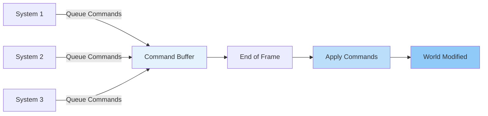
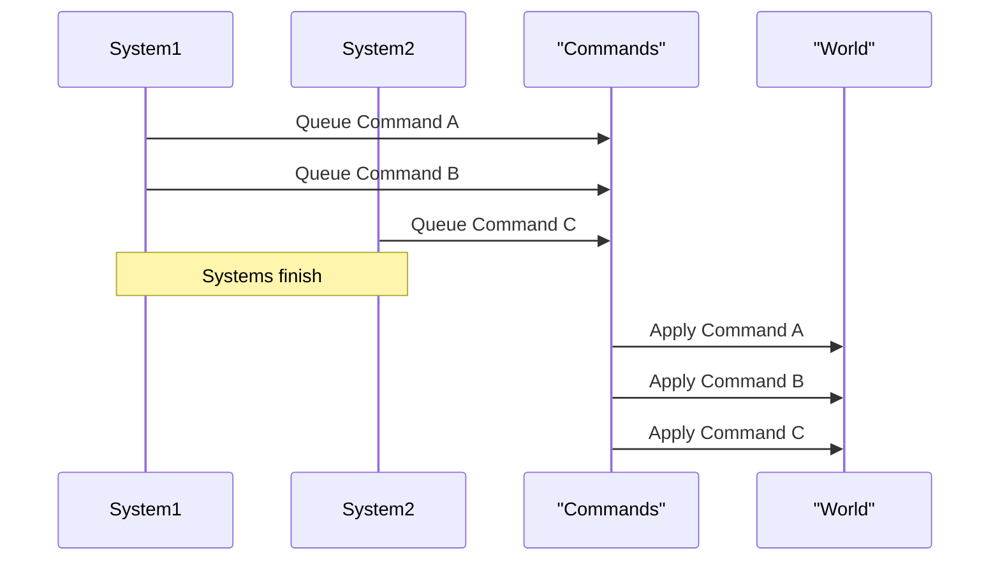
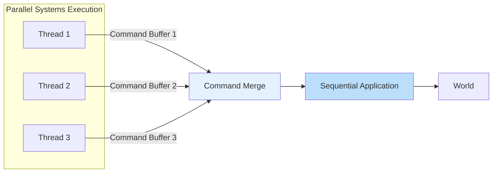

Commands are the primary mechanism in Bevy for modifying world state in a safe and efficient manner. They provide a deferred execution model that enables parallel system execution while maintaining data integrity. Understanding commands is essential for spawning entities, modifying components, and managing the lifecycle of entities in your Bevy applications.

## Understanding Commands

Commands in Bevy represent operations that modify the world state. Rather than directly modifying the world during system execution, commands queue operations that are applied later. This deferred execution is fundamental to Bevy's parallel scheduling system.

The command system works by collecting commands from all systems during a frame, then applying them at the end of the frame. This approach prevents data races and allows systems to run in parallel without conflicts. Commands are stored in a command buffer that gets flushed at the appropriate time.



### Command Types

Bevy provides several command types for different operations. The `Commands` system parameter is the primary interface for queuing commands. It offers methods for spawning entities, inserting components, despawning entities, and more.

The most common command types include:

- **Entity spawning**: Creating new entities with optional components
- **Component insertion**: Adding components to existing entities
- **Component removal**: Removing components from entities
- **Entity despawning**: Removing entire entities
- **Resource manipulation**: Adding and removing resources

Sources: [system.rs](https://github.com/bevyengine/bevy/blob/HEAD/crates/bevy_ecs/src/system/system_param.rs), [world.rs](https://github.com/bevyengine/bevy/blob/HEAD/crates/bevy_ecs/src/world/mod.rs)

## Spawning Entities

Spawning entities is one of the most common operations in Bevy. The `Commands` parameter provides multiple methods for entity creation, each suited for different scenarios.

### Basic Entity Spawning

The simplest way to spawn an entity is using the `spawn_empty` method, which creates an entity without any components:

```rust
fn spawn_empty_entity(mut commands: Commands) {
    commands.spawn_empty();
}
```

However, entities typically need components to be useful. You can spawn entities with components using the `spawn` method:

```rust
#[derive(Component)]
struct Position { x: f32, y: f32 }

#[derive(Component)]
struct Velocity { x: f32, y: f32 }

fn spawn_entity(mut commands: Commands) {
    commands.spawn((
        Position { x: 0.0, y: 0.0 },
        Velocity { x: 1.0, y: 1.0 },
    ));
}
```

The `spawn` method accepts a tuple of components, making it easy to create entities with multiple components in a single call.

Sources: [spawn.rs](https://github.com/bevyengine/bevy/blob/HEAD/crates/bevy_ecs/src/spawn.rs)

### Bundles and Component Groups

When spawning entities with many components or when you need to spawn multiple entities with the same set of components, bundles are useful. A bundle is a collection of components that can be spawned together:

```rust
#[derive(Bundle)]
struct PlayerBundle {
    position: Position,
    velocity: Velocity,
    #[bundle()]
    sprite: SpriteBundle,
}

fn spawn_player(mut commands: Commands) {
    commands.spawn(PlayerBundle {
        position: Position { x: 100.0, y: 100.0 },
        velocity: Velocity { x: 0.0, y: 0.0 },
        sprite: SpriteBundle {
            sprite: Sprite {
                custom_size: Some(Vec2::new(32.0, 32.0)),
                ..default()
            },
            ..default()
        },
    });
}
```

Bundles make your code more readable and maintainable by grouping related components together.

Sources: [bundle.rs](https://github.com/bevyengine/bevy/blob/HEAD/crates/bevy_ecs/src/bundle/mod.rs)

### Batch Spawning

When spawning many entities at once, batch spawning is more efficient than spawning individually. The `spawn_batch` method accepts an iterator of component tuples:

```rust
fn spawn_batch(mut commands: Commands) {
    let positions = (0..100).map(|i| (
        Position { x: i as f32 * 10.0, y: 0.0 },
        Velocity { x: 0.0, y: 1.0 },
    ));
    
    commands.spawn_batch(positions);
}
```

This approach is significantly faster for large numbers of entities because it reduces the overhead of individual spawn operations.

Sources: [spawn_batch.rs](https://github.com/bevyengine/bevy/blob/HEAD/crates/bevy_ecs/src/world/spawn_batch.rs)

<cgx_tips>
Batch spawning is optimized for performance and should be preferred when spawning multiple entities with identical component structures. It reduces memory allocations and improves cache efficiency.</cgx_tips>

## Entity Commands and Fluent API

The `Commands` API provides a fluent interface that allows chaining operations. When you call `spawn()`, it returns an `EntityCommands` object that can be used to perform further operations on that specific entity:

```rust
fn spawn_with_commands(mut commands: Commands) {
    commands.spawn((
        Position { x: 0.0, y: 0.0 },
    ))
    .insert(Velocity { x: 1.0, y: 1.0 })
    .insert(Name::new("Player"));
}
```

This fluent API makes code more readable and allows for complex entity setup in a single expression. You can also use `id()` to get the `Entity` identifier:

```rust
fn spawn_and_track(mut commands: Commands) {
    let entity = commands.spawn((
        Position { x: 0.0, y: 0.0 },
    )).id();
    
    // Store entity for later reference
}
```

Sources: [entity_commands.rs](https://github.com/bevyengine/bevy/blob/HEAD/crates/bevy_ecs/src/system/entity_commands.rs)

### Working with Existing Entities

Commands can also operate on existing entities. You can modify existing entities by using the `entity()` method with an `Entity` identifier:

```rust
fn modify_entity(mut commands: Commands, query: Query<Entity, With<Position>>) {
    for entity in query.iter() {
        commands.entity(entity)
            .insert(Velocity { x: 0.0, y: 1.0 })
            .remove::<Position>();
    }
}
```

This pattern is useful for dynamically adding or removing components based on game logic.

Sources: [system.rs](https://github.com/bevyengine/bevy/blob/HEAD/crates/bevy_ecs/src/system/system_param.rs)

## Command Ordering and Execution

Understanding when commands are executed is crucial for correct behavior. Commands are executed at the end of each frame, after all systems have run. This means that changes made by commands are not visible to systems in the same frame.

### Command Execution Order

Commands are applied in the order they were queued within each system, but the order of system execution determines the overall order of command application. This is generally not an issue for independent entities, but can matter when operations depend on each other:



For cases where immediate execution is necessary, you can use `apply_deferred` within a system, though this is generally discouraged unless absolutely required.

Sources: [scheduler.rs](https://github.com/bevyengine/bevy/blob/HEAD/crates/bevy_ecs/src/schedule/schedule.rs)

### Apply Deferred Commands

Sometimes you need to apply commands immediately within a system. The `apply_deferred` system parameter allows you to flush the command buffer early:

```rust
use bevy::ecs::schedule::common_conditions::resource_exists;

fn spawn_and_use(mut commands: Commands) {
    let entity = commands.spawn_empty().id();
    commands.apply_deferred();
    
    // Now the entity exists and can be queried
    let mut query = Query<&mut Position>;
    // ... use entity
}
```

This operation should be used sparingly as it can impact performance by breaking parallel execution opportunities.

Sources: [apply_deferred.rs](https://github.com/bevyengine/bevy/blob/HEAD/crates/bevy_ecs/src/schedule/auto_insert_apply_deferred.rs)

## Advanced Command Patterns

### Entity Relationships

Commands can establish relationships between entities, which is useful for parent-child hierarchies and other entity relationships:

```rust
fn spawn_hierarchy(mut commands: Commands) {
    let parent = commands.spawn((
        Name::new("Parent"),
        Position { x: 0.0, y: 0.0 },
    )).id();
    
    let child = commands.spawn((
        Name::new("Child"),
        Position { x: 10.0, y: 10.0 },
    )).id();
    
    commands.entity(parent).add_child(child);
}
```

Parent-child relationships are important for transform hierarchies and scene graphs. The `add_child` method automatically sets up the relationship.

Sources: [hierarchy.rs](https://github.com/bevyengine/bevy/blob/HEAD/crates/bevy_ecs/src/hierarchy.rs)

### Despawning Entities

Removing entities is also done through commands. The `despawn` method removes an entity entirely:

```rust
fn despawn_entities(mut commands: Commands, query: Query<Entity, With<DespawnMarker>>) {
    for entity in query.iter() {
        commands.entity(entity).despawn();
    }
}
```

You can also despawn recursively, which removes an entity and all its descendants:

```rust
fn despawn_recursive(mut commands: Commands, query: Query<Entity, With<DespawnMarker>>) {
    for entity in query.iter() {
        commands.entity(entity).despawn_recursive();
    }
}
```

Sources: [spawn.rs](https://github.com/bevyengine/bevy/blob/HEAD/crates/bevy_ecs/src/spawn.rs)

## Performance Considerations

### Command Buffer Efficiency

Command operations are generally efficient, but there are best practices to consider:

- **Batch operations**: Use `spawn_batch` for multiple entities with the same components
- **Minimize command count**: Combine operations when possible using the fluent API
- **Avoid unnecessary applies**: Don't use `apply_deferred` unless necessary
- **System ordering**: Consider system order when operations have dependencies

<cgx_tips>
The command system is optimized for throughput. Thousands of entities can be spawned efficiently using batch operations, while individual spawns have some overhead. Profile your application if spawn operations become a bottleneck.</cgx_tips>

### Thread Safety

Commands are designed for thread-safe parallel execution. Each system has its own command buffer, which are then merged and applied sequentially. This design enables Bevy to run systems in parallel without data races.



This architecture maximizes parallelism while ensuring correct final state.

Sources: [command_queue.rs](https://github.com/bevyengine/bevy/blob/HEAD/crates/bevy_ecs/src/world/command_queue.rs)

## Common Patterns and Examples

### Spawning with Initialization

A common pattern is spawning entities and then performing additional setup:

```rust
#[derive(Component)]
struct Health { current: u32, max: u32 }

fn spawn_player(mut commands: Commands) {
    commands.spawn((
        Name::new("Player"),
        PlayerMarker,
    ))
    .insert(Position { x: 0.0, y: 0.0 })
    .insert(Velocity { x: 0.0, y: 0.0 })
    .insert(Health { current: 100, max: 100 });
}
```

### Dynamic Component Addition

Commands excel at dynamic component addition based on runtime conditions:

```rust
fn add_component_if_needed(mut commands: Commands, query: Query<(Entity, &Position)>) {
    for (entity, position) in query.iter() {
        if position.x > 100.0 {
            commands.entity(entity).insert(Highlight);
        }
    }
}
```

### Entity Removal Patterns

Conditional entity removal is straightforward with commands:

```rust
fn cleanup_entities(mut commands: Commands, query: Query<(Entity, &Health)>) {
    for (entity, health) in query.iter() {
        if health.current <= 0 {
            commands.entity(entity).despawn();
        }
    }
}
```

Sources: [examples](https://github.com/bevyengine/bevy/tree/HEAD/examples)

## Integration with Other Systems

Commands integrate seamlessly with other Bevy systems and patterns. They work with all system parameter types and can be used in any system.

### Combining with Queries

Commands and queries work together effectively. You can query for entities and modify them with commands:

```rust
fn modify_with_query(mut commands: Commands, query: Query<(Entity, &Position)>) {
    for (entity, position) in query.iter() {
        if position.x > 50.0 {
            commands.entity(entity).insert(Velocity { x: -1.0, y: 0.0 });
        }
    }
}
```

This pattern is common in game logic where entities need to be modified based on their state.

Sources: [system_param.rs](https://github.com/bevyengine/bevy/blob/HEAD/crates/bevy_ecs/src/system/system_param.rs)

### Resource Management

Commands can also manage resources, though this is less common than entity operations:

```rust
fn add_resource(mut commands: Commands) {
    commands.insert_resource(GameConfig { difficulty: 5 });
}
```

Resources are generally managed through other mechanisms, but commands provide this capability when needed.

## Troubleshooting Common Issues

### Entities Not Visible in Same Frame

A common issue is querying for entities spawned in the same frame:

```rust
// This won't work as expected
fn spawn_and_query(mut commands: Commands, query: Query<&Position>) {
    commands.spawn(Position { x: 0.0, y: 0.0 });
    // Query won't include the spawned entity yet
}
```

Solution: Use `apply_deferred` if immediate access is needed, or defer operations to the next frame.

Sources: [scheduler.rs](https://github.com/bevyengine/bevy/blob/HEAD/crates/bevy_ecs/src/schedule/schedule.rs)

### Performance with Many Commands

When spawning thousands of entities, individual spawns can be slow:

```rust
// Inefficient
for i in 0..1000 {
    commands.spawn((Position { x: i as f32, y: 0.0 }, Velocity::default()));
}
```

Solution: Use batch spawning for better performance.

## Best Practices

### Prefer Batches for Bulk Operations

When spawning many entities with the same component types, use `spawn_batch`:

```rust
// Efficient
commands.spawn_batch(
    (0..1000).map(|i| (
        Position { x: i as f32, y: 0.0 },
        Velocity::default(),
    ))
);
```

### Use Bundles for Complex Entities

Group related components into bundles for better code organization:

```rust
#[derive(Bundle)]
struct EnemyBundle {
    sprite: SpriteBundle,
    health: Health,
    enemy: EnemyMarker,
}
```

### Leverage the Fluent API

Chain operations for cleaner code:

```rust
commands.spawn((
    Position::default(),
    Name::new("Entity"),
))
.insert(Velocity::default())
.insert(Health::default());
```

Sources: [best_practices.rs](https://github.com/bevyengine/bevy/tree/HEAD/examples)

## Next Steps

Mastering commands is fundamental to working with Bevy's ECS system. To deepen your understanding:

- Explore [Query Patterns and Filters](https://github.com/bevyengine/bevy/blob/HEAD/docs/guide_to_ecs_systems.md#query-patterns) for advanced querying techniques
- Learn about [Observers and Events](https://github.com/bevyengine/bevy/blob/HEAD/docs/guide_to_ecs_systems.md#observers-and-events) for event-driven architecture
- Study [Component Hooks and Lifecycle](https://github.com/bevyengine/bevy/blob/HEAD/docs/guide_to_ecs_systems.md#component-hooks-and-lifecycle) for understanding component behavior

Commands provide the foundation for entity management in Bevy. Understanding their deferred execution model and performance characteristics will help you build efficient and correct game logic.
