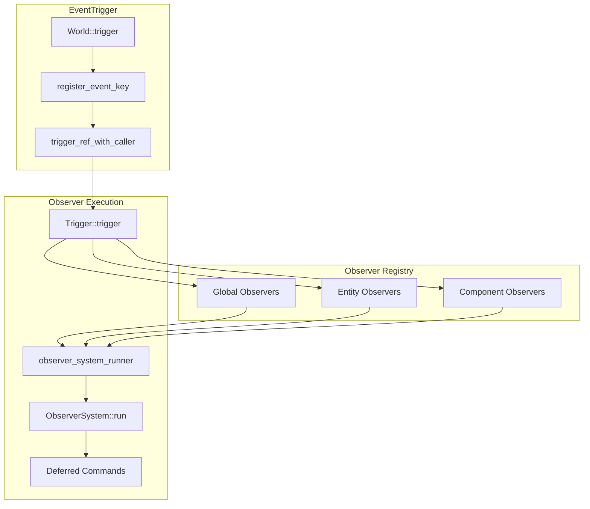
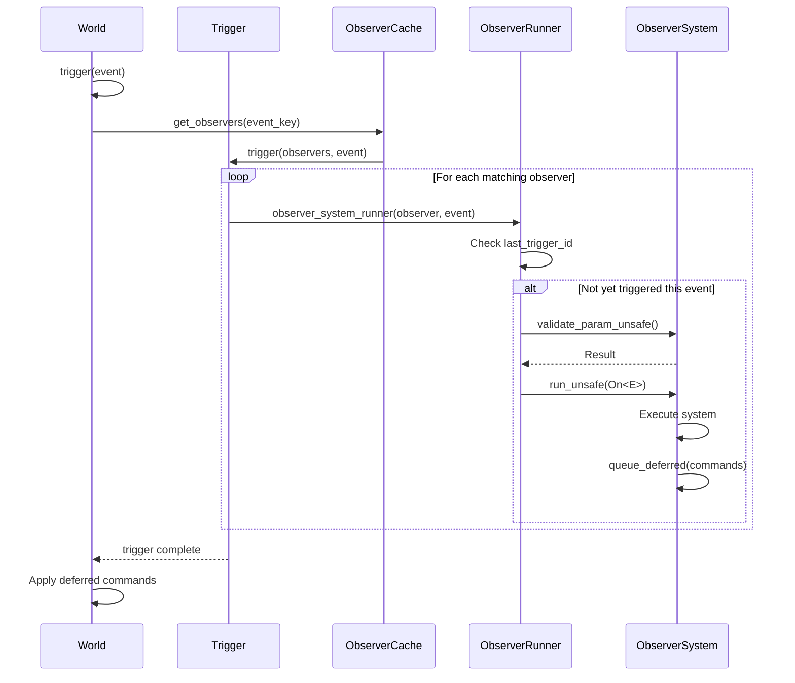

Bevy's observer system provides a **push-based architecture** for responding to events within the ECS, offering immediate, synchronous execution when events occur. Unlike traditional pull-based event systems that require explicit polling, observers execute immediately as part of the trigger call, enabling reactive patterns without the complexity of schedule coordination. The system unifies global events, entity-scoped events, and component lifecycle events under a consistent API, making it ideal for scenarios requiring immediate responses to state changes.

Sources: [crates/bevy_ecs/src/observer/mod.rs](crates/bevy_ecs/src/observer/mod.rs#L1-L4), [crates/bevy_ecs/src/event/mod.rs](crates/bevy_ecs/src/event/mod.rs#L14-L19)

## Core Architecture

The observer system operates through a sophisticated routing mechanism that maps events to observer systems. Observers are entities themselves, holding a `System` that runs whenever a matching `Event` is triggered. The architecture maintains three primary storage strategies: global observers (watch all events), entity observers (watch specific entities), and component observers (watch components on specific or all entities).



The routing mechanism distinguishes between three observer types based on their descriptor configuration. Global observers match any event of their registered type, entity observers require the event to target specific entities, and component observers match events that target specific components either globally or on specific entities.

Sources: [crates/bevy_ecs/src/observer/mod.rs](crates/bevy_ecs/src/observer/mod.rs#L117-L175), [crates/bevy_ecs/src/event/trigger.rs](crates/bevy_ecs/src/event/trigger.rs#L37-L55)

## Event Types and Triggers

Events define what "happens" in your system, while Triggers determine how those events are routed to observers. Bevy provides several built-in trigger patterns, each serving different architectural needs.

| Trigger Type | Purpose | Default For | Routing Behavior |
|-------------|---------|--------------|------------------|
| `GlobalTrigger` | Simple broadcast events | `#[derive(Event)]` | Runs all global observers matching the event type |
| `EntityTrigger` | Entity-targeted events | `#[derive(EntityEvent)]` | Runs global observers + entity-specific observers for `event_target()` |
| `PropagateEntityTrigger` | Hierarchical events | `#[derive(EntityEvent)]` with `propagate` | EntityTrigger + propagates through hierarchy relationships |
| `EntityComponentsTrigger` | Component lifecycle | Built-in lifecycle events | Runs observers for specific component changes |

The `Event` trait requires an associated `Trigger` type that defines routing semantics:

```rust
pub trait Event: Send + Sync + Sized + 'static {
    /// Defines which observers will run, what data will be passed, and execution order
    type Trigger<'a>: Trigger<Self>;
}
```

This design allows custom trigger implementations for specialized routing needs, though the built-in triggers cover most use cases. The trigger system ensures type safety while providing flexibility in event propagation patterns.

Sources: [crates/bevy_ecs/src/event/mod.rs](crates/bevy_ecs/src/event/mod.rs#L88-L91), [crates/bevy_ecs/src/event/trigger.rs](crates/bevy_ecs/src/event/trigger.rs#L13-L25)

## Global Events

Global events provide a simple broadcast mechanism where any observer registered for that event type receives notification. This pattern is ideal for system-wide notifications, configuration changes, or application-level events.

```rust
#[derive(Event)]
struct Speak {
    message: String,
}

// Register a global observer
world.add_observer(|speak: On<Speak>| {
    println!("{}", speak.message);
});

// Trigger the event - all observers run immediately
world.trigger(Speak {
    message: "Hello, World!".to_string(),
});
```

The observer system uses `ComponentId` as unique identifiers for event types through an internal `EventWrapperComponent<E>`. This design enables dynamic event type registration without requiring events to implement `Component` directly, while providing fast lookup and compatibility with dynamically-typed observer APIs.

Sources: [crates/bevy_ecs/src/event/mod.rs](crates/bevy_ecs/src/event/mod.rs#L20-L69), [crates/bevy_ecs/src/event/mod.rs](crates/bevy_ecs/src/event/mod.rs#L354-L376)

## Entity-Scoped Events

`EntityEvent` extends the basic event system to target specific entities, enabling entity-specific logic while maintaining global observer capabilities. Events derive this trait automatically, with the target entity identified through field name conventions or explicit attributes.

```rust
#[derive(EntityEvent)]
struct Explode {
    entity: Entity,  // Target entity
}

world.entity_mut(target_entity).observe(|event: On<Explode>, mut commands: Commands| {
    println!("Entity {} goes BOOM!", event.entity);
    commands.entity(event.entity).despawn();
});

world.trigger(Explode { entity: target_entity });
```

Entity events automatically support both global observers (via `World::add_observer`) and entity-specific observers (via `EntityWorldMut::observe`). The routing system ensures entity-specific observers only receive events targeting their watched entity, while global observers receive all entity events.

The target entity can be specified through multiple conventions:

```rust
// Named field with "entity" name
#[derive(EntityEvent)]
struct Explode { entity: Entity }

// Tuple struct with single Entity
#[derive(EntityEvent)]
struct Explode(Entity);

// Custom field name with attribute
#[derive(EntityEvent)]
struct Explode {
    #[event_target]
    exploded_entity: Entity,
}

// Custom wrapper type implementing ContainsEntity
#[derive(EntityEvent)]
struct Explode(Bomb);

struct Bomb(Entity);
impl ContainsEntity for Bomb {
    fn entity(&self) -> Entity { self.0 }
}
```

Sources: [crates/bevy_ecs/src/event/mod.rs](crates/bevy_ecs/src/event/mod.rs#L93-L313), [crates/bevy_ecs/src/event/trigger.rs](crates/bevy_ecs/src/event/trigger.rs#L123-L162)

## Event Propagation

Entity events support propagation through entity hierarchies, enabling bubbling patterns common in UI and scene graph architectures. Propagation follows `Traversal` relationships, defaulting to `ChildOf` but supporting custom relationship components.

```rust
#[derive(EntityEvent)]
#[entity_event(propagate)]
struct Click {
    entity: Entity,
}

// Observer can control propagation
world.add_observer(|mut click: On<Click>| {
    // Stop propagation after handling
    if should_stop_propagation() {
        click.propagate(false);
    }
});
```

For automatic propagation without manual control, use the `auto_propagate` attribute:

```rust
#[derive(EntityEvent)]
#[entity_event(propagate, auto_propagate)]
struct Click {
    entity: Entity,
}
```

Custom traversal relationships enable flexible propagation patterns beyond simple parent-child hierarchies:

```rust
#[derive(Component)]
#[relationship(relationship_target = ClickableBy)]
struct Clickable(Entity);

#[derive(Component)]
#[relationship_target(relationship = Clickable)]
struct ClickableBy(Vec<Entity>);

#[derive(EntityEvent)]
#[entity_event(propagate = &'static Clickable)]
struct Click { entity: Entity }
```

Propagation follows relationships toward their root, though cycles are not detected for performance reasons. Each observer in the propagation chain receives the event with the updated target entity, allowing contextual handling at each level.

Sources: [crates/bevy_ecs/src/event/mod.rs](crates/bevy_ecs/src/event/mod.rs#L193-L309)

## Component Lifecycle Events

Bevy provides built-in lifecycle events that fire when components change: `Add`, `Insert`, `Replace`, and `Remove`. These events follow a strict order: when spawning, `Add` fires first, then `Insert`; when despawning, `Replace` fires, then `Remove`.

```rust
world.add_observer(|_: On<Add, Health>, mut commands: Commands| {
    // Run when component is first added to entity
    commands.spawn(Effect::new("spawn_effect"));
});

world.add_observer(|_: On<Remove, Health>| {
    // Run when component is removed
    println!("Entity lost health component");
});
```

Lifecycle events use `EntityComponentsTrigger`, which enables filtering by component type tuples:

```rust
// Observe when both A and B are added
world.add_observer(|_: On<Add, (A, B)>, mut res: ResMut<Order>| {
    res.observed("both_added");
});
```

<CgxTip>Lifecycle events fire in a deterministic order during entity operations. During `spawn()`, the sequence is `Add` → `Insert`. During `remove()`, it's `Replace` → `Remove`. This order is guaranteed even across sparse set storage components.</CgxTip>

When inserting an already-present component, only `Insert` fires (not `Add`). Observers can detect this distinction by checking the `Replace` event context.

Sources: [crates/bevy_ecs/src/observer/mod.rs](crates/bevy_ecs/src/observer/mod.rs#L300-L418)

## Observer Registration Patterns

Observers can be registered at different scopes with varying routing behaviors. The registration method determines which events trigger the observer.

| Registration Method | Scope | Example |
|-------------------|-------|---------|
| `World::add_observer()` | Global, watches all events of type | `world.add_observer(\|_: On<MyEvent\> ...)` |
| `EntityWorldMut::observe()` | Entity-specific, watches events targeting that entity | `entity.observe(\|_: On<MyEvent\> ...)` |
| `Observer::watch_entity()` + `spawn()` | Manual entity targeting | `observer.watch_entity(e); world.spawn(observer)` |
| `Observer::watch_entities()` + `spawn()` | Multiple entity targeting | `observer.watch_entities([e1, e2, e3]);` |

Component-aware observers filter events by component type:

```rust
// Watch Add events for component A on any entity
world.add_observer(|_: On<Add, A>| { /* ... */ });

// Watch Add events for component A on specific entity
let entity = world.spawn_empty().id();
let mut observer = Observer::new(|_: On<Add, A>| { /* ... */ });
observer.watch_entity(entity);
world.spawn(observer);

// Watch multiple component types
world.add_observer(|_: On<Add, (A, B)>| { /* ... */ });
```

The observer cache optimizes routing by storing observers in specialized maps keyed by component IDs and entity IDs. Global observers are stored separately for O(1) lookup, while entity and component observers use hash maps for efficient filtering.

Sources: [crates/bevy_ecs/src/observer/mod.rs](crates/bevy_ecs/src/observer/mod.rs#L25-L60), [crates/bevy_ecs/src/observer/mod.rs](crates/bevy_ecs/src/observer/mod.rs#L116-L243)

## Trigger Execution Flow

When an event is triggered, the system executes a precise flow that ensures immediate observer execution while maintaining type safety and preventing duplicate triggers within the same event propagation.



The `last_trigger_id` mechanism prevents duplicate observer execution when multiple trigger conditions match the same observer. Each event trigger increments a global trigger ID, and observers track the last trigger ID they responded to, ensuring idempotent behavior within a single trigger operation.

Sources: [crates/bevy_ecs/src/observer/runner.rs](crates/bevy_ecs/src/observer/runner.rs#L35-L118), [crates/bevy_ecs/src/event/trigger.rs](crates/bevy_ecs/src/event/trigger.rs#L174-L200)

## Event Mutation and Trigger Ref

Events can be modified by observers, and these modifications are visible to subsequent observers in the trigger sequence. This enables cooperative event handling patterns where multiple observers contribute to event processing.

```rust
#[derive(Event)]
struct ProcessEvent {
    data: Vec<i32>,
}

world.add_observer(|mut event: On<ProcessEvent>| {
    event.data.push(1);
});

world.add_observer(|mut event: On<ProcessEvent>| {
    event.data.push(2);
});

world.add_observer(|mut event: On<ProcessEvent>| {
    event.data.push(3);
});

let mut event = ProcessEvent { data: vec![] };
world.trigger_ref(&mut event);
// event.data is now [1, 2, 3]
```

The `trigger_ref` variants allow borrowing the event instead of consuming it, enabling inspection or further processing after all observers have run:

```rust
let mut event = MyEvent::default();
world.trigger_ref(&mut event);

// Event may have been modified by observers
if event.needs_retry {
    world.trigger_ref(&mut event);
}
```

Observer execution order follows registration order in reverse (LIFO), meaning the most recently registered observer runs first. This allows "later" observers to potentially modify the event before "earlier" observers see it, though this pattern should be used deliberately to avoid confusion.

Sources: [crates/bevy_ecs/src/observer/mod.rs](crates/bevy_ecs/src/observer/mod.rs#L81-L114), [crates/bevy_ecs/src/observer/mod.rs](crates/bevy_ecs/src/observer/mod.rs#L420-L431)

## Error Handling in Observers

Observers support fallible operations through the `Result` return type, enabling graceful error handling within event-driven systems. By default, observer errors cause panics, but custom error handlers can be configured for alternative behaviors.

```rust
#[derive(Event)]
struct FallibleEvent;

fn fallible_observer(_: On<FallibleEvent>) -> Result {
    Err("Operation failed".into())
}

// Configure error handling
world.add_observer(fallible_observer);
```

Custom error handlers intercept errors before they reach panic logic:

```rust
fn custom_error_handler(err: Error, context: ErrorContext) {
    log::error!("Observer {:?} failed: {}", context, err);
}

// Register handler globally
world.spawn((Observer::new(fallible_observer), custom_error_handler));
```

The error context includes the observer's name, last run timestamp, and the specific error that occurred, enabling sophisticated error tracking and recovery strategies in production systems.

Sources: [crates/bevy_ecs/src/observer/runner.rs](crates/bevy_ecs/src/observer/runner.rs#L100-L117)

## Advanced Observer Patterns

Multiple events can share a single observer using the event key system, enabling cross-cutting concerns that respond to several event types:

```rust
let on_remove = world.register_event_key::<Remove>();

world.spawn(unsafe {
    Observer::new(|_: On<Add, A>| {
        // Handle both Add and Remove
    })
    .with_event_key(on_remove)
});
```

<CgxTip>When using `with_event_key`, ensure the observer's system is compatible with all event types registered to it. The system's parameter types must work with all registered events, or you risk runtime type mismatches.</CgxTip>

Observers can target multiple entities, enabling efficient resource sharing:

```rust
let mut observer = Observer::new(|event: On<Explode>| {
    println!("Watched entity exploded: {:?}", event.entity);
});

observer.watch_entities([entity1, entity2, entity3]);
world.spawn(observer);
```

This pattern is more efficient than spawning separate observer entities for each watched entity, as the routing cache stores a single observer that runs multiple times, once per targeted entity.

Sources: [crates/bevy_ecs/src/observer/mod.rs](crates/bevy_ecs/src/observer/mod.rs#L448-L469)

## Archetype Caching and Performance

The observer system employs archetype flag caching to optimize component-based observer routing. When observers watch specific components, the system sets flags on archetypes containing those components, enabling O(1) determination of whether an archetype has any matching observers.

```rust
// Flags are set on archetypes containing component A
world.add_observer(|_: On<Add, A>| { /* ... */ });

// Later, when despawning the observer, flags are cleared automatically
```

This optimization avoids unnecessary archetype iteration during entity operations. The flag management is automatic—observers register their interests on creation, and the system clears flags when all observers for a component are removed.

Sparse set storage components are handled identically to table storage components, ensuring consistent behavior across all storage types. The lifecycle order tests confirm this consistency across storage strategies.

Sources: [crates/bevy_ecs/src/observer/mod.rs](crates/bevy_ecs/src/observer/mod.rs#L342-L361), [crates/bevy_ecs/src/observer/mod.rs](crates/bevy_ecs/src/observer/mod.rs#L218-L238)

## Integration with Commands

Observers can issue commands during execution, which are deferred and applied after all observers complete. This enables entity creation, deletion, and modification as immediate responses to events.

```rust
world.add_observer(|event: On<Explode>, mut commands: Commands| {
    commands.spawn(ParticleEffect {
        position: get_position(event.entity),
    });
    commands.entity(event.entity).despawn_recursive();
});
```

Commands are queued via `DeferredWorld` and applied after the trigger operation completes, ensuring all observers see a consistent world state during their execution. The system maintains command order through the standard deferred command queue.

Sources: [crates/bevy_ecs/src/observer/runner.rs](crates/bevy_ecs/src/observer/runner.rs#L116), [crates/bevy_ecs/src/world/deferred_world.rs](crates/bevy_ecs/src/world/deferred_world.rs)

## Next Steps

The observer system integrates deeply with Bevy's ECS architecture. For comprehensive event-driven design patterns, explore these related concepts:

- **[Entity Component System (ECS)](9-entity-component-system-ecs)** - Foundation for observer entity management and component storage
- **[Commands and Entity Spawning](26-commands-and-entity-spawning)** - Deferral mechanisms used by observer commands
- **[Component Hooks and Lifecycle](28-component-hooks-and-lifecycle)** - Alternative lifecycle event mechanisms
- **[Relationships and Hierarchy](29-relationships-and-hierarchy)** - Entity relationship patterns enabling event propagation
- **[System Scheduling and Execution](11-system-scheduling-and-execution)** - How observer systems fit into Bevy's schedule
