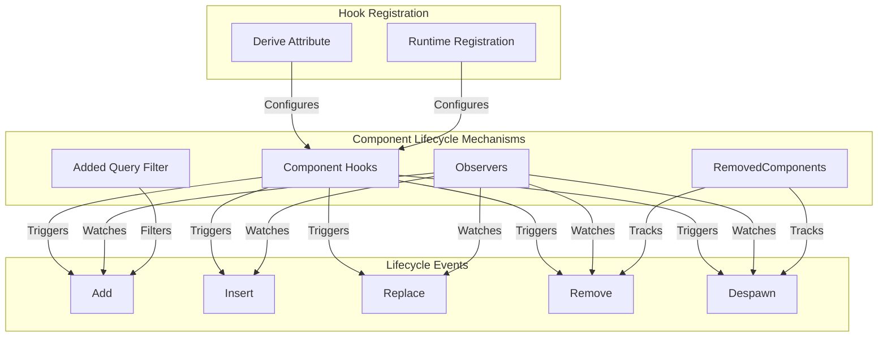
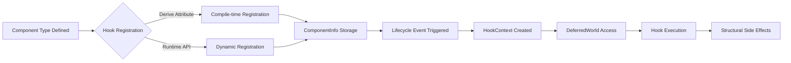
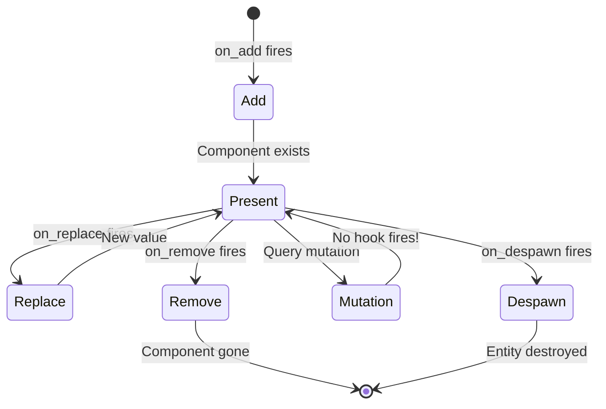

Component hooks and lifecycle events provide the foundation for reacting to component state changes in Bevy's Entity Component System. These mechanisms enable structural side effects, cache synchronization, and hierarchical data management when components are added, removed, or replaced. Understanding these patterns is essential for building complex, maintainable ECS architectures that maintain data consistency across entity relationships and external resources.

## Architecture Overview

The component lifecycle system in Bevy operates through a multi-layered approach that provides flexibility across different use cases. At its core, component hooks are inherent functions that execute as constructors and destructors for specific component types. These hooks integrate with a broader event system that includes observers, removal trackers, and query filters, creating a comprehensive toolkit for lifecycle management.



Sources: [lifecycle.rs](crates/bevy_ecs/src/lifecycle.rs#L1-L50), [component/mod.rs](crates/bevy_ecs/src/component/mod.rs#L338-L385)

## Lifecycle Events: The Five Types

Bevy defines five distinct lifecycle events that map to specific phases of component existence. These events are categorized into addition and removal phases, each with precise semantics and execution ordering.

**Addition Events:**
- **Add**: Triggered when a component is added to an entity that did not already have it. This represents the true creation moment for component presence on an entity.
- **Insert**: Triggered when a component is added regardless of prior existence, making it applicable to both initial additions and replacements.

**Removal Events:**
- **Replace**: Triggered when a component is about to be removed and replaced, executing before the value is replaced, enabling access to the original data.
- **Remove**: Triggered when a component is removed without replacement, executing before the actual removal.
- **Despawn**: Triggered for each component on an entity when the entire entity is despawned.

The execution order follows a predictable sequence: `Add` → `Insert` → `Replace` → `Remove` → `Despawn`. This ordering enables sophisticated coordination between hooks, allowing for staged setup and teardown operations.

Sources: [lifecycle.rs](crates/bevy_ecs/src/lifecycle.rs#L52-L84), [lifecycle.rs](crates/bevy_ecs/src/lifecycle.rs#L308-L360)

### Event Key Constants

Each lifecycle event corresponds to a fixed `ComponentId` assigned during `World` initialization. These constants enable efficient lookups in hot paths without requiring `TypeId` resolution:

```rust
pub const ADD: EventKey = EventKey(ComponentId::new(0));
pub const INSERT: EventKey = EventKey(ComponentId::new(1));
pub const REPLACE: EventKey = EventKey(ComponentId::new(2));
pub const REMOVE: EventKey = EventKey(ComponentId::new(3));
pub const DESPAWN: EventKey = EventKey(ComponentId::new(4));
```

Sources: [lifecycle.rs](crates/bevy_ecs/src/lifecycle.rs#L258-L263)

## Component Hooks: Inherent Behavior

Component hooks are functions that execute automatically at specific lifecycle points for a component type. They are stored in the `ComponentInfo` of each component and serve as inherent constructors and destructors, similar to how constructors and destructors work in object-oriented programming but applied at the ECS level.



The `ComponentHooks` struct maintains optional hook functions for each lifecycle phase, providing a flexible registration system that allows for selective implementation of only the needed lifecycle handlers.

Sources: [lifecycle.rs](crates/bevy_ecs/src/lifecycle.rs#L105-L160), [lifecycle.rs](crates/bevy_ecs/src/lifecycle.rs#L165-L254)

### HookContext and DeferredWorld

Each hook receives a `HookContext` containing metadata about the triggering event and a `DeferredWorld` providing safe, deferred access to world state:

```rust
pub struct HookContext {
    pub entity: Entity,
    pub component_id: ComponentId,
    pub caller: MaybeLocation,
    pub relationship_hook_mode: RelationshipHookMode,
}
```

The `DeferredWorld` enables hooks to perform structural mutations like spawning entities, inserting components, or modifying resources while maintaining safety guarantees through deferred execution.

Sources: [lifecycle.rs](crates/bevy_ecs/src/lifecycle.rs#L90-L100), [lifecycle.rs](crates/bevy_ecs/src/lifecycle.rs#L86-L88)

<CgxTip>Hooks are designed for structural side effects—such as maintaining indexes, cleaning up resources, or synchronizing hierarchical data—not for general-purpose game logic. Use queries and systems for gameplay logic to maintain ECS architectural clarity.</CgxTip>

## Hook Registration Patterns

Bevy provides two primary approaches for registering component hooks: compile-time attribute configuration and runtime registration. Each approach serves different use cases and offers varying degrees of flexibility.

### Derive Attribute Configuration

The derive macro approach enables inline, declarative hook specification directly in component definitions:

```rust
#[derive(Component)]
#[component(on_add = my_on_add_hook)]
#[component(on_insert = my_on_insert_hook)]
#[component(on_replace = my_on_replace_hook)]
#[component(on_remove = my_on_remove_hook)]
struct MyComponent;

fn my_on_add_hook(world: DeferredWorld, context: HookContext) {
    // Hook implementation
}
```

This pattern supports function elision when hook functions follow the naming convention `Self::on_*`, and enables closure-generating functions for parameterized hooks.

Sources: [component/mod.rs](crates/bevy_ecs/src/component/mod.rs#L338-L385), [component/mod.rs](crates/bevy_ecs/src/component/mod.rs#L387-L425)

### Runtime Registration

The runtime approach provides dynamic hook configuration through the `World::register_component_hooks` API:

```rust
world.register_component_hooks::<MyComponent>()
    .on_add(|mut world, context| {
        // Add hook logic
    })
    .on_remove(|mut world, context| {
        // Remove hook logic
    });
```

Runtime registration is particularly useful for plugins that need to attach behavior to existing component types without modifying their definitions, and for conditional hook registration based on application state or configuration.

Sources: [lifecycle.rs](crates/bevy_ecs/src/lifecycle.rs#L117-L164)

### Comparison: Registration Approaches

| Aspect | Derive Attribute | Runtime Registration |
|--------|------------------|---------------------|
| **When to Use** | Component types you control | Third-party components or plugin integration |
| **Visibility** | Type definition contains all behavior | Behavior registered separately |
| **Flexibility** | Compile-time fixed | Dynamic, conditional configuration |
| **Debugging** | All hooks visible in one location | Requires tracing registration points |
| **Performance** | Zero-cost at runtime | Minimal registration overhead |

Sources: [lifecycle.rs](crates/bevy_ecs/src/lifecycle.rs#L117-L164), [component/mod.rs](crates/bevy_ecs/src/component/mod.rs#L338-L385)

## Synchronizing with Lifecycle Events

A critical consideration when working with component lifecycle events is that hooks do not fire when components are mutated through queries. This means components can be modified through direct mutable access without triggering lifecycle events, which can break assumptions about cache consistency when not properly accounted for.



For reliable synchronization of data structures with component lifecycle events, combine `Insert` and `Replace` hooks to fully capture all changes. This is particularly important when working with immutable components or when maintaining indexes that must reflect the complete component state.

Sources: [lifecycle.rs](crates/bevy_ecs/src/lifecycle.rs#L52-L84), [lifecycle.rs](crates/bevy_ecs/src/lifecycle.rs#L215-L235)

### The Immutability Pattern

Components marked as immutable through `#[component(immutable)]` cannot be mutated through queries, forcing all modifications to go through explicit insertions and removals that trigger lifecycle events. This pattern provides strong guarantees for cache synchronization:

```rust
#[derive(Component)]
#[component(immutable)]
struct CachedIndexEntry {
    // Data that must trigger updates when changed
}
```

With immutable components, `Insert` and `Replace` hooks become the only mechanism for changing component values, ensuring that cache synchronization logic runs consistently.

Sources: [component/mod.rs](crates/bevy_ecs/src/component/mod.rs#L105-L125)

## Alternative Lifecycle Mechanisms

Beyond component hooks, Bevy provides three additional mechanisms for responding to component lifecycle events. Each serves distinct use cases and offers different capabilities.

### Observers

Observers provide a user-extensible event system that can watch for component lifecycle events among many other event types. Unlike hooks, observers are not tied to specific component types and can be registered dynamically to watch for events on bundles of components:

```rust
world.observe(
    |trigger: Trigger<Add<MyComponent>>, mut commands: Commands| {
        // Observer logic
    }
);
```

Observers offer greater flexibility for cross-component event handling but do not have direct access to component data during the event phase in the same way hooks do through `DeferredWorld`.

Sources: [lifecycle.rs](crates/bevy_ecs/src/lifecycle.rs#L1-L50)

### RemovedComponents System Parameter

The `RemovedComponents` system parameter provides an event-style interface for tracking when components are removed from entities:

```rust
fn react_on_removal(mut removed: RemovedComponents<MyComponent>) {
    removed.read().for_each(|removed_entity| {
        println!("Component removed from entity: {:?}", removed_entity);
    });
}
```

This parameter acts as a message reader, providing access to removal events but not access to the removed component data itself. It's cleared automatically by `App::update` in the main Bevy app.

Sources: [lifecycle.rs](crates/bevy_ecs/src/lifecycle.rs#L435-L475), [lifecycle.rs](crates/bevy_ecs/src/lifecycle.rs#L410-L432)

### Added Query Filter

The `Added` query filter checks each component to determine if it has been added since the last system run:

```rust
fn system(query: Query<&MyComponent, Added<MyComponent>>) {
    // Process newly added components
}
```

This filter provides frame-based detection of component additions but does not trigger on replacements and requires the system to run after the addition to detect it.

Sources: [lifecycle.rs](crates/bevy_ecs/src/lifecycle.rs#L1-L50)

### Mechanism Comparison

| Mechanism | Scope | Data Access | Trigger Timing | Best For |
|-----------|-------|-------------|----------------|----------|
| **Component Hooks** | Per component type | Full world access | Exact event timing | Structural side effects, cache sync |
| **Observers** | Cross-component | Event-based | Event emission | Complex event handling, coordination |
| **RemovedComponents** | Per component type | Entity only | Deferred batch processing | Post-processing removal notifications |
| **Added Filter** | Per system run | Component access | Frame-based query | Frame-reactive systems |

Sources: [lifecycle.rs](crates/bevy_ecs/src/lifecycle.rs#L1-L50)

## Practical Patterns and Use Cases

Component hooks excel at maintaining auxiliary data structures and ensuring resource consistency. The following patterns demonstrate common use cases.

### Entity Tracking

Maintaining a global index of entities with specific components:

```rust
#[derive(Resource, Default)]
struct TrackedEntities(HashSet<Entity>);

world.register_component_hooks::<MyTrackedComponent>()
    .on_add(|mut world, context| {
        world.resource_mut::<TrackedEntities>()
            .0.insert(context.entity);
    })
    .on_remove(|mut world, context| {
        world.resource_mut::<TrackedEntities>()
            .0.remove(&context.entity);
    });
```

Sources: [lifecycle.rs](crates/bevy_ecs/src/lifecycle.rs#L117-L164)

### Resource Cleanup

Cleaning up external resources when components are removed:

```rust
world.register_component_handles::<TextureHandle>()
    .on_remove(|world, context| {
        let texture = world.get::<TextureHandle>(context.entity);
        if let Some(handle) = texture {
            world.resource_mut::<Assets<Texture>>()
                .remove(handle.id());
        }
    });
```

### Hierarchical Synchronization

Maintaining bidirectional relationships between parent and child entities:

```rust
world.register_component_hooks::<ChildOf>()
    .on_add(|mut world, context| {
        let parent = world.get::<ChildOf>(context.entity).unwrap().parent;
        world.entity_mut(parent)
            .get_mut::<Children>()
            .unwrap()
            .children
            .push(context.entity);
    });
```

<CgxTip>When working with relationships and hierarchy, use `Replace` hooks to handle re-parenting scenarios where a child is moved from one parent to another, ensuring both the old parent's child list and the new parent's child list are updated correctly.</CgxTip>

## Advanced Hook Behaviors

### Fallible Registration

The `try_on_*` methods provide fallible hook registration that returns `None` if a hook is already registered, allowing for graceful handling of conflicting registrations without panicking:

```rust
world.register_component_hooks::<MyComponent>()
    .try_on_add(my_hook)
    .expect("Hook registration failed");
```

Sources: [lifecycle.rs](crates/bevy_ecs/src/lifecycle.rs#L256-L320)

### Component Integration with Hooks

The `Component` trait provides optional methods that hooks can implement, enabling component types to define their own inherent behavior:

```rust
impl Component for MyComponent {
    fn on_add() -> Option<ComponentHook> {
        Some(my_on_add_hook)
    }
    
    fn on_remove() -> Option<ComponentHook> {
        Some(my_on_remove_hook)
    }
}
```

These methods are automatically called during component registration, integrating component-defined hooks with the registration system.

Sources: [component/mod.rs](crates/bevy_ecs/src/component/mod.rs#L487-L520), [lifecycle.rs](crates/bevy_ecs/src/lifecycle.rs#L165-L205)

## Integration with Required Components

Required components interact with component hooks in important ways. When a component with required components is inserted, the required components are inserted first, triggering their own `Add` and `Insert` hooks before the requiring component's hooks fire. This ordering enables initialization logic in required components that must complete before the depending component's logic runs.

The recursive nature of required components means that hook execution follows the dependency tree, with components deeper in the dependency hierarchy having their hooks execute first.

Sources: [component/mod.rs](crates/bevy_ecs/src/component/mod.rs#L200-L338), [component/mod.rs](crates/bevy_ecs/src/component/mod.rs#L523-L535)

## Performance Considerations

Component hooks are optimized for hot-path execution, using fixed `ComponentId` constants for event types to avoid `TypeId` lookups. However, hooks should be kept minimal and focused on structural operations rather than extensive computation.

When maintaining large indexes or caches through hooks, consider the trade-off between consistency (immediate updates via hooks) and throughput (batched updates via system iteration). For most cases, hooks provide the right balance, but extremely large-scale applications may benefit from deferred batch processing.

Sources: [lifecycle.rs](crates/bevy_ecs/src/lifecycle.rs#L86-L88), [lifecycle.rs](crates/bevy_ecs/src/lifecycle.rs#L258-L263)

## Next Steps

Understanding component hooks and lifecycle events provides the foundation for advanced ECS patterns. Continue exploring related concepts:

- **[Observers and Events](27-observers-and-events)**: For broader event handling patterns and cross-component coordination
- **[Relationships and Hierarchy](29-relationships-and-hierarchy)**: For implementing entity relationships and managing parent-child structures
- **[Query Patterns and Filters](25-query-patterns-and-filters)**: For advanced system querying strategies
- **[Change Detection System](12-change-detection-system)**: For understanding how change detection integrates with lifecycle events
