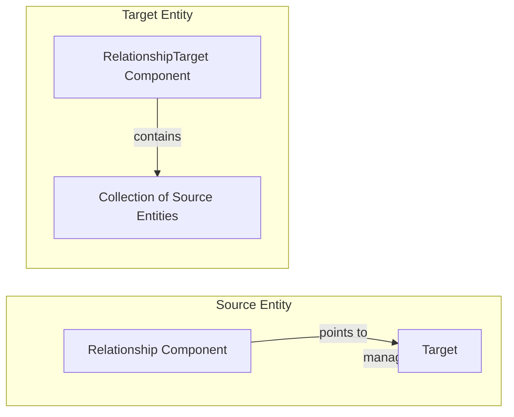
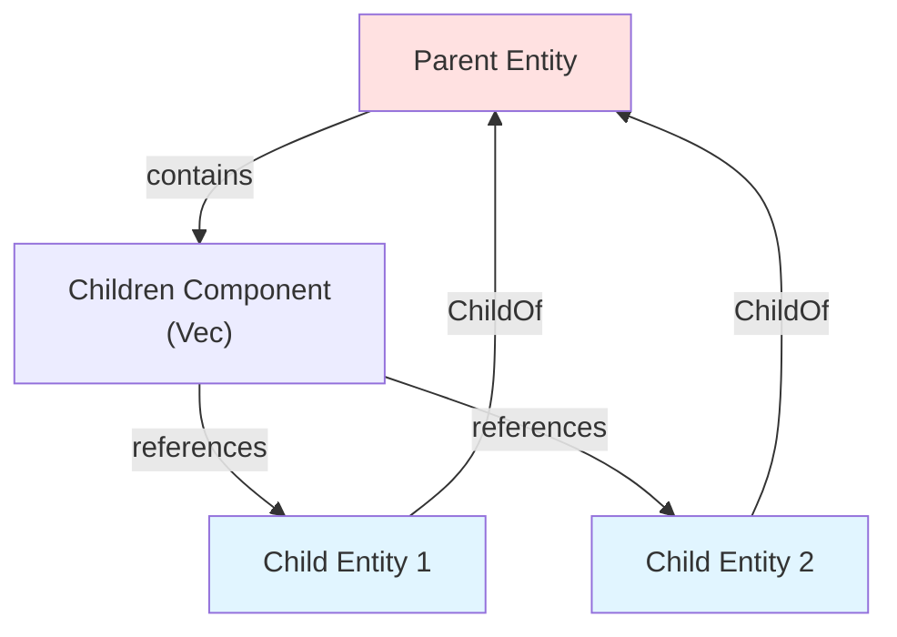
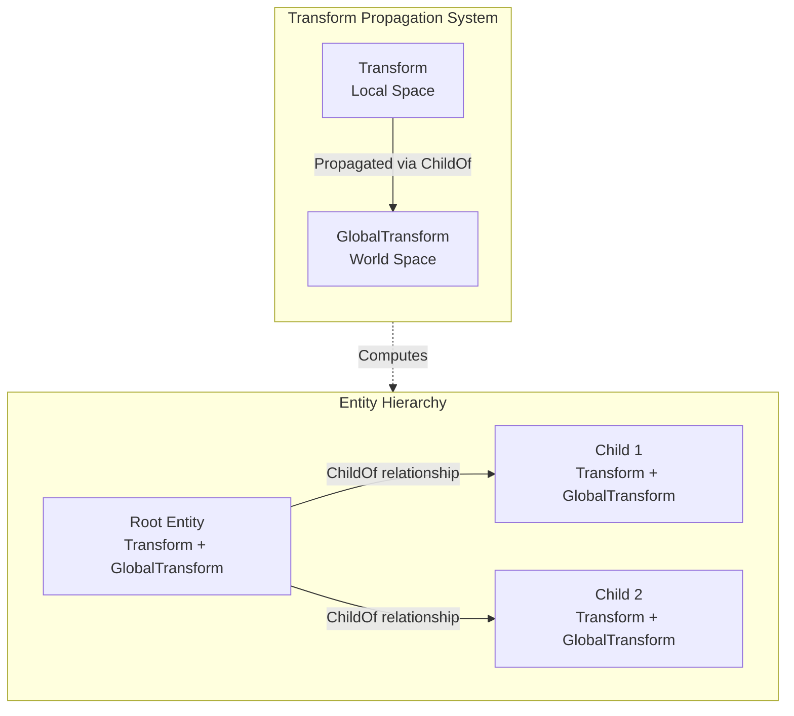
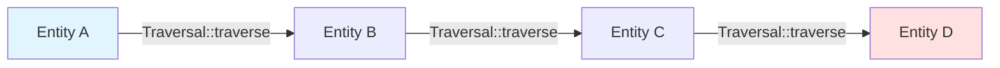

Bevy's relationship system provides a flexible, declarative framework for linking entities together. This system underpins the core transform hierarchy that enables spatial organization and transforms propagation, while also supporting custom relationship types for domain-specific entity connections.

## Core Relationship Architecture

At its foundation, the relationship system establishes bi-directional links between entities through complementary components: a source `Relationship` component and a target `RelationshipTarget` component. The relationship component serves as the "source of truth," while the target component maintains an automatically synchronized collection of all entities pointing to it.

Sources: [mod.rs](crates/bevy_ecs/src/relationship/mod.rs#L1-L100)



The `Relationship` trait defines the contract for source components, requiring an associated `RelationshipTarget` type and methods for accessing and modifying the target entity. Component hooks automatically maintain the bidirectional synchronization when relationships are inserted, replaced, or removed.

Sources: [mod.rs](crates/bevy_ecs/src/relationship/mod.rs#L49-L88)

<CgxTip>Relationship components are immutable through queries. To change a relationship, insert a new instance rather than attempting direct mutation. This ensures component hooks execute correctly and the corresponding RelationshipTarget stays synchronized.</CgxTip>

### Deriving Relationships

The relationship system provides derive macros for both relationship and relationship target components. Relationships require specifying their corresponding target type via the `relationship_target` attribute:

```rust
#[derive(Component)]
#[relationship(relationship_target = TargetedBy)]
struct Targeting(pub Entity);

#[derive(Component)]
#[relationship_target(relationship = Targeting)]
struct TargetedBy(Vec<Entity>);
```

Sources: [mod.rs](crates/bevy_ecs/src/relationship/mod.rs#L60-L88)

Key derive attributes include:
- `allow_self_referential`: Permits relationships pointing to the same entity
- `linked_spawn`: Automatically despawns related entities when the target despawns (used by Children)

## Canonical Hierarchy: ChildOf and Children

Bevy provides a built-in parent-child hierarchy through the `ChildOf` and `Children` components. This canonical relationship powers transform and visibility propagation throughout the scene graph.

Sources: [hierarchy.rs](crates/bevy_ecs/src/hierarchy.rs#L1-L100)

### ChildOf: The Source Component

`ChildOf` contains a single `Entity` representing the parent. When inserted on an entity, the parent automatically receives a `Children` component (if not already present) containing the child entity. The component hooks handle all synchronization automatically.

Sources: [hierarchy.rs](crates/bevy_ecs/src/hierarchy.rs#L27-L70)



The `linked_spawn` attribute on `Children` ensures that when a parent despawns, all children and their descendants are automatically despawned. This cascade prevents orphaned entities and simplifies scene management.

Sources: [hierarchy.rs](crates/bevy_ecs/src/hierarchy.rs#L118-L120)

### Creating Hierarchies

Multiple ergonomic methods exist for building entity hierarchies. The `with_children` helper on `EntityWorldMut` provides a closure-based API for spawning children:

```rust
let root = world.spawn_empty()
    .with_children(|parent| {
        parent.spawn_empty().with_children(|parent| {
            grandchild = parent.spawn_empty().id();
        });
        child2 = parent.spawn_empty().id();
    })
    .id();
```

Sources: [hierarchy.rs](crates/bevy_ecs/src/hierarchy.rs#L52-L70)

Alternatively, use `add_child` after entities exist:

```rust
let parent = commands.spawn_empty().id();
let child = commands.spawn_empty().id();
commands.entity(parent).add_child(child);
```

Sources: [hierarchy.rs](examples/ecs/hierarchy.rs#L45-L56)

### Working with Children

The `Children` component implements various collection operations for managing child ordering and access:

| Method | Purpose |
|--------|---------|
| `swap(a_index, b_index)` | Swap positions of two children |
| `sort_by(comparator)` | Stable sort using custom comparator |
| `sort_by_key(extractor)` | Sort by key extraction function |
| `sort_by_cached_key(extractor)` | Sort with cached keys for complex extractions |

Sources: [hierarchy.rs](crates/bevy_ecs/src/hierarchy.rs#L140-L180)

Iterate over children by treating `Children` as a slice:

```rust
for (parent, children) in &mut parents_query {
    for child in children {
        // Process each child entity
    }
}
```

Sources: [hierarchy.rs](examples/ecs/hierarchy.rs#L60-L75)

## Transform Integration

The transform hierarchy leverages the `ChildOf`/`Children` relationship to compute world-space transforms. Each entity's `Transform` component defines its position relative to its parent, while the computed `GlobalTransform` stores the world-space position.

Sources: [transform.rs](crates/bevy_transform/src/components/transform.rs#L54-L79)



The `TransformSystems::Propagate` system runs during `PostUpdate`, traversing the hierarchy from roots to leaves to compute each entity's `GlobalTransform` based on its `Transform` and parent's `GlobalTransform`.

Sources: [transform.rs](crates/bevy_transform/src/components/transform.rs#L73-L80)

<CgxTip>Modifying `Transform` during or after `PostUpdate` causes a one-frame lag before `GlobalTransform` updates. Schedule transform changes in `Update` or earlier stages to avoid this delay.</CgxTip>

## Custom Relationships

Beyond the canonical hierarchy, define custom relationships for domain-specific entity connections. Each custom relationship follows the same pattern: a source component implementing `Relationship` and a target component implementing `RelationshipTarget`.

### Example: Targeting System

A combat system might model units targeting each other:

```rust
#[derive(Component)]
#[relationship(relationship_target = TargetedBy)]
struct Targeting(Entity);

#[derive(Component)]
#[relationship_target(relationship = Targeting)]
struct TargetedBy(Vec<Entity>);
```

Sources: [relationships.rs](examples/ecs/relationships.rs#L20-L35)

Insert the relationship component directly, and the hooks automatically update the target:

```rust
let alice = commands.spawn(Name::new("Alice")).id();
let bob = commands.spawn((Name::new("Bob"), Targeting(alice))).id();
// Alice automatically gets TargetedBy([bob])
```

Sources: [relationships.rs](examples/ecs/relationships.rs#L53-L58)

### Helper Methods for Custom Relationships

The same helper methods available for `ChildOf` work with any custom relationship type:

| Method | Description |
|--------|-------------|
| `with_related<R>(bundle)` | Spawn entity with relationship R and bundle |
| `with_related_entities<R>(closure)` | Spawn multiple related entities via closure |
| `add_related<R>(&[Entity])` | Add multiple relationships |
| `remove_related<R>(&[Entity])` | Remove specific relationships |
| `replace_related<R>(&[Entity])` | Replace all relationships with new set |
| `detach_all_related<R>()` | Remove all relationships of type R |

Sources: [related_methods.rs](crates/bevy_ecs/src/relationship/related_methods.rs#L18-L120)

Example using `with_related`:

```rust
let charlie = commands.spawn(Name::new("Charlie"))
    .with_related::<Targeting>(Name::new("James"))
    .with_related_entities::<Targeting>(|spawner| {
        spawner.spawn(Name::new("Devon"));
    })
    .id();
```

Sources: [relationships.rs](examples/ecs/relationships.rs#L60-L70)

## Traversal and Graph Operations

The `Traversal` trait enables systematic traversal through relationship graphs, particularly useful for event propagation and graph analysis. Implementations define how to move from one entity to the next based on relationship components.

Sources: [traversal.rs](crates/bevy_ecs/src/traversal.rs#L13-L34)



Bevy provides a `Traversal` implementation for any `&R` where `R: Relationship`, enabling ancestor traversal through relationship chains.

Sources: [traversal.rs](crates/bevy_ecs/src/traversal.rs#L38-L45)

### Cycle Detection

Relationships can form cycles, which may cause infinite loops in traversal operations. Implement cycle detection algorithms when traversing potentially cyclic graphs:

```rust
fn check_for_cycles(
    query: Query<Entity, With<Targeting>>,
    targeting_query: Query<&Targeting>,
) -> Result<(), TargetingCycle> {
    for start in query.iter() {
        let mut visited = EntityHashSet::new();
        for entity in targeting_query.iter_ancestors(start) {
            if !visited.insert(entity) {
                return Err(TargetingCycle { initial_entity: start, visited });
            }
        }
    }
    Ok(())
}
```

Sources: [relationships.rs](examples/ecs/relationships.rs#L150-L180)

The `iter_ancestors` method on queries traverses relationship chains, returning all entities reachable by following the relationship repeatedly. Use this for depth-first searches, path finding, or hierarchy analysis.

Sources: [relationships.rs](examples/ecs/relationships.rs#L160-L178)

## Mutation and Lifecycle

Proper relationship mutation requires understanding the hook system. Relationship components cannot be directly mutated through queries—instead, insert a new instance to trigger the appropriate hooks.

### Safe Mutation Pattern

To change a relationship target:

```rust
// Incorrect: Direct mutation bypasses hooks
// commands.entity(devon).get_mut::<Targeting>().unwrap().0 = alice;

// Correct: Insert new instance triggers hooks
commands.entity(devon).insert(Targeting(alice));
```

Sources: [relationships.rs](examples/ecs/relationships.rs#L115-L125)

Removing a relationship updates the target automatically:

```rust
// Remove targeting relationship
commands.entity(charlie).remove::<Targeting>();
// Charlie is automatically removed from TargetedBy of its previous target
```

Sources: [relationships.rs](examples/ecs/relationships.rs#L197-L204)

### Despawn Behavior

When an entity despawns, the relationship system handles cleanup:

1. All relationships from this entity are removed, updating targets' collections
2. If using `linked_spawn`, all entities in the `RelationshipTarget` collection are despawned
3. This cascade continues recursively for descendants

Sources: [mod.rs](crates/bevy_ecs/src/relationship/mod.rs#L100-L150)

## Performance Considerations

### Collection Types

Relationship targets support different collection types through the `RelationshipSourceCollection` trait. The default `Vec<Entity>` provides ordered, indexed access. For large collections or frequent membership checks, consider custom collection implementations.

Sources: [hierarchy.rs](crates/bevy_ecs/src/hierarchy.rs#L118-L120)

### Query Patterns

Efficient relationship queries leverage the target component for batch operations:

```rust
// Process all children of parents
fn process_children(parents_query: Query<(Entity, &Children)>, child_query: Query<&mut Transform>) {
    for (parent, children) in &parents_query {
        for child in children {
            if let Ok(mut transform) = child_query.get_mut(*child) {
                // Process child
            }
        }
    }
}
```

Sources: [hierarchy.rs](examples/ecs/hierarchy.rs#L60-L75)

### Change Detection

Relationship components integrate with Bevy's change detection system. Use `Changed<T>` filters to react to hierarchy modifications:

```rust
fn on_hierarchy_change(query: Query<Ref<ChildOf>>) {
    for child_of in query.iter() {
        if child_of.is_changed() {
            // Handle parent change
        }
    }
}
```

## Relationship Comparison

| Relationship Type | Use Case | Despawn Behavior | Directionality |
|-------------------|----------|------------------|----------------|
| `ChildOf`/`Children` | Spatial hierarchy, transform propagation | Cascade despawn | Hierarchical (parent → children) |
| Custom `Targeting` | Combat targeting, AI behavior | Independent | Bidirectional reference |
| `LinkedSpawn` relationships | Asset dependencies, lifecycle coupling | Cascade despawn | Source → Target |

## Further Reading

- [Entity Component System (ECS)](9-entity-component-system-ecs) - Foundational concepts
- [Transforms and Positioning](examples/transforms/transform.rs) - Practical transform hierarchy examples
- [Observers and Events](27-observers-and-events) - Relationship-based event propagation
- [Component Hooks and Lifecycle](28-component-hooks-and-lifecycle) - Advanced relationship hook customization
