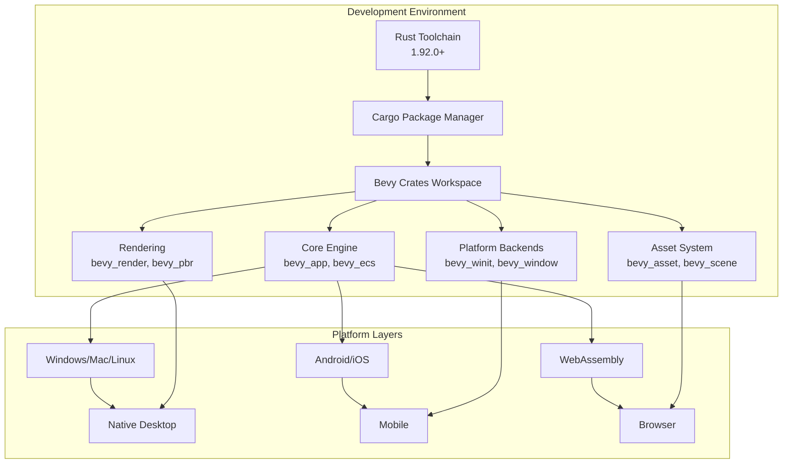
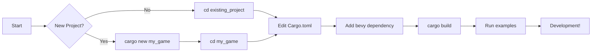
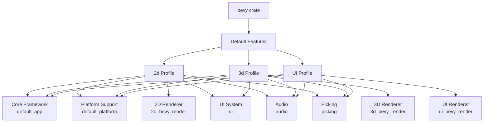

This guide walks you through setting up a complete development environment for Bevy game engine, from installing Rust to configuring platform-specific dependencies and development tools. Bevy is a modular, data-driven game engine built in Rust that prioritizes both developer productivity and runtime performance.


Sources: [README.md](/README.md#L1-L50), [Cargo.toml](/Cargo.toml#L1-L15)

## System Architecture Overview

Before diving into installation, it's helpful to understand the modular architecture of Bevy's development environment:



This modular approach means you can enable only the features you need, reducing compile times and binary size. The workspace contains over 30 individual crates that compose the full Bevy engine.

Sources: [Cargo.toml](/Cargo.toml#L14-L50), [src/lib.rs](/src/lib.rs#L40-L55)

## Prerequisites

### Rust Installation

Bevy requires a modern Rust toolchain to take advantage of the latest language features and improvements. The Minimum Supported Rust Version (MSRV) is **Rust 1.92.0**.

```bash
# Install Rust using rustup (recommended)
curl --proto '=https' --tlsv1.2 -sSf https://sh.rustup.rs | sh

# Verify installation
rustc --version
cargo --version

# Update to latest stable if needed
rustup update stable
```

| Component | Minimum Version | Recommended |
|-----------|----------------|-------------|
| Rust | 1.92.0 | Latest stable |
| Cargo | 1.92.0 | Bundled with Rust |
| rustup | 1.26.0 | Latest |

<CgxTip>Bevy relies heavily on improvements in the Rust language and compiler. As a result, the MSRV is generally close to "the latest stable release" of Rust. Using older versions may result in compilation errors.</CgxTip>

Sources: [Cargo.toml](/Cargo.toml#L13), [README.md](/README.md#L18-L22)

### Platform-Specific Dependencies

#### Linux Dependencies

Linux requires system-level libraries for windowing, audio, and input handling. The packages vary by distribution:

| Distribution | Installation Command |
|--------------|---------------------|
| Ubuntu/Debian | `sudo apt-get install g++ pkg-config libx11-dev libasound2-dev libudev-dev libxkbcommon-x11-0 libwayland-dev libxkbcommon-dev` |
| Fedora | `sudo dnf install gcc-c++ libX11-devel alsa-lib-devel systemd-devel wayland-devel libxkbcommon-devel` |
| Arch/Manjaro | `sudo pacman -S libx11 pkgconf alsa-lib libxcursor libxrandr libxi pipewire-alsa` |
| Void | `sudo xbps-install -S pkgconf alsa-lib-devel libX11-devel eudev-libudev-devel` |

**Graphics Drivers**: Depending on your graphics card, install one of:
- `vulkan-radeon` (AMD)
- `vulkan-intel` (Intel)
- `mesa-vulkan-drivers` (Mesa)

Sources: [docs/linux_dependencies.md](/docs/linux_dependencies.md#L1-L50)

#### Windows

Windows users have the simplest setup experience. Bevy works out-of-the-box with:

- Windows 10 or 11 (recommended)
- Visual Studio Build Tools 2019 or later (for C++ toolchain)
- No additional system dependencies required

Sources: [examples/README.md](/examples/README.md#L7-L15)

#### macOS

macOS development requires Xcode command-line tools:

```bash
# Install Xcode command-line tools
xcode-select --install

# Verify installation
xcode-select -p
```

Sources: [examples/README.md](/examples/README.md#L720-L735)

## Project Setup

### Creating a New Bevy Project



#### Step 1: Initialize the Project

```bash
# Create a new Rust project
cargo new my_bevy_game
cd my_bevy_game
```

#### Step 2: Configure Cargo.toml

Edit your `Cargo.toml` to include Bevy:

```toml
[package]
name = "my_bevy_game"
version = "0.1.0"
edition = "2021"

[dependencies]
bevy = "0.19"  # Use the latest version from crates.io

# For development builds with faster compile times:
[profile.dev]
opt-level = 1

[profile.dev.package."*"]
opt-level = 3
```

#### Step 3: Create Your First Bevy App

Update `src/main.rs`:

```rust
use bevy::prelude::*;

fn main() {
    App::new()
        .add_plugins(DefaultPlugins)
        .add_systems(Startup, setup)
        .add_systems(Update, rotate_cube)
        .run();
}

fn setup(mut commands: Commands) {
    commands.spawn(Camera2d);
}

fn rotate_cube(time: Res<Time>) {
    println!("Time elapsed: {:?}", time.elapsed_seconds());
}
```

#### Step 4: Build and Run

```bash
# Build the project
cargo build

# Run your game
cargo run

# Or build in release mode for performance
cargo build --release
cargo run --release
```

Sources: [examples/hello_world.rs](/examples/hello_world.rs#L1-L12), [README.md](/README.md#L50-L65)

## Working with Bevy Examples

Bevy provides extensive examples demonstrating all major features. Running these examples is an excellent way to learn the engine and verify your environment.

```bash
# Clone the Bevy repository
git clone https://github.com/bevyengine/bevy.git
cd bevy

# Switch to the latest release (recommended for learning)
git checkout latest

# Run a specific example
cargo run --example breakout

# Run with specific window backend (Linux)
cargo run --features wayland --example hello_world
cargo run --features x11 --example hello_world

# List all available examples
ls examples/
```

| Example Category | Examples |
|-----------------|----------|
| 2D Rendering | `sprite`, `sprite_sheet`, `texture_atlas` |
| 3D Rendering | `lighting`, `3d_scene`, `load_gltf` |
| UI | `button`, `text`, `ui_scaling` |
| Audio | `audio`, `decodable` |
| Input | `input`, `keyboard_input`, `mouse_input` |
| ECS | `ecs`, `query`, `resources` |

<CgxTip>Always check out the matching version when working with examples. The main branch may have breaking API changes compared to the latest crates.io release.</cgg_tip>

Sources: [examples/README.md](/examples/README.md#L1-L50), [README.md](/README.md#L50-L65)

## Cargo Features and Customization

Bevy exposes extensive Cargo features allowing you to customize the engine for your needs. This can significantly reduce compile times and binary size.

### Understanding Feature Profiles



### Common Feature Configurations

```toml
# Full engine (default)
bevy = "0.19"

# 2D only (faster compilation, smaller binary)
bevy = { version = "0.19", default-features = false, features = ["2d"] }

# 3D only
bevy = { version = "0.19", default-features = false, features = ["3d"] }

# UI only
bevy = { version = "0.19", default-features = false, features = ["ui"] }

# Development build with debugging tools
bevy = { version = "0.19", features = ["dev"] }

# Headless (no rendering)
bevy = { version = "0.19", default-features = false, features = ["default_app"] }
```

| Feature | Description | Use Case |
|---------|-------------|----------|
| `dev` | Asset hot-reloading, debug tools | Development only |
| `file_watcher` | File system watching | Asset development |
| `dynamic_linking` | Faster iterative compiles | Active development |
| `serialize` | Serde serialization support | Save/load systems |
| `trace` | Tracing spans for profiling | Performance debugging |
| `bevy_ci_testing` | Automated testing utilities | CI/CD pipelines |

### Development-Specific Features

For active development, enable features that improve your workflow:

```toml
# In Cargo.toml
[dependencies]
bevy = { version = "0.19", features = [
    "dev",           # Asset hot-reloading, dev tools
    "dynamic_linking", # Faster recompilation
    "trace",         # Performance profiling
] }

# Optional: disable unused features
# For a 2D game, you might disable 3D features
bevy = { version = "0.19", default-features = false, features = [
    "2d",
    "dev",
    "dynamic_linking",
] }
```

Sources: [docs/cargo_features.md](/docs/cargo_features.md#L1-L50), [Cargo.toml](/Cargo.toml#L70-L120)

## Development Tools and Debugging

### Profiling Setup

Bevy includes built-in tracing for profiling engine internals and user code:

```bash
# Tracy profiler (recommended for CPU profiling)
cargo run --release --features bevy/trace_tracy

# Tracy with memory tracking
cargo run --release --features bevy/trace_tracy,bevy/trace_tracy_memory

# Chrome tracing format
cargo run --release --features bevy/trace_chrome
```

To profile your own code:

```rust
use bevy::prelude::*;

fn my_system() {
    let _span = info_span!("my_system").entered();
    // Your system code here
}
```

Sources: [docs/profiling.md](/docs/profiling.md#L1-L50)

### Debugging Tools

**Macro Debugging:**
```bash
# Expand macros to see generated code
cargo expand --color always | less -R
```

**WGPU Tracing:**
```bash
# Capture wgpu traces for graphics debugging
# 1. Create trace directory
mkdir wgpu_trace
# 2. Enable trace feature in Cargo.toml
# 3. Configure trace path in RenderPlugin
# 4. Run app and reproduce issue
```

Sources: [docs/debugging.md](/docs/debugging.md#L1-L25)

### Development Editor Configuration

**VS Code (recommended):**
```json
{
  "rust-analyzer.cargo.features": "all",
  "rust-analyzer.checkOnSave.command": "clippy",
  "files.watcherExclude": {
    "**/target/**": true
  }
}
```

**rustfmt Configuration:**
Bevy includes a `rustfmt.toml` for consistent code formatting. Run:
```bash
cargo fmt
```

Sources: [rustfmt.toml](/rustfmt.toml#L1-L20), [Cargo.toml](/Cargo.toml#L19-L80)

## Platform-Specific Development

### WebAssembly Development

Developing for the web requires additional tooling:

```bash
# Add wasm32 target
rustup target add wasm32-unknown-unknown

# Install wasm-bindgen CLI
cargo install wasm-bindgen-cli

# Build for Web
cargo build --release --example lighting --target wasm32-unknown-unknown
wasm-bindgen --out-name wasm_example \
  --out-dir examples/wasm/target \
  --target web target/wasm32-unknown-unknown/release/examples/lighting.wasm

# Serve the files
python3 -m http.server --directory examples/wasm
```

**WebGPU vs WebGL2:**
- WebGL2: Better browser support, limited features
- WebGPU: Modern, experimental, better performance

```toml
# For WebGL2
bevy = { version = "0.19", default-features = false, features = ["webgl2"] }

# For WebGPU
bevy = { version = "0.19", default-features = false, features = ["webgpu"] }
```

Sources: [examples/README.md](/examples/README.md#L750-L820)

### Android Development

Android development requires additional setup:

```bash
# Install Android SDK and NDK
# Set environment variables
export ANDROID_SDK_ROOT=/path/to/sdk
export ANDROID_NDK_ROOT=/path/to/ndk

# Add Android targets
rustup target add aarch64-linux-android

# Install cargo-ndk
cargo install cargo-ndk

# Build shared libraries
cargo ndk -t arm64-v8a -o android_project/app/src/main/jniLibs build
```

**Android API Levels:**
- API 31+: Use GameActivity (default, recommended)
- API < 31: Use NativeActivity (add `android-native-activity` feature)

Sources: [examples/README.md](/examples/README.md#L650-L720)

### iOS Development

iOS development requires Xcode and specific targets:

```bash
# Add iOS targets
rustup target add aarch64-apple-ios           # Devices
rustup target add x86_64-apple-ios            # Simulator (Intel)
rustup target add aarch64-apple-ios-sim       # Simulator (Apple Silicon)

# Build and run
cd examples/mobile
make run
# Or specify device
DEVICE_ID=device-uuid make run
```

Sources: [examples/README.md](/examples/README.md#L720-L740)

## Project Structure

A typical Bevy project structure:

```
my_bevy_game/
├── assets/
│   ├── images/
│   ├── models/
│   ├── audio/
│   └── scenes/
├── src/
│   ├── main.rs
│   ├── systems/
│   ├── components/
│   └── resources/
├── Cargo.toml
└── build.rs  # Optional, for build scripts
```

The assets directory structure mirrors Bevy's asset system organization. Bevy automatically watches this directory when the `file_watcher` feature is enabled for hot-reloading.

Sources: [examples/](/examples/), [README.md](/README.md#L1-L10)

## Troubleshooting Common Issues

### Compilation Errors

| Issue | Solution |
|-------|----------|
| `rustc` not found | Install Rust via rustup |
| "linker not found" (Linux) | Install `pkg-config` and system libraries |
| "vulkan not found" | Install GPU-specific Vulkan drivers |
| "wgpu error" | Update graphics drivers, check backend compatibility |

### Performance Issues

- Slow compile times: Enable `dynamic_linking` feature
- Large binary size: Use feature profiles instead of default features
- Runtime slowness: Build in release mode (`--release`)
- UI performance: Check you're using the latest stable Rust

Sources: [docs/linux_dependencies.md](/docs/linux_dependencies.md#L50-L100)

## Next Steps

With your development environment configured, you're ready to dive deeper into Bevy:

1. **[Fast Compile Configuration](4-fast-compile-configuration)** - Optimize your build setup for faster iterative development
2. **[Cargo Features and Custom Builds](5-cargo-features-and-custom-builds)** - Explore the full range of Bevy features and custom build configurations
3. **[Quick Start](2-quick-start)** - Learn the fundamentals of Bevy through hands-on examples
4. **[Entity Component System (ECS)](9-entity-component-system-ecs)** - Understand Bevy's core architecture pattern

For additional help and community support:
- Join the [Bevy Discord](https://discord.gg/bevy)
- Browse [GitHub Discussions](https://github.com/bevyengine/bevy/discussions)
- Check out [Community Learning Resources](https://bevy.org/assets/)
