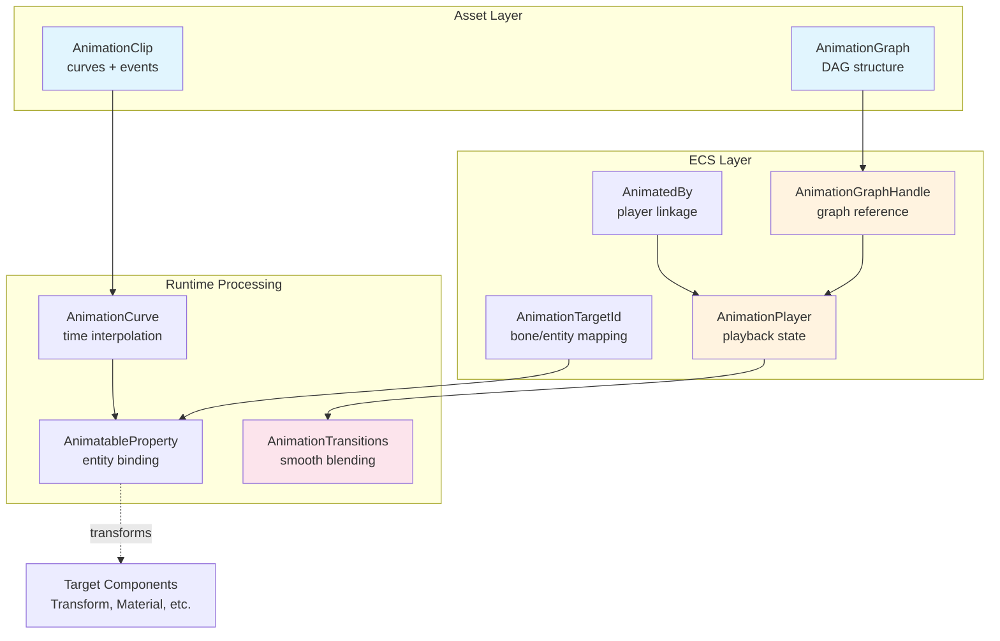
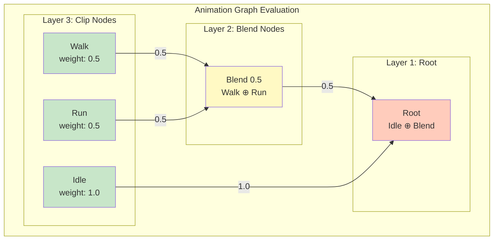

The Animation System in Bevy provides a comprehensive, performant framework for animating entities through a graph-based architecture that supports complex blending, transitions, and precise targeting. Built atop Bevy's ECS foundation, the animation system enables everything from simple property animations to sophisticated character rig blending with additive layers and masking capabilities.

## Architecture Overview

The animation system operates through a layered architecture where [`AnimationClip`] assets define the raw animation data, [`AnimationGraph`] assets specify how multiple animations blend together, and [`AnimationPlayer`] components manage playback state. The system uses UUID-based targeting through [`AnimationTargetId`] to enable seamless retargeting between different skeletal hierarchies.



## Core Components

### AnimationClip

The [`AnimationClip`] serves as the fundamental container for animation data, organizing [`VariableCurve`] instances indexed by [`AnimationTargetId`]. Each curve implements the [`AnimationCurve`] trait, which provides time-based interpolation, and clips support both property animation and time-triggered events. The clip automatically manages duration based on the maximum time extent of its contained curves.

Clips support two types of events: root-level events that trigger on the [`AnimationPlayer`] entity, and targeted events that trigger on specific entities matching an [`AnimationTargetId`]. Events are stored with timestamps and triggered when the playback time crosses those points, carrying weight information for blend-aware event handling.

Sources: [lib.rs](crates/bevy_animation/src/lib.rs#L54-L86), [lib.rs](crates/bevy_animation/src/lib.rs#L247-L380)

### AnimationGraph

The [`AnimationGraph`] implements a directed acyclic graph (DAG) that defines how multiple animations blend together, using three node types:

| Node Type | Purpose | Weight Behavior |
|-----------|---------|-----------------|
| **Clip** | Leaf nodes containing animation clips | Multiplied by active animation weight |
| **Blend** | Normalized blending of child animations | Children's weights normalized to sum to 1.0 |
| **Add** | Additive layering of child animations | Children's weights added without normalization |

Graphs include a masking system where each node can specify which [`AnimationMask`] groups it affects, enabling selective animation of bone subsets. The graph structure is optimized for runtime evaluation through [`ThreadedAnimationGraphs`] resources that cache postorder traversals and sorted edge lookups for efficient frame-by-frame processing.

Sources: [graph.rs](crates/bevy_animation/src/graph.rs#L37-L110), [graph.rs](crates/bevy_animation/src/graph.rs#L147-L186)

### AnimationPlayer

The [`AnimationPlayer`] component manages playback state for all active animations associated with an entity. It maintains a map of [`ActiveAnimation`] instances indexed by [`AnimationNodeIndex`], each tracking elapsed time, seek position, playback speed, weight, pause state, and repetition behavior. The player supports simultaneous playback of multiple animations from the same graph, with each animation independently controllable.

Active animations support three repetition modes via [`RepeatAnimation`]: `Never` (plays once), `Count(n)` (plays n times), and `Forever` (loops indefinitely). The player provides methods for controlling playback including `start()`, `play()`, `stop()`, `pause()`, `resume()`, `seek_all_by()`, and `adjust_speeds()`, with both per-animation and batch operations available.

Sources: [lib.rs](crates/bevy_animation/src/lib.rs#L421-L467), [lib.rs](crates/bevy_animation/src/lib.rs#L715-L830)

### AnimationTargetId

The [`AnimationTargetId`] component identifies which parts of an [`AnimationClip`] apply to a given entity, implemented as a UUID derived from the full path name of bones in the animation hierarchy. This UUID-based system enables automatic retargeting—animations can be applied to any rig with matching bone names without manual mapping. Asset loaders generate these IDs by hashing the full path from root to bone, ensuring uniqueness while maintaining consistency across different assets.

Entities in the animated hierarchy typically receive [`AnimationTargetId`] components from asset loaders, with the [`AnimatedBy`] component optionally linking them to a specific [`AnimationPlayer`] entity. This architecture allows flexible hierarchies where a player can animate entities that aren't direct descendants, though each target can only be animated by one player at a time.

Sources: [lib.rs](crates/bevy_animation/src/lib.rs#L126-L170), [lib.rs](crates/bevy_animation/src/lib.rs#L172-L210)

## Curve System

### AnimationCurve Trait

The [`AnimationCurve`] trait forms the bridge between time-based data generation and entity property modification. Implementations receive a time parameter and produce values that are applied to entities through [`AnimatableProperty`] implementations. The system includes several adapters for creating animation curves from various sources:

**[`AnimatableCurve`]**: Wraps any [`Curve<T>`] (where T: [`Animatable`]) and an [`AnimatableProperty`] to create an animation curve that modifies the specified property. This is the primary mechanism for most animations.

**[`animated_field!` macro]**: A convenient macro that generates an [`AnimatableProperty`] for a specific field on a component, enabling direct field-level animation without custom property implementations.

The curve evaluation system uses thread-local [`AnimationCurveEvaluator`] instances cached by [`EvaluatorId`] for optimal performance, avoiding repeated allocator overhead during per-frame evaluation.

Sources: [animation_curves.rs](crates/bevy_animation/src/animation_curves.rs#L1-L110)

### Animatable Trait

The [`Animatable`] trait defines how values of a type interpolate and blend, forming the foundation for all animatable properties. It requires two methods:

- `interpolate(a, b, t)`: Linear interpolation between two values with factor t (not clamped to [0, 1])
- `blend(inputs)`: Combines multiple [`BlendInput`] values, each specifying a weight, value, and whether to use additive blending

The trait is implemented for all numeric types, vectors (`Vec2`, `Vec3`, `Vec3A`, `Vec4`, etc.), quaternion types (`Quat`), colors (`LinearRgba`, `Srgba`, etc.), and composite types like `Transform`. The `Transform` implementation separately interpolates translation, scale, and rotation (using spherical linear interpolation for quaternions).

<CgxTip>When implementing custom `Animatable` types, ensure your `blend` implementation handles both additive and non-additive inputs correctly. Additive blending should typically apply the weighted delta to the accumulated result, while non-additive blending should interpolate between the current result and the new value.</CgxTip>

Sources: [animatable.rs](crates/bevy_animation/src/animatable.rs#L19-L53), [animatable.rs](crates/bevy_animation/src/animatable.rs#L100-L147)

### AnimatableProperty Trait

The [`AnimatableProperty`] trait provides a mechanism to extract mutable references to properties from entities for animation. Implementations define:

- `Property` type: The animatable value type (must implement [`Animatable`])
- `get_mut(entity)`: Retrieves a mutable reference to the property from the entity
- `evaluator_id()`: Returns the [`EvaluatorId`] used for curve evaluator caching

This enables animation of complex property paths, including nested structures, optional values, and custom components. The system handles errors through [`AnimationEvaluationError`], which can indicate missing components or absent properties.

Sources: [animation_curves.rs](crates/bevy_animation/src/animation_curves.rs#L113-L210)

## Animation Graphs and Blending

### Graph Structure

Animation graphs use a directed acyclic graph where edges flow from leaf clip nodes up through blend and add nodes to the root. The graph is evaluated bottom-up: clip nodes sample their animation at the current time, blend nodes combine their children with normalized weights, and add nodes combine children additively. Each node can have an associated weight that scales its contribution to parent blending operations.



The graph evaluation uses a postorder traversal cached in [`ThreadedAnimationGraph`], ensuring children are processed before parents. This cached structure includes sorted edge ranges that allow O(1) lookup of child nodes, eliminating per-frame sorting overhead.

Sources: [graph.rs](crates/bevy_animation/src/graph.rs#L237-L310)

### Masking

Animation masks provide selective control over which animation targets (bones) are affected by nodes and their descendants. Each [`AnimationMask`] is a bitfield where bit N corresponds to mask group N—setting a bit to 1 disables animation for all targets in that group. The [`AnimationGraph`] maintains a mapping of [`AnimationTargetId`] to their mask group memberships, enabling complex selective animation scenarios.

A common use case is object interaction: assign a character's hand bones to a mask group, then mask that group when the character picks up an object. The character's animations continue playing for the rest of the body while the hand remains static, allowing manual positioning for the grasped object.

<CgxTip>When using masks, remember that masking is hierarchical—masking a node affects that node AND all its descendants in the graph. This allows high-level masking at blend nodes without needing to mask individual clip nodes.</CgxTip>

Sources: [graph.rs](crates/bevy_animation/src/graph.rs#L48-L85)

## Transitions

### AnimationTransitions Component

The [`AnimationTransitions`] component manages smooth fade-out transitions between animations, implementing a "greedy layer" system where each transitioning animation gets its requested weight and the main animation receives whatever weight remains. When calling [`AnimationTransitions::play()`], the previous main animation is added to the transition queue with a calculated weight decline rate based on the specified [`Duration`].

Each [`AnimationTransition`] tracks:
- `current_weight`: Starts at the previous animation's weight and decreases
- `weight_decline_per_sec`: Calculated as 1.0 / transition_duration
- `animation`: The [`AnimationNodeIndex`] being faded out

The [`advance_transitions()`] system applies these weight changes each frame, ensuring normalized total weight across all animations. The [`expire_completed_transitions()`] system removes completed transitions and stops the corresponding animations via [`AnimationPlayer::stop()`].

Sources: [transition.rs](crates/bevy_animation/src/transition.rs#L13-L73), [transition.rs](crates/bevy_animation/src/transition.rs#L95-L160)

## Usage Patterns

### Basic Mesh Animation

Playing a skinned mesh animation involves creating an [`AnimationGraph`] from an [`AnimationClip`], loading the mesh as a scene, and connecting them:

```rust
// Create graph from clip
let (graph, index) = AnimationGraph::from_clip(
    asset_server.load(GltfAssetLabel::Animation(2).from_asset("fox.glb"))
);
let graph_handle = graphs.add(graph);

// Spawn scene with observer for ready event
commands.spawn((
    AnimationToPlay { graph_handle, index },
    SceneRoot(asset_server.load(GltfAssetLabel::Scene(0).from_asset("fox.glb")))
)).observe(play_animation_when_ready);

// Start animation when scene loads
fn play_animation_when_ready(
    trigger: On<SceneInstanceReady>,
    mut players: Query<&mut AnimationPlayer>,
    mut commands: Commands
) {
    for child in children.iter_descendants(trigger.entity) {
        if let Ok(mut player) = players.get_mut(child) {
            player.play(animation_to_play.index).repeat();
            commands.entity(child).insert(
                AnimationGraphHandle(animation_to_play.graph_handle.clone())
            );
        }
    }
}
```

Sources: [animated_mesh.rs](examples/animation/animated_mesh.rs#L14-L78)

### Controlled Animation Playback

For interactive control, use [`AnimationTransitions`] for smooth switching and monitor keyboard input to control playback parameters:

```rust
fn keyboard_control(
    mut players: Query<(&mut AnimationPlayer, &mut AnimationTransitions)>,
    animations: Res<Animations>
) {
    for (mut player, mut transitions) in &mut players {
        // Play/pause toggle
        if keyboard_input.just_pressed(KeyCode::Space) {
            let anim = player.animation_mut(current_index).unwrap();
            if anim.is_paused() { anim.resume(); } else { anim.pause(); }
        }
        
        // Speed adjustment
        if keyboard_input.just_pressed(KeyCode::ArrowUp) {
            let anim = player.animation_mut(current_index).unwrap();
            anim.set_speed(anim.speed() * 1.5);
        }
        
        // Animation switching with transition
        if keyboard_input.just_pressed(KeyCode::Enter) {
            *current_animation = (*current_animation + 1) % 3;
            transitions.play(
                &mut player,
                animations.animations[*current_animation],
                Duration::from_millis(250)
            ).repeat();
        }
    }
}
```

Sources: [animated_mesh_control.rs](examples/animation/animated_mesh_control.rs#L82-L150)

### Animation Blending with Graphs

Graph-based blending enables complex animation layering. The example demonstrates blending between Idle, Walk, and Run animations with interactive weight adjustment:

```rust
// Create graph with blend structure
let mut graph = AnimationGraph::new();
let root = graph.root;

// Create blend node for walk/run
let blend = graph.add_node(AnimationNode::new(AnimationNodeType::Blend));
graph.add_edge(blend, root);

// Add clip nodes
let idle = graph.add_clip(clip_idle, 1.0, root);
let walk = graph.add_clip(clip_walk, 0.5, blend);
let run = graph.add_clip(clip_run, 0.5, blend);

// All three animations play simultaneously
player.start(idle);
player.start(walk);
player.start(run);

// Adjust blend weights in real-time
fn handle_weight_drag(
    mut weights: Query<&mut ExampleAnimationWeights>,
    mut players: Query<&mut AnimationPlayer>
) {
    for (mut weights, mut player) in &mut (weights, players) {
        weights.weights[walk_index] = drag_value;
        player.animation_mut(walk_index).unwrap().set_weight(drag_value);
        weights.weights[run_index] = 1.0 - drag_value;
        player.animation_mut(run_index).unwrap().set_weight(1.0 - drag_value);
    }
}
```

Sources: [animation_graph.rs](examples/animation/animation_graph.rs#L150-L250)

## Event System

Animation events trigger at specified timestamps during playback, supporting both root-level events (on the player entity) and targeted events (on specific animation target entities). Events receive the triggering entity, event time, and current animation weight, enabling weight-responsive behaviors.

```rust
// Add event to clip
clip.add_event_fn(1.5, |commands, entity, time, weight| {
    println!("Footstep at {:.2}s with weight {:.2}", time, weight);
});

// Add targeted event
clip.add_event_fn_to_target(
    AnimationTargetId::from(&Name::new("Hand")),
    2.0,
    |commands, entity, time, weight| {
        commands.trigger(HandAnimationEvent { weight });
    }
);
```

Events are triggered by the [`trigger_untargeted_animation_events()`] system, which checks each active animation's clip for events between the previous and current seek times.

Sources: [lib.rs](crates/bevy_animation/src/lib.rs#L279-L380), [lib.rs](crates/bevy_animation/src/lib.rs#L845-L890)

## System Execution

The animation system runs in the [`PostUpdate`] schedule after [`TransformSystems::TransformPropagate`], ensuring animations are applied before rendering. Key systems include:

1. **`advance_animations()`**: Updates elapsed time and seek position for all active animations
2. **`advance_transitions()`**: Applies weight changes for transitioning animations
3. **`expire_completed_transitions()`**: Removes finished transitions and stops animations
4. **Animation graph evaluation**: Blends all active animations according to the graph structure
5. **`trigger_untargeted_animation_events()`**: Triggers events whose time has been crossed

The evaluation uses parallel processing for independent [`AnimationPlayer`] instances, with thread-local caches for curve evaluators to maximize performance.

Sources: [lib.rs](crates/bevy_animation/src/lib.rs#L892-L999), [lib.rs](crates/bevy_animation/src/lib.rs#L1000-L1668)

## Performance Considerations

The animation system is optimized for runtime performance through several design choices:

**Thread-local caching**: [`AnimationCurveEvaluator`] instances are cached per thread by [`EvaluatorId`], avoiding repeated allocation during frame evaluation.

**Cached graph traversal**: [`ThreadedAnimationGraph`] precomputes postorder traversal and sorted edge ranges, eliminating per-frame graph traversal overhead.

**Parallel player processing**: Multiple [`AnimationPlayer`] components are processed in parallel where possible, leveraging Bevy's parallel system execution.

**Efficient targeting**: UUID-based [`AnimationTargetId`] enables O(1) lookups without string comparisons during evaluation.

For optimal performance with many animated entities, ensure each entity has exactly one [`AnimationPlayer`] and consider using masks rather than separate animation graphs for selective bone animation.

## Next Steps

Understanding the Animation System provides a foundation for several advanced topics:

- **[Scene System](21-scene-system)**: Learn about hierarchical entity loading and spawning, which animation often operates upon
- **[Asset System](18-asset-loading-and-management)**: Deep dive into asset loading pipelines for GLTF models and custom animation formats
- **[Entity Component System (ECS)](9-entity-component-system-ecs)**: Master the query patterns and component management that animation relies upon
- **[Reflection System](33-reflection-system)**: Understand how animation serialization and property access work under the hood

For practical experimentation, explore the [animation examples directory](examples/animation/) which includes demonstrations of mesh animation, graph blending, morph targets, and event handling.
