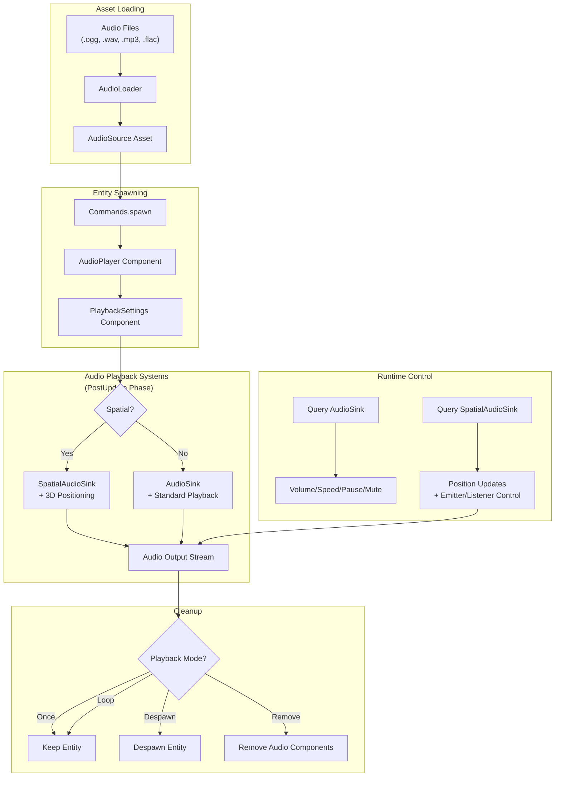
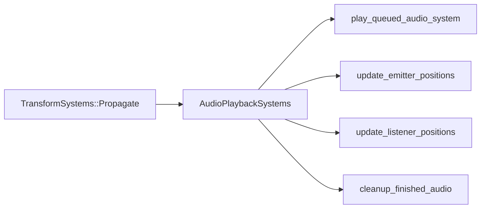

The Audio System in Bevy provides a comprehensive framework for audio playback and spatial sound rendering, built atop the Rodio audio library and integrated seamlessly with the ECS architecture. This system supports both static audio assets and procedural sound generation, with runtime control over playback parameters and spatial positioning for immersive audio experiences.

## Architecture Overview

The audio system operates as a plugin-based subsystem that integrates audio playback into Bevy's game loop. Audio components are processed during the `PostUpdate` phase after transform propagation, enabling spatial audio calculations to leverage current entity positions. The system employs a sink-based model where audio entities transition through states: from queued entities awaiting playback, to active playback with sink components, and finally to cleanup based on playback mode configuration.



## Core Components and Assets

### AudioPlayer and AudioSource

The `AudioPlayer` component serves as the trigger mechanism for audio playback, wrapping a handle to an `AudioSource` asset. The `AudioSource` asset contains the raw audio data in formats supported by enabled Cargo features: OGG (default), WAV, MP3, and FLAC. These assets are loaded through the asset system and decoded using Rodio's decoder.

**Basic Audio Playback:**
```rust
fn play_background_audio(asset_server: Res<AssetServer>, mut commands: Commands) {
    commands.spawn((
        AudioPlayer::new(asset_server.load("background_audio.ogg")),
        PlaybackSettings::LOOP,
    ));
}
```

Sources: [examples/audio/audio.rs](examples/audio/audio.rs#L1-L18), [crates/bevy_audio/src/audio_source.rs](crates/bevy_audio/src/audio_source.rs#L8-L22)

### PlaybackSettings

The `PlaybackSettings` component configures initial audio behavior and can be customized using builder-style methods. This component is applied only when audio starts—changes during playback require querying the `AudioSink` or `SpatialAudioSink` components instead.

**Playback Modes:**

| Mode | Behavior | Use Case |
|------|----------|----------|
| `Once` | Plays once, then idle | One-shot sound effects |
| `Loop` | Repeats infinitely | Background music, ambient sounds |
| `Despawn` | Plays once, then despawns entity | Temporary effects with automatic cleanup |
| `Remove` | Plays once, then removes audio components | Reuse entity without audio |

**Common PlaybackSettings Configurations:**
```rust
// Looping background music
PlaybackSettings::LOOP

// One-shot sound effect with despawn
PlaybackSettings::DESPAWN

// Custom configuration
PlaybackSettings::ONCE
    .with_volume(Volume::Decibels(-3.0))
    .with_spatial(true)
    .with_start_position(Duration::from_secs(5))
    .paused()
```

Sources: [crates/bevy_audio/src/audio.rs](crates/bevy_audio/src/audio.rs#L14-L119)

## Runtime Audio Control

### AudioSink Component

When audio begins playback, Bevy automatically inserts an `AudioSink` component onto the entity, enabling runtime control over the active audio stream. The `AudioSink` implements the `AudioSinkPlayback` trait, providing methods for volume adjustment, playback speed modification, pause/resume, seeking, and mute control.

**Runtime Control Example:**
```rust
fn control_audio(
    mut music_controller: Query<&mut AudioSink, With<MyMusic>>,
    keyboard: Res<ButtonInput<KeyCode>>,
) {
    let Ok(mut sink) = music_controller.get_single_mut() else { return; };
    
    // Toggle playback with Space key
    if keyboard.just_pressed(KeyCode::Space) {
        sink.toggle_playback();
    }
    
    // Adjust volume
    if keyboard.just_pressed(KeyCode::Equal) {
        let current_volume = sink.volume();
        sink.set_volume(current_volume.increase_by_percentage(10.0));
    }
    
    // Modulate speed based on time
    sink.set_speed((ops::sin(time.elapsed_secs() / 5.0) + 1.0).max(0.1));
}
```

Sources: [examples/audio/audio_control.rs](examples/audio/audio_control.rs#L1-L114), [crates/bevy_audio/src/sinks.rs](crates/bevy_audio/src/sinks.rs#L1-L118)

### Volume Management

Bevy provides sophisticated volume control through the `Volume` enum, which supports both linear scale and decibel representations. Volume can be controlled per-audio sink or globally via the `GlobalVolume` resource. The system correctly handles muting by preserving the intended volume level internally while setting the physical volume to zero.

**Volume Representation:**

| Format | Normal Value | Muted | Formula |
|--------|--------------|-------|---------|
| Linear | 1.0 | 0.0 | Direct multiplier |
| Decibels | 0.0 | -∞ | 20×log₁₀(linear) |

**Global Volume Control:**
```rust
// Apply global volume multiplier (doesn't affect already-playing audio)
fn set_global_volume(mut global_volume: ResMut<GlobalVolume>) {
    global_volume.volume = Volume::Decibels(-6.0); // 50% of normal
}
```

Sources: [crates/bevy_audio/src/volume.rs](crates/bevy_audio/src/volume.rs#L1-L200), [crates/bevy_audio/src/sinks.rs](crates/bevy_audio/src/sinks.rs#L119-L201)

## Spatial Audio

Bevy's spatial audio system enables 3D sound positioning using stereo panning based on the relative positions of audio emitters and listeners. While the system doesn't support advanced techniques like HRTF (Head-Related Transfer Functions), it provides efficient left-right channel distribution suitable for many game scenarios.

### SpatialListener

The `SpatialListener` component defines the audio receiver's position in 3D space, typically attached to the camera or player entity. Only one listener should exist at any given time—the system will warn if multiple are detected and use the first one found.

**Spatial Listener Setup:**
```rust
fn setup_listener(mut commands: Commands) {
    let gap = 4.0; // Distance between ears in world units
    
    commands.spawn((
        Transform::default(),
        SpatialListener::new(gap),
    ));
}
```

Sources: [crates/bevy_audio/src/audio.rs](crates/bevy_audio/src/audio.rs#L169-L193)

### SpatialAudioSink and 3D Positioning

When `PlaybackSettings::spatial` is enabled, Bevy inserts a `SpatialAudioSink` component instead of `AudioSink`. The sink automatically tracks the entity's global transform for emitter positioning, and the system updates ear positions based on the listener's transform.

**Spatial Audio Configuration:**
```rust
commands.spawn((
    AudioPlayer::new(asset_server.load("explosion.ogg")),
    PlaybackSettings::ONCE
        .with_spatial(true)
        .with_spatial_scale(SpatialScale(0.1)), // Scale factor for world units
    Transform::from_xyz(10.0, 5.0, -20.0), // Emitter position
));
```

Sources: [examples/audio/spatial_audio_3d.rs](examples/audio/spatial_audio_3d.rs#L1-L140), [crates/bevy_audio/src/audio_output.rs](crates/bevy_audio/src/audio_output.rs#L98-L170)

<CgxTip>The spatial audio system updates positions in the PostUpdate phase after transform propagation. For dynamic audio emitters, ensure their transforms are updated before this stage. The system automatically handles position updates when emitter or listener transforms change.</CgxTip>

## Custom Audio Sources

Bevy supports custom audio types through the `Decodable` trait, which bridges your audio data types with Rodio's source abstraction. This enables procedural sound generation or custom audio processing pipelines without leaving Bevy's asset system.

### Procedural Sound with Pitch

Bevy includes `Pitch`, a procedural audio asset that generates sine wave tones at specified frequencies and durations. This is useful for UI sounds, testing, or generating audio without external files.

**Using Procedural Audio:**
```rust
fn play_tone(mut commands: Commands) {
    commands.spawn((
        AudioPlayer::new(Handle::<Pitch>::default()),
        PlaybackSettings::ONCE,
    ));
}

// Configure a Pitch asset (typically done via asset loader or direct creation)
let pitch = Pitch::new(440.0, Duration::from_secs_f32(0.5)); // A4 note, 500ms
```

Sources: [crates/bevy_audio/src/pitch.rs](crates/bevy_audio/src/pitch.rs#L1-L36), [examples/audio/pitch.rs](examples/audio/pitch.rs)

### Implementing Decodable for Custom Types

To add your own audio source type, implement the `Decodable` trait with `Send` and `Sync` bounds, then register it with `app.add_audio_source::<MyCustomType>()`.

**Custom Decodable Implementation:**
```rust
impl Decodable for MyCustomAudio {
    type DecoderItem = f32;
    type Decoder = MyCustomDecoder;
    
    fn decoder(&self) -> Self::Decoder {
        MyCustomDecoder::new(self.data.clone())
    }
}

// Register in App
app.add_audio_source::<MyCustomAudio>();
```

Sources: [crates/bevy_audio/src/audio_source.rs](crates/bevy_audio/src/audio_source.rs#L64-L120)

## System Integration and Execution

The AudioPlugin configures audio playback systems to run in the `PostUpdate` schedule within the `AudioPlaybackSystems` set. This set only executes when audio output is available (detected via the `AudioOutput` resource). Systems are ordered after `TransformSystems::Propagate` to ensure spatial calculations use current entity positions.

**System Execution Order:**


The audio output resource (`AudioOutput`) wraps Rodio's `OutputStreamHandle` and intentionally leaks the `OutputStream` to prevent audio interruption. This is a memory-safety trade-off that's acceptable when the audio system is initialized once at application startup.

Sources: [crates/bevy_audio/src/lib.rs](crates/bevy_audio/src/lib.rs#L78-L121), [crates/bevy_audio/src/audio_output.rs](crates/bevy_audio/src/audio_output.rs#L1-L80)

## Audio Format Support

Bevy's audio format support is feature-gated to allow customization of the final binary size and licensing requirements. Different formats can be enabled via Cargo features.

**Supported Audio Formats:**

| Format | Feature | Extension | Default |
|--------|---------|-----------|---------|
| OGG Vorbis | `bevy/vorbis` | `.ogg`, `.oga`, `.spx` | Yes |
| WAV | `bevy/wav` | `.wav` | No |
| MP3 | `bevy/mp3` | `.mp3` | No |
| FLAC | `bevy/flac` | `.flac` | No |

**Cargo.toml Configuration:**
```toml
[dependencies]
bevy = { version = "0.15", features = ["mp3", "wav"] }
```

<CgxTip>Audio format support requires matching Cargo features between your application and the Bevy engine. Attempting to load an unsupported format will result in a panic with an `UnrecognizedFormat` error. Use `bevy/vorbis` (enabled by default) for open-source OGG files to avoid licensing complications with MP3.</CgxTip>

Sources: [crates/bevy_audio/src/audio_source.rs](crates/bevy_audio/src/audio_source.rs#L23-L62)

## Integration with Other Systems

The Audio System integrates deeply with Bevy's asset system, transform hierarchy, and ECS scheduling. Audio assets are loaded asynchronously through the asset server, and playback automatically awaits asset readiness.

### Asset System Integration

Audio playback is deferred until the `AudioSource` asset is fully loaded. The `play_queued_audio_system` checks asset availability before creating sinks, ensuring smooth playback without blocking the main thread. This enables seamless integration with the [Asset Loading and Management](18-asset-loading-and-management) workflow.

### Transform System Integration

For spatial audio, the system depends on the transform system to calculate emitter and listener positions. The audio systems run in `PostUpdate` after `TransformSystems::Propagate`, ensuring that all transform updates have been applied before audio calculations. See [Transforms](29-relationships-and-hierarchy) for more on transform management.

### System Scheduling Integration

The audio systems use a run condition (`audio_output_available`) that only executes when an audio device is detected. This allows applications to run on headless servers or systems without audio hardware without errors. The systems are organized in the `AudioPlaybackSystems` set, which can be configured with custom ordering relative to your game systems. For detailed scheduling information, refer to [System Scheduling and Execution](11-system-scheduling-and-execution).

## Next Steps

The Audio System provides a robust foundation for game audio, but for complete game development, consider exploring:

- **Animation System** - Learn how to synchronize audio with character animations and game events in the [Animation System](31-animation-system)
- **Scene System** - Discover how to bundle audio with game objects in the [Scene System](21-scene-system)
- **Input Handling System** - Implement interactive audio control based on player input in the [Input Handling System](22-input-handling-system)
