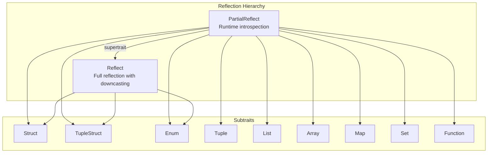
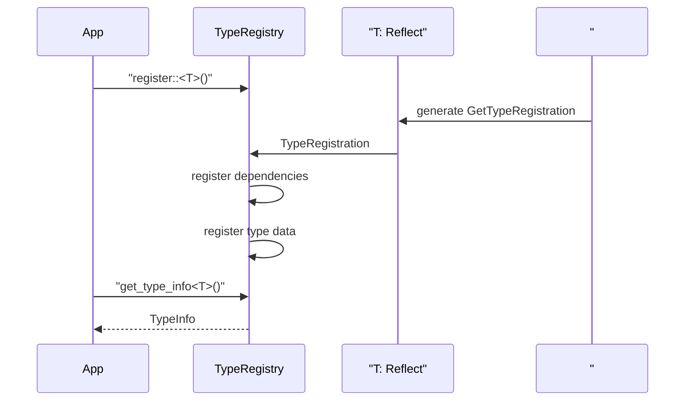
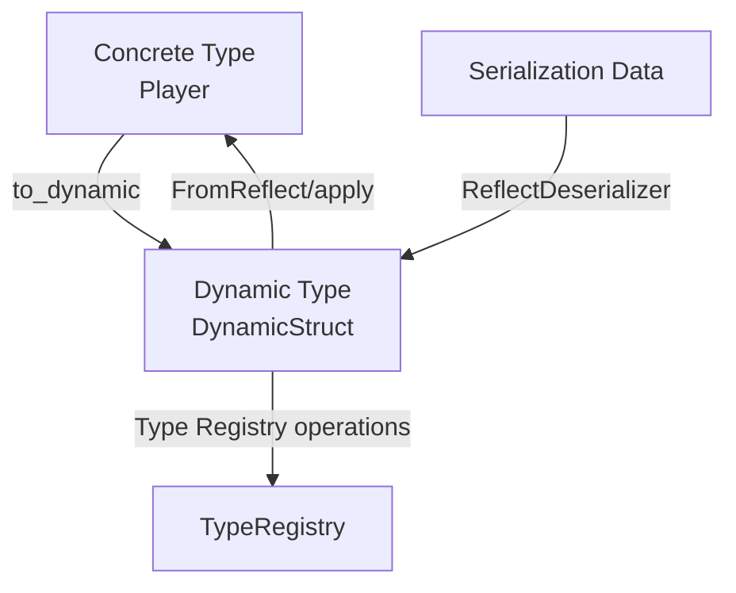
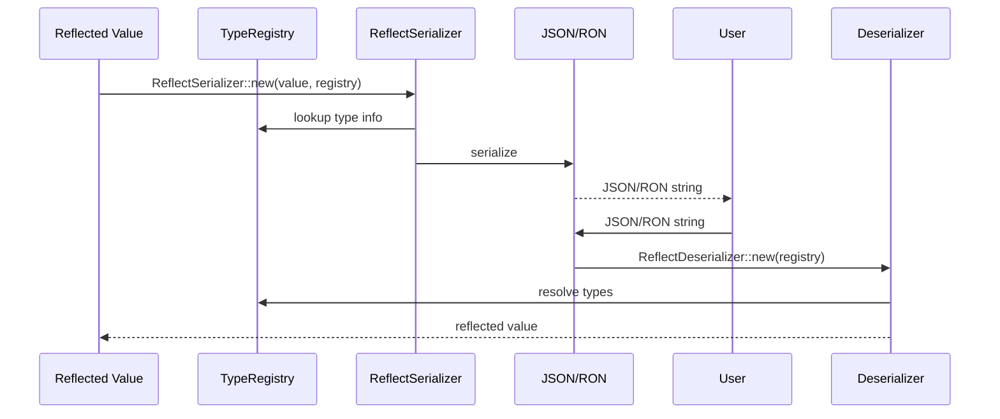

The Reflection System provides Bevy's runtime type inspection and manipulation capabilities, enabling dynamic interaction with Rust types at runtime. This system serves as the foundation for scene serialization, editor tools, plugin systems, and scripting support throughout the engine.

## Core Architecture

Bevy's reflection architecture centers around two primary trait hierarchies that enable type-erased operations while maintaining strong type safety guarantees.



The **PartialReflect** trait enables introspection and dynamic manipulation of values without requiring compile-time type knowledge. It provides methods for accessing type information, cloning, comparison, and applying values. The **Reflect** trait extends PartialReflect with additional guarantees, specifically the ability to downcast trait objects back to their concrete types. This distinction is crucial: PartialReflect works with any reflected value (including dynamic types), while Reflect ensures the value represents a single, known Rust type.

Sources: [lib.rs](crates/bevy_reflect/src/lib.rs#L42-L100), [reflect.rs](crates/bevy_reflect/src/reflect.rs#L43-L85)

## Type Registration

The Type Registry serves as the central repository for all reflected type metadata in your application, enabling runtime type discovery and dynamic operations.



Types registered with the Type Registry provide both metadata and additional capabilities through **type data**. Common type data includes `ReflectDefault` for default values, `ReflectFromReflect` for dynamic construction, and `ReflectSerialize`/`ReflectDeserialize` for serialization capabilities.

Sources: [type_registry.rs](crates/bevy_reflect/src/type_registry.rs#L27-L88), [type_registry.rs](crates/bevy_reflect/src/type_registry.rs#L102-L158)

## Reflection Subtraits

Bevy provides specialized subtraits for different type categories, each exposing type-specific operations through a uniform interface.

| Subtrait | Use Case | Key Operations |
|----------|----------|----------------|
| **Struct** | Named fields with string identifiers | `field(name)`, `field_mut(name)`, `iter_fields()` |
| **TupleStruct** | Positional fields without names | `field(index)`, `field_len()` |
| **Enum** | Enum variants with associated data | `variant_name()`, `variant_index()`, `variant_field()` |
| **Tuple** | Fixed-length sequences | `field(index)`, `field_len()` |
| **List** | Dynamic growable sequences (e.g., `Vec<T>`) | `push()`, `pop()`, `insert()` |
| **Array** | Fixed-size sequences (e.g., `[T; N]`) | `get(index)`, `len()` |
| **Map** | Key-value collections (e.g., `HashMap<K,V>`) | `get(key)`, `insert(key, value)` |
| **Set** | Unique element collections (e.g., `HashSet<T>`) | `contains(value)`, `insert(value)` |

The derive macro automatically implements the appropriate subtrait based on your type definition. For structs, this generates Struct trait implementations; for enums, it generates the Enum trait.

Sources: [structs.rs](crates/bevy_reflect/src/structs.rs#L22-L70), [reflection_types.rs](examples/reflection/reflection_types.rs#L14-L42)

## Dynamic Types

Dynamic types provide runtime-constructed representations of Rust types, essential for deserialization and scenarios where the exact type isn't known at compile time.



Dynamic types include `DynamicStruct`, `DynamicTupleStruct`, `DynamicEnum`, `DynamicList`, `DynamicMap`, `DynamicArray`, and `DynamicTuple`. These types implement PartialReflect but not Reflect, representing the structure of their concrete counterparts without being the actual types. This distinction is vital: dynamic types proxy concrete types for field access and manipulation, while concrete types can be downcast to their original form.

Two primary patterns convert between dynamic and concrete types:
1. **Apply pattern**: Create a concrete instance and apply the dynamic data onto it
2. **FromReflect pattern**: Use the `FromReflect` trait to construct the concrete type directly

Sources: [dynamic_types.rs](examples/reflection/dynamic_types.rs#L40-L130), [from_reflect.rs](crates/bevy_reflect/src/from_reflect.rs#L11-L59)

## Function Reflection

The reflection system extends to function-level introspection, enabling dynamic function calls and scripting capabilities.

```rust
// Convert regular functions to DynamicFunction
let function: DynamicFunction = add.into_function();
let args = ArgList::new().with_owned(2_i32).with_owned(3_i32);
let result = function.call(args)?;
let value: Box<dyn PartialReflect> = result.unwrap_owned();
```

Functions become type-erased values through `IntoFunction` and `IntoFunctionMut` traits, supporting:
- Regular functions and closures
- Overloaded functions with multiple signatures
- Variable argument counts
- Method calls with `self` parameter

This enables powerful patterns like scripting systems, runtime command execution, and serialization of function references.

Sources: [function_reflection.rs](examples/reflection/function_reflection.rs#L16-L85)

## Serialization Integration

Bevy's reflection system provides seamless serialization/deserialization without requiring manual `Serialize`/`Deserialize` implementations.



The system integrates with serde through `ReflectSerializer` and `ReflectDeserializer`, supporting formats like JSON, RON, MessagePack, and any serde-compatible format. This enables cross-platform data interchange, save/load systems, and external tooling integration.

Sources: [serialization.rs](examples/reflection/serialization.rs#L23-L66), [lib.rs](crates/bevy_reflect/src/lib.rs#L1-L30)

## Standard Trait Reflection

Bevy automatically reflects common standard library traits through type data registration, enabling dynamic trait dispatch on reflected values.

| Trait Data | Trait Reflected | Dynamic Operation |
|------------|----------------|-------------------|
| `ReflectDefault` | `Default` | Create default instances dynamically |
| `ReflectAdd`/`ReflectSub`/`ReflectMul`/`ReflectDiv` | Arithmetic ops | Perform operations on reflected values |
| `ReflectPartialEq` | `PartialEq` | Compare reflected values |
| `ReflectHash` | `Hash` | Hash reflected values |
| `ReflectClone` | `Clone` | Clone reflected values efficiently |

Use the `#[reflect(Trait)]` attribute to register these traits when deriving Reflect:

```rust
#[derive(Reflect, Default, PartialEq, Clone)]
#[reflect(Default, PartialEq, Clone)]
struct MyStruct {
    field: u32,
}
```

Sources: [std_traits.rs](crates/bevy_reflect/src/std_traits.rs#L9-L35), [reflection_types.rs](examples/reflection/reflection_types.rs#L46-L52)

## Advanced Patterns

### Field Access and Manipulation

Reflection enables dynamic field access by name, crucial for editor tools and data-driven systems:

```rust
#[derive(Reflect)]
struct Entity {
    name: String,
    health: u32,
}

let mut entity = Entity { name: "Player".to_string(), health: 100 };

// Get field by name
let field = entity.field("health").unwrap();
assert_eq!(field.try_downcast_ref::<u32>(), Some(&100));

// Mutate field dynamically
*entity.get_field_mut::<u32>("health").unwrap() = 150;
```

### Value Application (Patching)

The apply pattern enables partial updates to reflected values, useful for configuration systems and undo/redo implementations:

```rust
let mut original = Player { name: "Alice".to_string(), health: 100 };

let patch = DynamicStruct::default();
patch.insert("health", 150u32);

// Apply patch - only matching fields updated
original.apply(&patch);
assert_eq!(original.health, 150);
assert_eq!(original.name, "Alice");
```

### Trait Reflection

Register custom traits for dynamic dispatch using `#[reflect_trait]`:

```rust
#[reflect_trait]
trait Damageable {
    fn take_damage(&mut self, amount: u32);
}

#[derive(Reflect)]
struct Player {
    health: u32,
}

impl Damageable for Player {
    fn take_damage(&mut self, amount: u32) {
        self.health = self.health.saturating_sub(amount);
    }
}
```

This enables type-erased trait method calls through the type registry.

Sources: [reflection.rs](examples/reflection/reflection.rs#L62-L95), [reflection.rs](examples/reflection/reflection.rs#L96-L121)

## Performance Considerations

Reflection involves runtime type information and dynamic dispatch, which incurs performance overhead. Key considerations:

- **Type information queries**: Cache `TypeInfo` from `TypeRegistry` for repeated access rather than calling `get_represented_type_info()` on instances
- **Downcasting**: Prefer `try_downcast_ref()` over multiple `downcast_ref()` attempts to avoid unnecessary checks
- **Cloning**: Use `#[reflect(Clone)]` to enable efficient cloning instead of the default recursive field cloning
- **Function calls**: Function reflection has higher overhead than direct calls; cache DynamicFunction objects when possible

<CgxTip>
For hot-path systems (like game logic), use reflection sparingly. It's best suited for editor tools, serialization, initialization, and systems where type flexibility outweighs raw performance. Consider compile-time alternatives for performance-critical paths.
</CgxTip>

## Integration with Bevy Systems

The reflection system integrates deeply with Bevy's ECS and plugin architecture:

- **Resource access**: `AppTypeRegistry` resource provides global type registry access
- **Component reflection**: Enable dynamic component spawning and modification
- **Scene serialization**: Scenes leverage reflection for complete entity serialization
- **Editor tools**: Inspector widgets use reflection to display and edit properties

```rust
fn inspect_system(query: Query<&dyn Reflect>) {
    for reflect in query.iter() {
        match reflect.reflect_ref() {
            ReflectRef::Struct(s) => {
                for field in s.iter_fields() {
                    info!("Field: {} = {:?}", s.name_at(i), field);
                }
            }
            // ... handle other kinds
        }
    }
}
```

Sources: [lib.rs](crates/bevy_reflect/src/lib.rs#L150-L200)

## Next Steps

- For understanding how reflection integrates with data persistence, explore [Scene System](21-scene-system)
- To learn about type safety patterns in Bevy, review [Entity Component System (ECS)](9-entity-component-system-ecs)
- For practical examples of reflection in game systems, see [Query Patterns and Filters](25-query-patterns-and-filters)
- To understand plugin architecture leveraging reflection, visit [App and Plugin System](10-app-and-plugin-system)
