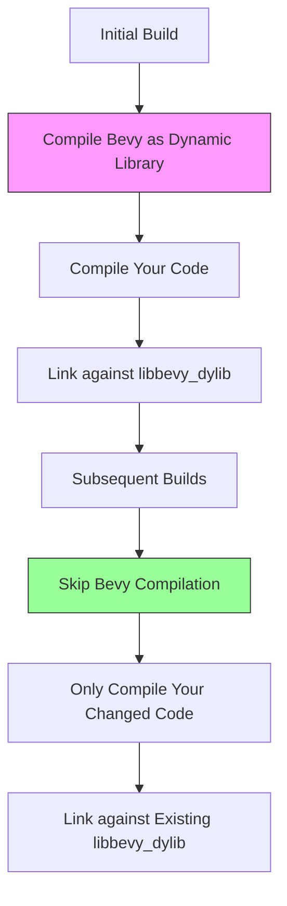
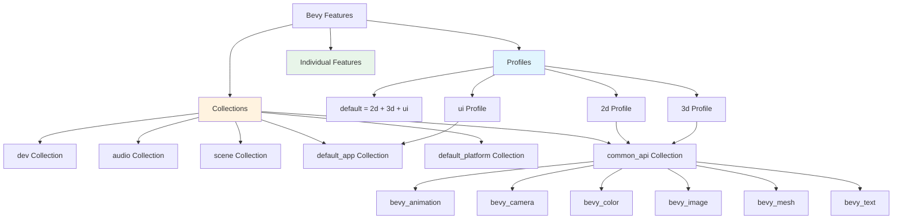

Fast compile times are essential for productive game development. Bevy provides several powerful configuration options to dramatically reduce compilation times during development while maintaining optimal performance in release builds. This guide explores every tool available to you, from dynamic linking to granular feature selection.

## Why Fast Compiles Matter

In game development, you'll compile your code hundreds or thousands of times. A typical Bevy application with default settings can take 2-5 minutes to compile from scratch. With fast compile configuration, you can reduce this to 15-30 seconds for incremental builds—saving hours of development time daily. Bevy's architecture is designed for productivity, but you must explicitly enable these optimizations.

Sources: [README.md](/README.md#L1-L133), [Cargo.toml](/Cargo.toml#L5453)

## Dynamic Linking: The Most Impactful Optimization

Dynamic linking is the single most effective optimization for faster compiles in Bevy. Instead of statically linking all Bevy code into your binary, it compiles Bevy once as a dynamic library (`.dll`, `.so`, or `.dylib` depending on your platform) and reuses it across builds.

### How Dynamic Linking Works



The first build with dynamic linking takes longer because it must create the dynamic library. However, every subsequent incremental build skips recompiling Bevy entirely—only your application code needs recompilation.

### Recommended Usage: Command-Line Flag

The safest and recommended approach is to use the `--features` flag directly in your cargo commands. This keeps your `Cargo.toml` clean and prevents accidentally enabling dynamic linking for release builds.

```bash
# Run your app with dynamic linking enabled
cargo run --features bevy/dynamic_linking

# Build with dynamic linking
cargo build --features bevy/dynamic_linking

# Run an example with dynamic linking
cargo run --example hello_world --features bevy/dynamic_linking
```

Sources: [crates/bevy_dylib/src/lib.rs](/crates/bevy_dylib/src/lib.rs#L1-L63)

### Manual Configuration (Not Recommended)

You can add the feature directly to your `Cargo.toml`, but this requires careful management to avoid shipping your game with dynamic library dependencies.

```toml
[dependencies.bevy]
version = "0.19"
features = ["dynamic_linking"]
```

**Warning:** When you build for release, you must remove this feature. Otherwise, your published game will require `libstd.so` and `libbevy_dylib.so` to be shipped alongside your executable, which complicates distribution.

### Debug-Only Automatic Configuration

For convenience, you can automatically enable dynamic linking only in debug builds using conditional compilation in your code:

```rust
#[allow(unused_imports)]
#[cfg(debug_assertions)]
use bevy_dylib;

fn main() {
    App::new()
        .add_plugins(DefaultPlugins)
        .run();
}
```

Then in your `Cargo.toml`:

```toml
[target.'cfg(debug_assertions)'.dependencies]
bevy_dylib = { path = "../bevy/crates/bevy_dylib", optional = true }

[dependencies]
bevy = { path = "../bevy", features = ["dynamic_linking"] }
```

This approach requires the `dynamic_linking` feature to be available but only links the dynamic library in debug mode.

Sources: [crates/bevy_dylib/src/lib.rs](/crates/bevy_dylib/src/lib.rs#L1-L63)

## Selective Feature Activation: Compile Only What You Need

Bevy is highly modular through its Cargo feature system. The default feature set includes everything Bevy offers—2D, 3D, UI, audio, and more. Most projects don't need all of these features. By disabling default features and selectively enabling only what you need, you can significantly reduce compile times.

### Understanding Bevy's Feature Hierarchy



Profiles are high-level combinations of features designed for common use cases. Collections are mid-level groupings that compose profiles. Individual features provide fine-grained control.

### Profile Selection

Profiles are the easiest way to customize your build without managing every feature manually.

| Profile | Description | Best For | Compile Time Impact |
|---------|-------------|----------|---------------------|
| `default` | Full Bevy experience (2D + 3D + UI) | Learning, general exploration | Slowest |
| `2d` | 2D games with UI, scenes, audio, picking | 2D platformers, RPGs, arcade games | ~40% faster |
| `3d` | 3D games with UI, scenes, audio, picking | First-person shooters, simulations | ~40% faster |
| `ui` | UI-focused apps with scenes, audio, picking | Tools, editors, data visualization | ~50% faster |

**Example 2D Game Configuration:**
```toml
[dependencies.bevy]
version = "0.19"
default-features = false
features = ["2d"]
```

**Example 3D Game Configuration:**
```toml
[dependencies.bevy]
version = "0.19"
default-features = false
features = ["3d"]
```

Sources: [docs/cargo_features.md](/docs/cargo_features.md#L1-L206), [Cargo.toml](/Cargo.toml#L100-L200)

### Collection-Based Custom Builds

When profiles don't fit your needs, build your own feature set using collections. This is ideal for specialized use cases like headless applications, custom renderers, or `no_std` targets.

| Collection | Purpose | Includes |
|------------|---------|----------|
| `default_app` | Core engine without rendering | Asset system, input, state, windowing |
| `default_platform` | Platform support | OS features, windowing backends, multithreading |
| `common_api` | Scene definition features | Animation, camera, mesh, text, shaders |
| `2d_api` | 2D without rendering backend | `common_api` + sprites |
| `3d_api` | 3D without rendering backend | `common_api` + lights, materials, textures |
| `dev` | Development tools | Debugging, asset hot-reloading, dev tools |
| `audio` | Audio functionality | Audio system + vorbis support |
| `default_no_std` | Embedded/no_std targets | Minimal math, color, state |

Sources: [docs/cargo_features.md](/docs/cargo_features.md#L1-L206), [Cargo.toml](/Cargo.toml#L100-L200)

**Example: Headless Server (No Rendering):**
```toml
[dependencies.bevy]
version = "0.19"
default-features = false
features = [
    "default_app",     # Core ECS, assets, scheduling
    "bevy_asset",      # Asset loading
    "bevy_state",      # State management
]
```

**Example: Custom Renderer (No Built-in Rendering):**
```toml
[dependencies.bevy]
version = "0.19"
default-features = false
features = [
    "default_app",
    "default_platform",
    "common_api",      # Access to meshes, cameras, etc.
    # Your custom renderer would provide rendering
]
```

### No_std Configuration

For embedded development or platforms without the standard library, use the `default_no_std` collection. This provides the minimal feature set needed for Bevy to run.

```toml
[dependencies.bevy]
version = "0.19"
default-features = false
features = [
    "default_no_std",  # libm, critical-section, color, state
]

[features]
std = ["bevy/std"]
libm = ["bevy/libm"]
critical-section = ["bevy/critical-section"]
```

<CgxTip>When working with `no_std`, enable clippy lints `std_instead_of_core`, `std_instead_of_alloc`, and `alloc_instead_of_core` to ensure you're using the most portable APIs available.</CgxTip>

Sources: [examples/no_std/library/Cargo.toml](/examples/no_std/library/Cargo.toml#L1-L47), [examples/no_std/README.md](/examples/no_std/README.md#L1-L19)

### Individual Feature Selection

For maximum control, select individual features. This approach requires deep knowledge of Bevy's dependencies but offers the finest optimization.

**Common features to enable:**
- `bevy_asset`: Asset loading and management
- `bevy_scene`: Scene spawning and loading
- `bevy_ecs`: Entity Component System (core)
- `bevy_app`: Application builder and plugin system
- `bevy_state`: State machines

**Common features to disable when not needed:**
- `bevy_render`: Rendering system (large compile impact)
- `bevy_audio`: Audio system
- `bevy_gizmos`: Debug visualization
- `bevy_dev_tools`: Development-only tools

Sources: [docs/cargo_features.md](/docs/cargo_features.md#L1-L206)

## Development-Only Features

Some features are designed specifically for development and should be disabled in production builds to reduce binary size and improve performance.

### The Dev Collection

The `dev` collection adds development-time conveniences at the cost of increased compile time and binary size:

```toml
[dependencies.bevy]
version = "0.19"
# Only enable dev in debug builds
features = []

[dev-dependencies.bevy]
version = "0.19"
features = ["dev"]
```

The `dev` collection includes:
- `debug`: Collects debug information about systems and components
- `bevy_dev_tools`: Development utilities and inspectors
- `file_watcher`: Asset hot-reloading support

**Never enable `dev` for release builds.** It adds functionality that shouldn't be in production games.

Sources: [docs/cargo_features.md](/docs/cargo_features.md#L1-L206)

### Asset Hot-Reloading

During development, enable the `file_watcher` feature to reload assets automatically when they change:

```toml
[dependencies.bevy]
version = "0.19"
features = ["file_watcher"]
```

This adds minimal compile overhead but dramatically improves the development workflow.

Sources: [docs/cargo_features.md](/docs/cargo_features.md#L1-L206)

## Comparison of Optimization Strategies

Different optimization strategies provide different benefits. Choose based on your specific needs.

| Strategy | Compile Time Reduction | Binary Size Impact | Setup Complexity | Release Safe |
|----------|----------------------|-------------------|------------------|--------------|
| **Dynamic Linking** | 70-90% (incremental) | None (release) | Very Low | Yes (with flags) |
| **Profile Selection** | 30-50% | 30-50% smaller | Low | Yes |
| **Custom Features** | 50-80% | 50-80% smaller | Medium | Yes |
| **dev Collection** | +10% slower | +20% larger | Very Low | No |
| **All Combined** | 85-95% | 50-70% smaller | Medium | Yes |

## Practical Configuration Examples

### Example 1: 2D Game with Fast Iteration

```toml
[dependencies.bevy]
version = "0.19"
default-features = false
features = ["2d"]

[dev-dependencies.bevy]
version = "0.19"
default-features = false
features = ["2d", "dev"]
```

Run with dynamic linking:
```bash
cargo run --features bevy/dynamic_linking
```

Sources: [docs/cargo_features.md](/docs/cargo_features.md#L1-L206)

### Example 2: 3D Game

```toml
[dependencies.bevy]
version = "0.19"
default-features = false
features = ["3d"]
```

Sources: [docs/cargo_features.md](/docs/cargo_features.md#L1-L206)

### Example 3: Headless Application (Server/CLI Tool)

```toml
[dependencies.bevy]
version = "0.19"
default-features = false
features = [
    "default_app",      # ECS, scheduling
    "bevy_state",      # State management
    "bevy_log",        # Logging
]
```

Sources: [Cargo.toml](/Cargo.toml#L100-L200)

### Example 4: Embedded/No_std Application

```toml
[dependencies.bevy]
version = "0.19"
default-features = false
features = [
    "default_no_std",
    "libm",            # Math library for no_std
    "critical-section", # Synchronization primitives
]
```

Sources: [examples/no_std/library/Cargo.toml](/examples/no_std/library/Cargo.toml#L1-L47)

## Build Profiles and Cargo Configuration

Beyond Bevy-specific features, you can optimize Rust's build configuration for faster development.

### Cargo Config for Faster Debug Builds

Create or modify `.cargo/config.toml` in your project root:

```toml
[build]
# Use more parallel jobs for compilation
jobs = 4

[profile.dev]
# Optimize dependencies even in debug builds
opt-level = 1
# Split debug information to speed up linking
split-debuginfo = "unpacked"
```

Sources: [README.md](/README.md#L1-L133)

### Using Check Builds

For even faster iteration, use `cargo check` instead of `cargo build`. This compiles without producing binaries:

```bash
cargo check --features bevy/dynamic_linking
```

This is useful for catching compilation errors during active development.

## Measuring Your Results

After applying optimizations, measure their impact:

```bash
# Clean build (measures worst-case)
cargo clean
cargo build --features bevy/dynamic_linking

# Touch a file and rebuild (measures incremental)
touch src/main.rs
cargo build --features bevy/dynamic_linking
```

Use a timing tool to track build times:

```bash
# Linux/Mac
time cargo build --features bevy/dynamic_linking

# Windows (PowerShell)
Measure-Command { cargo build --features bevy/dynamic_linking }
```

## Troubleshooting Common Issues

### Issue: Dynamic linking causes runtime errors on Linux

**Solution:** Install the required development libraries:

```bash
# Ubuntu/Debian
sudo apt install libstdc++-dev

# Fedora/RHEL
sudo dnf install libstdc++-devel
```

### Issue: Cannot find libbevy_dylib.so when running

**Solution:** This occurs when the dynamic library path isn't set. Use the `LD_LIBRARY_PATH` environment variable:

```bash
export LD_LIBRARY_PATH=target/debug/deps:$LD_LIBRARY_PATH
cargo run --features bevy/dynamic_linking
```

Sources: [crates/bevy_dylib/src/lib.rs](/crates/bevy_dylib/src/lib.rs#L1-L63)

### Issue: Cargo features conflict

**Solution:** Some features are mutually exclusive or have dependencies. Use `cargo tree` to visualize dependencies:

```bash
cargo tree --features bevy/dynamic_linking
```

## Next Steps

Now that you have fast compile configuration set up, explore these related topics:

- **[Cargo Features and Custom Builds](5-cargo-features-and-custom-builds)** - Dive deeper into Bevy's feature system and how to create custom feature combinations for specialized use cases.

- **[Entity Component System (ECS)](9-entity-component-system-ecs)** - Learn about Bevy's core architecture that you're now compiling quickly.

- **[App and Plugin System](10-app-and-plugin-system)** - Understand how to structure your Bevy applications for maximum maintainability and performance.

For community support and questions about compile optimization, visit the [Bevy Discord](https://discord.gg/bevy) or [GitHub Discussions](https://github.com/bevyengine/bevy/discussions).
