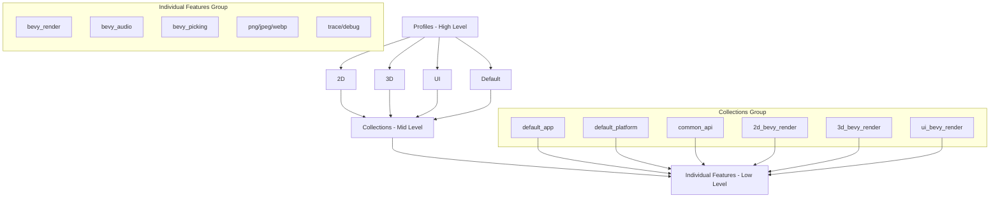
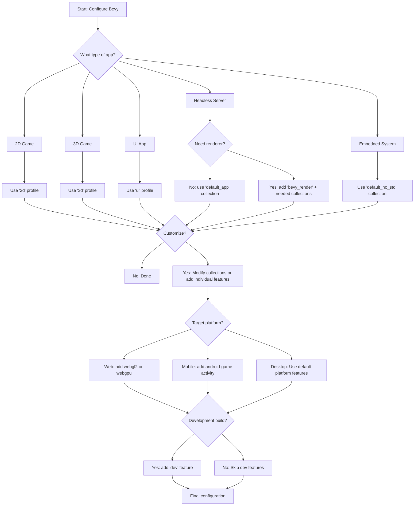

Bevy provides a sophisticated Cargo feature system that enables developers to fine-tune the engine's capabilities, compilation time, and binary size. By understanding the feature hierarchy—profiles, collections, and individual features—you can create optimized builds tailored to your specific project requirements while leveraging only the functionality you actually need.

Sources: [Cargo.toml](Cargo.toml#L130-L329), [docs/cargo_features.md](docs/cargo_features.md#L1-L50)

## Understanding the Feature Hierarchy

The feature system is organized into three levels of abstraction, allowing you to choose the right granularity for your build configuration. At the top level are **profiles**—pre-configured feature sets for common use cases. Below these are **collections**—mid-level groups that compose the profiles. At the bottom are individual features that can be selected independently for maximum control.

This hierarchical design enables progressive optimization: start with a profile that matches your use case, then drill down to collections or individual features only when needed. The structure balances convenience for typical scenarios with flexibility for specialized requirements.



Sources: [docs/cargo_features.md](docs/cargo_features.md#L10-L30), [Cargo.toml](Cargo.toml#L130-L229)

## Using Profiles for Common Scenarios

Profiles provide the quickest path to a working Bevy application by bundling the most commonly used features for specific domains. They're designed to be used with `default-features = false` to exclude unnecessary functionality from the default feature set.

| Profile | Description | Use Case |
|---------|-------------|----------|
| **2d** | Core framework, 2D rendering, UI, scenes, audio, picking | 2D games and applications |
| **3d** | Core framework, 3D rendering, UI, scenes, audio, picking | 3D games and applications |
| **ui** | Core framework, UI rendering, scenes, audio, picking | UI-focused applications |
| **default** | Combination of 2d, 3d, and ui profiles | Full-featured applications |

To use a profile, disable default features and enable only the profile you need. For example, a 2D game can be configured as:

```toml
[dependencies]
bevy = { version = "0.19", default-features = false, features = ["2d"] }
```

This approach significantly reduces compilation time compared to building all default features, as the 2D profile excludes heavy 3D rendering components like PBR materials, glTF loading, and meshlet processing.

Sources: [docs/cargo_features.md](docs/cargo_features.md#L10-L30), [Cargo.toml](Cargo.toml#L136-L229)

## Building Custom Feature Sets with Collections

When profiles don't match your specific needs, collections provide the next level of control. These mid-level feature groups are the building blocks used to compose profiles, enabling you to create custom configurations without managing dozens of individual features.

| Collection | Description | Components |
|------------|-------------|------------|
| **default_app** | Core application foundation | async_executor, bevy_asset, bevy_log, bevy_state, bevy_window, custom_cursor, reflect_auto_register |
| **default_platform** | Platform support features | std, android-game-activity, bevy_gilrs, bevy_winit, default_font, multi_threaded, webgl2, x11, wayland |
| **common_api** | Shared scene definition features | bevy_animation, bevy_camera, bevy_color, bevy_gizmos, bevy_image, bevy_mesh, bevy_shader, bevy_material, bevy_text, hdr, png |
| **2d_bevy_render** | Built-in 2D renderer | 2d_api, bevy_render, bevy_core_pipeline, bevy_post_process, bevy_sprite_render, bevy_gizmos_render |
| **3d_bevy_render** | Built-in 3D renderer | 3d_api, bevy_render, bevy_core_pipeline, bevy_gizmos_render, bevy_anti_alias, bevy_gltf, bevy_pbr, bevy_post_process, gltf_animation |
| **ui_bevy_render** | Built-in UI renderer | ui_api, bevy_render, bevy_core_pipeline, bevy_ui_render |
| **dev** | Development tools | debug, bevy_dev_tools, file_watcher |
| **audio** | Audio functionality | bevy_audio, vorbis |
| **scene** | Scene composition | bevy_scene |
| **picking** | Interactive picking | bevy_picking, mesh_picking, sprite_picking, ui_picking |

Collections are particularly valuable for specialized scenarios:
- **Headless applications**: Use `default_app` without any renderer for server-side logic or command-line tools
- **Custom renderers**: Use `2d_api`, `3d_api`, or `ui_api` to build your own rendering pipeline
- **Embedded platforms**: Use `default_no_std` collection for constrained environments

Sources: [docs/cargo_features.md](docs/cargo_features.md#L32-L60), [Cargo.toml](Cargo.toml#L195-L329)

## Platform-Specific Builds

Bevy's feature system enables optimization for different target platforms, from web browsers to embedded systems. Each platform has specific feature requirements and optimization strategies.

### WebAssembly Builds

For web deployment, you'll typically use either WebGL2 or WebGPU. Bevy provides the `webgl2` feature for broader compatibility and the `webgpu` feature for modern browsers with hardware acceleration.

```toml
[dependencies]
bevy = { version = "0.19", default-features = false, features = ["3d", "webgl2"] }
```

Building for Wasm requires setting up the target and using wasm-bindgen:

```sh
rustup target add wasm32-unknown-unknown
cargo install wasm-bindgen-cli

cargo build --release --example your_app --target wasm32-unknown-unknown
wasm-bindgen --out-name wasm_example --out-dir examples/wasm/target --target web target/wasm32-unknown-unknown/release/examples/your_app.wasm
```

<CgxTip>Use the `build-wasm-example` tool for streamlined builds: `cargo run -p build-wasm-example -- --api webgl2 your_example` for WebGL2 or `--api webgpu` for WebGPU builds with automated optimization.</CgxTip>

Web builds benefit from additional size optimization:

| Profile | With wasm-opt | Without wasm-opt |
|---------|---------------|------------------|
| Default | 8.5M | 13.0M |
| opt-level = "z" + lto = "fat" + codegen-units = 1 | 4.8M | 8.5M |

Sources: [examples/README.md](examples/README.md#L801-L880), [Cargo.toml](Cargo.toml#L598-L629)

### no_std Embedded Platforms

For embedded systems without the standard library, Bevy provides the `default_no_std` collection:

```toml
[dependencies]
bevy = { version = "0.19", default-features = false, features = ["default_no_std"] }
```

The `no_std` collection includes:
- **libm**: Pure Rust math library替代 std math
- **critical-section**: Synchronization primitives for all platforms
- **bevy_color**: Shared color types
- **bevy_state**: State management

When building libraries that support both `std` and `no_std`, expose feature flags to let consumers choose:

```toml
[features]
default = ["std"]
std = ["bevy/std"]
libm = ["bevy/libm"]
critical-section = ["bevy/critical-section"]
```

Sources: [examples/no_std/README.md](examples/no_std/README.md#L1-L19), [Cargo.toml](Cargo.toml#L230-L232)

### Mobile Platforms

Mobile development requires platform-specific features. For Android, choose between GameActivity (modern default) or NativeActivity (legacy):

```toml
[dependencies]
bevy = { version = "0.19", default-features = false, features = [
  "3d",
  "android-game-activity",  # Modern default
  "android_shared_stdcxx"   # Shared stdlib for cxx
]}
```

iOS builds don't require special cargo features but need proper Xcode project configuration.

Sources: [examples/mobile/README.md](examples/mobile/android_basic/readme.md), [Cargo.toml](Cargo.toml#L247-L248)

## Advanced Feature Configuration

For fine-grained control, you can select individual features. This is useful when you need specific functionality without pulling in entire collections or profiles.

### Performance-Related Features

| Feature | Purpose | Trade-off |
|---------|---------|-----------|
| **dynamic_linking** | Improves iterative compile times | Requires runtime dependencies |
| **multi_threaded** | Enables parallel task execution | Adds complexity; disable for single-threaded constraints |
| **async_io** | Alternative async executor for async-io applications | Incompatible with default futures-lite executor |

### Development and Debugging Features

| Feature | Purpose | Recommendation |
|---------|---------|----------------|
| **dev** | Asset hot-reloading, debugging tools | Enable only during development |
| **debug** | Collect debug information about systems and components | Useful for diagnostics |
| **trace** | Tracing support | Combine with trace_chrome or trace_tracy for profiling |
| **bevy_debug_stepping** | Step-based debugging of systems | Advanced debugging workflow |

### Graphics and Rendering Features

| Feature Category | Options | Use Cases |
|------------------|---------|-----------|
| **Image formats** | png, jpeg, webp, gif, bmp, tiff, exr, dds, ktx2 | Choose formats your project uses |
| **Audio formats** | vorbis, flac, mp3, wav | Match your audio asset formats |
| **Shaders** | shader_format_glsl, shader_format_spirv, shader_format_wesl | Match your shader pipeline |
| **PBR enhancements** | pbr_anisotropy_texture, pbr_transmission_textures, pbr_light_textures | Enable based on material needs |

<CgxTip>When building production releases, audit enabled features and remove development-only features like `dev`, `debug`, and `file_watcher` to reduce binary size and improve security.</CgxTip>

Sources: [docs/cargo_features.md](docs/cargo_features.md#L62-L206), [Cargo.toml](Cargo.toml#L530-L729)

## Feature Selection Decision Flow



Sources: [Cargo.toml](Cargo.toml#L136-L329), [docs/cargo_features.md](docs/cargo_features.md#L10-L206)

## Best Practices and Common Patterns

### Minimal Starter Configuration

For a simple 2D game with minimal dependencies:

```toml
[dependencies]
bevy = { version = "0.19", default-features = false, features = ["2d"] }
```

### Development vs Production Builds

Use feature-based profiles in your `Cargo.toml` to manage different environments:

```toml
[dependencies]
bevy = { version = "0.19", default-features = false, features = [
  "3d",
  "bevy_dev_tools",  # Only in dev
] }

# Then use `cargo build --no-default-features --features "3d"` for production
```

Alternatively, use Cargo profiles:

```toml
[profile.dev.package.bevy]
opt-level = 3  # Speed up debug builds

[profile.release]
opt-level = 3
lto = true
codegen-units = 1
```

### Headless Server Example

For a game server that doesn't need rendering:

```toml
[dependencies]
bevy = { version = "0.19", default-features = false, features = [
  "default_app",
  "bevy_state",
  "serialize",  # For serialization
] }
```

### Mobile-Specific Configuration

For Android games:

```toml
[target.'cfg(target_os = "android")'.dependencies]
bevy = { version = "0.19", default-features = false, features = [
  "3d",
  "android-game-activity",
  "android_shared_stdcxx",
] }
```

Sources: [Cargo.toml](Cargo.toml#L136-L729), [examples/README.md](examples/README.md#L668-L735)

## Next Steps

Now that you understand how to configure Bevy's feature system for optimal builds, you're ready to explore deeper architectural concepts:

- **[Entity Component System (ECS)](9-entity-component-system-ecs)** - Learn how Bevy's core architecture powers your applications
- **[App and Plugin System](10-app-and-plugin-system)** - Understand how to structure your application and add functionality
- **[Fast Compile Configuration](4-fast-compile-configuration)** - Dive deeper into compilation optimization strategies

For practical examples of feature configurations, explore the [examples](https://github.com/bevyengine/bevy/tree/main/examples) directory, which demonstrates various feature combinations for different scenarios including 2D, 3D, UI, mobile, and WebAssembly targets.
