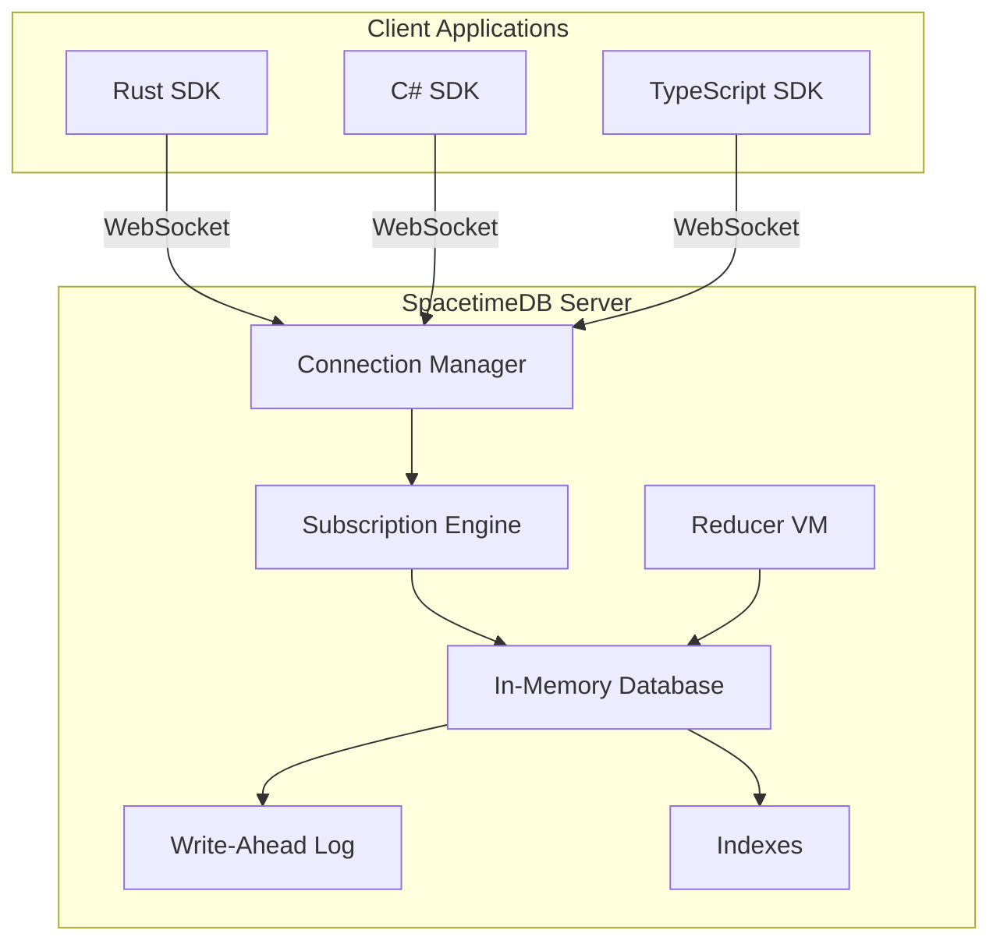
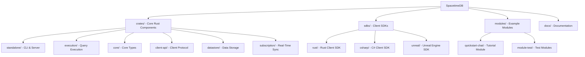
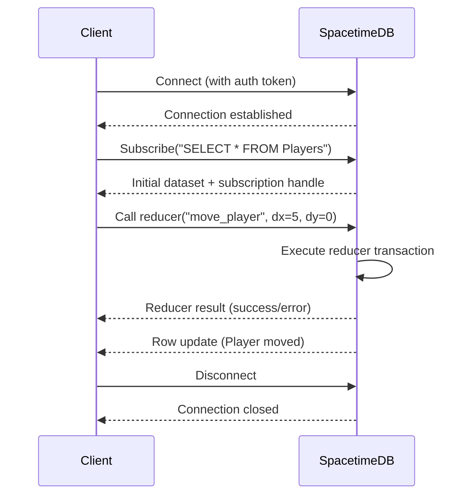

Welcome to SpacetimeDB, a revolutionary database-server hybrid designed for building real-time multiplayer applications. This page provides a comprehensive introduction to what SpacetimeDB is, how it works, and how you can get started building applications that operate "at the speed of light."

## What is SpacetimeDB?

SpacetimeDB is fundamentally a **relational database system that lets you upload your application logic directly into the database** through specialized stored procedures called "modules." Unlike traditional architectures where you deploy a web or game server between your clients and database, SpacetimeDB eliminates this middle layer—your clients connect directly to the database and execute your application logic inside the database itself.


This unified approach means you can write your entire application in a single language (Rust or C#) and deploy it as a single binary. No more microservices, containers, Kubernetes, Docker, VMs, or DevOps complexity. SpacetimeDB handles the infrastructure so you can focus on building your application.

The concept shares similarities with smart contracts, but SpacetimeDB is specifically a database system with no blockchain dependency—and it's orders of magnitude faster than any smart contract system. This performance is demonstrated by real-world production use: the entire backend of BitCraft Online (a full MMORPG) runs as a single SpacetimeDB module with no additional servers or services.

Sources: [README.md](/README.md#L45-L58)

## Core Architecture

The SpacetimeDB architecture fundamentally reimagines how applications are built by merging database and server responsibilities into a single, cohesive system.

### Database-Server Hybrid Paradigm

In traditional application architectures, you typically have three separate layers: client applications, backend servers (business logic), and databases (data persistence). SpacetimeDB collapses this into two layers: client applications and an intelligent database that also executes business logic.

This architectural shift is enabled by several key design principles:

- **In-Memory Processing**: SpacetimeDB holds all application state in memory for maximum speed, persisting data via a write-ahead-log (WAL) for recovery and durability
- **Direct Client Connection**: Clients establish WebSocket connections directly to the database, eliminating the latency of intermediate server hops
- **Transactional Logic**: All server-side operations (called "reducers") run within database transactions, ensuring ACID guarantees and data consistency
- **Real-Time Subscriptions**: Clients subscribe to SQL queries and receive automatic updates when matching data changes

### System Components

The SpacetimeDB system consists of several interconnected components working together to provide the unified database-server experience:



Sources: [README.md](/README.md#L71-L81), [execution/lib.rs](/crates/execution/src/lib.rs#L1-L30)

### Project Structure

Understanding the SpacetimeDB codebase structure helps you navigate and contribute to the project:



Sources: [Repository Structure](/crates/standalone/src/main.rs#L1-L40)

## Key Features

SpacetimeDB provides a comprehensive set of features designed to simplify real-time application development while maintaining maximum performance.

### Modules and Reducers

**Modules** are compiled application logic uploaded to SpacetimeDB. They define database schema (tables, columns, indexes) and implement business logic through **reducers**—transactional functions that process client requests and modify database state.

Reducers are the heart of server-side logic in SpacetimeDB:

- **Transactional**: Each reducer executes within a database transaction, ensuring all-or-nothing semantics
- **Type-Safe**: Strongly typed interfaces catch errors at compile time rather than runtime
- **Performance**: Compiled to native code (WebAssembly) for maximum execution speed
- **Authorization**: Built-in identity and authentication for permission checks

Sources: [modules/index.md](/docs/docs/modules/index.md#L1-L22)

### Real-Time Subscriptions

The subscription API enables clients to maintain a local, synchronized view of database state. Clients register SQL queries (subscriptions) and receive automatic updates when data changes match those queries.

Key subscription capabilities include:

- **Selective Replication**: Only receive data relevant to your application
- **Automatic Updates**: Server pushes changes as they occur, no polling required
- **Event Callbacks**: Respond to connection changes, subscription updates, and row modifications
- **Efficient Bandwidth**: Delta updates minimize network usage

Sources: [subscriptions/index.md](/docs/docs/subscriptions/index.md#L1-L30)

### In-Memory Architecture

SpacetimeDB prioritizes latency over batch processing, optimizing for real-time applications like games, chat systems, and collaboration tools:

- **Memory-Resident Data**: All application state lives in memory for microsecond-level access
- **WAL Persistence**: Write-ahead log provides durability and crash recovery
- **Index Optimization**: Multiple index types support various query patterns
- **Memory Management**: Efficient garbage collection and memory pooling prevent leaks

Sources: [README.md](/README.md#L71-L81)

## Language Support

SpacetimeDB provides comprehensive SDKs for multiple programming languages, supporting diverse development teams and use cases.

### Server-Side (Modules)

| Language | Performance | Use Case | Quickstart |
|----------|-------------|----------|------------|
| **Rust** | Fastest (2x faster than C#) | High-performance applications, games, low-latency systems | [Rust Module Guide](/docs/modules/rust/quickstart) |
| **C#** | Fast | Unity developers, .NET teams familiar with the ecosystem | [C# Module Guide](/docs/modules/c-sharp/quickstart) |

<CgxTip>
Rust modules are recommended for maximum performance, particularly for latency-sensitive applications. C# modules offer excellent productivity for teams already using .NET or Unity.</CgxTip>

Sources: [modules/index.md](/docs/docs/modules/index.md#L1-L22), [README.md](/README.md#L280-L288)

### Client-Side (SDKs)

| Language | Platform | Use Case | Quickstart |
|----------|----------|----------|------------|
| **Rust** | Cross-platform desktop/server | Command-line tools, native apps, high-performance clients | [Rust SDK Guide](/docs/sdks/rust/quickstart) |
| **C#** | .NET, Unity | Unity games, Windows applications, .NET services | [C# SDK Guide](/docs/sdks/c-sharp/quickstart) |
| **TypeScript** | Web browsers, Node.js | Web applications, React/Vue/Angular frontends | [TypeScript SDK Guide](/docs/sdks/typescript/quickstart) |

**Additional Framework Support**:
- **Unity Integration**: Full Unity game engine integration with C# SDK
- **Unreal Engine**: Dedicated C++ bindings for Unreal development
- **React Integration**: TypeScript SDK optimized for React applications

Sources: [sdks/index.md](/docs/docs/sdks/index.md#L1-L30)

## Development Workflow

Getting started with SpacetimeDB follows a simple four-step process that takes you from installation to a running application.

### Step 1: Install the CLI Tool

The SpacetimeDB CLI (`spacetime`) is your gateway to developing, deploying, and managing SpacetimeDB databases. Installation is straightforward across all major platforms:

**macOS/Linux:**
```bash
curl -sSf https://install.spacetimedb.com | sh
```

**Windows (PowerShell):**
```powershell
iwr https://windows.spacetimedb.com -useb | iex
```

**Docker (Alternative):**
```bash
docker run --rm --pull always -p 3000:3000 clockworklabs/spacetime start
```

The CLI provides commands for starting servers, logging in, publishing modules, and managing your SpacetimeDB environment.

Sources: [README.md](/README.md#L100-L116), [getting-started.md](/docs/docs/getting-started.md#L1-L12)

### Step 2: Start a SpacetimeDB Server

For local development, you run SpacetimeDB in standalone mode. This gives you a full database server running on your machine:

```bash
spacetime start
```

By default, the server listens on port 3000. You can customize this with the `--listen-addr` parameter. For production deployments, you can self-host with systemd and Nginx or use SpacetimeDB's managed cloud service.

<CgxTip>
Standalone mode runs in the foreground and doesn't support SSL out of the box, making it perfect for local development. For production, use the cloud service or configure Nginx reverse proxy with HTTPS.</CgxTip>

Sources: [getting-started.md](/docs/docs/getting-started.md#L1-L12), [spacetimedb-standalone.md](/docs/docs/deploying/spacetimedb-standalone.md#L1-L80)

### Step 3: Write and Upload a Module

Modules define your database schema and implement your server-side logic. A minimal module typically includes:

1. **Table definitions**: Specify your data model with Rust structs marked with table attributes
2. **Reducers**: Implement transactional functions that process client requests
3. **Lifecycle hooks**: Optional initialization and authentication logic

Here's a simplified example structure:

```rust
// Define a table
#[spacetimedb(table)]
pub struct Player {
    #[spacetimedb(builtin_identity)]
    identity: Identity,
    name: String,
    x: i32,
    y: i32,
}

// Define a reducer
#[spacetimedb(reducer)]
pub fn move_player(ctx: &ReducerContext, dx: i32, dy: i32) -> Result<()> {
    // Get the player by identity
    let player = ctx.db.player().identity()?.find(&ctx.identity)?;
    
    // Update position (all within a transaction)
    ctx.db.player().update(Player {
        x: player.x + dx,
        y: player.y + dy,
        ..player
    });
    
    Ok(())
}
```

After writing your module, upload it with:

```bash
spacetime publish
```

Sources: [modules/index.md](/docs/docs/modules/index.md#L1-L22), [README.md](/README.md#L45-L58)

### Step 4: Connect with a Client SDK

Finally, connect your client application to the SpacetimeDB server using one of the available SDKs. The typical client workflow includes:

1. **Connect to the database**: Establish a WebSocket connection with authentication
2. **Subscribe to data**: Register SQL queries to receive relevant data updates
3. **Call reducers**: Invoke server-side functions with parameters
4. **Handle events**: React to data changes, connection state, and reducer results

**Example conceptual flow:**



Sources: [sdks/index.md](/docs/docs/sdks/index.md#L1-L74)

## Use Cases and Applications

SpacetimeDB's unique architecture makes it ideal for applications requiring real-time data synchronization and low-latency state management.

### Real-Time Multiplayer Games

**Why it works**: Game state changes frequently and must be synchronized across all players with minimal delay. SpacetimeDB's in-memory architecture and subscription system ensure millisecond-level consistency.

**Examples**:
- BitCraft Online: Full MMORPG backend running on SpacetimeDB
- Real-time strategy games
- First-person shooters with position updates
- Mobile multiplayer games

### Collaboration Tools

**Why it works**: Multiple users need to see changes made by others instantly. SpacetimeDB's subscription API provides efficient real-time synchronization without complex signaling servers.

**Examples**:
- Real-time document editing
- Whiteboard applications
- Project management dashboards
- Code collaboration platforms

### Chat and Messaging

**Why it works**: Chat applications require message broadcasting, presence tracking, and history management—all handled naturally by SpacetimeDB's reducer and subscription system.

**Examples**:
- Group chat rooms
- Direct messaging apps
- Customer support chat
- Community forums with real-time features

### Live Data Applications

**Why it works**: Applications displaying live metrics, monitoring data, or financial information benefit from automatic updates and efficient data delivery.

**Examples**:
- Real-time analytics dashboards
- IoT device monitoring
- Financial trading platforms
- Live sports statistics

## Performance Characteristics

SpacetimeDB is optimized for specific performance scenarios that differentiate it from traditional database systems.

### Latency vs. Throughput

| Metric | SpacetimeDB | Traditional Databases |
|--------|-------------|----------------------|
| **Latency** | Microsecond-level (in-memory) | Millisecond-level (disk I/O) |
| **Throughput** | Optimized for concurrent operations | Optimized for batch processing |
| **Consistency** | Strong consistency (ACID) | Varies by configuration |
| **Scaling** | Vertical scaling (single instance) | Horizontal scaling (clusters) |

### Performance Optimizations

Several design choices contribute to SpacetimeDB's performance:

1. **In-Memory Tables**: No disk I/O for reads—data lives entirely in memory
2. **Native Execution**: Modules compiled to WebAssembly for near-native speed
3. **Efficient Serialization**: BSATN binary format minimizes data transfer overhead
4. **Selective Updates**: Only send changed data, not full state refreshes
5. **Index Acceleration**: Multiple index types for optimal query performance

Sources: [README.md](/README.md#L71-L81)

## Deployment Options

SpacetimeDB offers flexible deployment options to match your development and production needs.

### Local Development (Standalone Mode)

Perfect for getting started and testing. Run a full SpacetimeDB server on your local machine:

```bash
spacetime start
```

**Features**:
- Full database functionality
- Module development and testing
- Client application integration
- No external dependencies

**Limitations**:
- No SSL/TLS support
- Runs in foreground
- Single machine only

### Self-Hosted (Production)

Deploy SpacetimeDB on your own infrastructure for complete control:

- **Systemd service**: Automated startup and monitoring
- **Nginx reverse proxy**: HTTPS termination and load balancing
- **Ubuntu/Linux**: Official deployment guides available
- **Custom configuration**: Tune for your workload and hardware

Sources: [spacetimedb-standalone.md](/docs/docs/deploying/spacetimedb-standalone.md#L1-L80)

### Managed Cloud Service

Let SpacetimeDB handle infrastructure management:

- **Zero configuration**: Server automatically scales and maintains
- **High availability**: Built-in redundancy and failover
- **Global edge**: Deployments close to your users
- **Automatic updates**: Always running the latest stable version

## Community and Resources

SpacetimeDB has a growing community of developers building real-time applications. Connect with us and access additional resources.

### Official Documentation

- [Comprehensive Guides](https://spacetimedb.com/docs): In-depth tutorials, API references, and best practices
- [CLI Reference](/docs/docs/cli-reference.md): Complete command-line interface documentation
- [SQL Reference](/docs/docs/sql/index.md): Query language and subscription syntax

### Community Channels

- [Discord](https://discord.gg/spacetimedb): Real-time chat with developers and community
- [GitHub Issues](https://github.com/clockworklabs/SpacetimeDB/issues): Bug reports and feature requests
- [Twitter/X](https://twitter.com/spacetime_db): Updates and announcements
- [Stack Overflow](https://stackoverflow.com/questions/tagged/spacetimedb): Q&A and troubleshooting

### Example Projects

The SpacetimeDB repository includes numerous example modules and client applications to help you learn:

- **quickstart-chat**: Simple chat server demonstrating core concepts
- **module-test**: Comprehensive testing utilities and patterns
- **SDK examples**: Client applications in all supported languages
- **Unity integration**: Full game example with SpacetimeDB backend

Sources: [README.md](/README.md#L35-L50), [modules/quickstart-chat/README.md](/modules/quickstart-chat/README.md#L1-L25)

## What's Next?

Now that you understand SpacetimeDB's architecture and capabilities, you're ready to start building. Here's the recommended learning path:

### For Beginners

1. **[Quick Start](2-quick-start)**: Follow the hands-on tutorial to build your first SpacetimeDB application
2. **[Installing SpacetimeDB CLI](3-installing-spacetimedb-cli)**: Set up your development environment
3. **[Rust Module Development Guide](15-rust-module-development-guide)**: Learn to write server-side logic
4. **[Rust Client SDK Reference](24-rust-client-sdk-reference)**: Connect your client applications

### For Experienced Developers

1. **[Understanding the Database-Server Hybrid Architecture](9-understanding-the-database-server-hybrid-architecture)**: Deep dive into technical design
2. **[Tables and Data Modeling](10-tables-and-data-modeling)**: Design efficient database schemas
3. **[Understanding Subscriptions](20-understanding-subscriptions)**: Master real-time data synchronization
4. **[Performance and Scalability](29-in-memory-architecture-and-wal)**: Optimize for production workloads

### For Game Developers

1. **[Unity Integration Guide](27-unity-integration-guide)**: Build games with SpacetimeDB backend
2. **[Identity and Authentication](18-identity-and-authentication)**: Implement player management
3. **[Scheduled Reducers and Timers](17-scheduled-reducers-and-timers)**: Create game events and ticks
4. **[Conflict Resolution and Consistency](23-conflict-resolution-and-consistency)**: Handle multiplayer state conflicts

The journey to building real-time applications at the speed of light begins with [Quick Start](2-quick-start). See you there!
