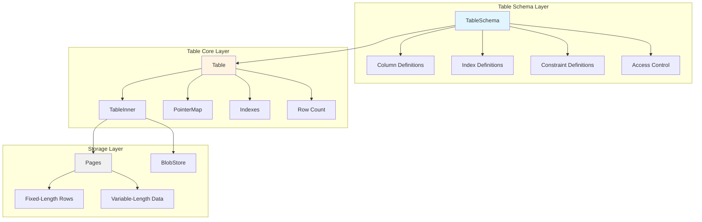
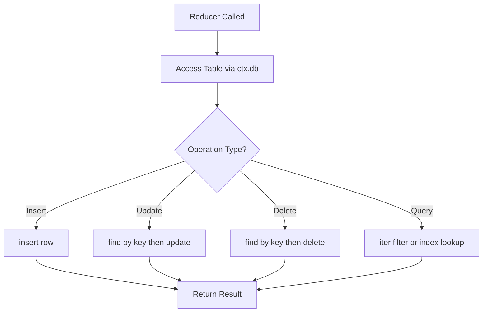

Tables form the foundation of data persistence in SpacetimeDB, combining traditional database table semantics with real-time synchronization capabilities. Unlike conventional databases where tables exist purely in the database layer, SpacetimeDB tables are defined directly in your module code using Rust structs with macro annotations, creating a seamless integration between your application logic and data model.

## Table Definition and Structure

SpacetimeDB tables are declared using the `#[spacetimedb::table]` attribute macro applied to Rust structs. This approach provides compile-time type safety while automatically generating the necessary database infrastructure. Each field in the struct becomes a column in the table, with the field's Rust type determining the column's data type.

```rust
#[spacetimedb::table(name = person, public)]
pub struct Person {
    #[primary_key]
    id: u32,
    name: String,
    age: u8,
}
```

The table macro accepts several parameters that control the table's behavior and visibility:

| Parameter | Type | Description | Default |
|-----------|------|-------------|---------|
| `name` | Identifier | The table name in the database | Required |
| `public` | Flag | Makes table accessible to all clients | Private by default |
| `private` | Flag | Explicitly marks table as private | Private by default |

Sources: [lib.rs](modules/quickstart-chat/src/lib.rs#L1-L95), [table.rs](crates/bindings-macro/src/table.rs#L1-L200)

### Table Access Control

SpacetimeDB distinguishes between public and private tables, which determines how clients can interact with your data:

**Public tables** are accessible to all connected clients. Any client can subscribe to and query these tables, making them ideal for shared application state like game entities, leaderboards, or chat messages.

**Private tables** are only accessible to the module's reducers. Clients cannot directly subscribe to or query private tables, though they can interact with the data indirectly through reducer calls. This makes private tables suitable for sensitive data like user credentials, administrative settings, or internal application state.

Sources: [lib.rs](modules/module-test/src/lib.rs#L89-L107)

## Table Architecture

The SpacetimeDB table system is built on a sophisticated in-memory architecture designed for high-performance concurrent access. Understanding this architecture helps you make informed decisions about data modeling and query optimization.



The `Table` struct serves as the primary abstraction, managing the complete lifecycle of table data including storage, indexing, and access control. It maintains a row layout specification that determines how data is organized in memory, enabling efficient serialization and deserialization operations.

Sources: [table.rs](crates/table/src/table.rs#L52-L120)

### Memory Layout and Row Storage

SpacetimeDB uses a sophisticated memory layout that optimizes for both speed and memory efficiency:

- **Page-based storage**: Data is organized into 64KB pages, with each page containing both fixed-length row data and variable-length components
- **Row pointers**: Rows are referenced using `RowPointer` structures that combine page index, offset, and transaction state information
- **Blob storage**: Large or complex values can be stored separately in a `BlobStore` with reference counting and deduplication

The system employs a `RowTypeLayout` that determines the exact memory layout for each row type, enabling zero-copy operations in many cases. When the row layout has a static size and structure, the system can generate highly optimized code paths for serialization.

Sources: [table.rs](crates/table/src/table.rs#L150-L250), [indexes.rs](crates/table/src/indexes.rs#L1-L100)

<CgxTip>For optimal performance, prefer fixed-size types (like `u32`, `i64`) over variable-size types (like `String`) in frequently queried columns. Fixed-size columns enable more efficient indexing and comparison operations.</CgxTip>

## Primary Keys and Identity

Every table should have a primary key to uniquely identify rows. Primary keys are marked using the `#[primary_key]` attribute on the appropriate field:

```rust
#[spacetimedb::table(name = user, public)]
pub struct User {
    #[primary_key]
    identity: Identity,
    name: Option<String>,
    online: bool,
}
```

Primary keys serve several critical functions:

1. **Uniqueness enforcement**: The system automatically ensures no duplicate primary key values exist
2. **Efficient lookups**: Primary key columns are automatically indexed for fast data retrieval
3. **Update operations**: Primary keys enable targeted updates without scanning the entire table
4. **Identity tracking**: The system uses primary keys to track row identity across updates

The primary key can be any type that supports hashing and comparison operations. Common choices include `u32`, `u64`, `Identity`, or composite keys.

Sources: [lib.rs](modules/quickstart-chat/src/lib.rs#L3-L12), [def.rs](crates/schema/src/def.rs#L360-L440)

### Auto-Incrementing Fields

For tables requiring automatically generated unique identifiers, SpacetimeDB provides the `#[auto_inc]` attribute. This attribute can be applied to primary key fields or any column requiring automatic incrementing:

```rust
#[spacetimedb::table(name = person, public)]
pub struct Person {
    #[primary_key]
    #[auto_inc]
    id: u32,
    name: String,
    age: u8,
}
```

Auto-increment fields maintain a sequence that increments with each insertion. If you insert a row with `id: 0`, the system automatically assigns the next available sequence value. This mechanism is thread-safe and transactionally consistent.

Sources: [lib.rs](modules/module-test/src/lib.rs#L18-L24)

## Indexes and Query Performance

Indexes are crucial for query performance, especially as your tables grow in size. SpacetimeDB supports two primary index types:

### B-Tree Indexes

B-tree indexes provide ordered data storage and support efficient range queries. They're ideal for columns used in comparisons (`<`, `>`, `<=`, `>=`) and range-based filters:

```rust
#[spacetimedb::table(name = points, private, 
    index(name = multi_column_index, btree(columns = [x, y])))]
pub struct Point {
    x: i64,
    y: i64,
}
```

Multi-column B-tree indexes support composite queries where multiple columns are filtered together. The index maintains rows sorted by the specified column order, enabling efficient queries that use prefix subsets of the indexed columns.

Sources: [lib.rs](modules/module-test/src/lib.rs#L100-L107)

### Direct Indexes

Direct indexes provide constant-time lookups for equality-based queries on individual columns. They're optimized for point queries and are typically used for columns frequently used in exact-match conditions:

```rust
#[spacetimedb::table(name = test_a, index(name = foo, direct(column = x)))]
pub struct TestA {
    pub x: u32,
    pub y: u32,
    pub z: String,
}
```

Direct indexes are more memory-efficient than B-tree indexes for simple equality lookups but don't support range queries.

### Index Selection Guidelines

| Query Pattern | Recommended Index | Example |
|---------------|------------------|---------|
| Exact match on single column | Direct index | `find(identity)` |
| Range comparisons | B-tree index | `filter(age..)` |
| Multi-column filtering | B-tree with composite columns | `find_by_x_and_y(x, y)` |
| Unique constraint enforcement | Unique index (auto-created for primary key) | Primary key |

Sources: [table.rs](crates/bindings-macro/src/table.rs#L1-L200), [lib.rs](modules/module-test/src/lib.rs#L26-L30)

## Constraints and Data Integrity

SpacetimeDB provides several mechanisms to enforce data integrity at the database level:

### Unique Constraints

The `#[unique]` attribute ensures that values in the marked column are unique across all rows. The system automatically creates an index to enforce this constraint efficiently:

```rust
#[spacetimedb::table(name = player, public)]
pub struct Player {
    #[primary_key]
    identity: Identity,
    #[auto_inc]
    #[unique]
    player_id: u64,
    #[unique]
    name: String,
}
```

Attempting to insert a duplicate value for a unique column results in a `UniqueConstraintViolation` error, which your reducer can handle appropriately.

Sources: [lib.rs](modules/module-test/src/lib.rs#L120-L133)

### Multiple Constraints

Tables can have multiple unique constraints, allowing you to enforce uniqueness across different business rules:

```rust
#[spacetimedb::table(name = pk_multi_identity)]
struct PkMultiIdentity {
    #[primary_key]
    id: u32,
    #[unique]
    #[auto_inc]
    other: u32,
}
```

Each unique constraint creates its own index, so be mindful of the performance and memory implications when adding many constraints to large tables.

Sources: [lib.rs](modules/module-test/src/lib.rs#L113-L120)

## Working with Tables in Reducers

Tables are accessed through the `ctx.db` object in your reducers, with each table having a dedicated accessor method:



### Inserting Data

New rows are inserted using the `insert` method, which returns the inserted row or an error if constraints are violated:

```rust
#[spacetimedb::reducer]
pub fn add(ctx: &ReducerContext, name: String, age: u8) {
    ctx.db.person().insert(Person { 
        id: 0, // Auto-increment if marked
        name, 
        age 
    });
}
```

For tables with auto-increment primary keys, passing `0` for the key field tells the system to generate the next available value automatically.

Sources: [lib.rs](modules/module-test/src/lib.rs#L225-L230)

### Updating Data

Updates involve finding the existing row and then applying changes. The pattern typically looks like:

```rust
#[spacetimedb::reducer]
pub fn set_name(ctx: &ReducerContext, name: String) -> Result<(), String> {
    let name = validate_name(name)?;
    if let Some(user) = ctx.db.user().identity().find(ctx.sender) {
        log::info!("User {} sets name to {name}", ctx.sender);
        ctx.db.user().identity().update(User {
            name: Some(name),
            ..user
        });
        Ok(())
    } else {
        Err("Cannot set name for unknown user".to_string())
    }
}
```

The `..user` syntax copies all other fields from the existing row, ensuring you only modify the intended columns.

Sources: [lib.rs](modules/quickstart-chat/src/lib.rs#L19-L32)

### Querying Data

SpacetimeDB provides multiple ways to query data, depending on your use case:

**Iteration**: Scan all rows in a table
```rust
for person in ctx.db.person().iter() {
    log::info!("Hello, {}!", person.name);
}
```

**Index lookups**: Efficiently find rows by indexed columns
```rust
if let Some(user) = ctx.db.user().identity().find(ctx.sender) {
    // Found user by identity index
}
```

**Range queries**: Filter by ranges using B-tree indexes
```rust
for person in ctx.db.person().age().filter(age..) {
    log::info!("{} has age {} >= {}", person.name, person.age, age);
}
```

Sources: [lib.rs](modules/module-test/src/lib.rs#L232-L250)

<CgxTip>Always use indexed queries when possible. Table scans (`iter()`) are acceptable for small tables but become prohibitively expensive as your data grows. Use `filter()` with indexed columns to leverage B-tree indexes.</CgxTip>

## Advanced Table Features

### Scheduled Tables

SpacetimeDB supports scheduled tables that automatically trigger reducers at specified intervals. This enables periodic tasks like cleanup operations, leaderboards updates, or game tick processing:

```rust
#[spacetimedb::table(name = repeating_test_arg, scheduled(repeating_test))]
pub struct RepeatingTestArg {
    #[primary_key]
    #[auto_inc]
    scheduled_id: u64,
    scheduled_at: spacetimedb::ScheduleAt,
    prev_time: Timestamp,
}

#[spacetimedb::reducer]
pub fn repeating_test(ctx: &ReducerContext, arg: RepeatingTestArg) {
    let delta_time = ctx.timestamp
        .duration_since(arg.prev_time)
        .expect("arg.prev_time is later than ctx.timestamp... huh?");
    log::trace!("Timestamp: {:?}, Delta time: {:?}", ctx.timestamp, delta_time);
}
```

The `scheduled_at` field controls when the reducer is invoked, with the table automatically managing the scheduling state.

Sources: [lib.rs](modules/module-test/src/lib.rs#L115-L123)

### Default Values

Columns can have default values specified using the `#[default]` attribute:

```rust
const DEFAULT_TEST_C: TestC = TestC::Foo;

#[table(name = test_d, public)]
pub struct TestD {
    #[default(Some(DEFAULT_TEST_C))]
    test_c: Option<TestC>,
}
```

Default values are automatically applied when inserting rows without specifying those columns.

Sources: [lib.rs](modules/module-test/src/lib.rs#L41-L47)

## Type System and Constraints

SpacetimeDB's type system ensures type safety across the entire application stack, from database to client:

### Supported Types

| Type Category | Example Types | Notes |
|---------------|---------------|-------|
| Primitives | `u8`, `u32`, `u64`, `i32`, `i64`, `bool` | Fixed-size, efficient |
| Strings | `String`, `Box<str>` | Variable-size, use carefully in indexes |
| Optionals | `Option<T>` | Supports nullable columns |
| Timestamps | `Timestamp` | Built-in time representation |
| Identities | `Identity` | Unique client identifier |
| Custom types | User-defined enums and structs | Must derive `SpacetimeType` |

Sources: [lib.rs](crates/bindings/src/lib.rs#L1-L100)

### Custom Type Definitions

You can define custom types for use in your tables:

```rust
#[derive(SpacetimeType)]
pub struct Baz {
    pub field: String,
}

#[derive(SpacetimeType)]
pub enum Foobar {
    Baz(Baz),
    Bar,
    Har(u32),
}

#[table(name = test_f, public)]
pub struct TestFoobar {
    pub field: Foobar,
}
```

These custom types are automatically serialized and can be used throughout your application, including in table schemas and reducer arguments.

Sources: [lib.rs](modules/module-test/src/lib.rs#L50-L68)

## Schema Management and Evolution

SpacetimeDB supports schema evolution through automatic migrations. When you modify table definitions, the system analyzes the changes and applies compatible migrations automatically.

### Compatible Schema Changes

- Adding new columns with default values
- Removing columns (data is lost)
- Changing column order (transparent to queries)
- Adding new indexes

### Incompatible Changes

The system prevents changes that would corrupt existing data:

- Changing column types in incompatible ways
- Removing columns referenced by indexes
- Modifying primary key structure

The `auto_migrate` module handles the complex logic of determining whether schema changes are safe to apply, providing clear error messages when incompatible changes are detected.

Sources: [table.rs](crates/table/src/table.rs#L300-L500), [def.rs](crates/schema/src/def.rs#L1-L150)

## Best Practices

### Table Design Principles

1. **Normalize thoughtfully**: While normalization reduces redundancy, denormalization can improve read performance in some cases
2. **Choose appropriate primary keys**: Use natural keys when they're stable and unique; otherwise use auto-increment integers
3. **Index strategically**: Add indexes for columns used in WHERE clauses, join conditions, and ORDER BY clauses
4. **Consider query patterns**: Design your schema around your actual access patterns rather than theoretical purity

### Performance Considerations

- **Index overhead**: Each index consumes memory and slows down inserts/updates
- **Row size**: Smaller rows enable more rows per page, improving cache efficiency
- **Variable-length data**: Large strings or blobs impact performance; consider storing references in BlobStore
- **Batch operations**: When possible, use batch inserts rather than individual operations

### Security Considerations

- **Sensitive data**: Use private tables for data that shouldn't be directly exposed to clients
- **Access patterns**: Design your public/private table boundaries around your security requirements
- **Validation**: Implement business logic validation in reducers rather than relying solely on database constraints

## Integration with Real-Time Features

Tables in SpacetimeDB are inherently real-time. When data in a table changes, all subscribed clients automatically receive updates. This means your data model directly determines what clients can observe in real-time.

For example, in the quickstart-chat module:

```rust
#[spacetimedb::table(name = message, public)]
pub struct Message {
    sender: Identity,
    sent: Timestamp,
    text: String,
}

#[spacetimedb::reducer]
pub fn send_message(ctx: &ReducerContext, text: String) -> Result<(), String> {
    let text = validate_message(text)?;
    log::info!("User {}: {text}", ctx.sender);
    ctx.db.message().insert(Message {
        sender: ctx.sender,
        text,
        sent: ctx.timestamp,
    });
    Ok(())
}
```

When `send_message` inserts a new row into the `Message` table, all subscribed clients automatically receive the new message, enabling real-time chat functionality without additional infrastructure.

Sources: [lib.rs](modules/quickstart-chat/src/lib.rs#L14-L44)

## Next Steps

Now that you understand tables and data modeling, explore how to implement server-side logic with [Reducers: Server-Side Logic](11-reducers-server-side-logic). For deeper understanding of SpacetimeDB's hybrid architecture, read [Understanding the Database-Server Hybrid Architecture](9-understanding-the-database-server-hybrid-architecture). If you're ready to start building, the [Rust Module Development Guide](15-rust-module-development-guide) provides comprehensive instructions for creating production-ready modules.
