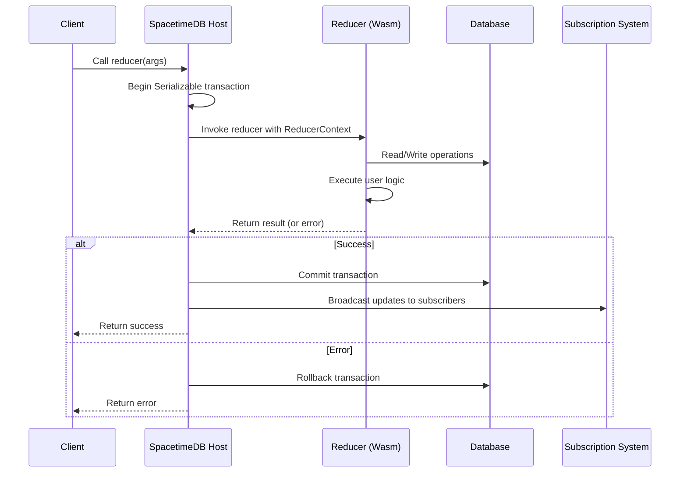

Reducers are the heart of SpacetimeDB's server-side programming model. They are functions that execute on the database server in response to client requests or system events, providing a secure, transactional environment for your application logic. Think of reducers as stored procedures with superpowers—they run in a WebAssembly sandbox, have direct access to your database tables, and automatically synchronize all changes to connected clients.

## What Makes Reducers Special

Reducers fundamentally change how you think about application logic. Instead of sending data to clients and having them decide what happens, you define the rules on the server and let clients simply trigger those rules. This architecture provides several critical advantages: **client applications cannot bypass business logic**, all data modifications happen within ACID transactions, and clients automatically receive real-time updates when reducers modify data.

When a reducer executes, it receives a `ReducerContext` that provides three essential capabilities: the caller's identity (`ctx.sender`), the current timestamp (`ctx.timestamp`), and direct database access (`ctx.db`). This context is your window into the system state and your tool for modifying it.

Sources: [lib.rs](modules/quickstart-chat/src/lib.rs#L32-L44), [module_host_actor.rs](crates/core/src/host/wasm_common/module_host_actor.rs#L268-L330)

## Defining Your First Reducer

Creating a reducer is straightforward. Use the `#[spacetimedb::reducer]` attribute macro on any function, and SpacetimeDB will expose it as a callable endpoint. Reducers accept parameters that clients can pass, receive the `ReducerContext`, and optionally return results.

```rust
#[spacetimedb::reducer]
pub fn set_name(ctx: &ReducerContext, name: String) -> Result<(), String> {
    let name = validate_name(name)?;
    if let Some(user) = ctx.db.user().identity().find(ctx.sender) {
        ctx.db.user().identity().update(User {
            name: Some(name),
            ..user
        });
        Ok(())
    } else {
        Err("Cannot set name for unknown user".to_string())
    }
}
```

The `validate_name` helper demonstrates a critical pattern: **validation logic lives inside reducers**, preventing invalid data from ever reaching your tables. Notice how `ctx.db.user()` gives you typed access to your User table—you're not writing raw SQL strings, but working with Rust types that SpacetimeDB generates from your schema.

Sources: [lib.rs](modules/quickstart-chat/src/lib.rs#L25-L44), [reducer.rs](crates/bindings-macro/src/reducer.rs#L19-L150)

## Database Operations in Reducers

Inside a reducer, `ctx.db` provides a fluent API for data manipulation. Each table generates methods for primary key lookups, index queries, inserts, updates, and deletes. These operations are automatically transactional—if your reducer returns an error or panics, all changes roll back.

The table handle methods follow predictable patterns. For a table with primary key columns, you get `.primary_key_column().find()` for lookups. For indexed columns, you get `.index_name().filter()`, `.index_name().delete()`, and similar operations. The type system ensures you can only query on columns that actually have indexes.

```rust
#[spacetimedb::reducer]
pub fn list_over_age(ctx: &ReducerContext, age: u8) {
    for person in ctx.db.person().age().filter(age..) {
        log::info!("{} has age {} >= {}", person.name, person.age, age);
    }
}
```

This example shows indexing at work. The `age` column has a btree index, so `.filter(age..)` efficiently finds all matching rows without scanning the entire table. SpacetimeDB generates these APIs from your `#[spacetimedb::table]` definitions, including all index configurations.

Sources: [lib.rs](modules/module-test/src/lib.rs#L219-L225), [lib.rs](modules/module-test/src/lib.rs#L16-L19)

## Reducer Execution Lifecycle

Understanding how reducers execute is crucial for writing correct and efficient code. When a client calls a reducer, SpacetimeDB initiates a carefully orchestrated process that ensures data consistency and provides observability.

The execution flow begins with transaction creation. SpacetimeDB starts a new transaction with `IsolationLevel::Serializable`, which guarantees that the reducer sees a consistent snapshot of the database and that concurrent reducer calls don't interfere with each other. The reducer then executes within this transaction context, with all database operations accumulating in the transaction's write set.


Here's the complete lifecycle in detail:



After the reducer completes, SpacetimeDB evaluates the outcome. If the reducer returns `Ok(())` or doesn't return a result type, the transaction commits and the subscription system broadcasts all changes to connected clients. If the reducer returns an `Err`, the transaction rolls back and no changes persist. This atomic behavior means **you can validate complex business rules inside reducers and reject invalid operations** with confidence.

Sources: [module_host_actor.rs](crates/core/src/host/wasm_common/module_host_actor.rs#L320-L398)

## Lifecycle Reducers

Beyond client-initiated calls, SpacetimeDB provides special lifecycle reducers that respond to system events. These are defined with additional attributes on the `#[spacetimedb::reducer]` macro and give you hooks into module and client lifecycle events.

### Initialization Reducer

The `init` reducer runs once when your module is first published or when the module restarts. It's perfect for seeding initial data or setting up scheduled tasks:

```rust
#[spacetimedb::reducer(init)]
pub fn init(_ctx: &ReducerContext) {
    // Seed initial data, setup scheduled tasks, etc.
}
```

Sources: [lib.rs](modules/quickstart-chat/src/lib.rs#L68-L69), [lib.rs](modules/module-test/src/lib.rs#L124-L130)

### Client Connection Reducers

The `client_connected` and `client_disconnected` reducers run whenever a client establishes or closes a connection. These receive the `ReducerContext` with `ctx.sender` set to the connecting client's identity, enabling you to track online status:

```rust
#[spacetimedb::reducer(client_connected)]
pub fn identity_connected(ctx: &ReducerContext) {
    if let Some(user) = ctx.db.user().identity().find(ctx.sender) {
        // Returning user: mark online
        ctx.db.user().identity().update(User { online: true, ..user });
    } else {
        // New user: create record
        ctx.db.user().insert(User {
            name: None,
            identity: ctx.sender,
            online: true,
        });
    }
}

#[spacetimedb::reducer(client_disconnected)]
pub fn identity_disconnected(ctx: &ReducerContext) {
    if let Some(user) = ctx.db.user().identity().find(ctx.sender) {
        ctx.db.user().identity().update(User { online: false, ..user });
    }
}
```

This pattern demonstrates **state tracking without explicit client code**—clients automatically get marked online/offline, and all connected clients see these changes in real-time through the subscription system.

Sources: [lib.rs](modules/quickstart-chat/src/lib.rs#L71-L94), [reducer.rs](crates/bindings-macro/src/reducer.rs#L22-L38)

## Error Handling and Validation

Reducers support Rust's standard error handling through `Result` types. When a reducer returns `Err<E>`, SpacetimeDB automatically rolls back the transaction and propagates the error to the client. This makes **validation failures and business rule violations** explicit and safe.

The validation helper pattern shown earlier (`validate_name`, `validate_message`) keeps your reducer logic clean while ensuring data integrity. You can validate complex rules, check permissions, or perform any necessary checks before modifying data:

```rust
fn validate_message(text: String) -> Result<String, String> {
    if text.is_empty() {
        Err("Messages must not be empty".to_string())
    } else {
        Ok(text)
    }
}

#[spacetimedb::reducer]
pub fn send_message(ctx: &ReducerContext, text: String) -> Result<(), String> {
    let text = validate_message(text)?;
    log::info!("User {}: {text}", ctx.sender);
    ctx.db.message().insert(Message {
        sender: ctx.sender,
        text,
        sent: ctx.timestamp,
    });
    Ok(())
}
```

If validation fails, the error propagates back to the client and no message is inserted. This transactional guarantee means you never have partial state—either the entire reducer operation succeeds, or nothing changes.

Sources: [lib.rs](modules/quickstart-chat/src/lib.rs#L46-L67), [module_host_actor.rs](crates/core/src/host/wasm_common/module_host_actor.rs#L385-L398)

## Energy Budgeting and Resource Management

SpacetimeDB includes a sophisticated energy budgeting system to prevent runaway reducers from consuming excessive resources. Each reducer call receives an energy budget based on a fingerprint that includes the module hash, caller identity, and reducer name. The runtime tracks energy consumption during execution and terminates reducers that exceed their budget.

This system protects your database from accidental or malicious infinite loops, excessive memory allocations, or computationally expensive operations. When a reducer runs out of energy, the transaction rolls back and the event status becomes `EventStatus::OutOfEnergy`.

<CgxTip>Monitor reducer energy usage in production. The energy system provides metrics that can reveal inefficient queries or logic before they impact performance. The system logs when reducers approach or exceed their energy budget.</CgxTip>

Sources: [module_host_actor.rs](crates/core/src/host/wasm_common/module_host_actor.rs#L330-L350), [module_host_actor.rs](crates/core/src/host/wasm_common/module_host_actor.rs#L380-L398)

## Best Practices for Reducer Design

Writing effective reducers requires thinking about the unique characteristics of the SpacetimeDB environment. Here are proven patterns for building robust, efficient reducer logic.

Keep reducers focused and single-purpose. Each reducer should do one thing well—create a record, update state, or perform a specific action. This makes your code easier to test, understand, and maintain. Large, monolithic reducers become difficult to debug and can consume more energy.

Leverage the type system for data integrity. Use Rust's type system to encode invariants that the database constraints alone cannot express. Custom types, enums, and validation helpers create a safety net that catches errors at compile time rather than at runtime.

Use indexes strategically. All queries that filter, update, or delete based on criteria should use indexed columns. Scanning tables without indexes is exponentially slower and wastes energy budget. When defining tables, think about the access patterns your reducers will need and add appropriate indexes.

Log strategically for observability. The `log::info!`, `log::warn!`, and `log::error!` macros integrate with SpacetimeDB's logging system, providing visibility into reducer execution. Log important state transitions, validation failures, and business rule violations—but avoid excessive logging that wastes energy.

<CgxTip>Design your reducer API around the client's intent, not your database schema. Clients should call reducers like "place_order" or "send_message" rather than "insert_order_row" or "add_message_to_table". This abstraction layer lets you evolve your database schema without breaking client code.</CgxTip>

Sources: [lib.rs](modules/quickstart-chat/src/lib.rs#L1-L95), [lib.rs](modules/module-test/src/lib.rs#L200-L399)

## Putting It All Together

Reducers are the bridge between client applications and your server-side logic. By defining clear, typed interfaces that execute in a secure, transactional environment, you can build applications that are both flexible and reliable. The combination of WebAssembly sandboxing, automatic transaction management, and real-time synchronization creates a powerful foundation for multiplayer games, collaborative tools, and any application where state consistency matters.

The reducer model enforces a critical architectural principle: **all state mutations happen through explicitly defined server-side functions**. This eliminates an entire class of bugs where clients might accidentally or maliciously corrupt application state. It also makes your application more testable—reducers are pure functions that you can unit test independently of the full system.

As you build with SpacetimeDB, you'll discover that reducers become the natural place to encode your business rules, validation logic, and state transitions. They're not just database access functions—they're the essence of your application's behavior, running exactly where you want them, with the guarantees you need.

Sources: [module_host_actor.rs](crates/core/src/host/wasm_common/module_host_actor.rs#L1-L200), [syscall.rs](crates/core/src/host/v8/syscall.rs#L1-L200)

## Next Steps

Now that you understand reducers, explore the broader SpacetimeDB ecosystem:

- **[Lifecycle Reducers](12-lifecycle-reducers)** - Dive deeper into initialization, connection, and scheduled reducers
- **[Identity and Authentication](18-identity-and-authentication)** - Learn how to secure your reducers and validate callers
- **[Public vs Private Tables](13-public-vs-private-tables)** - Understand how table access control interacts with reducer security
- **[Rust Module Development Guide](15-rust-module-development-guide)** - Complete guide to building production-ready modules
