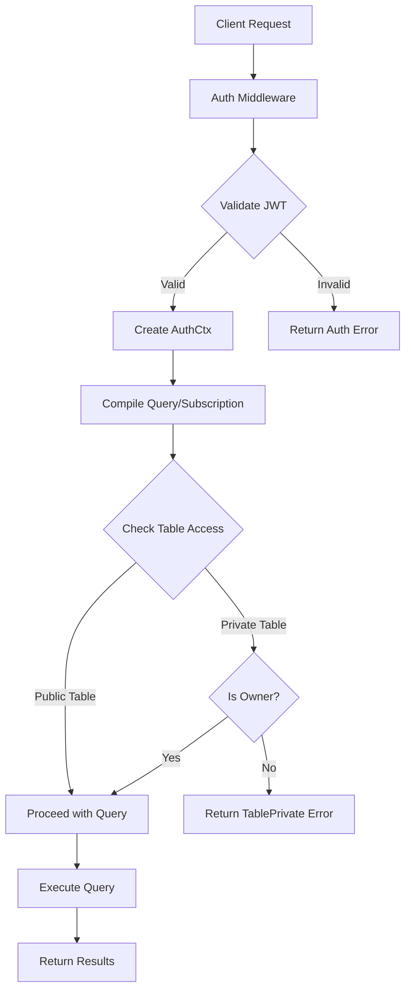

Public and private tables form the foundation of SpacetimeDB's access control model, determining who can read, write, and subscribe to your data. This distinction enables you to build applications with both collaborative shared state and secure user-specific data.

## Understanding Table Access Levels

In SpacetimeDB, each table is configured with an access level that governs how different identities can interact with it. The access control is enforced at the database level through the `StAccess` type, which determines whether a table is publicly accessible or restricted to specific authorization contexts.

The authentication and authorization framework uses `AuthCtx` to track the identity making requests, while `StTableType` defines the table's access characteristics. When queries are compiled through `compile_sql_stmt` and `compile_subscription`, the authorization context is evaluated to ensure proper access rights.

Sources: [relation.rs](crates/schema/src/relation.rs#L7-L12), [lib.rs](crates/query/src/lib.rs#L18-L50)

### Private Tables

Private tables are accessible only to the database owner. This makes them ideal for storing sensitive data, administrative records, or internal application state that should never be exposed to other users.

When attempting to access a private table without proper authorization, the system returns an `AuthError::TablePrivate` error. The same protection extends to related database objects:

- **Private indexes** trigger `AuthError::IndexPrivate` when accessed without authorization
- **Private sequences** trigger `AuthError::SequencePrivate` for sequence operations
- **Private constraints** trigger `AuthError::ConstraintPrivate` when validation occurs

The `OwnerRequired` error variant specifically indicates that only the database owner can perform the requested operation, providing clear feedback for unauthorized access attempts.

Sources: [error.rs](crates/schema/src/def/error.rs#L49-L60)

### Public Tables

Public tables can be accessed by any authenticated client with proper credentials. This enables collaborative features where multiple users can interact with shared state, such as leaderboards, chat rooms, or multiplayer game worlds.

Through the `ConnectionAuthCtx` structure, the system validates JWT-based authentication using `SpacetimeIdentityClaims`, which include the identity, subject, issuer, and audience information. This authentication context flows through the query compilation and execution pipeline, ensuring that while public tables are accessible, all access is still authenticated and tracked.

Sources: [identity.rs](crates/auth/src/identity.rs#L11-L44), [auth.rs](crates/client-api/src/auth.rs#L59-L88)

## Access Control Architecture

The access control model integrates with SpacetimeDB's query compilation and execution pipeline. When a client attempts to interact with a table:

The query compilation process in `compile_subscription` and `compile_sql_stmt` accepts an `AuthCtx` parameter, which is used to enforce access control rules before any data is retrieved or modified. Row-Level Security (RLS) views can further refine access within public tables by applying additional filters based on the requesting identity.

Sources: [lib.rs](crates/query/src/lib.rs#L18-L50), [database.rs](crates/client-api/src/routes/database.rs#L41-L95)

## Data Access Patterns

### Reading Data

Both public and private tables support read operations through SQL queries and subscriptions. The key difference lies in authorization requirements:

- **Private tables**: Only accessible by database owner identity
- **Public tables**: Accessible by any authenticated identity

Subscription queries for real-time updates undergo the same access control checks, ensuring that clients only receive updates for tables they're authorized to access. The `resolve_views_for_sql` and `resolve_views_for_sub` functions apply any necessary RLS filters to further restrict visible data.

Sources: [lib.rs](crates/query/src/lib.rs#L18-L50)

### Writing Data

Data modification operations (INSERT, UPDATE, DELETE) also respect table access levels. Private tables can only be modified by the owner, while public tables allow modifications from authenticated clients.

The execution pipeline uses `MutDatastore` and `MutExecutor` interfaces for write operations, which incorporate the same authorization checks present in read operations. This ensures consistency across all data access patterns.

Sources: [lib.rs](crates/execution/src/lib.rs#L90-L120), [dml.rs](crates/execution/src/dml.rs)

## Table Access Comparison

| Feature | Private Tables | Public Tables |
|---------|---------------|---------------|
| **Access Scope** | Database owner only | All authenticated identities |
| **Read Operations** | Owner only | Any authenticated client |
| **Write Operations** | Owner only | Any authenticated client |
| **Subscription Support** | Owner only | Any authenticated client |
| **Use Cases** | Admin data, sensitive user data, internal state | Leaderboards, chat, multiplayer state, public content |
| **Error on Unauthorized Access** | `AuthError::TablePrivate` | N/A (auth required but not ownership) |

Sources: [error.rs](crates/schema/src/def/error.rs#L49-L60)

## Authentication Context

The `ConnectionAuthCtx` structure carries the authentication information throughout request processing:

- **claims**: `SpacetimeIdentityClaims` containing identity, subject, issuer, and audience
- **jwt_payload**: String representation of the JWT payload for logging and debugging

This context is created from `SpacetimeAuth` during request processing and converted from `IncomingClaims` after JWT validation. The identity is computed from the issuer and subject claims using `Identity::from_claims`, ensuring consistent identity across the system.

Sources: [identity.rs](crates/auth/src/identity.rs#L8-L44), [auth.rs](crates/client-api/src/auth.rs#L59-L88)

## Best Practices

### When to Use Private Tables

- Store sensitive user information that should never be exposed
- Maintain administrative or configuration data
- Implement internal application state that powers business logic
- Cache computed results that are only relevant to the owner

### When to Use Public Tables

- Enable collaborative features where multiple users interact with shared data
- Implement leaderboards, rankings, or public statistics
- Create multiplayer game worlds with shared state
- Build real-time collaboration tools like shared documents or whiteboards

<CgxTip>Always start with private tables for new data structures. Make tables public only when there's a clear requirement for shared access. This security-by-default approach prevents accidental data exposure.</CgxTip>

<CgxTip>Combine public tables with Row-Level Security (RLS) filters for fine-grained access control. This allows you to share a table publicly while ensuring each user can only access their own data within it.</CgxTip>

## Error Handling

When access control violations occur, the system provides specific error messages to help diagnose issues:

- **`TablePrivate`**: Attempted to access a private table without owner privileges
- **`OwnerRequired`**: Operation requires database owner authorization
- **`IndexPrivate`**, **`SequencePrivate`**, **`ConstraintPrivate`**: Access to private database objects

These errors are returned through the standard error handling pipeline, allowing clients to respond appropriately—for example, by prompting for re-authentication or informing users that certain operations are not available to them.

Sources: [error.rs](crates/schema/src/def/error.rs#L49-L60)

## Integration with Lifecycle

Public and private table configurations interact with lifecycle reducers like `client_connected` and `client_disconnected`. These reducers can inspect the authentication context to make decisions about which tables to initialize, subscribe to, or clean up based on the connecting identity's access rights.

The lifecycle system in `database.rs` demonstrates how `call_identity_connected` validates connections and can reject them based on reducer logic, providing an additional layer of access control that works alongside table-level permissions.

Sources: [database.rs](crates/client-api/src/routes/database.rs#L65-L95)

## Next Steps

To deepen your understanding of SpacetimeDB's data model and access patterns:

- [Tables and Data Modeling](10-tables-and-data-modeling) - Learn about table structure, types, and relationships
- [Identity and Authentication](18-identity-and-authentication) - Explore the authentication system in detail
- [Understanding Subscriptions](20-understanding-subscriptions) - Discover how real-time data subscriptions work
- [Row-Level Security](docs/rls/index.md) - Understand advanced access control with RLS filters

By combining public and private tables with Row-Level Security and proper authentication strategies, you can build secure, collaborative applications that protect sensitive data while enabling rich shared experiences.
