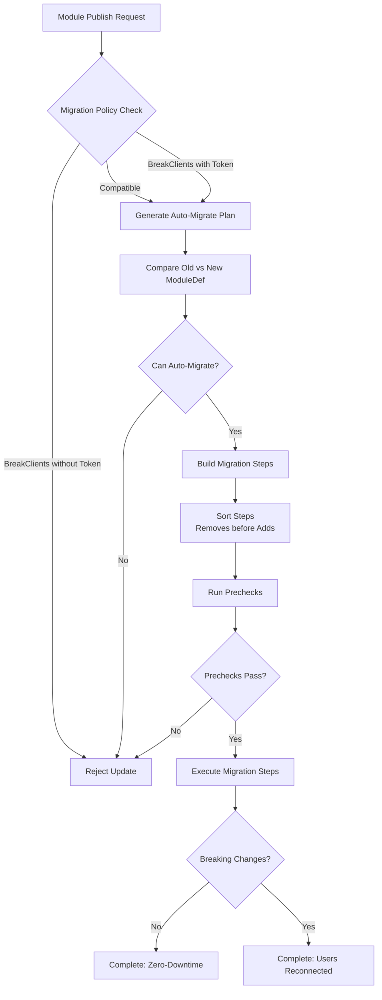

SpacetimeDB provides a sophisticated automatic schema migration system that intelligently handles many common schema evolution scenarios while protecting you from dangerous operations. The system analyzes the differences between your old and new module definitions, generates a migration plan, and enforces safety policies to ensure data integrity.

## Migration Architecture Overview

The automatic migration system operates through a carefully designed pipeline that validates, plans, and executes schema changes while maintaining database consistency.



The migration engine, implemented in `crates/schema/src/auto_migrate.rs` [auto_migrate.rs](crates/schema/src/auto_migrate.rs#L1-L1584), performs a comprehensive diff analysis between the old and new module definitions, categorizing each change into executable steps or manual migration requirements.

## Migration Policies

SpacetimeDB enforces explicit migration policies to prevent accidental breaking changes. The system supports two policy levels with distinct requirements:

| Policy | Description | Token Required | Client Disconnection |
|--------|-------------|----------------|----------------------|
| **Compatible** | Default mode allowing only backward-compatible changes | No | Never |
| **BreakClients** | Allows breaking changes with explicit acknowledgment | Yes | Required |

The `MigrationPolicy` enum [auto_migrate.rs](crates/schema/src/auto_migrate.rs#L56-L65) determines whether a module update can proceed based on the generated plan's impact:

```rust
pub enum MigrationPolicy {
    /// Migration must maintain backward compatibility with existing clients
    Compatible,
    /// To use this, a valid `MigrationToken` must be provided
    BreakClients(spacetimedb_lib::Hash),
}
```

When a breaking change is required, you must obtain a migration token through the pre-publish API, which proves explicit acknowledgment of the client impact [auto_migrate.rs](crates/schema/src/auto_migrate.rs#L67-L85).

## Supported Automatic Migrations

The migration system supports a comprehensive set of schema operations that can be performed automatically without downtime.

### Table Operations

| Operation | Auto-Migratable | Notes |
|-----------|----------------|-------|
| Add new table | ✅ Yes | Includes indexes, constraints, and sequences |
| Remove table | ❌ No | Requires manual migration |
| Change table type | ❌ No | Requires manual migration |
| Change access (public/private) | ✅ Yes | Zero-downtime update |

Adding a new table is straightforward—all associated objects (indexes, constraints, sequences) are automatically included in the migration step [auto_migrate.rs](crates/schema/src/auto_migrate.rs#L500-L510).

### Column Operations

| Operation | Auto-Migratable | Requirements |
|-----------|----------------|--------------|
| Add column | ✅ Yes | **Must have default value** |
| Remove column | ❌ No | Requires manual migration |
| Reorder columns | ❌ No | Requires manual migration |
| Change column type | ⚠️ Conditional | Must follow compatibility rules |

When adding columns, the default value requirement is strictly enforced. The system validates this requirement and generates appropriate migration steps [auto_migrate.rs](crates/schema/src/auto_migrate.rs#L540-L560):

```rust
Diff::Add { new } => {
    if new.default_value.is_some() {
        Ok(ProductMonoid(Any(false), Any(true)))
    } else {
        Err(AutoMigrateError::AddColumn {
            table: new.table_name.clone(),
            column: new.name.clone(),
        }.into())
    }
}
```

Adding columns without defaults triggers the `DisconnectAllUsers` step because the operation requires rewriting the entire table structure [auto_migrate.rs](crates/schema/src/auto_migrate.rs#L590-L600).

<CgxTip>
When adding columns with default values, the migration is performed in a layout-incompatible manner, requiring all users to disconnect temporarily. The new columns must be contiguous and at the end of the table.
</CgxTip>

### Index Operations

| Operation | Auto-Migratable | Conditions |
|-----------|----------------|------------|
| Add index | ✅ Yes | Zero-downtime |
| Remove index | ✅ Yes | Zero-downtime |
| Change index columns | ✅ Yes | Drop and recreate |
| Change accessor name | ❌ No | Requires manual migration |

The index migration system automatically handles algorithm changes by dropping and recreating indexes when the algorithm differs [auto_migrate.rs](crates/schema/src/auto_migrate.rs#L730-L750).

### Constraint Operations

| Operation | Auto-Migratable | Notes |
|-----------|----------------|-------|
| Add unique constraint | ❌ No | Requires manual migration |
| Remove unique constraint | ✅ Yes | Zero-downtime |
| Change unique constraint | ❌ No | Requires manual migration |

Adding unique constraints to existing tables is prohibited because it would require validating all existing rows for uniqueness, which could fail for data already present [auto_migrate.rs](crates/schema/src/auto_migrate.rs#L760-L780).

### Sequence Operations

| Operation | Auto-Migratable | Preconditions |
|-----------|----------------|---------------|
| Add sequence | ✅ Yes | Must pass range validation |
| Remove sequence | ✅ Yes | Zero-downtime |
| Modify sequence | ✅ Yes | Drop and recreate |

The system performs prechecks before adding sequences to ensure compatibility with existing data [auto_migrate.rs](crates/schema/src/auto_migrate.rs#L810-L830).

### Row-Level Security

Row-level security (RLS) policies are automatically managed by removing all old policies and adding new ones. This full rebuild approach handles complex dependency graphs correctly [auto_migrate.rs](crates/schema/src/auto_migrate.rs#L820-L830).

## Type Compatibility Rules

The migration system enforces strict type compatibility rules when changing column types. These rules ensure that existing data can be safely reinterpreted or transformed.

### Sum Type (Enum) Compatibility

Sum types can be upgraded under specific conditions:

| Condition | Allowed | Reason |
|-----------|---------|--------|
| Add variants at end | ✅ Yes | Existing data unaffected |
| Remove variants | ❌ No | Would orphan existing data |
| Rename variants | ❌ No | Breaks type semantics |
| Change variant types | ⚠️ Conditional | Must follow nested compatibility |

The system validates that old enum variants form a prefix of the new variants [auto_migrate.rs](crates/schema/src/auto_migrate.rs#L620-L680):

```rust
let var_lens_ok = match old_vars.len().cmp(&new_vars.len()) {
    Ordering::Less => Ok(Any(true)),      // Adding variants is okay
    Ordering::Equal => Ok(Any(false)),     // Same count is okay
    Ordering::Greater => Err(/*...*/),    // Removing variants fails
};
```

### Product Type (Struct) Compatibility

Product types follow similar upgrade rules:

| Condition | Allowed | Reason |
|-----------|---------|--------|
| Add fields at end | ✅ Yes | Layout-compatible |
| Remove fields | ❌ No | Would lose data |
| Rename fields | ❌ No | Breaks type semantics |
| Change field types | ⚠️ Conditional | Must follow nested compatibility |

### Primitive Type Compatibility

The system enforces strict compatibility for primitive types based on memory layout:

| Old Type | New Type | Allowed | Notes |
|----------|----------|---------|-------|
| i8, i16 | i32, i64 | ✅ Yes | Safe widening |
| u8, u16 | u32, u64 | ✅ Yes | Safe widening |
| i32 | i16 | ❌ No | Potential overflow |
| String | u32 | ❌ No | Size/alignment mismatch |

The system checks both size and alignment to ensure safe type transformations [auto_migrate.rs](crates/schema/src/auto_migrate.rs#L360-L450).

## Migration Steps Execution

When a migration plan is approved, it executes a sequence of ordered steps. The critical invariant is that all removal operations occur before addition operations to handle cases like index recreation correctly [auto_migrate.rs](crates/schema/src/auto_migrate.rs#L215-L245):

```rust
pub enum AutoMigrateStep<'def> {
    // Remove operations (ordered first)
    RemoveIndex(/*...*/),
    RemoveConstraint(/*...*/),
    RemoveSequence(/*...*/),
    RemoveSchedule(/*...*/),
    RemoveRowLevelSecurity(/*...*/),
    
    // Structural changes
    ChangeColumns(/*...*/),
    AddColumns(/*...*/),  // Requires DisconnectAllUsers first
    
    // Add operations (ordered last)
    AddTable(/*...*/),
    AddIndex(/*...*/),
    AddSequence(/*...*/),
    AddSchedule(/*...*/),
    AddRowLevelSecurity(/*...*/),
    
    ChangeAccess(/*...*/),
    DisconnectAllUsers,
}
```

The migration plan automatically sorts steps using the derived `PartialOrd` implementation, ensuring correct execution order [auto_migrate.rs](crates/schema/src/auto_migrate.rs#L920-L930).

## Common Migration Scenarios

### Scenario 1: Adding a New Column with Default

```rust
// Old schema
#[spacetimedb::table(name = players, public)]
pub struct Player {
    #[primary_key]
    id: u64,
    name: String,
}

// New schema
#[spacetimedb::table(name = players, public)]
pub struct Player {
    #[primary_key]
    id: u64,
    name: String,
    #[spacetimedb(default = 1)]  // Required default
    level: u32,
}
```

**Migration Steps:**
1. `DisconnectAllUsers`
2. `AddColumns(players)`
3. Reconnect users

This migration requires temporary disconnection because adding columns requires rewriting the table layout.

### Scenario 2: Type-Safe Enum Extension

```rust
// Old schema
#[derive(SpacetimeType)]
pub enum Class {
    Fighter,
    Caster,
    Medic,
}

// New schema - allowed: adding variant at end
#[derive(SpacetimeType)]
pub enum Class {
    Fighter,
    Caster,
    Medic,
    Ranger,  // New variant added
}
```

**Migration Steps:**
1. `ChangeColumns(players)` - zero downtime

The existing data remains valid because the old variants form a prefix of the new enum.

### Scenario 3: Adding an Index

```rust
// Old schema
#[spacetimedb::table(name = players, public)]
pub struct Player {
    #[primary_key]
    id: u64,
    name: String,
    level: u32,
}

// New schema
#[spacetimedb::table(name = players, public)]
pub struct Player {
    #[primary_key]
    id: u64,
    #[spacetimedb(btree_index)]  // New index
    name: String,
    level: u32,
}
```

**Migration Steps:**
1. `AddIndex(players_name_idx_btree)` - zero downtime

Index additions are always zero-downtime operations.

## Limitations Requiring Manual Migration

Several schema operations cannot be automatically migrated and require manual intervention:

| Operation | Reason | Alternative |
|-----------|--------|-------------|
| Removing columns | Data loss risk | Use incremental migrations pattern |
| Removing tables | Dependency complexity | Use incremental migrations pattern |
| Column reordering | Layout incompatibility | Redesign schema to avoid |
| Adding unique constraints | Data validation required | Use incremental migrations pattern |
| Changing index accessor names | API compatibility | Use incremental migrations pattern |

<CgxTip>
When automatic migration fails, consider using the incremental migrations pattern recommended by Lightfox Games. This approach adds new tables alongside existing ones, allowing gradual migration without requiring users to disconnect.
</CgxTip>

## Incremental Migrations Pattern

For complex schema changes that require manual migration, the recommended approach is to use incremental migrations. This pattern, documented in [incremental-migrations.md](docs/docs/how-to/incremental-migrations.md), involves:

1. Create a new table (e.g., `table_v2`) alongside the original
2. Write reducers to populate both tables for new data
3. Gradually migrate existing data through scheduled reducers
4. Deploy client updates to use the new table
5. Eventually deprecate the old table

This pattern provides several advantages:
- Zero-downtime deployment through module hotswapping
- Gradual data migration amortized across transactions
- Coexistence of old and new clients during rollout
- No forced user disconnections

The incremental migrations approach is particularly valuable when you need to perform operations that automatic migration cannot handle, such as removing columns, restructuring data, or implementing complex transformations.

## Migration Planning API

The migration planning system provides detailed error messages explaining why automatic migration fails. Each `AutoMigrateError` variant includes context about the specific operation and schema elements involved [auto_migrate.rs](crates/schema/src/auto_migrate.rs#L270-L350).

For example, when attempting to add a column without a default:

```
Error: Adding a column alliance to table character requires a default value annotation
```

The system can also generate pretty-printed migration plans for review before execution [auto_migrate.rs](crates/schema/src/auto_migrate.rs#L86-L100).

## Next Steps

Understanding automatic schema migrations is essential for maintaining evolving databases. Explore these related topics:

- [Tables and Data Modeling](10-tables-and-data-modeling) - Learn fundamental table design principles
- [Rust Module Development Guide](15-rust-module-development-guide) - Understand module structure and reducers
- [Incremental Migrations](docs/docs/how-to/incremental-migrations.md) - Deep dive into the manual migration pattern
- [Public vs Private Tables](13-public-vs-private-tables) - Learn about access control in migrations
