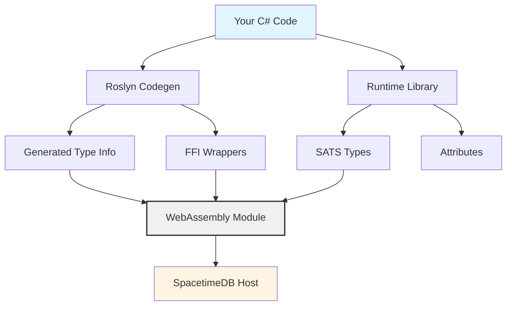
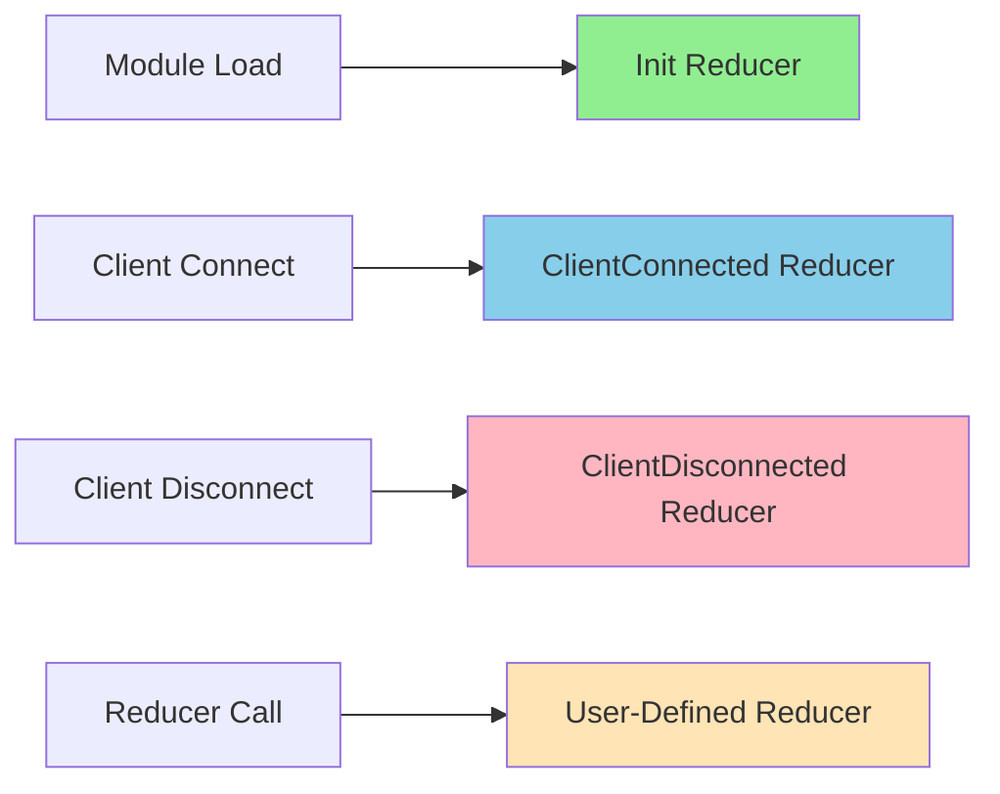
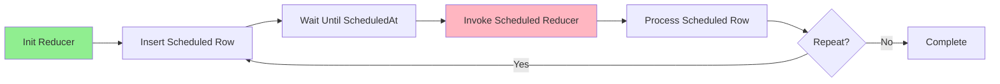

This guide provides comprehensive documentation for developing SpacetimeDB modules using C#. It covers the architecture, setup process, type system, table definitions, reducers, and advanced features available in the C# bindings.

## C# Module Architecture Overview

SpacetimeDB C# modules leverage WebAssembly (Wasm) through a sophisticated binding system that bridges .NET code with the SpacetimeDB runtime. The architecture consists of three main components that work together to compile your C# code into Wasm modules compatible with the SpacetimeDB platform.


The **Codegen** layer uses Roslyn incremental source generators to analyze your types decorated with attributes and generate necessary registration code, type descriptors, and FFI wrappers at compile time. This happens automatically when you build your project, requiring no manual intervention beyond applying the correct attributes to your types.

The **Runtime** layer provides the core SATS (SpacetimeDB Algebraic Type System) implementation, attributes for code generation, and WebAssembly bindings. It currently implements WASI compatibility through the `Wasi.Sdk` package, which may evolve in future versions. The runtime handles all the low-level communication between your C# code and the SpacetimeDB host.

The **FFI (Foreign Function Interface)** layer consists of native C bindings (`bindings.c`) that declare WebAssembly imports/exports compatible with SpacetimeDB's ABI. These bindings convert between Mono types and raw types expected by the SpacetimeDB FFI, providing the critical bridge between managed .NET code and native WebAssembly execution.

Sources: [crates/bindings-csharp/Runtime/README.md](crates/bindings-csharp/Runtime/README.md#L1-L24), [crates/bindings-csharp/Codegen/README.md](crates/bindings-csharp/Codegen/README.md#L1-L37)



## Project Setup and Configuration

Setting up a C# module project requires specific NuGet package references and project configuration to ensure proper code generation and runtime compatibility. The process involves creating a standard .NET project and adding references to the SpacetimeDB binding packages.

**Project File Configuration**:

Your `.csproj` file must reference both the Codegen analyzer and Runtime package. The Codegen reference is configured as an analyzer to prevent it from being included in the final build output, while the Runtime package provides the necessary types and functionality at runtime.

Sources: [modules/module-test-cs/module-test-cs.csproj](modules/module-test-cs/module-test-cs.csproj#L1-L14)

```xml
<Project Sdk="Microsoft.NET.Sdk">
  <ItemGroup>
    <ProjectReference 
      Include="../../crates/bindings-csharp/Codegen/Codegen.csproj" 
      OutputItemType="Analyzer" 
      ReferenceOutputAssembly="false" />
    <ProjectReference 
      Include="../../crates/bindings-csharp/Runtime/Runtime.csproj" />
  </ItemGroup>
</Project>
```

<CgxTip>Ensure your project targets a compatible .NET version (typically .NET 8 or later) as the SpacetimeDB bindings use modern C# features including record types, pattern matching, and caller information attributes.</CgxTip>

**Namespace Convention**: Organize your module code within the `SpacetimeDB.Modules.<ModuleName>` namespace to maintain consistency with the module naming system used throughout SpacetimeDB.

**Partial Types Requirement**: All types decorated with `[Table]` or `[Type]` attributes must be declared as `partial struct` or `partial class/record`. This requirement enables the code generator to augment these types with additional methods and properties in generated source files. The code generator cannot add methods to types that aren't partial, and static extension methods on third-party types aren't feasible in C#.

Sources: [crates/bindings-csharp/Codegen/README.md](crates/bindings-csharp/Codegen/README.md#L8-L20)

## Type System and Data Definitions

SpacetimeDB's type system in C# supports both table types and algebraic types (enums and tagged unions). The code generator processes these types to generate type information and registration code that makes them available to the SpacetimeDB runtime.

### Simple Types and Enums

The `[Type]` attribute marks types that participate in the SpacetimeDB type system but aren't necessarily tables. These can be structs, enums, or records used as column types or reducer arguments.

Sources: [modules/module-test-cs/Lib.cs](modules/module-test-cs/Lib.cs#L46-L56), [modules/sdk-test-cs/Lib.cs](modules/sdk-test-cs/Lib.cs#L9-L28)

```csharp
[Type]
public enum TestC
{
    Foo,
    Bar
}

[Type]
public struct ByteStruct
{
    public byte b;
}

[Type]
public struct EveryPrimitiveStruct
{
    public byte a;
    public ushort b;
    public uint c;
    public ulong d;
    public U128 e;
    public U256 f;
    public sbyte g;
    public short h;
    public int i;
    public long j;
    public I128 k;
    public I256 l;
    public bool m;
    public float n;
    public double o;
    public string p;
    public Identity q;
    public ConnectionId r;
    public Timestamp s;
    public TimeDuration t;
}
```

**Supported Primitive Types**: C# modules support comprehensive primitive type mapping including all integer types (byte, sbyte, short, ushort, int, uint, long, ulong), large integers (I128, U128, I256, U256), floating-point types (float, double), boolean, string, and SpacetimeDB-specific types (Identity, ConnectionId, Timestamp, TimeDuration).

### Tagged Enums (Algebraic Types)

C# doesn't have native sum types like Rust's enums, but SpacetimeDB provides a pattern for emulating tagged enums using records that inherit from a `TaggedEnum<Variants>` marker interface. This enables pattern-matching similar to Rust enums.

Sources: [crates/bindings-csharp/Codegen/README.md](crates/bindings-csharp/Codegen/README.md#L23-L37), [modules/module-test-cs/Lib.cs](modules/module-test-cs/Lib.cs#L68-L86)

```csharp
[Type]
public record Baz
{
    public string field;
}

[Type]
public record Bar { }

[Type]
public record Foobar : TaggedEnum<(Baz Baz, Bar Bar, uint Har)>
{
}

// Usage in reducer with pattern matching
switch (arg4)
{
    case TestF.Foo _:
        Log.Info("Foo");
        break;
    case TestF.Bar _:
        Log.Info("Bar");
        break;
    case TestF.Baz fb:
        Log.Info(fb.Baz_.value);
        break;
}
```

**Tagged Enum Pattern**: The `TaggedEnum<Variants>` base type accepts a named tuple of all possible variants. The code generator creates inherited records for each variant, enabling C# pattern matching on any instance of the enum type. This provides type-safe discrimination between variants and access to variant-specific data.

## Table Definitions and Schema

Tables in C# modules are defined using the `[Table]` attribute on struct or class types. The code generator automatically registers these tables and generates table access structures that provide CRUD operations and querying capabilities within reducer calls.

### Basic Table Declaration

The fundamental table declaration uses the `[Table]` attribute with optional parameters for name and visibility.

Sources: [modules/module-test-cs/Lib.cs](modules/module-test-cs/Lib.cs#L13-L23), [crates/bindings-csharp/Runtime/Attrs.cs](crates/bindings-csharp/Runtime/Attrs.cs#L42-L80)

```csharp
[Table(Name = "person", Public = true)]
public partial struct Person
{
    [PrimaryKey]
    [AutoInc]
    public uint id;
    public string name;

    [Index.BTree]
    public byte age;
}
```

**Table Attribute Parameters**:

| Parameter | Type | Default | Description |
|-----------|------|---------|-------------|
| `Name` | `string?` | `nameof(Type)` | The table name in SpacetimeDB |
| `Public` | `bool` | `false` | Whether the table is visible to all clients |
| `Scheduled` | `string?` | `null` | Name of reducer to invoke on schedule |
| `ScheduledAt` | `string` | `"ScheduledAt"` | Column name for scheduled time |

Sources: [crates/bindings-csharp/Runtime/Attrs.cs](crates/bindings-csharp/Runtime/Attrs.cs#L42-L80)

### Column Attributes and Constraints

Column-level attributes define constraints, indexes, and automatic behavior for table columns. Multiple attributes can be combined on a single field.

Sources: [modules/module-test-cs/Lib.cs](modules/module-test-cs/Lib.cs#L13-L31), [crates/bindings-csharp/Runtime/Attrs.cs](crates/bindings-csharp/Runtime/Attrs.cs#L1-L50)

**Primary Key and Auto-Increment**:

```csharp
[PrimaryKey]
[AutoInc]
public uint id;
```

The `[PrimaryKey]` attribute marks a column as the primary key, implicitly enforcing uniqueness. The `[AutoInc]` attribute enables automatic incrementing, requiring an integer type (byte, sbyte, short, ushort, int, uint, long, ulong, or their extended variants).

**Unique Constraints**:

```csharp
[Unique]
public string name;
```

The `[Unique]` attribute enforces that values in this column must be unique across all rows. It can be combined with `[AutoInc]` to create auto-incrementing unique identifiers.

**Default Values**:

```csharp
[Default("John Doe")]
public string name;
```

The `[Default]` attribute specifies a default value for a column. When a column is added to an existing table during module republishing, this value populates existing rows. Default values cannot be combined with auto-increment, primary key, or unique constraints.

Sources: [crates/bindings-csharp/Runtime/Attrs.cs](crates/bindings-csharp/Runtime/Attrs.cs#L117-L170)

### Indexes

SpacetimeDB C# modules support B-tree indexes for efficient querying. Indexes can be single-column or multi-column.

Sources: [modules/module-test-cs/Lib.cs](modules/module-test-cs/Lib.cs#L24-L31, #L105-L110), [crates/bindings-csharp/Runtime/Attrs.cs](crates/bindings-csharp/Runtime/Attrs.cs#L82-L103)

**Single-Column Index**:

```csharp
[Table(Name = "test_a")]
public partial struct TestA
{
    [Index.BTree(Name = "foo")]
    public uint x;
    public uint y;
    public string z;
}
```

**Multi-Column Index**:

```csharp
[Table(Name = "points", Public = false)]
[Index.BTree(Name = "multi_column_index", Columns = new[] { "x", "y" })]
public partial struct Point
{
    public long x;
    public long y;
}
```

Multiple `[Table]` attributes on a single type enable row type reuse. Each attribute creates a separate SpacetimeDB table with a unique name, while sharing the same struct definition.

Sources: [modules/module-test-cs/Lib.cs](modules/module-test-cs/Lib.cs#L119-L124)

### Scheduled Tables

Tables can be configured to trigger reducers at specific times, enabling scheduled operations.

Sources: [modules/module-test-cs/Lib.cs](modules/module-test-cs/Lib.cs#L116-L126)

```csharp
[Table(Name = "repeating_test_arg", Scheduled = nameof(Module.repeating_test), ScheduledAt = nameof(scheduled_at))]
public partial struct RepeatingTestArg
{
    [PrimaryKey]
    [AutoInc]
    public ulong scheduled_id;
    public ScheduleAt scheduled_at;
    public Timestamp prev_time;
}

[Reducer]
public static void repeating_test(ReducerContext ctx, RepeatingTestArg arg)
{
    var deltaTime = ctx.Timestamp.TimeDurationSince(arg.prev_time);
    Log.Trace($"Timestamp: {ctx.Timestamp}, Delta time: {deltaTime}");
}
```

### Public vs Private Tables

Public tables are visible to all clients through subscriptions, while private tables are only visible to the module and the table owner.

Sources: [modules/module-test-cs/Lib.cs](modules/module-test-cs/Lib.cs#L131-L136, #L152-L156)

```csharp
[Table(Name = "player", Public = true)]
[Table(Name = "logged_out_player", Public = true)]
public partial struct Player
{
    [PrimaryKey]
    public Identity identity;
    [AutoInc]
    [Unique]
    public ulong player_id;
    [Unique]
    public string name;
}

[Table(Name = "private_table", Public = false)]
public partial struct PrivateTable
{
    public string name;
}
```

## Reducers: Server-Side Logic

Reducers are server-side functions that can be called by clients. They're the primary mechanism for interacting with SpacetimeDB modules, handling business logic, and modifying data.

### Basic Reducer Declaration

Reducers are defined as static methods in a `partial class Module` decorated with the `[Reducer]` attribute.

Sources: [modules/module-test-cs/Lib.cs](modules/module-test-cs/Lib.cs#L205-L219, #L221-L227)

```csharp
static partial class Module
{
    [Reducer]
    public static void add(ReducerContext ctx, string name, byte age)
    {
        ctx.Db.person.Insert(new Person { id = 0, name = name, age = age });
    }

    [Reducer]
    public static void say_hello(ReducerContext ctx)
    {
        foreach (var person in ctx.Db.person.Iter())
        {
            Log.Info($"Hello, {person.name}!");
        }
        Log.Info("Hello, World!");
    }
}
```

### ReducerContext

The `ReducerContext` parameter provides access to database operations, authentication information, and context data.

**Available Properties**:

| Property | Type | Description |
|----------|------|-------------|
| `Db` | `Db` | Database access object containing table references |
| `Timestamp` | `Timestamp` | Current server timestamp |
| `Sender` | `Identity` | Identity of the client calling the reducer |
| `Identity` | `Identity` | Module identity (owner) |

Sources: [modules/module-test-cs/Lib.cs](modules/module-test-cs/Lib.cs#L266-L276, #L438-L449)

```csharp
[Reducer]
public static void log_module_identity(ReducerContext ctx)
{
    Log.Info($"sender: {ctx.Sender}");
    Log.Info($"timestamp: {ctx.Timestamp}");
    Log.Info($"Module identity: {ctx.Identity.ToString().ToLower()}");
}

[Reducer]
public static void assert_caller_identity_is_module_identity(ReducerContext ctx)
{
    var caller = ctx.Sender;
    var owner = ctx.Identity;
    if (!caller.Equals(owner))
    {
        throw new Exception($"Caller {caller} is not the owner {owner}");
    }
    else
    {
        Log.Info($"Called by the owner {owner}");
    }
}
```

### Table Operations

The code generator provides table access structures with insert, update, delete, and query operations.

Sources: [modules/module-test-cs/Lib.cs](modules/module-test-cs/Lib.cs#L239-L276, #L307-L319, #L342-L355)

**Insert Operations**:

```csharp
ctx.Db.person.Insert(new Person { id = 0, name = name, age = age });

for (uint i = 0; i < 1000; i++)
{
    ctx.Db.test_a.Insert(new TestA
    {
        x = i + arg.x,
        y = i + arg.y,
        z = "Yo"
    });
}
```

**Delete Operations**:

```csharp
// Delete rows using the "foo" index
ulong numDeleted = 0;
for (uint row = 5; row < 10; row++)
{
    numDeleted += ctx.Db.test_a.foo.Delete(row);
}

// Delete by primary key
bool deleted = ctx.Db.test_e.id.Delete(id);
if (!deleted)
{
    throw new Exception($"No TestE row with id {id}");
}

// Delete multiple rows by indexed column
var numDeleted = ctx.Db.test_e.name.Delete(name);
if (numDeleted == 0)
{
    throw new Exception($"No TestE row with name {name}");
}
else
{
    Log.Info($"Deleted {numDeleted} player(s) with name {name}");
}
```

**Iterate and Query**:

```csharp
// Full table scan
foreach (var person in ctx.Db.person.Iter())
{
    Log.Info($"{person.name} has age {person.age}");
}

// Filter by index range
foreach (var person in ctx.Db.person.age.Filter((age, byte.MaxValue)))
{
    Log.Info($"{person.name} has age {person.age} >= {age}");
}

// Count rows
var rowCountBeforeDelete = ctx.Db.test_a.Count;

// Filter with LINQ
var multiRowCount = ctx.Db.points.Iter().Where(row => row.x >= 0 && row.y <= 200).Count();
```

### Lifecycle Reducers

SpacetimeDB provides special lifecycle reducers that run at specific module events: initialization, client connection, and client disconnection.

Sources: [modules/module-test-cs/Lib.cs](modules/module-test-cs/Lib.cs#L194-L203, #L349-L353), [crates/bindings-csharp/Runtime/Attrs.cs](crates/bindings-csharp/Runtime/Attrs.cs#L157-L170)



**Initialization Reducer**:

```csharp
[Reducer(ReducerKind.Init)]
public static void init(ReducerContext ctx)
{
    ctx.Db.repeating_test_arg.Insert(new RepeatingTestArg
    {
        prev_time = ctx.Timestamp,
        scheduled_id = 0,
        scheduled_at = new TimeDuration(1000000)
    });
}
```

**Client Connection Reducer**:

```csharp
[Reducer(ReducerKind.ClientConnected)]
public static void client_connected(ReducerContext ctx)
{
    // Logic when a client connects
    Log.Info($"Client connected: {ctx.Sender}");
}
```

**ReducerKind Enum**:

| Kind | Description | Timing |
|------|-------------|--------|
| `UserDefined` | Standard reducer (default) | On client call |
| `Init` | Module initialization | Once when module loads |
| `ClientConnected` | Client connection | Each time a client connects |
| `ClientDisconnected` | Client disconnection | Each time a client disconnects |

Sources: [crates/bindings-csharp/Runtime/Attrs.cs](crates/bindings-csharp/Runtime/Attrs.cs#L157-L170)

## Logging and Error Handling

SpacetimeDB provides a comprehensive logging API and exception system for debugging and error handling within reducers.

### Logging

The `Log` class provides methods for logging messages at different severity levels, with automatic capture of source file, line number, and caller information.

Sources: [crates/bindings-csharp/Runtime/Log.cs](crates/bindings-csharp/Runtime/Log.cs#L1-L180)

```csharp
[Reducer]
public static void test(ReducerContext ctx, TestAlias arg, TestB arg2, TestC arg3, TestF arg4)
{
    Log.Debug("Debug message - detailed information");
    Log.Trace("Trace message - very detailed flow information");
    Log.Info("Info message - general information");
    Log.Warn("Warning message - something unexpected but recoverable");
    Log.Error("Error message - something went wrong");
    Log.Exception("Exception occurred during processing");
    
    try
    {
        // Some operation that might throw
    }
    catch (Exception ex)
    {
        Log.Exception(ex); // Logs full exception with stack trace
    }
}
```

**Log Levels**:

| Level | Use Case | FFI Level |
|-------|----------|-----------|
| `Debug` | Detailed information for debugging | `FFI.LogLevel.Debug` |
| `Trace` | Very detailed flow information | `FFI.LogLevel.Trace` |
| `Info` | General informational messages | `FFI.LogLevel.Info` |
| `Warn` | Warning messages for unexpected but recoverable conditions | `FFI.LogLevel.Warn` |
| `Error` | Error messages when something goes wrong | `FFI.LogLevel.Error` |

<CgxTip>The logging methods use C# caller information attributes (`[CallerMemberName]`, `[CallerFilePath]`, `[CallerLineNumber]`) to automatically capture source location. Do not manually provide the reserved parameters as this may lead to undefined behavior.</CgxTip>

### Exception Handling

SpacetimeDB defines specific exception types for common error conditions. These exceptions are automatically thrown by the FFI layer when corresponding error codes are returned.

Sources: [crates/bindings-csharp/Runtime/Exceptions.cs](crates/bindings-csharp/Runtime/Exceptions.cs#L1-L88)

```csharp
public abstract class StdbException : Exception
{
    public abstract override string Message { get; }
}
```

**Exception Types**:

| Exception | Description | Common Causes |
|-----------|-------------|---------------|
| `NotInTransactionException` | ABI call made outside a transaction | Calling FFI functions from non-reducer context |
| `BsatnDecodeException` | Failed to decode BSATN data | Type mismatch in reducer arguments |
| `NoSuchTableException` | Referenced table doesn't exist | Typo in table name or unregistered table |
| `NoSuchIndexException` | Referenced index doesn't exist | Typo in index name or unregistered index |
| `IndexNotUniqueException` | Index operation requires uniqueness | Attempting unique operation on non-unique index |
| `NoSuchRowException` | Row not found for update/delete | Primary key or unique constraint doesn't match |
| `UniqueConstraintViolationException` | Duplicate value in unique column | Inserting duplicate value in unique/primary key column |
| `ScheduleAtDelayTooLongException` | Scheduled delay exceeds maximum | Scheduling too far in the future |
| `BufferTooSmallException` | Buffer insufficient for data | Internal buffer sizing issue |
| `NoSuchIterException` | Invalid iterator handle | Using invalidated iterator |
| `AutoIncOverflowException` | Auto-increment sequence overflow | Exceeding maximum value for integer type |
| `UnknownException` | Unknown error code | New or unhandled error condition |

Sources: [crates/bindings-csharp/Runtime/Exceptions.cs](crates/bindings-csharp/Runtime/Exceptions.cs#L1-L88)

**Error Handling Pattern**:

```csharp
[Reducer]
public static void safe_operation(ReducerContext ctx, ulong id)
{
    try
    {
        bool deleted = ctx.Db.test_e.id.Delete(id);
        if (!deleted)
        {
            throw new Exception($"No TestE row with id {id}");
        }
    }
    catch (UniqueConstraintViolationException ex)
    {
        Log.Error($"Unique constraint violation: {ex.Message}");
        // Handle constraint violation
    }
    catch (StdbException ex)
    {
        Log.Error($"SpacetimeDB error: {ex.Message}");
        // Handle SpacetimeDB-specific errors
    }
    catch (Exception ex)
    {
        Log.Error($"Unexpected error: {ex.Message}");
        // Handle unexpected errors
    }
}
```

## Authentication and Identity

SpacetimeDB provides comprehensive authentication and identity management through the `AuthCtx` class and identity types.

### Identity Types

Identity represents a unique entity in the SpacetimeDB system - either a client, module, or internal component.

Sources: [modules/module-test-cs/Lib.cs](modules/module-test-cs/Lib.cs#L128-L131, #L318-L321)

```csharp
[Table(Name = "has_special_stuff")]
public partial struct HasSpecialStuff
{
    public Identity identity;
    public ConnectionId connection_id;
}

[Reducer]
public static void test_identity(ReducerContext ctx)
{
    var caller = ctx.Sender;
    var owner = ctx.Identity;
    
    Log.Info($"Caller identity: {caller.ToString().ToLower()}");
    Log.Info($"Module/owner identity: {owner.ToString().ToLower()}");
}
```

### AuthContext

The `AuthCtx` class provides access to authentication context and JWT (JSON Web Token) claims when available.

Sources: [crates/bindings-csharp/Runtime/AuthCtx.cs](crates/bindings-csharp/Runtime/AuthCtx.cs#L1-L89)

**AuthContext Properties**:

| Property | Type | Description |
|----------|------|-------------|
| `IsInternal` | `bool` | True if reducer was spawned from inside the database |
| `HasJwt` | `bool` | True if a JWT is present (false when `IsInternal`) |
| `Jwt` | `JwtClaims?` | Loaded JWT claims, or null if not available |

```csharp
// AuthCtx is typically accessed internally through ReducerContext
// The ReducerContext.Sender property provides the caller identity
// while ReducerContext.Identity provides the module identity
```

## Advanced Topics

### Type Aliases

C# supports type aliases using `using` directives, which can improve code readability.

Sources: [modules/module-test-cs/Lib.cs](modules/module-test-cs/Lib.cs#L4-L6)

```csharp
// A C# type alias for TestA.
using TestAlias = TestA;

[Reducer]
public static void test(ReducerContext ctx, TestAlias arg, TestB arg2, TestC arg3, TestF arg4)
{
    // Use TestAlias instead of TestA
    Log.Info($"Test alias value: {arg.x}");
}
```

### Nullable Types

Nullable types handle optional values, equivalent to Rust's `Option<T>`.

Sources: [modules/module-test-cs/Lib.cs](modules/module-test-cs/Lib.cs#L57-L62)

```csharp
[Table(Name = "test_d", Public = true)]
public partial struct TestD
{
    // In Rust this was an Option<TestC>; in C# we use a nullable enum.
    public TestC? test_c;
}
```

### Scheduled Reducers

Scheduled reducers enable delayed execution and recurring tasks by combining tables with the `Scheduled` parameter.

Sources: [modules/module-test-cs/Lib.cs](modules/module-test-cs/Lib.cs#L113-L126, #L194-L203), [crates/bindings-csharp/Runtime/Internal/ITable.cs](crates/bindings-csharp/Runtime/Internal/ITable.cs#L164-L170)



The scheduling system uses the `MakeSchedule` method to create schedule definitions that associate a table column with a reducer name.

### Index-Based Operations

Indexes enable efficient lookups, updates, and deletions without full table scans.

Sources: [modules/module-test-cs/Lib.cs](modules/module-test-cs/Lib.cs#L361-L388)

```csharp
[Reducer]
public static void test_btree_index_args(ReducerContext ctx)
{
    // Testing various acceptable index filter argument types.
    string s = "String";
    var _1 = ctx.Db.test_e.name.Filter(s);
    var _2 = ctx.Db.test_e.name.Filter("str");

    // Delete by indexed column
    ctx.Db.test_e.name.Delete(s);
    ctx.Db.test_e.name.Delete("str");

    // For the multi‑column index on points
    var mci = ctx.Db.points.multi_column_index;
    var _a = mci.Filter(0L);
    var _b = mci.Filter(0L); // by value or by reference
}
```

## Building and Deployment

Once your module is developed, it must be compiled to WebAssembly and deployed to SpacetimeDB.

<CgxTip>The code generation happens automatically during compilation. Ensure you're using a supported .NET SDK version (typically .NET 8+) and that the SpacetimeDB bindings packages are properly referenced in your project file.</CgxTip>

**Build Process**:

1. Compile the C# project with the SpacetimeDB bindings
2. The code generator produces registration code and type descriptors
3. The runtime builds a WebAssembly module with WASI bindings
4. The module is packaged for deployment to SpacetimeDB

**Deployment** (conceptual):

```bash
# These are illustrative commands - actual CLI commands may vary
spacetimedb publish my-module
spacetimedb logs my-module
spacetimedb call my-module add "John" 30
```

For detailed deployment instructions and CLI usage, see [Installing SpacetimeDB CLI](3-installing-spacetimedb-cli) and [Quick Start](2-quick-start).

## Complete Example

Here's a complete example demonstrating key concepts in C# module development.

Sources: [modules/module-test-cs/Lib.cs](modules/module-test-cs/Lib.cs#L1-L450)

```csharp
namespace SpacetimeDB.Modules.ExampleModule;

using SpacetimeDB;

// ─────────────────────────────────────────────────────────────────────────────
// TABLE DEFINITIONS
// ─────────────────────────────────────────────────────────────────────────────

[Table(Name = "person", Public = true)]
public partial struct Person
{
    [PrimaryKey]
    [AutoInc]
    public uint id;
    public string name;

    [Index.BTree]
    public byte age;
}

[Table(Name = "game", Public = true)]
public partial struct Game
{
    [PrimaryKey]
    public ulong game_id;
    [AutoInc]
    public uint player_count;
    public string status;
}

[Type]
public enum GameState
{
    Waiting,
    Active,
    Completed
}

// ─────────────────────────────────────────────────────────────────────────────
// REDUCERS
// ─────────────────────────────────────────────────────────────────────────────

static partial class Module
{
    [Reducer(ReducerKind.Init)]
    public static void init(ReducerContext ctx)
    {
        Log.Info("Module initialized");
    }

    [Reducer]
    public static void add_person(ReducerContext ctx, string name, byte age)
    {
        ctx.Db.person.Insert(new Person { id = 0, name = name, age = age });
        Log.Info($"Added person: {name}, age {age}");
    }

    [Reducer]
    public static void list_adults(ReducerContext ctx, byte minAge)
    {
        Log.Info($"People aged {minAge} or older:");
        foreach (var person in ctx.Db.person.Iter())
        {
            if (person.age >= minAge)
            {
                Log.Info($"  - {person.name} (age {person.age})");
            }
        }
    }

    [Reducer]
    public static void start_game(ReducerContext ctx, ulong gameId)
    {
        // Find the game by primary key
        // Note: This is a simplified example - actual implementation would use index lookup
        var found = false;
        foreach (var game in ctx.Db.game.Iter())
        {
            if (game.game_id == gameId && game.status == "Waiting")
            {
                Log.Info($"Starting game {gameId}");
                found = true;
                break;
            }
        }
        
        if (!found)
        {
            throw new Exception($"No waiting game found with ID {gameId}");
        }
    }

    [Reducer(ReducerKind.ClientConnected)]
    public static void on_client_connected(ReducerContext ctx)
    {
        Log.Info($"Client connected: {ctx.Sender}");
    }
}
```

## Best Practices and Common Patterns

### Error Handling Patterns

Always wrap database operations in try-catch blocks to handle SpacetimeDB-specific exceptions gracefully. Provide meaningful error messages in your logs.

```csharp
[Reducer]
public static void safe_insert(ReducerContext ctx, string name)
{
    try
    {
        ctx.Db.person.Insert(new Person { id = 0, name = name, age = 30 });
    }
    catch (UniqueConstraintViolationException)
    {
        Log.Error($"Person with name '{name}' already exists");
    }
    catch (StdbException ex)
    {
        Log.Error($"Database error: {ex.Message}");
    }
}
```

### Index Strategy

Create indexes on columns frequently used in WHERE clauses or join conditions. Balance read performance against write overhead.

```csharp
[Table(Name = "player_stats")]
public partial struct PlayerStats
{
    [PrimaryKey]
    public uint player_id;
    
    // Index for frequent lookups by name
    [Index.BTree]
    public string name;
    
    // Index for range queries
    [Index.BTree]
    public int score;
}
```

### Scheduled Task Pattern

Use scheduled tables for recurring tasks like cleanup, aggregation, or timeout handling.

```csharp
[Table(Name = "scheduled_cleanup", Scheduled = nameof(cleanup), ScheduledAt = nameof(run_at))]
public partial struct ScheduledCleanup
{
    [PrimaryKey]
    [AutoInc]
    public ulong id;
    public Timestamp run_at;
    public string cleanup_type;
}

[Reducer]
public static void cleanup(ReducerContext ctx, ScheduledCleanup task)
{
    Log.Info($"Running cleanup: {task.cleanup_type}");
    // Perform cleanup logic
}
```

## Troubleshooting

### Common Issues

**Issue**: Code generation not working
- **Solution**: Ensure all table and type definitions use `partial` keyword and reference the Codegen package as an analyzer

**Issue**: AutoInc not working
- **Solution**: Verify the column has an integer type. Complex types cannot use auto-increment

**Issue**: Index lookup failing
- **Solution**: Check that the index name matches exactly (case-sensitive) and that the column type is equatable

**Issue**: "No such table" exception
- **Solution**: Verify the `[Table]` attribute has the correct `Name` parameter or matches the type name

Sources: [crates/bindings-csharp/Codegen/Module.cs](crates/bindings-csharp/Codegen/Module.cs#L1-L200)

## Next Steps

- **[Rust Module Development Guide](15-rust-module-development-guide)**: Compare C# module development with Rust to understand cross-language considerations
- **[Scheduled Reducers and Timers](17-scheduled-reducers-and-timers)**: Deep dive into scheduled and timer-based reducer patterns
- **[Identity and Authentication](18-identity-and-authentication)**: Comprehensive guide to authentication systems and identity management
- **[C# Client SDK Reference](25-c-client-sdk-reference)**: Building client applications that connect to your C# modules
- **[Error Handling and Validation](19-error-handling-and-validation)**: Advanced error handling patterns and validation strategies
- **[Understanding the Database-Server Hybrid Architecture](9-understanding-the-database-server-hybrid-architecture)**: Understand the underlying architecture that makes C# modules possible
