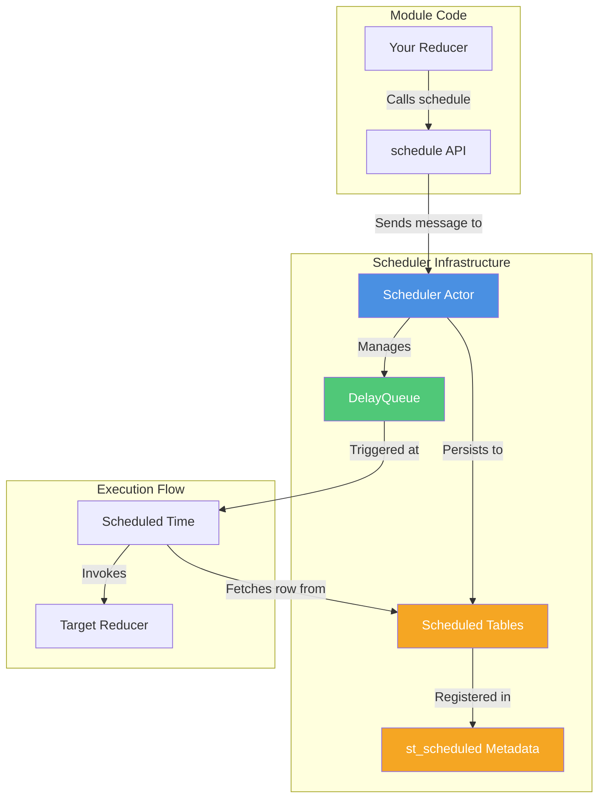
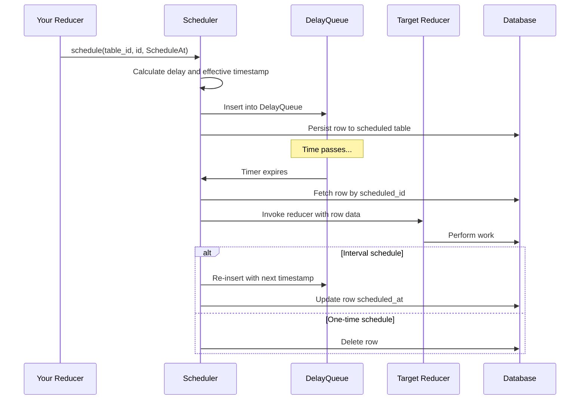

**Purpose and Scope**: SpacetimeDB provides a powerful scheduling system that enables deferred and repeated execution of server-side reducers. This mechanism integrates deeply with the database architecture, allowing you to schedule reducers that will execute at specific times, after durations, or on recurring intervals—all while maintaining ACID guarantees and automatic persistence across module restarts.

## Architecture Overview

The scheduled reducer system is built on an asynchronous actor model that coordinates between your module's database tables and Tokio's timing infrastructure. The architecture ensures that scheduled operations survive server restarts by persisting schedule metadata in special database tables.



The scheduling system operates through three interconnected layers:

- **API Layer**: Your reducers call scheduling functions to register delayed operations
- **Persistence Layer**: Scheduled entries are stored in database tables with special attributes
- **Execution Layer**: An async actor monitors timing and invokes reducers when scheduled times arrive

This design provides fault tolerance—scheduled reducers stored in the database automatically reload when a module restarts, ensuring no scheduled operations are lost.

## Scheduling Table Configuration

To use scheduled reducers, you define special tables that store scheduling metadata. These tables are annotated with the `scheduled` attribute, which tells SpacetimeDB to register them for timer management.

Sources: [lib.rs](modules/module-test/src/lib.rs#L132-L139)

```rust
#[spacetimedb::table(name = repeating_test_arg, scheduled(repeating_test))]
pub struct RepeatingTestArg {
    #[primary_key]
    #[auto_inc]
    scheduled_id: u64,
    scheduled_at: spacetimedb::ScheduleAt,
    prev_time: Timestamp,
}
```

### Table Structure Requirements

Every scheduled table must include specific columns to support the scheduling infrastructure:

| Column | Required | Type | Purpose |
|--------|----------|------|---------|
| `scheduled_id` | Yes | `u64` | Unique identifier for the scheduled entry (primary key) |
| `scheduled_at` | Yes | `ScheduleAt` | When the reducer should execute |
| Additional columns | No | Any | Arguments passed to the scheduled reducer |

The `ScheduleAt` enum provides three scheduling modes:

- **`ScheduleAt::Timestamp(Timestamp)`**: Execute at an absolute point in time
- **`ScheduleAt::Duration(Duration)`**: Execute after a relative delay from scheduling time
- **`ScheduleAt::Interval(Duration)`**: Execute repeatedly at the specified interval

When you insert a row into a scheduled table, SpacetimeDB automatically registers the reducer execution. The `scheduled(reducer_name)` attribute specifies which reducer receives the table row as arguments when the timer triggers.

Sources: [scheduler.rs](crates/core/src/host/scheduler.rs#L428-L432)

## Creating Scheduled Reducers

### One-Time Scheduling

Schedule a reducer to execute once at a specific time or after a delay:

```rust
#[spacetimedb::reducer(init)]
pub fn init(ctx: &ReducerContext) {
    // Schedule a reducer to execute 5 seconds from now
    ctx.db.my_schedule().insert(MySchedule {
        scheduled_id: 0,  // Auto-incremented
        scheduled_at: duration!("5000ms").into(),
        message: "Hello from the future!".to_string(),
    });
    
    // Or schedule at an absolute timestamp
    let future_time = ctx.timestamp + duration!("1h");
    ctx.db.my_schedule().insert(MySchedule {
        scheduled_id: 0,
        scheduled_at: future_time.into(),
        message: "Delayed by 1 hour".to_string(),
    });
}

#[spacetimedb::reducer]
pub fn my_scheduled_reducer(ctx: &ReducerContext, args: MySchedule) {
    log::info!("Scheduled message: {}", args.message);
}
```

### Repeated Scheduling (Intervals)

For recurring tasks, use interval scheduling:

```rust
#[spacetimedb::table(name = heartbeat_timer, scheduled(send_heartbeat))]
pub struct HeartbeatTimer {
    #[primary_key]
    #[auto_inc]
    scheduled_id: u64,
    scheduled_at: spacetimedb::ScheduleAt,
    last_heartbeat: Timestamp,
}

#[spacetimedb::reducer]
pub fn send_heartbeat(ctx: &ReducerContext, args: HeartbeatTimer) {
    log::info!("Heartbeat at {:?}", ctx.timestamp);
    
    // The system automatically reschedules interval tasks
    // No need to manually reinsert!
}
```

<CgxTip>
With interval scheduling, SpacetimeDB automatically re-inserts the row with an updated `scheduled_at` timestamp after each execution. You only need to create the initial row—the system handles the recurrence loop.
</CgxTip>

## Timing and Execution Model

The scheduler uses a sophisticated timing system with distinct concepts:



### Time Calculation Mechanics

The scheduler maintains two timestamp representations for each scheduled reducer:

Sources: [scheduler.rs](crates/core/src/host/scheduler.rs#L226-L227)

- **`effective_at` (Timestamp)**: The logical timestamp presented to the reducer when it executes. This is at least the time it was scheduled for, but may be later if system delays occur.
- **`real_at` (Instant)**: The actual wall-clock time when the timer should fire. Used by Tokio's `DelayQueue` for precise timing.

When a scheduled reducer executes, it receives a timestamp that's the maximum of the scheduled time and the current system time. This ensures monotonic time progression even if the scheduler is delayed.

### Maximum Scheduling Horizon

Tokio's `DelayQueue` imposes a practical limit on scheduling:

Sources: [scheduler.rs](crates/core/src/host/scheduler.rs#L183-L186)

```rust
const MAX_SCHEDULE_DELAY: Duration = Duration::from_millis(
    // Equal to 64^6 - 1 milliseconds, which is 2.177589 years.
    (1 << (6 * 6)) - 1,
);
```

The maximum scheduling duration is approximately **2.18 years** into the future. Attempting to schedule beyond this limit returns a `ScheduleError::DelayTooLong`. This limitation prevents malicious or erroneous code from causing the scheduler to panic.

<CgxTip>
For operations needed beyond 2 years, implement a rescheduling pattern where your scheduled reducer schedules the next execution incrementally.
</CgxTip>

## Cancelling Scheduled Reducers

To cancel a scheduled reducer, simply delete its row from the scheduled table:

```rust
#[spacetimedb::reducer]
pub fn cancel_task(ctx: &ReducerContext, task_id: u64) {
    // Find and delete the scheduled task
    if let Some(task) = ctx.db.my_schedule().scheduled_id().find(task_id) {
        ctx.db.my_schedule().delete(task);
        log::info!("Cancelled task {}", task_id);
    }
}
```

The scheduler detects deleted rows during execution attempts and silently skips them without error. This makes cancellation clean and idempotent.

Sources: [scheduler.rs](crates/core/src/host/scheduler.rs#L335-L343)

## Lifecycle and Persistence

### Module Startup Restoration

When a module starts or restarts, the scheduler automatically loads all existing scheduled reducers from the database:

Sources: [scheduler.rs](crates/core/src/host/scheduler.rs#L108-L142)

1. The system queries the `st_scheduled` metadata table to find all tables with the `scheduled` attribute
2. For each scheduled table, it iterates through all rows
3. For each row, it calculates the remaining time until execution and re-inserts it into the `DelayQueue`
4. The scheduler then processes these timers as normal

This ensures that scheduled reducers persist across crashes, restarts, and deployments. Your scheduled operations are as durable as your database itself.

### Transactional Guarantees

Scheduled reducers operate within SpacetimeDB's ACID transaction model:

- **Atomicity**: If a reducer that creates a scheduled entry fails, the row isn't inserted, and nothing is scheduled
- **Consistency**: The scheduler validates all timing constraints before accepting a schedule
- **Isolation**: Scheduled reducer executions are isolated from concurrent operations
- **Durability**: Scheduled entries are written to the write-ahead log before being scheduled

## Volatile Immediate Scheduling

For scenarios requiring immediate execution without database persistence, the scheduler provides a volatile scheduling API:

Sources: [scheduler.rs](crates/core/src/host/scheduler.rs#L245-L250)

```rust
// In module_host.rs - used internally
pub fn volatile_nonatomic_schedule_immediate(
    &self, 
    reducer_name: String, 
    args: FunctionArgs
)
```

This is a specialized interface for internal operations that:
- Executes as soon as possible (zero delay)
- Does NOT persist to the database
- Is lost if the scheduler crashes
- Bypasses the normal scheduled table mechanism

This is primarily used internally for system operations rather than user code.

## Error Handling

The scheduler provides comprehensive error handling:

Sources: [scheduler.rs](crates/core/src/host/scheduler.rs#L188-L195)

| Error Type | Description | Recovery |
|------------|-------------|----------|
| `ScheduleError::DelayTooLong` | Attempted to schedule beyond ~2.18 years | Use shorter intervals with rescheduling |
| `ScheduleError::DecodingError` | Failed to read schedule row data | Fix table schema or row corruption |
| `ReducerCallError::NoSuchModule` | Module no longer exists | Scheduler skips execution, row persists for next restart |
| `ReducerCallError::ScheduleReducerNotFound` | Target reducer doesn't exist | Row deleted or persists based on configuration |

Scheduled reducers that fail to execute due to transient issues may be retried on module restart, while permanent failures typically result in row cleanup.

## Practical Patterns

### Debounced Operations

```rust
#[spacetimedb::table(name = debounce_timer, scheduled(process_update))]
pub struct DebounceTimer {
    #[primary_key]
    user_id: u64,
    scheduled_at: ScheduleAt,
    update_count: u64,
}

#[spacetimedb::reducer]
pub fn user_update(ctx: &ReducerContext, user_id: u64, data: String) {
    // Debounce: only process after 5 seconds of no updates
    if let Some(existing) = ctx.db.debounce_timer().user_id().find(user_id) {
        // Update existing timer, rescheduling it
        ctx.db.debounce_timer().user_id().update(existing, |timer| {
            timer.scheduled_at = duration!("5000ms").into();
            timer.update_count += 1;
        });
    } else {
        // Create new timer
        ctx.db.debounce_timer().insert(DebounceTimer {
            user_id,
            scheduled_at: duration!("5000ms").into(),
            update_count: 1,
        });
    }
}

#[spacetimedb::reducer]
pub fn process_update(ctx: &ReducerContext, timer: DebounceTimer) {
    log::info!("Processing {} batched updates for user {}", 
               timer.update_count, timer.user_id);
    // Do the actual work once
}
```

### Rate-Limited Background Jobs

```rust
#[spacetimedb::table(name = maintenance_job, scheduled(run_maintenance))]
pub struct MaintenanceJob {
    #[primary_key]
    job_type: String,
    scheduled_at: ScheduleAt,
    last_run: Timestamp,
}

#[spacetimedb::reducer(init)]
pub fn init(ctx: &ReducerContext) {
    // Schedule maintenance every hour
    ctx.db.maintenance_job().insert(MaintenanceJob {
        job_type: "cleanup".to_string(),
        scheduled_at: duration!("1h").into(),
        last_run: Timestamp::MIN,
    });
}
```

## Advanced Considerations

### Performance Characteristics

The scheduler's design optimizes for efficiency:

- **Memory overhead**: Each scheduled reducer occupies approximately 16 bytes in the `ScheduledReducerId` struct plus the queue entry
- **Time complexity**: Insert and remove operations in `DelayQueue` are O(log n) where n is the number of scheduled items
- **Database load**: Scheduled reducers incur no database reads until execution time, minimizing baseline overhead

### Concurrency Model

The scheduler actor runs on the Tokio runtime and processes messages asynchronously. Multiple scheduled reducers can execute concurrently if their timers fire simultaneously, subject to your module's reducer concurrency limits.

### Monitoring and Observability

When debugging scheduled reducers, check:

1. **Database tables**: Query your scheduled tables to see pending entries
2. **Logs**: The scheduler logs when scheduled reducers are invoked or fail
3. **System metadata**: The `st_scheduled` table shows which tables are registered for scheduling

Sources: [scheduler.rs](crates/core/src/host/scheduler.rs#L337-L341)

## Next Steps

With scheduled reducers mastered, explore related patterns:

- [Lifecycle Reducers](12-lifecycle-reducers) for initialization and cleanup patterns
- [Identity and Authentication](18-identity-and-authentication) to control who can schedule operations
- [Error Handling and Validation](19-error-handling-and-validation) for robust reducer design
- [In-Memory Architecture and WAL](29-in-memory-architecture-and-wal) to understand persistence guarantees

Scheduled reducers provide a powerful primitive for implementing sophisticated time-based logic within your SpacetimeDB modules. By combining them with the database's transaction guarantees, you can build reliable, distributed systems with minimal boilerplate.
