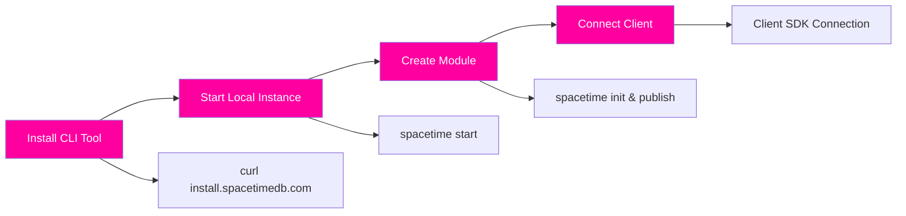
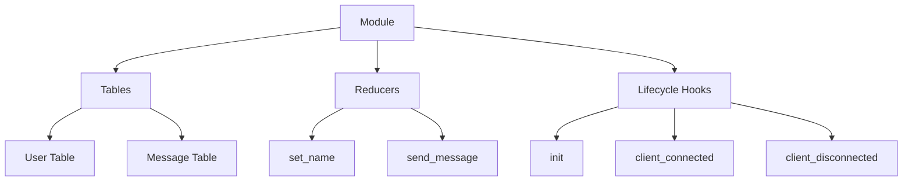

Welcome to SpacetimeDB, a database-server hybrid that enables you to build real-time applications with unprecedented simplicity. Unlike traditional architectures where you maintain separate application servers and databases, SpacetimeDB lets you upload your application logic directly into the database itself as "modules." Your clients connect directly to this unified system, eliminating the need for microservices, containers, Kubernetes, or complex DevOps infrastructure.


Sources: [README.md](README.md#L22-L45)

## Understanding the Quick Start Workflow

Getting started with SpacetimeDB follows a streamlined four-step process that takes you from installation to a running application in minutes. This workflow leverages the unique architecture where your backend logic runs inside the database, dramatically simplifying deployment and reducing latency.



Sources: [README.md](README.md#L133-L153)

### Prerequisites

Before you begin, ensure you have the following tools available:

| Platform | Requirements |
|----------|-------------|
| macOS | Bash shell, curl |
| Linux | Bash shell, curl |
| Windows | PowerShell or Git Bash, optionally WSL |

Sources: [README.md](README.md#L99-L117)

## Step 1: Install the SpacetimeDB CLI

The `spacetime` CLI tool is your gateway to SpacetimeDB development. It handles module creation, compilation, publishing, and database management.

### Installation Options

<CgxTip>The CLI installation script automatically sets up version management, allowing you to switch between different SpacetimeDB releases using the `spacetime version` command.</CgxTip>

#### macOS Installation

```bash
curl -sSf https://install.spacetimedb.com | sh
```

#### Linux Installation

```bash
curl -sSf https://install.spacetimedb.com | sh
```

#### Windows Installation

**PowerShell:**
```powershell
iwr https://windows.spacetimedb.com -useb | iex
```

**Git Bash:**
```bash
curl -sSf https://install.spacetimedb.com | sh
```

After installation, verify your setup:
```bash
spacetime --version
```

Sources: [README.md](README.md#L102-L121)

<CgxTip>For development workflows requiring the latest unreleased features, you can build from source. However, for production use, we strongly recommend using the pre-built CLI releases.</CgxTip>

#### Docker Alternative

If you prefer containerized development, you can run SpacetimeDB directly with Docker:

```bash
docker run --rm --pull always -p 3000:3000 clockworklabs/spacetime start
```

Sources: [README.md](README.md#L155-L159)

## Step 2: Start a Local SpacetimeDB Instance

Launch your local development environment with a single command. This starts a standalone database server ready to accept modules and client connections.

```bash
spacetime start
```

The `start` command launches the `spacetimedb-standalone` binary with default configurations, initializing a data directory and setting up JWT authentication keys for secure connections. The server listens on port 3000 by default for WebSocket connections from clients.

Sources: [crates/cli/src/subcommands/start.rs](crates/cli/src/subcommands/start.rs#L10-L42)

### Understanding What's Running

When you run `spacetime start`, the following components initialize:

| Component | Purpose |
|-----------|---------|
| Data Directory | Stores persisted database state and WAL (Write-Ahead Log) |
| JWT Keys | Enables identity-based authentication for clients |
| WebSocket Server | Accepts real-time client connections on port 3000 |
| Module Runtime | Executes your uploaded application code in WebAssembly |

Sources: [README.md](README.md#L38-L48)

## Step 3: Create and Publish Your First Module

A SpacetimeDB module contains your application logic, data models (tables), and server-side functions (reducers). Let's create a simple chat application to demonstrate the core concepts.

### Initialize a New Project

The CLI provides scaffolding for different module languages. For this quick start, we'll use Rust:

```bash
spacetime init --lang rust ./my-chat-app
cd my-chat-app
```

This creates a project structure with a `Cargo.toml` and `src/lib.rs` file containing boilerplate code.

Sources: [crates/cli/src/subcommands/init.rs](crates/cli/src/subcommands/init.rs#L10-L27)

### Module Anatomy

A SpacetimeDB module consists of three main components:



### Writing the Chat Module

The following example creates a fully functional chat server with user identity tracking, online status management, and real-time message broadcasting. Replace the contents of `src/lib.rs` with this code:

```rust
use spacetimedb::{Identity, ReducerContext, Table, Timestamp};

// Define the User table to track connected users
#[spacetimedb::table(name = user, public)]
pub struct User {
    #[primary_key]
    identity: Identity,
    name: Option<String>,
    online: bool,
}

// Define the Message table to store chat history
#[spacetimedb::table(name = message, public)]
pub struct Message {
    sender: Identity,
    sent: Timestamp,
    text: String,
}

// Validate that names are not empty
fn validate_name(name: String) -> Result<String, String> {
    if name.is_empty() {
        Err("Names must not be empty".to_string())
    } else {
        Ok(name)
    }
}

// Reducer: Allow users to set their display name
#[spacetimedb::reducer]
pub fn set_name(ctx: &ReducerContext, name: String) -> Result<(), String> {
    let name = validate_name(name)?;
    if let Some(user) = ctx.db.user().identity().find(ctx.sender) {
        log::info!("User {} sets name to {name}", ctx.sender);
        ctx.db.user().identity().update(User {
            name: Some(name),
            ..user
        });
        Ok(())
    } else {
        Err("Cannot set name for unknown user".to_string())
    }
}

// Validate that messages are not empty
fn validate_message(text: String) -> Result<String, String> {
    if text.is_empty() {
        Err("Messages must not be empty".to_string())
    } else {
        Ok(text)
    }
}

// Reducer: Send a chat message
#[spacetimedb::reducer]
pub fn send_message(ctx: &ReducerContext, text: String) -> Result<(), String> {
    let text = validate_message(text)?;
    log::info!("User {}: {text}", ctx.sender);
    ctx.db.message().insert(Message {
        sender: ctx.sender,
        text,
        sent: ctx.timestamp,
    });
    Ok(())
}

// Lifecycle: Called when the module is first published
#[spacetimedb::reducer(init)]
pub fn init(_ctx: &ReducerContext) {}

// Lifecycle: Called when a client connects
#[spacetimedb::reducer(client_connected)]
pub fn identity_connected(ctx: &ReducerContext) {
    if let Some(user) = ctx.db.user().identity().find(ctx.sender) {
        // Returning user: mark as online
        ctx.db.user().identity().update(User { online: true, ..user });
    } else {
        // New user: create record with no name
        ctx.db.user().insert(User {
            name: None,
            identity: ctx.sender,
            online: true,
        });
    }
}

// Lifecycle: Called when a client disconnects
#[spacetimedb::reducer(client_disconnected)]
pub fn identity_disconnected(ctx: &ReducerContext) {
    if let Some(user) = ctx.db.user().identity().find(ctx.sender) {
        ctx.db.user().identity().update(User { online: false, ..user });
    }
}
```

Sources: [modules/quickstart-chat/src/lib.rs](modules/quickstart-chat/src/lib.rs#L1-L95)

### Publish Your Module

Compile and upload your module to the local SpacetimeDB instance:

```bash
spacetime publish
```

The `publish` command builds your WebAssembly module, uploads it to the running server, and initializes the database with your table definitions. If this is your first publish, you'll be prompted to provide a database name.

Sources: [crates/cli/src/subcommands/publish.rs](crates/cli/src/subcommands/publish.rs#L15-L40)

## Step 4: Connect with a Client

Now that your module is running, you can interact with it using client SDKs. For testing purposes, the CLI provides built-in tools to invoke reducers and query tables.

### Test Your Module via CLI

**Call a reducer to set your name:**
```bash
spacetime call <your-database-name> set_name "\"Alice\""
```

**Send a message:**
```bash
spacetime call <your-database-name> send_message "\"Hello, World!\""
```

**Query the messages table:**
```bash
spacetime sql <your-database-name> "SELECT * FROM message"
```

Sources: [crates/cli/src/subcommands/call.rs](crates/cli/src/subcommands/call.rs#L15-L30)

### Interactive REPL

For a more interactive experience, use the SpacetimeDB REPL (Read-Eval-Print Loop):

```bash
spacetime sql <your-database-name>
```

In the REPL, you can:
- Execute SQL queries to inspect data
- Call reducers directly
- View real-time updates

The REPL provides syntax highlighting and auto-completion for SQL queries.

Sources: [crates/cli/src/subcommands/repl.rs](crates/cli/src/subcommands/repl.rs#L30-L80)

### Subscribe to Real-Time Updates

One of SpacetimeDB's most powerful features is automatic data synchronization. You can subscribe to queries and receive updates as data changes:

```bash
spacetime subscribe <your-database-name> "SELECT * FROM message"
```

This opens a WebSocket connection that streams query results in real-time, updating whenever new messages are inserted or data changes.

Sources: [crates/cli/src/subcommands/subscribe.rs](crates/cli/src/subcommands/subscribe.rs#L15-L50)

## Module Language Options

SpacetimeDB supports multiple languages for writing server-side modules. Here's a quick comparison:

| Language | Use Case | Status |
|----------|----------|--------|
| Rust | High-performance applications, games | Stable |
| C# | .NET ecosystem, enterprise applications | Stable |
| TypeScript | Web developers, JavaScript familiarity | Unstable |

### TypeScript Module Example

If you prefer TypeScript, here's how the chat module would look:

```typescript
import { schema, t, table, SenderError } from 'spacetimedb/server';

const User = table(
  { name: 'user', public: true },
  {
    identity: t.identity().primaryKey(),
    name: t.string().optional(),
    online: t.bool(),
  }
);

const Message = table(
  { name: 'message', public: true },
  { sender: t.identity(), sent: t.timestamp(), text: t.string() }
);

const spacetimedb = schema(User, Message);

spacetimedb.reducer('set_name', { name: t.string() }, (ctx, { name }) => {
  if (!name) throw new SenderError('Names must not be empty');
  const user = ctx.db.user.identity.find(ctx.sender);
  if (!user) throw new SenderError('Cannot set name for unknown user');
  ctx.db.user.identity.update({ ...user, name });
});

spacetimedb.reducer('send_message', { text: t.string() }, (ctx, { text }) => {
  if (!text) throw new SenderError('Messages must not be empty');
  ctx.db.message.insert({
    sender: ctx.sender,
    text,
    sent: ctx.timestamp,
  });
});

spacetimedb.init(_ctx => {});

spacetimedb.clientConnected(ctx => {
  const user = ctx.db.user.identity.find(ctx.sender);
  if (user) {
    ctx.db.user.identity.update({ ...user, online: true });
  } else {
    ctx.db.user.insert({
      name: undefined,
      identity: ctx.sender,
      online: true,
    });
  }
});

spacetimedb.clientDisconnected(ctx => {
  const user = ctx.db.user.identity.find(ctx.sender);
  if (user) {
    ctx.db.user.identity.update({ ...user, online: false });
  }
});
```

Sources: [modules/quickstart-chat-ts/src/index.ts](modules/quickstart-chat-ts/src/index.ts#L1-L83)

## Client SDK Integration

SpacetimeDB provides client SDKs for multiple languages, enabling seamless connection from your frontend applications:

| SDK | Platform | Documentation |
|-----|----------|---------------|
| Rust | Desktop, Server, Backend | [Rust Client SDK Reference](24-rust-client-sdk-reference) |
| C# | Unity, .NET Applications | [C# Client SDK Reference](25-c-client-sdk-reference) |
| TypeScript | Web browsers, Node.js | [TypeScript Client SDK Reference](26-typescript-client-sdk-reference) |
| Unity | Game Development | [Unity Integration Guide](27-unity-integration-guide) |
| Unreal Engine | Game Development | [Unreal Engine Integration Guide](28-unreal-engine-integration-guide) |

Sources: [README.md](README.md#L168-L178)

## Common Patterns and Best Practices

### Data Model Design

When designing your tables, consider these SpacetimeDB-specific patterns:

- **Use Identity for User Records**: Leverage the cryptographic identity provided by SpacetimeDB for authentication
- **Timestamp for Ordering**: Use the built-in `Timestamp` type for ordering events
- **Public Tables for Subscriptions**: Mark tables as `public` when clients need to subscribe to changes

```rust
#[spacetimedb::table(name = game_state, public)]
pub struct GameState {
    #[primary_key]
    entity_id: u64,
    position_x: f32,
    position_y: f32,
    updated_at: Timestamp,
}
```

### Reducer Patterns

Reducers are your server-side functions that modify state. Follow these guidelines:

- **Validate Input**: Always validate arguments before modifying state
- **Return Result Types**: Use `Result<T, String>` for error handling
- **Log Important Events**: Use `log::info!` for debugging and audit trails
- **Consider Rate Limiting**: Add rate limits for actions that could be abused

### Lifecycle Hooks

SpacetimeDB provides automatic lifecycle hooks for connection management:

| Hook | Purpose |
|------|---------|
| `init` | Run once when module is first published |
| `client_connected` | Called for each client connection |
| `client_disconnected` | Called for each client disconnection |

Sources: [modules/quickstart-chat/src/lib.rs](modules/quickstart-chat/src/lib.rs#L66-L95)

## Next Steps

Now that you've completed the Quick Start guide, explore these resources to deepen your understanding:

**Core Concepts:**
- [Understanding the Database-Server Hybrid Architecture](9-understanding-the-database-server-hybrid-architecture) - Learn about the architectural decisions behind SpacetimeDB
- [Tables and Data Modeling](10-tables-and-data-modeling) - Dive deeper into schema design
- [Reducers: Server-Side Logic](11-reducers-server-side-logic) - Master reducer patterns and best practices

**Installation Options:**
- [Installing SpacetimeDB CLI](3-installing-spacetimedb-cli) - Detailed installation guide with troubleshooting
- [Running with Docker](4-running-with-docker) - Containerized deployment options
- [Building from Source](5-building-from-source) - Compile SpacetimeDB yourself for development

**Module Development:**
- [Rust Module Development Guide](15-rust-module-development-guide) - Comprehensive Rust module tutorial
- [C# Module Development Guide](16-c-module-development-guide) - Build modules with .NET
- [Scheduled Reducers and Timers](17-scheduled-reducers-and-timers) - Implement time-based logic

**Client Integration:**
- [TypeScript Client SDK Reference](26-typescript-client-sdk-reference) - Build web clients
- [Understanding Subscriptions](20-understanding-subscriptions) - Implement real-time data synchronization

## Troubleshooting

### Common Issues

**CLI Not Found:**
If `spacetime` command isn't recognized, ensure the installation directory is in your PATH:
```bash
export PATH="$HOME/.local/bin:$PATH"
```

**Module Build Failures:**
Ensure you have the Rust toolchain installed:
```bash
curl --proto '=https' --tlsv1.2 -sSf https://sh.rustup.rs | sh
```

**Connection Refused:**
Verify that SpacetimeDB is running:
```bash
spacetime start
```

### Getting Help

If you encounter issues not covered here:
- Join our [Discord community](https://discord.gg/spacetimedb) for real-time support
- Check [Issues and Feedbacks](7-issues-and-feedbacks) for known problems
- Review the [CLI Reference](https://spacetimedb.com/docs/cli-reference) for detailed command documentation
