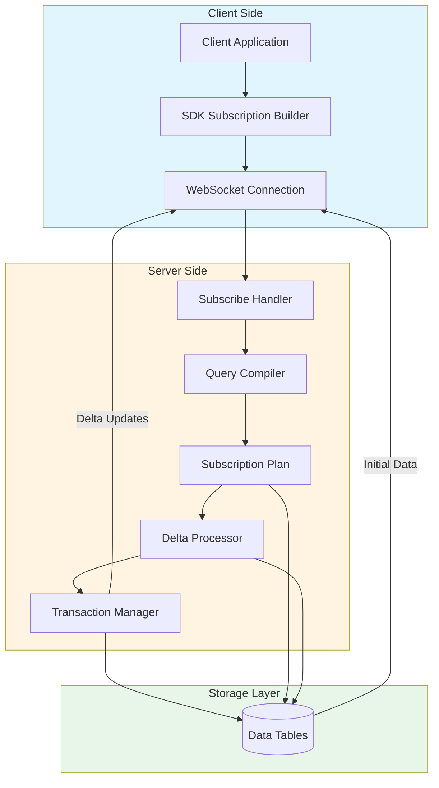
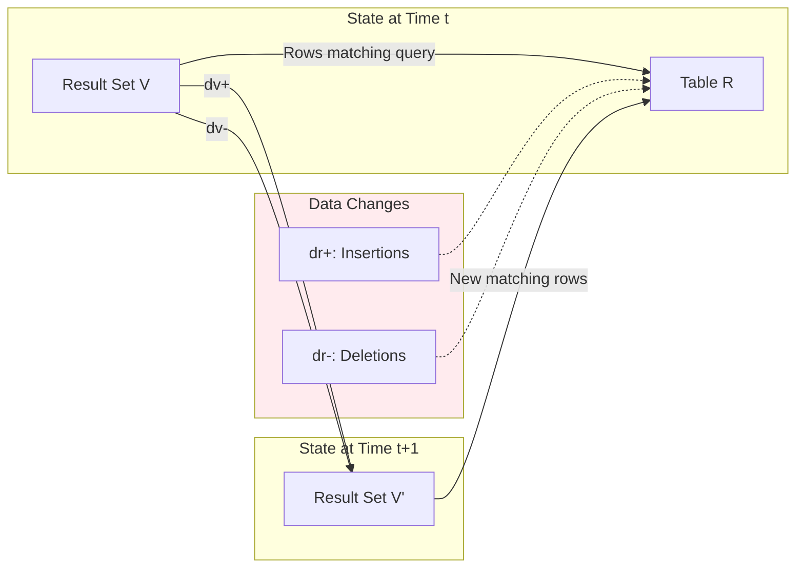
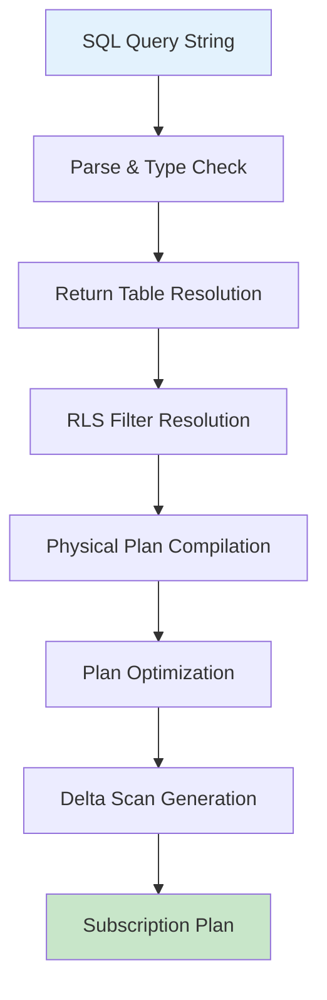

Subscriptions are the foundation of real-time data synchronization in SpacetimeDB, enabling clients to maintain local caches that stay synchronized with server-side data through incremental updates. This mechanism eliminates the need for polling and provides instant notifications when data changes, making it ideal for collaborative applications, multiplayer games, and any system requiring responsive state management.

## The Subscription Architecture

At its core, a subscription represents a **view over one or more tables** that is incrementally maintained as data changes. The system uses a delta-based approach where only the differences between states are transmitted and applied, rather than full table snapshots on every update.



The architecture demonstrates the bidirectional flow: clients issue subscription requests through WebSocket connections, the server compiles these into optimized execution plans, and delta updates flow back as transactions modify the underlying data. This design ensures minimal network traffic and optimal client-side cache consistency.

## Subscription Message Protocol

SpacetimeDB supports multiple subscription message types through its WebSocket protocol, each serving specific use cases in real-time applications.

### Client-Side Message Types

| Message Type | Purpose | Parameters | Use Case |
|-------------|---------|-----------|----------|
| `Subscribe` | Replace entire subscription set | `query_strings`, `request_id` | Initial connection or full refresh |
| `SubscribeSingle` | Add single query subscription | `query`, `request_id`, `query_id` | Granular data access |
| `SubscribeMulti` | Add multiple queries as unit | `query_strings`, `request_id`, `query_id` | Related query sets |
| `Unsubscribe` | Remove single subscription | `request_id`, `query_id` | Cleanup unused queries |
| `UnsubscribeMulti` | Remove multiple subscriptions | `request_id`, `query_id` | Batch cleanup |

Sources: [websocket.rs](crates/client-api-messages/src/websocket.rs#L93-L278)

### Server-Side Message Types

| Message Type | Trigger | Content |
|-------------|---------|---------|
| `InitialSubscription` | Legacy Subscribe request | Full result set |
| `SubscribeApplied` | SubscribeSingle/Multi success | Matching rows with query_id |
| `UnsubscribeApplied` | Unsubscribe success | Removed rows |
| `TransactionUpdate` | After reducer run | Row insertions/deletions |
| `TransactionUpdateLight` | After reducer (light mode) | Table-level updates |
| `SubscriptionError` | Any lifecycle error | Error context |

Sources: [websocket.rs](crates/client-api-messages/src/websocket.rs#L304-L399)

The protocol distinguishes between **legacy subscription behavior** (where `Subscribe` replaces all subscriptions) and **modern granular subscriptions** (where `SubscribeSingle`/`SubscribeMulti` add to existing subscriptions). This evolution provides flexibility for different application patterns while maintaining backward compatibility.

## Incremental Update Mechanism

The power of SpacetimeDB subscriptions lies in the mathematical foundation of incremental view maintenance. Rather than recomputing entire query results on every change, the system computes and transmits only the deltas.

### Delta Computation for Single Tables

For simple queries filtering a single table, delta computation is straightforward:

- **Insert plans**: Process newly inserted rows matching query conditions
- **Delete plans**: Process deleted or modified rows that no longer match conditions



The delta `dv` represents the difference between view states: `V' = V U dv`. The server sends `dv(+)` (rows to insert into the client's view) and `dv(-)` (rows to remove), enabling clients to update their local cache with minimal computation.

Sources: [lib.rs](crates/subscription/src/lib.rs#L59-L91)

### Delta Computation for Joins

For queries joining multiple tables, delta computation becomes more sophisticated. Given tables `R` and `S` with deltas `dr` and `ds`:

```text
dv(+) = R'ds(+) U dr(+)S' U dr(+)ds(-) U dr(-)ds(+)
dv(-) = R'ds(-) U dr(-)S' U dr(+)ds(+) U dr(-)ds(-)
```

This derivation shows that eight distinct query fragments must be evaluated to compute the complete delta for a two-table join:

| Fragment | Operation | Tables Involved |
|----------|-----------|-----------------|
| R'ds(+) | Insert matching rows | Current R, inserted S |
| dr(+)S' | Insert matching rows | Inserted R, current S |
| dr(+)ds(-) | Insert matching rows | Inserted R, deleted S |
| dr(-)ds(+) | Insert matching rows | Deleted R, inserted S |
| R'ds(-) | Remove matching rows | Current R, deleted S |
| dr(-)S' | Remove matching rows | Deleted R, current S |
| dr(+)ds(+) | Remove matching rows | Inserted R, inserted S |
| dr(-)ds(-) | Remove matching rows | Deleted R, deleted S |

Sources: [lib.rs](crates/subscription/src/lib.rs#L94-L161)

The system generates these fragments automatically through `Fragments::compile_from_plan`, ensuring efficient incremental updates even for complex multi-table queries without requiring clients to recompute joins locally.

## Query Compilation and Optimization

Subscriptions begin as SQL queries that must be compiled into executable physical plans. The compilation pipeline involves several stages:



The `compile_subscription` function orchestrates this pipeline, validating query length (50,000 byte limit), parsing the SQL, determining the return table and name, resolving Row-Level Security filters, and generating optimized physical plans that can be executed incrementally.

Sources: [lib.rs](crates/query/src/lib.rs#L25-L51)

### Join Edge Pruning

A critical optimization for performance is **join edge pruning**, which allows the system to selectively evaluate only relevant subscriptions when a table is modified. For example, given multiple subscriptions with different filter values:

```sql
SELECT a.* FROM a JOIN b ON a.id = b.id WHERE b.x = 1
SELECT a.* FROM a JOIN b ON a.id = b.id WHERE b.x = 2
SELECT a.* FROM a JOIN b ON a.id = b.id WHERE b.x = 3
```

When table `a` is updated, only the subscriptions where the updated `a.id` actually appears in the result set need to be evaluated. The `JoinEdge` structure captures the metadata needed for this pruning: table IDs, join columns, and filter columns.

Sources: [lib.rs](crates/subscription/src/lib.rs#L288-L340)

## Client SDK Integration

The TypeScript SDK provides a fluent API for managing subscriptions with lifecycle callbacks for handling asynchronous subscription establishment and error conditions.

### Subscription Builder Pattern

The `SubscriptionBuilder` offers a chainable API for configuring subscriptions:

```typescript
const subscription = connection.subscriptionBuilder()
  .onApplied((ctx) => {
    console.log("SDK client cache initialized.");
    console.log("Matching rows:", ctx.db.User);
  })
  .onError((ctx, error) => {
    console.error("Subscription failed:", error);
  })
  .subscribe("SELECT * FROM User WHERE active = true");

// Later, to clean up
subscription.unsubscribe();
```

The `onApplied` callback fires when the server sends the `SubscribeApplied` message containing initial matching rows, allowing applications to initialize their UI after the cache is populated. The `onError` callback handles subscription failures or unexpected removals.

Sources: [subscription_builder_impl.ts](crates/bindings-typescript/src/sdk/subscription_builder_impl.ts#L8-L125)

### Subscription Handle Lifecycle

The `SubscriptionHandleImpl` manages subscription state through several phases:

| State | Description | Valid Operations |
|-------|-------------|------------------|
| `#endedState: false`, `#activeState: false` | Pending | None (waiting for server) |
| `#endedState: false`, `#activeState: true` | Active | `unsubscribe()` |
| `#endedState: true` | Ended | None (terminal) |

Attempting to call `unsubscribe()` multiple times results in an error, preventing double-unsubscription bugs.

Sources: [subscription_builder_impl.ts](crates/bindings-typescript/src/sdk/subscription_builder_impl.ts#L136-L200)

### Connection Configuration

WebSocket connections support several configuration options that affect subscription behavior:

| Parameter | Type | Default | Effect |
|-----------|------|---------|--------|
| `compression` | `'gzip' \| 'none'` | `'none'` | Compress message payloads |
| `lightMode` | `boolean` | `false` | Send table-level updates instead of row-level |
| `confirmedReads` | `boolean` | `false` | Wait for durability confirmation before sending updates |

Light mode reduces bandwidth by sending only table identifiers that changed, requiring clients to refetch data. Confirmed reads ensure consistency at the cost of latency.

Sources: [subscribe.rs](crates/client-api/src/routes/subscribe.rs#L74-L138)

## WebSocket Connection Management

The subscription protocol operates over WebSocket connections, with the server providing several configuration knobs for connection lifecycle management:

| Configuration | Default | Purpose |
|--------------|---------|---------|
| `ping_interval` | 15s | Keep-alive ping frequency |
| `idle_timeout` | 30s | Connection closure on inactivity |
| `close_handshake_timeout` | 250ms | Graceful close window |
| `incoming_queue_length` | 16384 | Maximum queued messages |

The `handle_websocket` function upgrades HTTP connections to WebSocket, negotiates protocol (binary BSATN or JSON), authenticates the client, and spawns a client actor that handles message routing and connection maintenance.

Sources: [subscribe.rs](crates/client-api/src/routes/subscribe.rs#L95-L245)

<CgxTip>
The WebSocket connection generates a random `ConnectionId` if not provided by the client, which is then included in the `IdentityToken` message sent as the first server message. This ID is used to correlate subsequent events and should be logged for debugging connection issues.
</cgt_tip>

## Error Handling and Resilience

Subscriptions can fail at various points in their lifecycle, and the protocol provides structured error information through `SubscriptionError` messages:

```typescript
interface SubscriptionError {
  total_host_execution_duration_micros: number;
  request_id?: number;  // Client-provided if request-related
  query_id?: number;    // Client-provided if query-related
  table_id?: number;    // Table ID if error is table-specific
  error_message: string; // Human-readable description
}
```

If `table_id` is unset, the entire subscription set must be dropped. If set, only queries on that table need to be removed, allowing other subscriptions to survive the error.

Sources: [websocket.rs](crates/client-api-messages/src/websocket.rs#L375-L399)

## Best Practices

### Granular vs. Bulk Subscriptions

Use `SubscribeSingle` for most use cases instead of the legacy `Subscribe`:

| Approach | Advantages | Disadvantages |
|----------|------------|---------------|
| `SubscribeSingle` | Granular control, independent lifecycle, efficient updates | More message IDs to track |
| `Subscribe` | Simple API, single request | Replaces all subscriptions, inefficient for updates |
| `subscribeToAllTables` | Convenience for prototypes | High bandwidth, high memory usage |

Sources: [subscription_builder_impl.ts](crates/bindings-typescript/src/sdk/subscription_builder_impl.ts#L106-L124)

### Index-Aware Query Design

Write subscription queries that leverage indexes effectively, as the system uses `IxScan` operations for efficient data access. The `index_ids()` method on subscription plans reveals which indexes are used, allowing optimization of subscription queries.

<CgxTip>
Always include filter conditions in subscriptions that match table indexes. The subscription system prunes updates based on join edges, but full table scans will still occur if predicates aren't indexed.
</cg_tip>

### Connection Reestablishment

When a WebSocket connection drops, clients must re-establish subscriptions. The TypeScript SDK's `SubscriptionHandleImpl` tracks active state, and applications should monitor connection events and rebuild subscriptions after reconnection.

## Next Steps

Now that you understand subscriptions, explore these related concepts:

- **[SQL Queries for Real-Time Data](21-sql-queries-for-real-time-data)** - Advanced query patterns and optimization techniques
- **[Subscription Optimization Strategies](22-subscription-optimization-strategies)** - Deep dive into performance tuning
- **[Conflict Resolution and Consistency](23-conflict-resolution-and-consistency)** - Handling concurrent modifications
- **[TypeScript Client SDK Reference](26-typescript-client-sdk-reference)** - Complete API documentation for client-side development

The subscription system integrates deeply with SpacetimeDB's **[Identity and Authentication](18-identity-and-authentication)** model, where RLS filters can modify subscription results based on client identity. Understanding this integration is essential for building secure multi-tenant applications.
