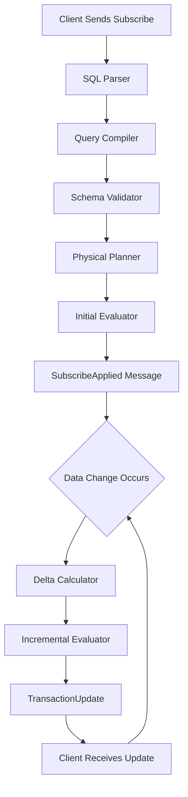
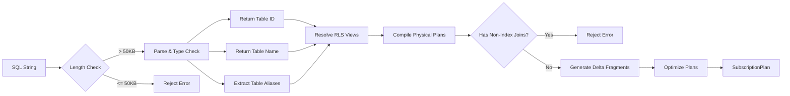

SQL queries in SpacetimeDB form the foundation of real-time data synchronization, enabling clients to precisely define what data they need while receiving automatic updates as that data changes. Unlike traditional databases where queries are executed once and return a snapshot, SpacetimeDB queries establish **live subscriptions** that continuously push relevant changes to connected clients through WebSocket connections.

The query system integrates SpacetimeDB's SQL parser with an incremental maintenance engine that computes deltas efficiently using relational algebra and index-based optimizations. This architecture enables high-throughput, low-latency updates even with complex multi-table joins.

Sources: [lib.rs](crates/query/src/lib.rs), [lib.rs](crates/subscription/src/lib.rs), [websocket.rs](crates/client-api-messages/src/websocket.rs)

## Architecture Overview

The real-time query pipeline consists of four coordinated layers: SQL parsing, query compilation with type checking, incremental plan generation, and WebSocket-based update delivery. When a client subscribes to a query, the system compiles it into physical execution plans, evaluates the initial result set, and establishes mechanisms to efficiently compute and deliver future changes.



This architecture ensures that query re-evaluation after each data change happens efficiently by computing only the necessary deltas rather than re-executing the entire query.

Sources: [websocket.rs](crates/client-api-messages/src/websocket.rs#L200-L350), [lib.rs](crates/subscription/src/lib.rs#L200-L399)

## SQL Query Syntax

SpacetimeDB supports a subset of standard SQL syntax optimized for real-time subscriptions. The core `SELECT` statement structure supports projection, filtering, joining, and limiting.

**Basic Select Syntax:**
```sql
SELECT column1, column2, ...
FROM table_name
WHERE condition
LIMIT n
```

The abstract syntax tree defines these components through the `SqlSelect` struct [sql.rs](crates/sql-parser/src/ast/sql.rs#L44-L57):
- **Project**: The column expressions to return in the result set
- **From**: The table source or join expression
- **Filter**: Optional WHERE clause predicate
- **Limit**: Optional row count restriction

**Supported Query Features:**

| Feature | Description | Example |
|---------|-------------|---------|
| Column Selection | Choose specific columns or use `*` | `SELECT id, name FROM users` |
| Filtering | WHERE clauses with predicates | `WHERE status = 'active' AND score > 100` |
| Joins | INNER JOIN with ON clause | `FROM orders JOIN customers ON orders.customer_id = customers.id` |
| Parameters | `:sender` auto-replacement | `WHERE owner_id = :sender` |
| Limiting | Restrict result count | `LIMIT 100` |

**Parameter Substitution:** The system automatically replaces the `:sender` parameter with the authenticated client's identity [sql.rs](crates/sql-parser/src/ast/sql.rs#L91-L97). This enables row-level security patterns where queries automatically filter to data owned by the requesting user.

Sources: [sql.rs](crates/sql-parser/src/ast/sql.rs#L44-L162), [lib.rs](crates/query/src/lib.rs#L16-L89)

## Subscription Mechanisms

SpacetimeDB provides three subscription models with different granularity and lifecycle management approaches.

### SubscribeSingle (Recommended)

Subscribes to a single SQL query with a client-assigned `query_id`. This is the preferred approach for most use cases as it provides fine-grained control over subscription lifecycle.

```rust
SubscribeSingle {
    query: "SELECT * FROM players WHERE room_id = :room_id",
    query_id: QueryId::new(1),
    request_id: 42
}
```

**Message Flow:**
1. Client sends `SubscribeSingle` message
2. Server validates and compiles query
3. Server sends `SubscribeApplied` with initial matching rows
4. Server sends `TransactionUpdate` on each relevant data change
5. Client can unsubscribe by sending `Unsubscribe` with the same `query_id`

Sources: [websocket.rs](crates/client-api-messages/src/websocket.rs#L215-L240)

### SubscribeMulti

Subscribes to multiple related queries under a single subscription ID. Useful when multiple queries share the same lifecycle requirements.

```rust
SubscribeMulti {
    query_strings: Box::from([
        "SELECT * FROM players WHERE room_id = :room_id".into(),
        "SELECT * FROM chat_messages WHERE room_id = :room_id".into()
    ]),
    query_id: QueryId::new(10),
    request_id: 43
}
```

Returns a `SubscribeMultiApplied` containing a `DatabaseUpdate` with rows from all queries in the subscription.

Sources: [websocket.rs](crates/client-api-messages/src/websocket.rs#L243-L263), [websocket.rs](crates/client-api-messages/src/websocket.rs#L405-L435)

### Subscribe (Legacy)

Replaces all existing subscriptions on the connection with a new set. Use `SubscribeSingle` for new implementations as it enables more granular control.

Sources: [websocket.rs](crates/client-api-messages/src/websocket.rs#L177-L210)

## Incremental Query Maintenance

The core innovation of SpacetimeDB's query system is its ability to incrementally maintain subscribed views without re-executing entire queries. For joins between tables R and S, the system uses delta calculus to compute exactly which rows should be inserted or removed from the result set when data changes.

**Delta Computation for Joins:**

When table R receives inserts (`dr(+)`) and deletes (`dr(-)`) and table S receives inserts (`ds(+)`) and deletes (`ds(-)`), the delta of the join view V is:

```
dv(+) = R'ds(+) ∪ dr(+)S' ∪ dr(+)ds(-) ∪ dr(-)ds(+)
dv(-) = R'ds(-) ∪ dr(-)S' ∪ dr(+)ds(+) ∪ dr(-)ds(-)
```

Where `R'` and `S'` represent the current state of each table after changes. This decomposition enables the system to compute updates by scanning only affected indexes rather than full table joins.

Sources: [lib.rs](crates/subscription/src/lib.rs#L100-L168)

### Delta Scans

The compiler generates multiple physical plan fragments for each subscription, each specialized for a particular delta scenario:

| Fragment Type | Purpose | Delta Configuration |
|---------------|---------|---------------------|
| Insert Plans | Find rows to add to subscription | Combinations of `Delta::Inserts` and `Delta::Deletes` on source tables |
| Delete Plans | Find rows to remove from subscription | Combinations of `Delta::Inserts` and `Delta::Deletes` on source tables |

For single-table queries, one insert fragment and one delete fragment are generated. For two-table joins, four fragments of each type are generated to handle all delta combinations.

<CgxTip>
The delta computation requires indexes on join columns. The system enforces this requirement and will reject subscription queries with non-indexed joins with the error "Subscriptions require indexes on join columns".
</CgxTip>

Sources: [lib.rs](crates/subscription/src/lib.rs#L169-L199), [lib.rs](crates/subscription/src/lib.rs#L455-L490)

### Join Edge Optimization

For subscriptions with joins, the system extracts `JoinEdge` metadata to optimize query re-evaluation. A join edge identifies:

1. The left and right tables being joined
2. The join columns on each table
3. The filter column on the right table

This enables query pruning when multiple subscriptions reference the same join pattern with different filter values. The system maintains a sorted set of join edges and can efficiently find all subscriptions affected by a particular table update.

Sources: [lib.rs](crates/subscription/src/lib.rs#L240-L310)

## Query Compilation Process

The query compilation pipeline transforms SQL strings into optimized execution plans suitable for incremental maintenance.



**Compilation Steps:**

1. **Length Validation**: Queries exceeding 50,000 UTF-8 bytes are rejected to prevent stack overflow from deeply nested conditions [lib.rs](crates/query/src/lib.rs#L16-L22)

2. **Parse and Type Check**: The `parse_and_type_sub()` function validates SQL syntax and ensures column types match the schema [lib.rs](crates/query/src/lib.rs#L28-L30)

3. **Table Resolution**: Extracts the return table ID and name from the query plan [lib.rs](crates/query/src/lib.rs#L32-L38)

4. **RLS Resolution**: Applies row-level security filters based on client authentication context [lib.rs](crates/query/src/lib.rs#L41-L44)

5. **Physical Compilation**: Transforms logical plans into physical execution plans with index scans [lib.rs](crates/query/src/lib.rs#L44-L47)

6. **Join Validation**: Ensures all joins use indexes on join columns [lib.rs](crates/subscription/src/lib.rs#L470-L474)

7. **Fragment Generation**: Creates insert and delete plan fragments for delta computation [lib.rs](crates/subscription/src/lib.rs#L482-L485)

Sources: [lib.rs](crates/query/src/lib.rs#L16-L89), [lib.rs](crates/subscription/src/lib.rs#L438-L538)

## Real-Time Update Protocol

After establishing a subscription, clients receive updates through structured WebSocket messages that describe exactly what changed in their subscribed data.

### SubscribeApplied Response

The initial response containing all rows currently matching the query:

```rust
SubscribeApplied {
    request_id: 42,  // Matches client request
    total_host_execution_duration_micros: 1250,
    query_id: QueryId::new(1),
    rows: SubscribeRows {
        table_id: TableId(3),
        table_name: "players".into(),
        table_rows: TableUpdate {
            inserts: [/* BSATN-encoded row data */],
            deletes: []  // Always empty for initial state
        }
    }
}
```

Sources: [websocket.rs](crates/client-api-messages/src/websocket.rs#L319-L345)

### TransactionUpdate Response

Sent after each reducer that affects subscribed rows:

```rust
TransactionUpdate {
    status: UpdateStatus::Committed(Update {
        database_update: DatabaseUpdate {
            table_updates: [
                TableUpdate {
                    table_id: TableId(3),
                    table_name: "players".into(),
                    inserts: [/* New matching rows */],
                    deletes: [/* Rows no longer matching */],
                    ops: [/* Operation details */]
                }
            ]
        }
    }),
    timestamp: Timestamp(1698765432000000000),
    caller_identity: Identity::from([/* 16 bytes */]),
    connection_id: ConnectionId::from_le_byte_array([/* 16 bytes */]),
    // ... additional fields
}
```

**Update Status Types:**

| Status | Meaning | When Sent |
|--------|---------|-----------|
| `Committed` | Transaction succeeded and affected subscribed data | When subscribed rows are inserted/deleted/updated |
| `Failed` | Reducer failed | When client's own reducer fails |
| `OutOfEnergy` | Reducer exceeded energy limit | When client's reducer runs out of energy |

Sources: [websocket.rs](crates/client-api-messages/src/websocket.rs#L465-L540)

### Error Handling

The system communicates subscription errors through `SubscriptionError` messages:

```rust
SubscriptionError {
    total_host_execution_duration_micros: 100,
    request_id: Some(42),  // None if error occurred during TransactionUpdate
    query_id: Some(QueryId::new(1)),
    table_id: Some(TableId(3)),  // None if entire subscription is dropped
    error: "Subscription requires indexes on join columns".into()
}
```

If `request_id`, `query_id`, and `table_id` are all `None`, the client should drop all subscriptions.

Sources: [websocket.rs](crates/client-api-messages/src/websocket.rs#L362-L403)

## Message Formats and Compression

SpacetimeDB supports two wire formats with optional compression to balance bandwidth and CPU usage:

**Protocol Versions:**
- `v1.json.spacetimedb`: JSON-encoded messages
- `v1.bsatn.spacetimedb`: Binary SpacetimeDB Algebraic Type Notation (BSATN)

**Compression Options:**
- `None`: No compression
- `Brotli`: Brotli compression
- `Gzip`: Gzip compression

Compression is negotiated via WebSocket subprotocol selection and applied to entire `ServerMessage` payloads. The compression tag is prepended to compressed messages to enable client-side decompression.

**Client Configuration:**
```rust
ClientConfig {
    protocol: Protocol::Binary,  // Or Protocol::Text
    compression: Compression::Brotli,
    tx_update_full: true,  // If false, uses TransactionUpdateLight
    confirmed_reads: false  // If true, waits for WAL confirmation before sending updates
}
```

<CgxTip>
For bandwidth-constrained clients, use the `light` parameter when connecting. This configures `tx_update_full: false`, causing the server to send `TransactionUpdateLight` messages that only contain table operation counts rather than full row data. The client can then request specific rows via `OneOffQuery` as needed.
</CgxTip>

Sources: [websocket.rs](crates/client-api-messages/src/websocket.rs#L75-L95), [subscribe.rs](crates/client-api/src/routes/subscribe.rs#L120-L130)

## Query Optimization Strategies

Effective use of SQL queries in SpacetimeDB requires understanding how the system optimizes for real-time performance.

### Index Requirements

**Mandatory Indexes:**
- Join columns: All joins must use indexes on the joined columns
- Filter columns: WHERE clause columns should be indexed for efficient evaluation

**Recommended Indexes:**
- Columns frequently used in filters across multiple subscriptions
- Foreign key columns used in joins

The system rejects subscription queries with non-indexed joins to prevent full table scans on every data change.

Sources: [lib.rs](crates/subscription/src/lib.rs#L470-L474)

### Query Granularity

**Fine-Grained Subscriptions:**
- Use specific WHERE clauses to limit subscribed data
- Subscribe to only the columns you need (avoid `SELECT *` when unnecessary)
- Split complex queries into multiple simpler subscriptions if they have different update frequencies

**Example:**
```sql
-- Good: Specific subscription for active players in a room
SELECT id, name, score FROM players 
WHERE room_id = :room_id AND status = 'active'

-- Less optimal: Broad subscription requiring more delta computation
SELECT * FROM players WHERE room_id = :room_id
```

### Avoiding Overlapping Subscriptions

Multiple subscriptions with overlapping result sets cause the server to send duplicate rows in update messages. Consider consolidation or use client-side deduplication if overlap is necessary.

Sources: [websocket.rs](crates/client-api-messages/src/websocket.rs#L236-L238)

### Limit Usage

While `LIMIT` clauses reduce the initial result set size, the system must still evaluate the full query to determine which rows to limit. For large datasets, use WHERE clauses to filter before limiting rather than relying solely on LIMIT.

## Best Practices

1. **Always use indexes on join columns** - This is mandatory for subscriptions
2. **Use parameterized queries** - Leverage `:sender` for row-level security
3. **Prefer SubscribeSingle** - Provides finer control over subscription lifecycle
4. **Set reasonable query limits** - Queries exceeding 50KB are rejected
5. **Monitor subscription counts** - Too many subscriptions per client can impact performance
6. **Use appropriate compression** - Balance CPU and bandwidth for your use case
7. **Handle SubscriptionError** - Implement proper error handling and recovery logic
8. **Unsubscribe when done** - Use Unsubscribe/UnsubscribeMulti to free server resources

## Next Steps

To deepen your understanding of real-time data in SpacetimeDB:

- [Understanding Subscriptions](20-understanding-subscriptions) - Learn about the subscription lifecycle and architecture
- [Subscription Optimization Strategies](22-subscription-optimization-strategies) - Advanced techniques for performance tuning
- [Conflict Resolution and Consistency](23-conflict-resolution-and-consistency) - How SpacetimeDB handles concurrent updates
- [TypeScript Client SDK Reference](26-typescript-client-sdk-reference) - Practical implementation details
- [Query Optimization](31-query-optimization) - Database-level query optimization techniques
