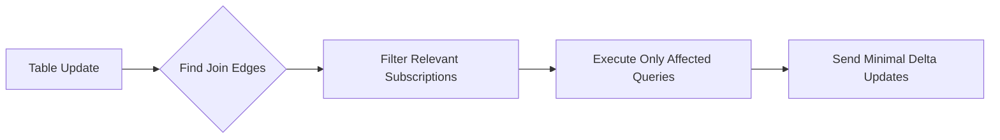

Subscription optimization in SpacetimeDB focuses on minimizing computational overhead and network traffic by employing incremental view maintenance, index-based query execution, and intelligent pruning strategies. This guide explores the architectural patterns and implementation techniques that enable efficient real-time data synchronization.

## Incremental Delta Maintenance

At the core of SpacetimeDB's subscription model lies the mathematical foundation of incremental view maintenance. Rather than re-evaluating entire queries when data changes, the system computes only the delta—the difference between the previous and current states of a subscription view. This approach transforms subscription updates from O(n×m) complexity to O(Δ), where Δ represents the magnitude of changes.

The system maintains subscription views through the elegant delta calculus: V' = V ∪ dv, where V represents the view at time t, V' at time t+1, and dv the computed delta. For join queries involving two tables R and S, the delta computation expands to a sophisticated eight-fragment algorithm comprising four insert fragments and four delete fragments [crates/subscription/src/lib.rs#L100-L150](crates/subscription/src/lib.rs#L100-L150).

The mathematical derivation for join deltas demonstrates how the system avoids full recomputation:
- **Inserts**: R'ds(+) ∪ dr(+)S' ∪ dr(+)ds(-) ∪ dr(-)ds(+)
- **Deletes**: R'ds(-) ∪ dr(-)S' ∪ dr(+)ds(+) ∪ dr(-)ds(-)

Where dr and ds represent deltas from tables R and S, with (+) denoting insertions and (-) deletions. Each fragment corresponds to a specific combination of delta operations, allowing the system to compute only the necessary changes without scanning entire tables [crates/subscription/src/lib.rs#L130-L180](crates/subscription/src/lib.rs#L130-L180).

## Index-Based Execution Requirements

SpacetimeDB enforces strict index requirements for subscription queries to guarantee optimal performance. The compilation process explicitly rejects queries containing non-index joins, mandating that all join operations utilize indexed columns [crates/subscription/src/lib.rs#L430-L435](crates/subscription/src/lib.rs#L430-L435). This design choice ensures that subscription updates leverage efficient index lookups rather than expensive full-table scans or hash joins.

The system extracts index identifiers from subscription fragments during compilation, building a dependency graph of which indexes each subscription requires [crates/subscription/src/lib.rs#L65-L85](crates/subscription/src/lib.rs#L65-L85). This metadata enables the runtime to track index modifications and trigger only the subscriptions affected by specific index changes.

For join queries specifically, the system implements specialized index join operators (IxJoin) that combine pipelined execution with indexed lookups. These operators support both unique and non-unique indexes, with special optimizations for unique indexes that avoid building in-memory hash tables [crates/execution/src/pipelined.rs#L800-L1200](crates/execution/src/pipelined.rs#L800-L1200).

## Join Edge Pruning Strategy

A sophisticated optimization technique for join queries involves the extraction of join edges—metadata describing the relationships between tables in a join. The JoinEdge structure captures the essential components: the left and right table identifiers, the join columns, and any filter conditions applied to the right table [crates/subscription/src/lib.rs#L220-L260](crates/subscription/src/lib.rs#L220-L260).

This optimization addresses a common scenario: multiple subscriptions that join the same two tables on identical columns but with different filter conditions on the right table. Without join edge pruning, an update to the left table would trigger evaluation of all such subscriptions. With join edge pruning, the system identifies exactly which subscriptions require re-evaluation based on the specific join column value that changed [crates/subscription/src/lib.rs#L285-L300](crates/subscription/src/lib.rs#L285-L300).

The join edge extraction requires specific conditions: a unique join index, single-column index lookup on the right table, and no self-joins. These constraints ensure that the extracted join edge provides sufficient information for effective pruning without false positives [crates/subscription/src/lib.rs#L415-L460](crates/subscription/src/lib.rs#L415-L460).

## Pipelined Execution Model

Subscription queries execute through a pipelined executor that avoids materializing intermediate results, significantly reducing memory allocation overhead. The pipelined execution model processes rows through operators like filters, projections, and joins in a streaming fashion, with each operator passing rows directly to the next operator without intermediate buffering [crates/execution/src/pipelined.rs#L1-L50](crates/execution/src/pipelined.rs#L1-L50).

The system includes an `is_empty` optimization that checks whether a plan contains an empty delta scan before executing it. This short-circuit evaluation prevents unnecessary work when no actual data changes have occurred, which is particularly valuable for subscription update cycles where most deltas may be empty [crates/execution/src/pipelined.rs#L1200-L1250](crates/execution/src/pipelined.rs#L1200-L1250).

<CgxTip>
The pipelined executor tracks execution metrics including rows scanned and bytes scanned, enabling real-time performance monitoring and identifying bottlenecks in subscription query plans. Use these metrics to identify subscriptions that require optimization through additional indexes or query restructuring.
</CgxTip>

## Query Plan Optimization

Before execution, subscription plans undergo optimization through a multi-stage process that transforms the physical plan for optimal performance. The optimization phase applies rewrite rules to push filters down, eliminate redundant operations, and select the most efficient join order [crates/query/src/lib.rs#L30-L40](crates/query/src/lib.rs#L30-L40).

The system also resolves Row-Level Security (RLS) filters during compilation, integrating authorization constraints directly into the query plan. This ensures that subscription queries only return data the client is authorized to access, without requiring runtime security checks for each row [crates/query/src/lib.rs#L25-L35](crates/query/src/lib.rs#L25-L35).

A critical safety mechanism limits SQL query length to 50,000 UTF-8 bytes, preventing stack overflow attacks from queries with deeply nested AND/OR conditions that could cause compilation failures or excessive resource consumption [crates/query/src/lib.rs#L18-L21](crates/query/src/lib.rs#L18-L21).

<CgxTip>
When designing subscription queries, prefer indexed predicates and limit query complexity to stay well within the 50,000 byte limit. Complex filters with many nested conditions should be decomposed into multiple simpler subscriptions when possible.
</CgxTip>

## Performance Best Practices

### Index Strategy

Design your table indexes specifically for your subscription workload patterns. Since subscriptions require indexes on all join columns, ensure that frequently joined columns have appropriate indexes. Consider composite indexes for multi-column joins where the leading column provides good selectivity [crates/physical-plan/src/plan.rs](crates/physical-plan/src/plan.rs).

### Subscription Granularity

Break complex subscriptions into multiple simpler subscriptions when appropriate. A single subscription joining three or more tables with complex filters may be less efficient than multiple subscriptions each joining two tables, as the delta computation complexity grows exponentially with the number of joined tables [crates/subscription/src/lib.rs#L190-L210](crates/subscription/src/lib.rs#L190-L210).

### Filter Placement

Place highly selective filters early in your query to minimize the number of rows processed by join operators. The optimizer attempts to push filters down, but explicit filter placement can guide the optimization process. Indexable filters on join columns are particularly valuable as they enable the join edge pruning optimization [crates/execution/src/pipelined.rs#L500-L600](crates/execution/src/pipelined.rs#L500-L600).

### Parameterized Queries

Utilize parameterized subscriptions when possible to enable query plan reuse. The compilation process detects parameter presence and caches plans for efficient re-evaluation with different parameter values. This is especially beneficial for subscriptions that differ only in filter predicates [crates/query/src/lib.rs#L15-L30](crates/query/src/lib.rs#L15-L30).

## Monitoring and Metrics

The subscription system provides comprehensive execution metrics that help identify optimization opportunities. The `ExecutionMetrics` structure tracks rows scanned, bytes scanned, and other performance indicators for each subscription update cycle [crates/execution/src/pipelined.rs#L100-L150](crates/execution/src/pipelined.rs#L100-L150).

Monitor these metrics to identify:
- Subscriptions scanning excessive rows (indicates missing indexes)
- Subscriptions with high byte counts (indicates wide projections or large row sizes)
- Uneven distribution of update costs (indicates opportunities for query restructuring)

The metrics collection is integrated throughout the pipelined execution engine, providing granular visibility into which operators consume the most resources [crates/execution/src/pipelined.rs#L1200-L1300](crates/execution/src/pipelined.rs#L1200-L1300).

## Next Steps

To deepen your understanding of SpacetimeDB's subscription and data synchronization architecture, explore these related topics:

- [Understanding Subscriptions](20-understanding-subscriptions) - Learn the fundamental concepts and API usage for SpacetimeDB subscriptions
- [SQL Queries for Real-Time Data](21-sql-queries-for-real-time-data) - Master the SQL syntax and query patterns for effective subscriptions
- [Query Optimization](31-query-optimization) - Discover advanced query optimization techniques and execution engine details
- [Indexing Strategies](30-indexing-strategies) - Understand how to design effective indexes for your data access patterns
