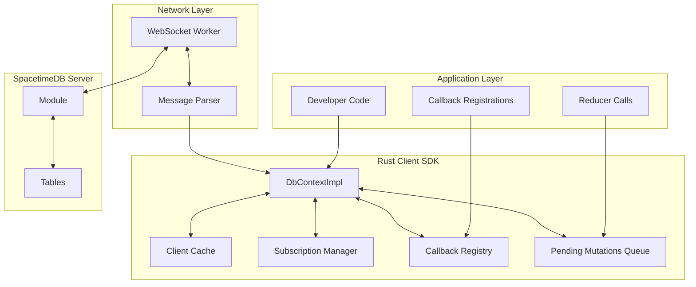
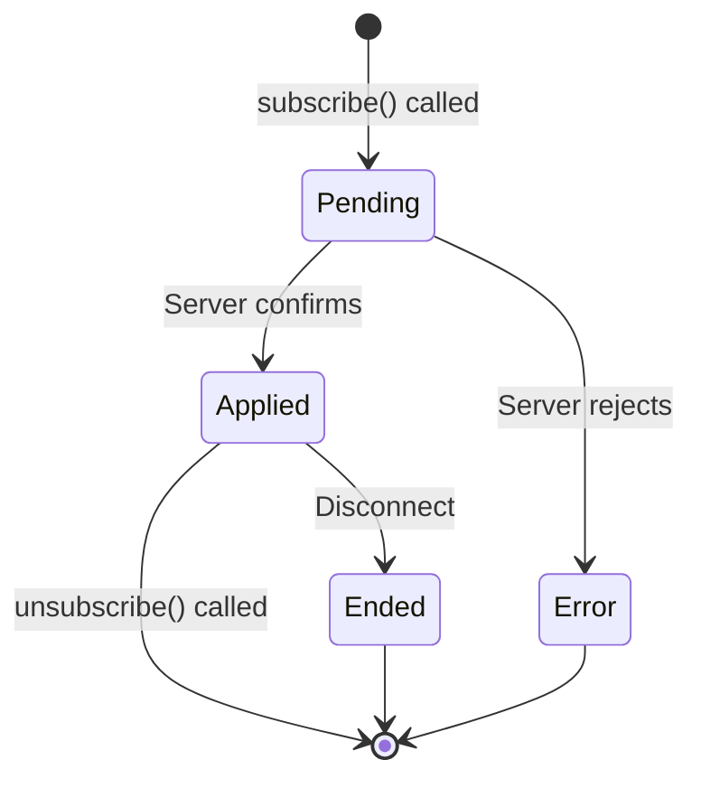

The SpacetimeDB Rust Client SDK enables native Rust applications to establish bidirectional connections with SpacetimeDB modules, subscribe to real-time data changes, and invoke server-side reducers. This comprehensive reference covers the SDK's architecture, core types, connection management, event handling, and practical usage patterns for intermediate developers.

Sources: [lib.rs](sdks/rust/src/lib.rs#L1-L76), [quickstart-chat example](sdks/rust/examples/quickstart-chat/main.rs#L1-L200)

## Architecture Overview

The Rust Client SDK operates on a **reactive event-driven model** where background WebSocket workers handle message transmission while developers register callbacks that respond to database state changes. The SDK maintains a local client cache of subscribed table rows, automatically updating this cache as server-side modifications arrive and invoking registered callbacks for each change event.

The architecture consists of several coordinated components: a `DbContextImpl` that manages connection state and client cache, callback systems for tables and reducers, subscription managers for query subscriptions, and a credential storage utility for authentication tokens. The design prevents deadlocks by deferring state mutations through a `pending_mutations` queue that gets processed during message advancement cycles.



Sources: [db_connection.rs](sdks/rust/src/db_connection.rs#L6-L17), [db_connection.rs](sdks/rust/src/db_connection.rs#L55-L91)

## Installation and Setup

The SpacetimeDB Rust Client SDK is distributed as a Cargo crate named `spacetimedb_sdk`. Add it to your project's dependencies:

```toml
[dependencies]
spacetimedb_sdk = "0.9"
```

The SDK also requires **module-specific bindings** generated by the SpacetimeDB CLI. These bindings provide type-safe access to your module's tables, reducers, and event contexts. Generate them by running:

```bash
spacetime generate --rust
```

This creates a `module_bindings` directory containing generated Rust code that you should include in your project with `mod module_bindings;`. The generated code includes `DbConnection`, `EventContext`, `ReducerEventContext`, `SubscriptionEventContext`, and other module-specific types that implement the SDK's traits.

Sources: [lib.rs](sdks/rust/src/lib.rs#L4-L7), [lib.rs](sdks/rust/src/lib.rs#L39-L65)

## Connection Management

### Building Database Connections

The `DbConnectionBuilder` provides a fluent API for configuring connections to SpacetimeDB modules. Create a connection by chaining builder methods and calling `build()`:

```rust
use spacetimedb_sdk::{DbConnection, credentials, Identity};

let ctx = DbConnection::builder()
    .on_connect(|ctx, identity, token| {
        println!("Connected as {}", identity);
        credentials::File::new("my_app").save(token).unwrap();
    })
    .on_connect_error(|ctx, err| {
        eprintln!("Connection failed: {}", err);
    })
    .on_disconnect(|ctx, err| {
        println!("Disconnected: {:?}", err);
    })
    .with_token(credentials::File::new("my_app").load().unwrap())
    .with_module_name("my_database")
    .with_uri("http://localhost:3000")
    .build()
    .expect("Failed to connect");
```

**Connection Builder Configuration Options**:

| Method | Purpose | Required |
|--------|---------|----------|
| `with_module_name(&str)` | Specifies the SpacetimeDB module name | Yes |
| `with_uri(&str)` | Sets the SpacetimeDB host URI | Yes |
| `with_token(Option<String>)` | Provides authentication token for re-authentication | No |
| `on_connect(Fn)` | Registers callback invoked upon successful connection | No |
| `on_connect_error(Fn)` | Registers callback for connection failures | No |
| `on_disconnect(Fn)` | Registers callback for disconnection events | No |

Sources: [credentials.rs](sdks/rust/src/credentials.rs#L103-L123), [quickstart-chat example](sdks/rust/examples/quickstart-chat/main.rs#L36-L55)

### Connection Lifecycle and Message Processing

The SDK operates on an **event processing loop** where you explicitly advance the connection to process incoming messages. Two primary methods control this lifecycle:

```rust
// Non-blocking: processes one message if available, returns immediately
ctx.advance_one_message()?;

// Blocking: sleeps until a message is available, then processes it
ctx.advance_one_message_blocking()?;
```

For most applications, use the convenience method `run_threaded()` which spawns a dedicated thread to continuously process messages:

```rust
ctx.run_threaded();
```

This method runs an infinite loop calling `advance_one_message_blocking()`, handling all WebSocket communication and callback invocations in the background thread. Your main thread can then focus on user interaction or other tasks.

<CgxTip>Never call `advance_one_message()` or `advance_one_message_blocking()` from multiple threads simultaneously. The SDK uses internal locking that assumes single-threaded message processing. Use `run_threaded()` for a simple solution or manage the loop manually in a single thread.</CgxTip>

Sources: [db_connection.rs](sdks/rust/src/db_connection.rs#L474-L548)

## Event System

The SDK's event system notifies your application of state changes through typed events passed to callbacks. The `Event<R>` enum encompasses all possible state changes, where `R` is the module-specific reducer enum.

### Event Types

```rust
pub enum Event<R> {
    Reducer(ReducerEvent<R>),
    SubscribeApplied,
    UnsubscribeApplied,
    Disconnected,
    SubscribeError(Error),
    UnknownTransaction,
}
```

| Event Variant | When Triggered | Associated Callbacks |
|---------------|----------------|---------------------|
| `Reducer` | A reducer executes (committed or failed) | Reducer callbacks, row callbacks from modifications |
| `SubscribeApplied` | A subscription becomes active | Subscription-applied callbacks, row insert callbacks |
| `UnsubscribeApplied` | A subscription ends normally | Unsubscribe callbacks, row delete callbacks |
| `Disconnected` | Connection terminates | Disconnect callbacks |
| `SubscribeError` | Subscription fails | Subscription error callbacks |
| `UnknownTransaction` | Unassociated transaction commits | Row callbacks from modifications |

### Reducer Events

`ReducerEvent<R>` provides detailed information about reducer executions:

```rust
pub struct ReducerEvent<R> {
    pub timestamp: Timestamp,
    pub status: Status,
    pub caller_identity: Identity,
    pub caller_connection_id: Option<ConnectionId>,
    pub energy_consumed: Option<u128>,
    pub reducer: R,
}
```

The `status` field indicates the reducer's outcome:

```rust
pub enum Status {
    Committed,           // Reducer succeeded and committed mutations
    Failed(Box<str>),    // Reducer failed with error message
    OutOfEnergy,         // Reducer aborted due to insufficient energy
}
```

Check the status in reducer callbacks to handle failures appropriately:

```rust
fn on_my_reducer(ctx: &ReducerEventContext, args: &MyReducerArgs) {
    match &ctx.event.status {
        Status::Committed => {
            println!("Reducer succeeded, consumed {:?} eV", ctx.event.energy_consumed);
        }
        Status::Failed(msg) => {
            eprintln!("Reducer failed: {}", msg);
        }
        Status::OutOfEnergy => {
            eprintln!("Reducer ran out of energy");
        }
    }
}
```

Sources: [event.rs](sdks/rust/src/event.rs#L1-L113), [quickstart-chat example](sdks/rust/examples/quickstart-chat/main.rs#L166-L178)

## Table Operations and Client Cache

The client cache maintains locally subscribed table rows, providing fast access without round trips to the server. Access tables through the `ctx.db` field on your connection context.

### Table Traits

Two traits define table operations:

```rust
pub trait Table {
    type Row: 'static;
    type EventContext;
    
    fn count(&self) -> u64;
    fn iter(&self) -> impl Iterator<Item = Self::Row> + '_;
    
    fn on_insert(&self, callback: impl FnMut(&Self::EventContext, &Self::Row)) -> Self::InsertCallbackId;
    fn remove_on_insert(&self, callback: Self::InsertCallbackId);
    
    fn on_delete(&self, callback: impl FnMut(&Self::EventContext, &Self::Row)) -> Self::DeleteCallbackId;
    fn remove_on_delete(&self, callback: Self::DeleteCallbackId);
}

pub trait TableWithPrimaryKey: Table {
    fn on_update(&self, callback: impl FnMut(&Self::EventContext, &Self::Row, &Self::Row)) -> Self::UpdateCallbackId;
    fn remove_on_update(&self, callback: Self::UpdateCallbackId);
}
```

**Table Methods**:

| Method | Purpose | Use Case |
|--------|---------|----------|
| `count()` | Returns number of cached rows | Statistics, UI counters |
| `iter()` | Iterator over all cached rows | Batch processing, filtering |
| `on_insert()` | Register insert callback | Notify on new data |
| `on_delete()` | Register delete callback | Cleanup on removal |
| `on_update()` | Register update callback (PK only) | Track modifications |

### Registering Table Callbacks

Callback registration follows a consistent pattern across table operations:

```rust
// Register insert callback
let insert_id = ctx.db.user().on_insert(|ctx, user| {
    println!("New user: {}", user.name);
});

// Register update callback (requires primary key)
let update_id = ctx.db.user().on_update(|ctx, old, new| {
    if old.name != new.name {
        println!("User renamed: {} -> {}", old.name, new.name);
    }
});

// Register delete callback
let delete_id = ctx.db.user().on_delete(|ctx, user| {
    println!("User left: {}", user.name);
});

// Remove callbacks when no longer needed
ctx.db.user().remove_on_insert(insert_id);
ctx.db.user().remove_on_update(update_id);
ctx.db.user().remove_on_delete(delete_id);
```

<CgxTip>Always check the event type in your row callbacks to avoid re-processing rows received during the initial subscription. Use `matches!(ctx.event, Event::SubscribeApplied)` to filter out subscription-time callbacks if needed.</CgxTip>

Sources: [table.rs](sdks/rust/src/table.rs#L1-L78), [quickstart-chat example](sdks/rust/examples/quickstart-chat/main.rs#L94-L142)

## Subscriptions

Subscriptions define which table rows the client cache should maintain. Use SQL queries to specify your subscription criteria.

### Creating Subscriptions

```rust
use spacetimedb_sdk::DbContext;

ctx.subscription_builder()
    .on_applied(|ctx| {
        println!("Subscription applied! Now have {} rows", ctx.db.message().count());
    })
    .on_error(|ctx, err| {
        eprintln!("Subscription error: {}", err);
    })
    .subscribe(["SELECT * FROM user", "SELECT * FROM message"]);
```

The `subscription_builder()` method returns a fluent API for configuring multiple SQL queries with callbacks.

### Subscription Callbacks

| Callback | Invocation Timing | Use Case |
|----------|-------------------|----------|
| `on_applied` | When subscription becomes active | Initialize UI, process initial data |
| `on_error` | When subscription fails | Display error messages, retry logic |

### Subscription Lifecycle



The subscription manager tracks active subscriptions and handles automatic cleanup on disconnect. Note that subscriptions don't automatically reconnect after disconnects—you must re-subscribe in your disconnect handler if you want to resume subscriptions.

Sources: [subscription.rs](sdks/rust/src/subscription.rs#L1-L150), [quickstart-chat example](sdks/rust/examples/quickstart-chat/main.rs#L183-L200)

## Credential Management

The `credentials` module provides persistent storage for authentication tokens, enabling your application to reconnect with the same identity across sessions.

### Credential Storage

```rust
use spacetimedb_sdk::credentials;

// Create a credential store file
let creds = credentials::File::new("my_app");

// Save token received during on_connect callback
fn on_connect(_ctx, identity, token) {
    creds.save(token).expect("Failed to save credentials");
}

// Load token when building connection
let token = creds.load().expect("Failed to load credentials");

let ctx = DbConnection::builder()
    .with_token(token)
    .with_module_name("my_db")
    .with_uri("http://localhost:3000")
    .build()?;
```

**Credential Storage Details**:

- Files are stored in `~/.spacetimedb_client_credentials/` by default
- Credentials are serialized in BSATN format (Binary SATisfiability Number)
- The `load()` method returns `None` if no credentials exist
- Different applications should use unique keys to avoid credential conflicts
- Use distinct keys per SpacetimeDB instance/cluster when connecting to multiple environments

Sources: [credentials.rs](sdks/rust/src/credentials.rs#L1-L152)

## Error Handling

The SDK uses a comprehensive error type `Error` that covers all failure modes:

```rust
pub enum Error {
    Disconnected,                              // Connection already terminated
    FailedToConnect { source: InternalError }, // Connection establishment failed
    SubscriptionError { error: String },      // Server rejected subscription query
    AlreadyEnded,                             // Operation on ended subscription
    AlreadyUnsubscribed,                      // Double unsubscribe attempt
    Internal(InternalError),                  // Internal SDK errors
}
```

**Error Handling Patterns**:

```rust
// Connection error handling
DbConnection::builder()
    .on_connect_error(|ctx, err| {
        match err {
            Error::FailedToConnect { source } => {
                eprintln!("Network error: {}", source);
                // Retry logic here
            }
            Error::SubscriptionError { error } => {
                eprintln!("Query syntax error: {}", error);
            }
            _ => eprintln!("Unexpected error: {}", err),
        }
    })
    .build();

// Runtime error handling
match ctx.advance_one_message() {
    Ok(has_more) => { /* continue */ }
    Err(Error::Disconnected) => {
        println!("Clean disconnect");
    }
    Err(Error::SubscriptionError { error }) => {
        eprintln!("Subscription failed: {}", error);
    }
    Err(e) => {
        eprintln!("Unexpected error: {}", e);
    }
}
```

Internal errors include helpful messages suggesting actions like re-running `spacetime generate` for outdated bindings, making debugging straightforward.

Sources: [error.rs](sdks/rust/src/error.rs#L1-L105)

## Complete Example: Chat Application

The quickstart-chat example demonstrates the full SDK lifecycle:

```rust
mod module_bindings;
use module_bindings::*;

use spacetimedb_sdk::{credentials, DbContext, Event, Status, Table, TableWithPrimaryKey};

fn main() {
    let ctx = connect_to_db();
    register_callbacks(&ctx);
    subscribe_to_tables(&ctx);
    ctx.run_threaded();
    user_input_loop(&ctx);
}

fn connect_to_db() -> DbConnection {
    DbConnection::builder()
        .on_connect(on_connected)
        .on_connect_error(on_connect_error)
        .on_disconnect(on_disconnected)
        .with_token(credentials::File::new("quickstart-chat").load().unwrap())
        .with_module_name("quickstart-chat")
        .with_uri("http://localhost:3000")
        .build()
        .expect("Failed to connect")
}

fn register_callbacks(ctx: &DbConnection) {
    ctx.db.user().on_insert(|_ctx, user| {
        if user.online {
            println!("User {} connected.", user.name.unwrap());
        }
    });
    
    ctx.db.user().on_update(|_ctx, old, new| {
        if old.name != new.name {
            println!("User renamed: {} -> {}", old.name.unwrap(), new.name.unwrap());
        }
    });
    
    ctx.db.message().on_insert(|ctx, msg| {
        if !matches!(ctx.event, Event::SubscribeApplied) {
            println!("Message: {}", msg.text);
        }
    });
    
    ctx.reducers.on_send_message(|ctx, text| {
        if let Status::Failed(err) = &ctx.event.status {
            eprintln!("Failed to send: {}", err);
        }
    });
}

fn subscribe_to_tables(ctx: &DbConnection) {
    ctx.subscription_builder()
        .on_applied(|ctx| {
            println!("Subscribed! Have {} messages", ctx.db.message().count());
        })
        .subscribe(["SELECT * FROM user", "SELECT * FROM message"]);
}
```

Sources: [quickstart-chat example](sdks/rust/examples/quickstart-chat/main.rs#L1-L228)

## Type Reference Table

| Type | Module | Purpose |
|------|--------|---------|
| `DbConnection` | Generated | Connection handle with module-specific methods |
| `DbConnectionBuilder` | `spacetimedb_sdk` | Connection configuration and construction |
| `EventContext` | Generated | Context passed to table callbacks |
| `ReducerEventContext` | Generated | Context passed to reducer callbacks |
| `SubscriptionEventContext` | Generated | Context passed to subscription callbacks |
| `ErrorContext` | Generated | Context passed to error callbacks |
| `Event<R>` | `spacetimedb_sdk` | Enum of all event types |
| `ReducerEvent<R>` | `spacetimedb_sdk` | Detailed reducer execution info |
| `Status` | `spacetimedb_sdk` | Reducer completion status |
| `Table` | `spacetimedb_sdk` | Trait for table operations |
| `TableWithPrimaryKey` | `spacetimedb_sdk` | Trait for tables with primary keys |
| `Error` | `spacetimedb_sdk` | SDK error type |
| `Identity` | `spacetimedb_lib` | SpacetimeDB identity type |
| `ConnectionId` | `spacetimedb_lib` | Connection identifier type |
| `credentials::File` | `spacetimedb_sdk` | Credential storage utility |

## Next Steps

Now that you understand the Rust Client SDK architecture and APIs, explore these related topics:

- For module development with Rust reducers and table schemas, see [Rust Module Development Guide](15-rust-module-development-guide)
- To understand subscriptions in depth, including optimization strategies, see [Understanding Subscriptions](20-understanding-subscriptions)
- For identity and authentication patterns, see [Identity and Authentication](18-identity-and-authentication)
- If you're building multiplayer games or real-time applications, review [Conflict Resolution and Consistency](23-conflict-resolution-and-consistency)
- For TypeScript client development, compare with the [TypeScript Client SDK Reference](26-typescript-client-sdk-reference)
