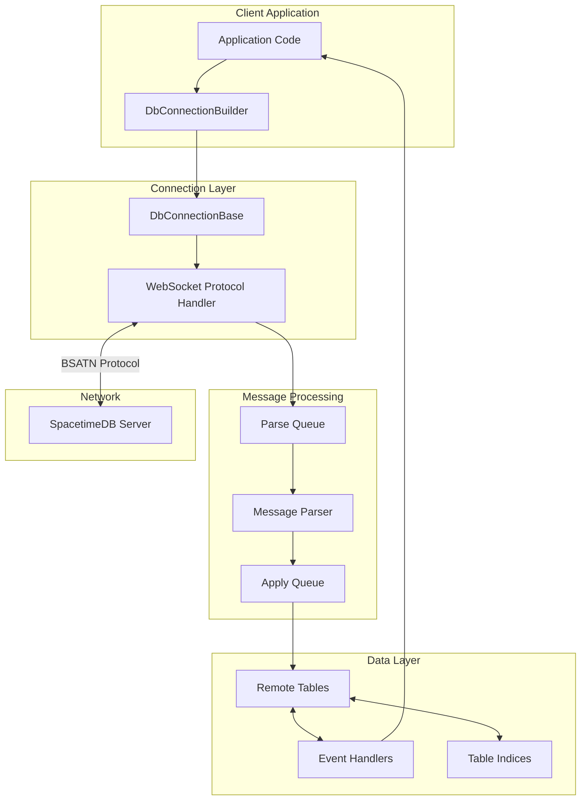
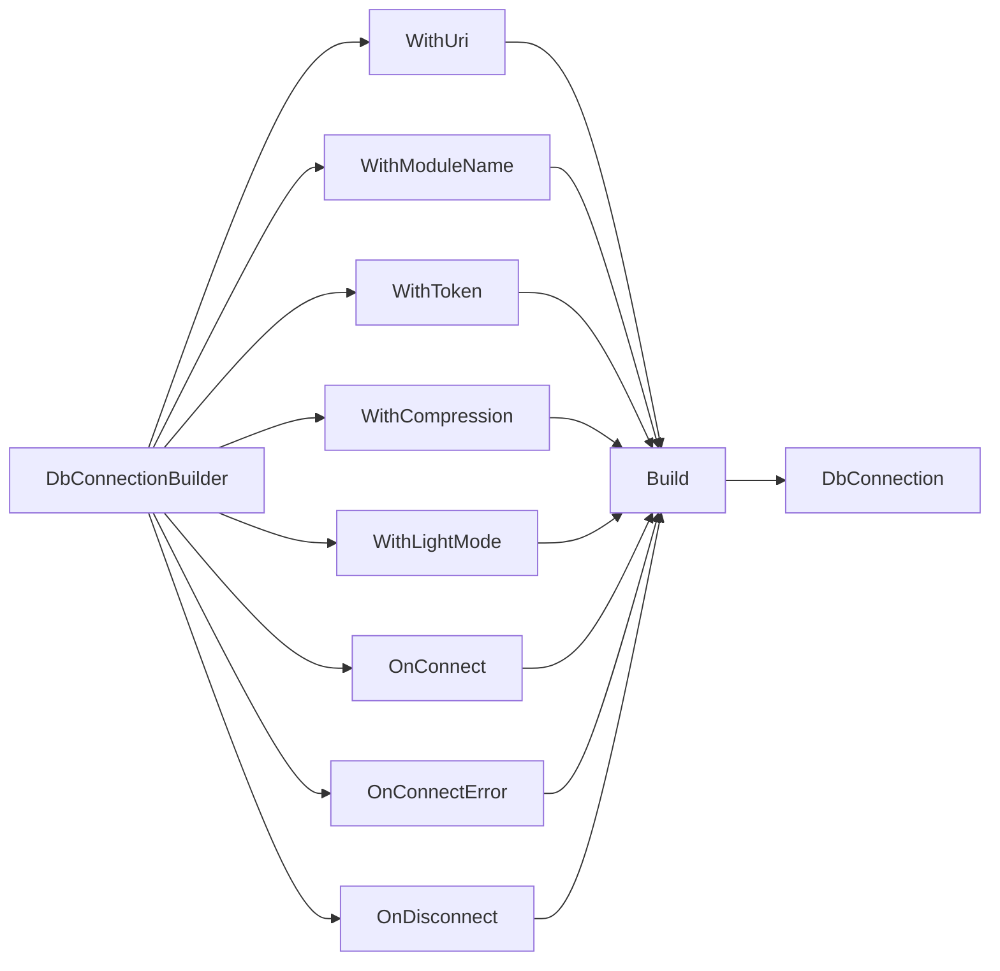
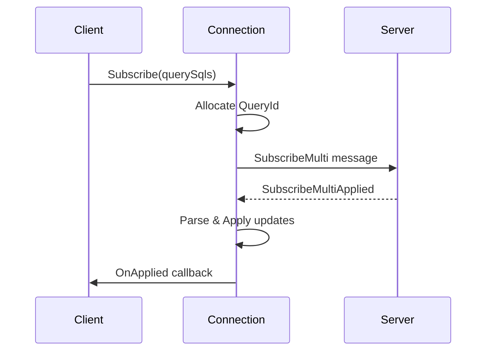

The SpacetimeDB C# Client SDK provides a comprehensive, event-driven interface for building real-time applications with automatic data synchronization. This SDK enables seamless connectivity between C# clients (including Unity applications) and SpacetimeDB modules, offering type-safe operations, efficient message processing, and sophisticated subscription management.

## Architecture Overview

The SDK follows a layered architecture that separates concerns between connection management, data synchronization, and event handling. At its core, the SDK uses a two-stage message processing pipeline with parse and apply queues, ensuring efficient network communication and deterministic state updates.



The SDK's architecture emphasizes **thread-safe message processing**, **type-safe table operations**, and **extensible event handling**. The builder pattern provides a fluent API for connection configuration, while the abstract base classes enable code generation for type-safe database interactions.

Sources: [SpacetimeDBClient.cs](/sdks/csharp/src/SpacetimeDBClient.cs#L14-L98), [Table.cs](/sdks/csharp/src/Table.cs#L88-L167)

## Core Components

### Connection Management

The `DbConnectionBuilder<T>` class provides a fluent interface for configuring and establishing connections to SpacetimeDB modules. This builder pattern ensures all required parameters are provided before connection establishment, reducing runtime errors.



The builder supports the following configuration options:

| Method | Purpose | Required | Default |
|--------|---------|----------|---------|
| `WithUri(string uri)` | Sets the SpacetimeDB server URI | Yes | - |
| `WithModuleName(string name)` | Sets the module name or address | Yes | - |
| `WithToken(string? token)` | Sets authentication token | No | null |
| `WithCompression(Compression comp)` | Sets compression algorithm | No | Brotli |
| `WithLightMode(bool light)` | Enables lightweight mode | No | false |
| `OnConnect(Action<Identity, string>)` | Registers connection callback | No | - |
| `OnConnectError(Action<Exception>)` | Registers error callback | No | - |
| `OnDisconnect(Action<Exception?>)` | Registers disconnect callback | No | - |

The connection process automatically converts HTTP(S) URIs to WebSocket (WS/WSS) protocols and establishes a connection using the `v1.bsatn.spacetimedb` protocol specification.

Sources: [SpacetimeDBClient.cs](/sdks/csharp/src/SpacetimeDBClient.cs#L14-L98), [SpacetimeDBClient.cs](/sdks/csharp/src/SpacetimeDBClient.cs#L487-L530)

### Abstract Connection Base

The `DbConnectionBase<DbConnection, Tables, Reducer>` abstract class provides the foundation for all database connections, implementing the `IDbConnection` interface. This class manages the core message processing pipeline, subscription tracking, and reducer invocation.

**Key Properties:**

- `ConnectionId` - Unique identifier for the connection instance
- `Identity` - The authenticated identity after connection
- `Db` - Abstract property providing access to remote tables
- `IsActive` - Boolean indicating connection status

**Message Processing Pipeline:**

The connection uses a two-queue architecture for efficient message handling:

1. **Parse Queue**: Receives raw bytes from the WebSocket and decodes them into structured messages
2. **Apply Queue**: Holds parsed messages ready for application to the local cache

This design enables **non-blocking network I/O** while maintaining **deterministic state updates** on the main thread, which is crucial for Unity and other game engines.

Sources: [SpacetimeDBClient.cs](/sdks/csharp/src/SpacetimeDBClient.cs#L119-L167), [SpacetimeDBClient.cs](/sdks/csharp/src/SpacetimeDBClient.cs#L228-L238)

## Data Synchronization

### Remote Table Handles

The `RemoteTableHandle<EventContext, Row>` class provides a type-safe abstraction for working with remote tables. Each table maintains a local cache synchronized with the server and exposes events for monitoring changes.

**Core Features:**

- **Multi-dictionary storage**: Efficiently handles duplicate rows by storing entries with both primary keys and row instances
- **BSATN serialization**: Uses the Binary Serialization for Algebraic Types protocol for efficient data transfer
- **Three-phase update application**: PreApply, Apply, PostApply ensure correct event ordering

**Table Events:**

| Event | Trigger | Parameters |
|-------|---------|------------|
| `OnInsert` | New row added | `EventContext context`, `Row row` |
| `OnUpdate` | Row modified | `EventContext context`, `Row oldRow`, `Row newRow` |
| `OnDelete` | Row removed | `EventContext context`, `Row row` |
| `OnBeforeDelete` | Before row removal | `EventContext context`, `Row row` |

The three-phase update process ensures that `OnBeforeDelete` callbacks are invoked across all tables before any actual deletions occur, allowing applications to maintain referential integrity.

Sources: [Table.cs](/sdks/csharp/src/Table.cs#L93-L167), [Table.cs](/sdks/csharp/src/Table.cs#L347-L365)

### Table Indexing

The SDK provides two types of index abstractions for efficient data queries:

**UniqueIndexBase<Column>**:

Enforces uniqueness on indexed columns and provides O(1) lookup via the `Find(Column value)` method. Internally uses a `Dictionary<Column, Row>` for storage.

**BTreeIndexBase<Column>**:

Supports non-unique indexed columns with O(1) filtering via the `Filter(Column value)` method. Uses a `Dictionary<Column, HashSet<Row>>` to store multiple rows per key value.

These indices are automatically updated when rows are inserted, updated, or deleted, maintaining consistency with the table's local cache without requiring manual intervention.

Sources: [Table.cs](/sdks/csharp/src/Table.cs#L102-L155)

## Subscription Management

### Query-Based Subscriptions

The SDK supports modern query-based subscriptions using `QueryId` for tracking. Subscriptions are created through the `Subscribe` method, which returns a `QueryId` that can be used for unsubscription.

**Subscription Flow:**



**Subscription Types:**

1. **SubscribeMulti**: Modern API supporting multiple queries with QueryId tracking
2. **LegacySubscribe**: Backwards-compatible API using RequestId tracking

The SDK maintains separate dictionaries for legacy and modern subscriptions, enabling gradual migration without breaking existing code.

Sources: [SpacetimeDBClient.cs](/sdks/csharp/src/SpacetimeDBClient.cs#L755-L778), [SpacetimeDBClient.cs](/sdks/csharp/src/SpacetimeDBClient.cs#L137-L142)

### Subscription Events

Subscriptions provide three lifecycle events:

- `OnApplied`: Called when the subscription is successfully established and initial data is loaded
- `OnError`: Called when the subscription fails
- `OnEnded`: Called when the subscription is terminated

The `SubscriptionAppliedType` discriminates between legacy and active subscriptions, providing type-safe access to subscription metadata.

Sources: [SpacetimeDBClient.cs](/sdks/csharp/src/SpacetimeDBClient.cs#L556-L608)

## Reducer Invocation

### Calling Reducers

Reducers are server-side functions that can be invoked from the client using the `InternalCallReducer` method. The method supports flags that control invocation behavior.

**CallReducerFlags:**

| Flag | Description |
|------|-------------|
| None | Standard invocation |
| [Unspecified] | Additional behavior modifiers (see implementation) |

The SDK tracks reducer request timing through the `Stats.ReducerRequestTracker`, enabling performance monitoring and debugging.

Sources: [SpacetimeDBClient.cs](/sdks/csharp/src/SpacetimeDBClient.cs#L733-L739), [SpacetimeDBClient.cs](/sdks/csharp/src/SpacetimeDBClient.cs#L853-L859)

### Reducer Events

When a reducer executes on the server, the client receives a `TransactionUpdate` message containing the reducer name, arguments, execution status, and any database changes. The SDK converts this into a `ReducerEvent<Reducer>` object.

**Reducer Status:**

- `Committed`: Transaction succeeded and changes were applied
- `OutOfEnergy`: Transaction failed due to energy quota exceeded
- `Failed`: Transaction failed for other reasons

The `Dispatch` method is responsible for routing reducer events to the appropriate handlers, enabling type-safe reducer processing.

Sources: [SpacetimeDBClient.cs](/sdks/csharp/src/SpacetimeDBClient.cs#L400-L446), [SpacetimeDBClient.cs](/sdks/csharp/src/SpacetimeDBClient.cs#L644-L666)

## Remote Queries

### One-Off Queries

The SDK supports ad-hoc SQL queries through the `RemoteQuery<T>` method. These queries are executed once and return results without establishing a subscription.

**Query Process:**

1. Generate unique message ID
2. Send `OneOffQuery` message to server
3. Wait for `OneOffQueryResponse` on completion
4. Deserialize results into strongly-typed array

The method validates that the result type matches the expected table type, ensuring type safety. Note that one-off queries do not modify the local cache, as they are intended for temporary data retrieval.

Sources: [SpacetimeDBClient.cs](/sdks/csharp/src/SpacetimeDBClient.cs#L780-L852)

## Unity Integration

### Platform-Specific Handling

The SDK includes conditional compilation for Unity environments, with special handling for WebGL builds:

```csharp
#if UNITY_WEBGL && !UNITY_EDITOR
    // Use coroutines for message parsing
    networkMessageParseThread = SpacetimeDBNetworkManager.StartCoroutine(ParseMessages());
#else
    // Use dedicated thread for message parsing
    networkMessageParseThread = new Thread(ParseMessages);
    networkMessageParseThread.Start();
#endif
```

The `SpacetimeDBNetworkManager` singleton manages connection lifecycles in Unity, automatically adding and removing connections as they connect and disconnect.

Sources: [SpacetimeDBClient.cs](/sdks/csharp/src/SpacetimeDBClient.cs#L179-L198), [SpacetimeDBClient.cs](/L36-L41)

## Error Handling

### Exception Handling

The SDK implements comprehensive error handling at multiple levels:

1. **Network Errors**: Caught during WebSocket connection and reported via `OnConnectError`
2. **Parse Errors**: Caught during message deserialization with detailed logging
3. **Application Errors**: Caught in event handlers to prevent cascading failures

All exceptions are logged using the `Log` class, which provides context-aware error reporting.

Sources: [SpacetimeDBClient.cs](/sdks/csharp/src/SpacetimeDBClient.cs#L384-L391), [Table.cs](/sdks/csharp/src/Table.cs#L382-L428)

## Performance Tracking

### Statistics Collection

The `Stats` class provides built-in performance monitoring for various operations:

- `ParseMessageQueueTracker`: Tracks message parsing throughput
- `ApplyMessageQueueTracker`: Tracks message application throughput
- `SubscriptionRequestTracker`: Tracks subscription request timing
- `ReducerRequestTracker`: Tracks reducer execution timing
- `OneOffRequestTracker`: Tracks one-off query timing

Each tracker records request duration and metadata, enabling detailed performance analysis and optimization.

Sources: [SpacetimeDBClient.cs](/sdks/csharp/src/SpacetimeDBClient.cs#L166), [SpacetimeDBClient.cs](/L369-L371)

## Compression Support

The SDK supports configurable compression for reducing bandwidth usage:

- **Brotli**: Default compression algorithm
- **None**: Disabled compression for debugging

Compression is negotiated during connection establishment and applied to all message payloads. The `CompressionHelpers` class handles decompression and decoding of incoming messages.

Sources: [SpacetimeDBClient.cs](/sdks/csharp/src/SpacetimeDBClient.cs#L22), [SpacetimeDBClient.cs](/L35)

## Frame Tick System

### Game Loop Integration

The `FrameTick()` method must be called regularly (typically each frame in game engines) to process pending messages. This method:

1. Updates the WebSocket connection state
2. Processes all messages in the apply queue
3. Invokes appropriate event handlers

This design allows the SDK to integrate seamlessly with various game loop architectures while maintaining determinism.

Sources: [SpacetimeDBClient.cs](/sdks/csharp/src/SpacetimeDBClient.cs#L867-L872)

<CgxTip>
The `FrameTick()` method is critical for Unity and other game engine integration. It must be called from the main thread each frame to process pending updates and invoke event handlers. Missing calls to `FrameTick()` will cause messages to accumulate in the apply queue, leading to stale data and increased memory usage.
</CgxTip>

## Type System

### BSATN Serialization

The SDK uses the BSATN (Binary Serialization for Algebraic Types) protocol for efficient data serialization. The `IStructuralReadWrite` interface defines the contract for types that can be serialized and deserialized.

**Key Methods:**

- `IStructuralReadWrite.ToBytes()`: Serializes an object to a byte array
- `IStructuralReadWrite.Read<T>()`: Deserializes a byte array to an object

The serialization layer is abstracted through `IReadWrite<T>`, enabling code generation for optimized, reflection-free serialization.

Sources: [Table.cs](/sdks/csharp/src/Table.cs#L208-L232), [SpacetimeDBClient.cs](/sdks/csharp/src/SpacetimeDBClient.cs#L855)

<CgxTip>
For optimal performance, use code-generated serializers rather than the generic `IStructuralReadWrite` interface. The code-generated serializers avoid reflection overhead and provide type-safe, monomorphized implementations that are significantly faster.
</CgxTip>

## Best Practices

### Connection Lifecycle

Always manage connections through the builder pattern and properly handle lifecycle events:

```csharp
var conn = MyDbConnection.Builder()
    .WithUri("wss://myserver.spacetimedb.com")
    .WithModuleName("my_module")
    .WithToken(authToken)
    .OnConnect((identity, token) => {
        Console.WriteLine($"Connected as {identity}");
        // Initialize subscriptions after connection
    })
    .OnConnectError(error => {
        Console.WriteLine($"Connection failed: {error.Message}");
    })
    .OnDisconnect(error => {
        Console.WriteLine($"Disconnected: {error?.Message ?? "Clean shutdown"}");
    })
    .Build();
```

### Subscription Management

Use modern `Subscribe` with `QueryId` for new code, reserving `LegacySubscribe` for backwards compatibility:

```csharp
// Modern API
var queryId = conn.Db.SomeTable.Subscribe(
    handle => handle.OnApplied += (ctx, status) => {
        Console.WriteLine($"Subscription active: {status.QueryId}");
    },
    new[] { "SELECT * FROM SomeTable" }
);

// Unsubscribe when done
conn.Unsubscribe(queryId);
```

### Event Handler Registration

Always unregister event handlers when they're no longer needed to prevent memory leaks:

```csharp
// Register handler
EventHandler handler = (ctx, row) => { /* handle row */ };
conn.Db.SomeTable.OnInsert += handler;

// Unregister when done
conn.Db.SomeTable.OnInsert -= handler;
```

Sources: [SpacetimeDBClient.cs](/sdks/csharp/src/SpacetimeDBClient.cs#L75-L97), [SpacetimeDBClient.cs](/sdks/csharp/src/SpacetimeDBClient.cs#L874-L878)

## Next Steps

For practical implementation guidance, consult the [Unity Integration Guide](27-unity-integration-guide) which provides step-by-step instructions for integrating the C# SDK into Unity projects. For understanding the underlying protocol and message formats, refer to [Understanding Subscriptions](20-understanding-subscriptions). For server-side development with C# modules, see the [C# Module Development Guide](16-c-module-development-guide).

To explore other client SDK options, review the [TypeScript Client SDK Reference](26-typescript-client-sdk-reference) or [Rust Client SDK Reference](24-rust-client-sdk-reference).
