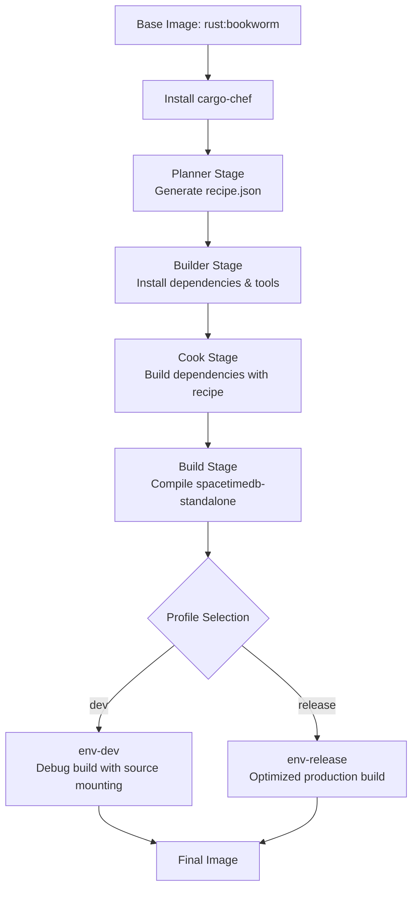
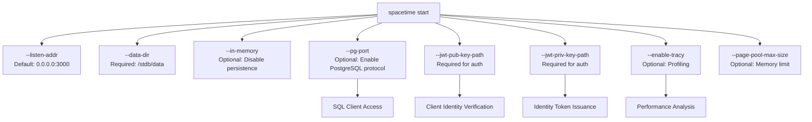
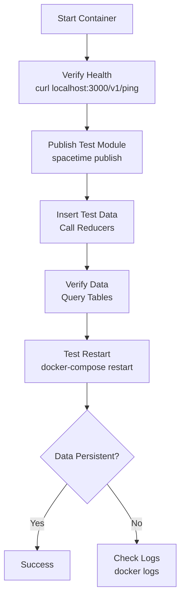

SpacetimeDB provides comprehensive Docker support, enabling you to run the database-server hybrid in containerized environments across development, testing, and production scenarios. This guide covers everything from pulling pre-built images to building custom containers, configuring different environments, and integrating with monitoring tools.

## Docker Architecture Overview


Running SpacetimeDB in Docker encapsulates the entire database and server runtime, including the standalone server, authentication keys, data persistence layer, and optional PostgreSQL wire protocol support. The multi-stage build process optimizes layer caching and reduces final image size by separating the Rust compilation environment from the runtime environment.

Sources: [Dockerfile](Dockerfile#L1-L57), [crates/standalone/Dockerfile](crates/standalone/Dockerfile#L1-L48)

## Quick Start with Pre-Built Images

The fastest way to get started is using the official Docker image. Pull and run SpacetimeDB with a single command:

```bash
docker run -d -p 3000:3000 clockworklabs/spacetimedb start \
  --data-dir=/stdb/data \
  --jwt-pub-key-path=/etc/spacetimedb/id_ecdsa.pub \
  --jwt-priv-key-path=/etc/spacetimedb/id_ecdsa
```

This command:
- Downloads the latest official image from Docker Hub
- Exposes port 3000 for client connections
- Starts the server with default configuration
- Mounts internal directories for authentication keys and data persistence

The server automatically generates JWT authentication keys on first startup if they don't exist, enabling secure client connections immediately.

Sources: [Dockerfile](Dockerfile#L48-L57), [crates/standalone/src/subcommands/start.rs](crates/standalone/src/subcommands/start.rs#L94-L130)

## Docker Image Components

The official SpacetimeDB Docker image includes:

| Component | Purpose | Version/Details |
|-----------|---------|-----------------|
| **Rust Runtime** | Core execution environment | Debian Bookworm with Rust toolchain |
| **WASM Target** | Module compilation | `wasm32-unknown-unknown` target installed |
| **.NET SDK** | C# module support | .NET 8.0 with WASI experimental workload |
| **Binaryen** | WASM optimization | Installed via package manager |
| **SpacetimeDB CLI** | Command-line interface | Linked to `/usr/local/bin/spacetime` |
| **Standalone Server** | Database runtime | Exposed on port 3000 |
| **PostgreSQL Wire Protocol** | SQL connectivity | Optional on port 5432 |

The image uses a non-root `spacetime` user for security, with the data directory and authentication keys properly isolated.

Sources: [Dockerfile](Dockerfile#L5-L48), [Dockerfile](Dockerfile#L50-L56)

## Building Custom Docker Images

For production deployments or custom configurations, you can build images from source using the multi-stage Dockerfile. This approach leverages `cargo-chef` for optimal layer caching, significantly reducing rebuild times during development.



### Development Build

For development with live code reloading:

```bash
docker build --build-arg CARGO_PROFILE=dev -t spacetimedb:dev .
```

### Production Build

For optimized production deployments:

```bash
docker build --build-arg CARGO_PROFILE=release -t spacetimedb:prod .
```

The production build compiles with Rust's release optimizations, resulting in significantly smaller binary size and faster execution at the cost of longer build times.

<CgxTip>
When building custom images, the `CARGO_PROFILE` argument determines whether you get a development or production build. Development builds include debugging symbols and are larger but compile faster. Production builds are optimized for performance and size but take longer to compile.
</CgxTip>

Sources: [crates/standalone/Dockerfile](crates/standalone/Dockerfile#L1-L48)

## Docker Compose Configurations

SpacetimeDB provides three Docker Compose configurations tailored for different use cases. Understanding these configurations helps you choose the right setup for your development or production environment.

### Configuration Comparison

| Configuration | Purpose | Features | Use Case |
|---------------|---------|----------|----------|
| **docker-compose.yml** | Development | Live code reloading, Tracy profiling, flamegraphs, hot-rebuild with `cargo-watch` | Active development and debugging |
| **docker-compose-release.yml** | Testing/Pre-production | Release build optimizations, PostgreSQL wire protocol, no development tools | Integration testing and staging |
| **docker-compose-live.yml** | Production | Pre-built registry images, Prometheus & Grafana, automatic restarts, core dumps | Production deployments |

Sources: [docker-compose.yml](docker-compose.yml#L1-L55), [docker-compose-release.yml](docker-compose-release.yml#L1-L35), [docker-compose-live.yml](docker-compose-live.yml#L1-L32)

### Development Environment

The development configuration (`docker-compose.yml`) provides a feature-rich environment for active development:

```yaml
services:
  node:
    labels:
      app: spacetimedb
    build:
      context: ./
      dockerfile: ./crates/standalone/Dockerfile
      args:
        CARGO_PROFILE: dev
    volumes:
      - ./crates/standalone:/usr/src/app/crates/standalone
      - ./crates/core:/usr/src/app/crates/core
      - ./crates/client-api:/usr/src/app/crates/client-api
      # ... additional source code volumes
      - key_files:/etc/spacetimedb
      - /stdb
    ports:
      - "3000:3000"
      - "5432:5432"    # PostgreSQL
      - "8086:8086"    # Tracy profiling
    entrypoint: cargo watch -i flamegraphs -i log.conf --why \
      -C crates/standalone \
      -x 'run start --data-dir=/stdb/data \
         --jwt-pub-key-path=/etc/spacetimedb/id_ecdsa.pub \
         --jwt-priv-key-path=/etc/spacetimedb/id_ecdsa \
         --pg-port 5432'
```

Key features of the development environment:

- **Live Code Reloading**: Source code is mounted as volumes, and `cargo-watch` automatically rebuilds on file changes
- **Tracy Profiling**: Port 8086 exposes the Tracy profiler for performance analysis
- **Flamegraph Support**: Optional CPU profiling with configurable output path
- **PostgreSQL Wire Protocol**: Enables SQL clients to connect via standard PostgreSQL tools
- **Debug Logging**: Full backtraces and debug-level logging for troubleshooting

Start the development environment:

```bash
docker-compose up
```

The server will automatically rebuild when you modify source files in the mounted directories.

Sources: [docker-compose.yml](docker-compose.yml#L1-L55)

### Release Environment

The release configuration (`docker-compose-release.yml`) removes development tools and uses optimized builds:

```yaml
services:
  node:
    build:
      context: ./
      dockerfile: ./crates/standalone/Dockerfile
    volumes:
      - ./crates/standalone:/usr/src/app/crates/standalone
      - ./crates/core:/usr/src/app/crates/core
      - ./crates/client-api:/usr/src/app/crates/client-api
      # ... additional source code volumes
      - key_files:/etc/spacetimedb
      - /stdb
    ports:
      - "3000:80"
    privileged: true
    command: start
    environment:
      RUST_BACKTRACE: 1
      ENV: release
    ulimits:
      core:
        soft: -1
        hard: -1
```

This configuration:
- Uses release profile for optimized performance
- Enables unlimited core dumps for post-mortem debugging
- Runs with elevated privileges for system-level operations
- Exposes the server on port 3000

Start the release environment:

```bash
docker-compose -f docker-compose-release.yml up
```

Sources: [docker-compose-release.yml](docker-compose-release.yml#L1-L35)

### Production Environment

The production configuration (`docker-compose-live.yml`) uses pre-built images from the official registry and includes monitoring infrastructure:

```yaml
services:
  node:
    working_dir: /usr/src/app
    image: registry.digitalocean.com/clockwork/spacetimedb${REGISTRY_SUFFIX}:latest
    volumes:
      - /stdb
      - key_files:/etc/spacetimedb
    command: start
    privileged: true
    environment:
      ENV: live
    env_file:
      - .env
    ulimits:
      core:
        soft: -1
        hard: -1
    logging:
      options:
        max-size: 1G
    restart: always

  prometheus:
    image: registry.digitalocean.com/clockwork/spacetimedb_prometheus${REGISTRY_SUFFIX}:latest
  
  grafana:
    image: registry.digitalocean.com/clockwork/spacetimedb_grafana${REGISTRY_SUFFIX}:latest
```

Production-specific features:
- **Pre-built Images**: Uses registry images for fast deployment
- **Automatic Restarts**: Configured with `restart: always` for high availability
- **Log Rotation**: Limits log size to 1GB to prevent disk exhaustion
- **Monitoring Stack**: Includes Prometheus and Grafana for metrics visualization
- **Environment Variables**: Load sensitive configuration from `.env` file

Start the production environment:

```bash
docker-compose -f docker-compose-live.yml up
```

Sources: [docker-compose-live.yml](docker-compose-live.yml#L1-L32)

## Configuration Options

### Server Startup Parameters

When running SpacetimeDB in Docker, you can customize behavior through CLI arguments passed to the `start` command:



Common configuration patterns:

**Basic Setup**:
```bash
spacetime start --data-dir=/stdb/data \
  --jwt-pub-key-path=/etc/spacetimedb/id_ecdsa.pub \
  --jwt-priv-key-path=/etc/spacetimedb/id_ecdsa
```

**With PostgreSQL Protocol**:
```bash
spacetime start --data-dir=/stdb/data \
  --jwt-pub-key-path=/etc/spacetimedb/id_ecdsa.pub \
  --jwt-priv-key-path=/etc/spacetimedb/id_ecdsa \
  --pg-port 5432
```

**In-Memory Testing**:
```bash
spacetime start --data-dir=/stdb/data \
  --jwt-pub-key-path=/etc/spacetimedb/id_ecdsa.pub \
  --jwt-priv-key-path=/etc/spacetimedb/id_ecdsa \
  --in-memory
```

Sources: [crates/standalone/src/subcommands/start.rs](crates/standalone/src/subcommands/start.rs#L9-L63)

### Logging Configuration

SpacetimeDB uses structured logging with configurable levels. The default `config.toml` provides sensible defaults for development:

```toml
[logs]
directives = [
    "spacetimedb=debug",
    "spacetimedb_client_api=debug",
    "spacetimedb_lib=debug",
    "spacetimedb_standalone=debug",
    "spacetimedb_commitlog=info",
    "spacetimedb_durability=info",
    "axum::rejection=trace",
]
```

For production, you can override these settings by mounting a custom `config.toml` or setting environment variables.

Sources: [crates/standalone/config.toml](crates/standalone/config.toml#L4-L19)

## Data Persistence and Volumes

### Volume Strategy

SpacetimeDB requires persistent storage for database data and authentication keys. The recommended approach uses named Docker volumes:

```yaml
volumes:
  key_files:  # Stores JWT keys for identity management
  stdb_data:  # Stores database WAL and snapshots
```

Bind mounts are also supported for development:

```yaml
volumes:
  - ./local_data:/stdb/data
  - ./keys:/etc/spacetimedb
```

### Data Directory Structure

The `/stdb/data` directory contains:

| Path | Contents | Purpose |
|------|----------|---------|
| `/stdb/data/wal` | Write-ahead log | Transaction durability |
| `/stdb/data/snapshots` | Database snapshots | Fast recovery |
| `/stdb/data/config.toml` | Server configuration | Runtime settings |
| `/stdb/data/logs/` | Application logs | Debugging and monitoring |

Authentication keys stored in `/etc/spacetimedb`:
- `id_ecdsa`: Private key for issuing identity tokens
- `id_ecdsa.pub`: Public key for verifying client identities

These keys are critical for security. Never commit them to version control, and ensure proper access controls in production.

Sources: [docker-compose.yml](docker-compose.yml#L26-L30), [crates/standalone/src/subcommands/start.rs](crates/standalone/src/subcommands/start.rs#L94-L130)

## Connecting to SpacetimeDB

Once your container is running, connect clients using the standard SpacetimeDB client SDKs. The connection URL follows the format:

```
ws://<host>:3000/<database_identity>
```

For example, if running locally:

```typescript
import { SpacetimeDBClient } from '@clockworklabs/spacetimedb-sdk';

const client = new SpacetimeDBClient();
await client.connect('ws://localhost:3000/my-database');
```

### PostgreSQL Wire Protocol

If you've enabled the PostgreSQL wire protocol (default port 5432), you can connect using standard SQL tools:

```bash
psql -h localhost -p 5432 -d your_database
```

This enables familiar SQL workflows for data exploration and ad-hoc queries.

Sources: [README.md](README.md#L23-L58)

## Testing and Development Workflows

### Automated Testing with Docker

The SpacetimeDB repository includes comprehensive smoke tests that validate Docker deployments. These tests verify critical behaviors like container restarts, data persistence, and client reconnection.

```python
from smoketests.docker import restart_docker

# Test that data persists across restarts
def test_restart_module():
    # Insert data before restart
    self.call("add", "Robert")
    
    # Restart Docker containers
    restart_docker()
    
    # Verify data is still accessible
    self.call("add", "Julie")
    logs = self.logs(100)
    assert "Hello, Robert!" in logs
    assert "Hello, Julie!" in logs
```

This test demonstrates that:
- Data persists across container restarts
- The WAL (write-ahead log) correctly replays transactions
- Client connections can be re-established after restart

Sources: [smoketests/docker.py](smoketests/docker.py#L9-L36), [smoketests/tests/zz_docker.py](smoketests/tests/zz_docker.py#L1-L60)

### Manual Testing Workflow



### Common Issues and Troubleshooting

| Issue | Cause | Solution |
|-------|-------|----------|
| **Port already in use** | Another service using port 3000 | Change `--listen-addr` or stop conflicting service |
| **Authentication errors** | Missing or mismatched JWT keys | Ensure `/etc/spacetimedb` contains `id_ecdsa` and `id_ecdsa.pub` |
| **Container won't start** | Privilege requirements | Run with `privileged: true` in docker-compose |
| **Slow rebuilds** | Large dependency graph | Use `cargo-chef` multi-stage build for caching |
| **Memory errors** | Exceeding container limits | Increase `--page-pool-max-size` or container memory allocation |

Sources: [smoketests/docker.py](smoketests/docker.py#L39-L200), [crates/standalone/src/subcommands/start.rs](crates/standalone/src/subcommands/start.rs#L148-L156)

## Performance and Monitoring

### Tracy Profiling

The development environment includes Tracy integration for deep performance analysis. Enable profiling by setting the environment variable:

```yaml
environment:
  SPACETIMEDB_TRACY: 1
```

Connect the Tracy profiler to `localhost:8086` to visualize execution traces, identify bottlenecks, and optimize reducer performance.

### Flamegraph Generation

For CPU profiling without Tracy, use flamegraph support:

```yaml
environment:
  SPACETIMEDB_FLAMEGRAPH_PATH: /var/log/flamegraph.folded
```

The system generates flamegraph data that can be visualized using standard flamegraph tools.

<CgxTip>
Production environments typically disable profiling to minimize performance overhead. Use Tracy and flamegraphs only during development and performance testing phases.
</CgxTip>

Sources: [docker-compose.yml](docker-compose.yml#L44-L48), [crates/standalone/src/subcommands/start.rs](crates/standalone/src/subcommands/start.rs#L119-L128)

## Next Steps

Now that you have SpacetimeDB running with Docker, explore these complementary topics:

- **[Installing SpacetimeDB CLI](3-installing-spacetimedb-cli)** - Learn about CLI tools for local development without Docker
- **[Building from Source](5-building-from-source)** - Understand the full build process for custom deployments
- **[Understanding the Database-Server Hybrid Architecture](9-understanding-the-database-server-hybrid-architecture)** - Deep dive into how SpacetimeDB combines database and server capabilities
- **[Rust Module Development Guide](15-rust-module-development-guide)** - Start building your first SpacetimeDB module

For production deployments, consider reviewing the [In-Memory Architecture and WAL](29-in-memory-architecture-and-wal) documentation to understand data persistence and recovery mechanisms in detail.
