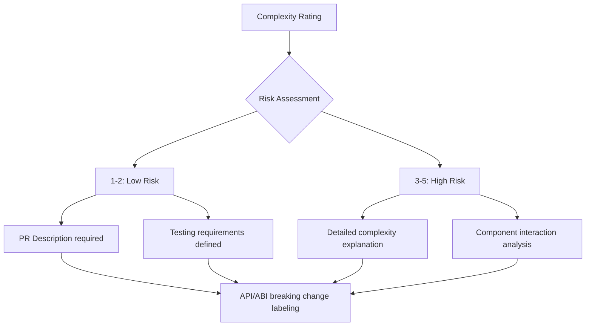

SpacetimeDB is developed and maintained by the team at Clockwork Labs, along with contributions from the open source community. This page highlights the key contributors who shape the project's direction and implementation.

## Core Contributors

Based on recent commit activity and contribution patterns, here are the primary contributors to SpacetimeDB:

| Contributor | Focus Areas | Recent Activity |
|-------------|-------------|-----------------|
| John Detter | TypeScript SDK, Release Management | TypeScript SDK version bumps ([1.11.3](https://github.com/clockworklabs/SpacetimeDB/commit/3c1c3415a287b43459841f44a943ddc44204ccc2), [1.11.2](https://github.com/clockworklabs/SpacetimeDB/commit/e1b3e3222cfc8c15268e10d14566bcef068e1a7e)) |
| Tyler Cloutier | Code Quality, Project Organization | [Cargo.toml fixes](https://github.com/clockworklabs/SpacetimeDB/commit/cfbdc519242edbc236d809b9558d1f1774cd7d3b) |
| Phoebe Goldman | Core Database Logic, Replay System | [Replay schema updates](https://github.com/clockworklabs/SpacetimeDB/commit/41eec04ea6150114247ff4ae7cbd7a68b1144bd5), [Bug fixes](https://github.com/clockworklabs/SpacetimeDB/commit/9f30d42d505729d43ec986a3c596a85dd85a2db0) |
| Shubham Mishra | Concurrency, Subscription System | [View deadlock fixes](https://github.com/clockworklabs/SpacetimeDB/commit/10fd8b2cd0dc2a720a5e7b18f961c558a3536e1b) |
| Adam Christopher Smith | React SDK Integration | [Table lookup fixes](https://github.com/clockworklabs/SpacetimeDB/commit/025ec1841591c9b8a4888f7cbe793c84854645ba) |
| Jason Larabie | Documentation | [Documentation refactoring](https://github.com/clockworklabs/SpacetimeDB/commit/48b8a31fe02f0fdb71143fa383c3d4a3fbc1e6ba) |
| Noa | TypeScript SDK, Language Features | [Iterator refactoring](https://github.com/clockworklabs/SpacetimeDB/commit/66f55471da60bf37eb8443f91ff343499573be9b), [Nameable implementations](https://github.com/clockworklabs/SpacetimeDB/commit/0a192082a8103f3e9b4478835d1d92dec9669c8f) |
| Ryan (rekhoff) | C# SDK, Runtime | [C# transaction implementation](https://github.com/clockworklabs/SpacetimeDB/commit/39f01289e5f64a88e4d723d7027493d8fe8a01d0), [Index scan improvements](https://github.com/clockworklabs/SpacetimeDB/commit/8a0cd87c4f0100b8a2d149c6cc56c0f109b1f94d) |
| Zeke Foppa | CI/CD Infrastructure | [V8 linker fixes](https://github.com/clockworklabs/SpacetimeDB/commit/264e45eafc13254b98be9bd9d69a468d9e9ef455), [Cache management](https://github.com/clockworklabs/SpacetimeDB/commit/c38b1350380b6d91b100764df7f32984c2cc56c3) |
| KirstenWF | Unreal SDK | [Validation improvements](https://github.com/clockworklabs/SpacetimeDB/commit/df035c48fff692a9ba93573811da3e1108998fa3) |
| Mazdak Farrokhzad | Performance Optimization | [Buffer pooling](https://github.com/clockworklabs/SpacetimeDB/commit/8e3af49f64a75e5d8744dffe12b0ec4e99aa31a0) |

## Contribution Patterns

### TypeScript SDK Development

The TypeScript SDK receives frequent updates focused on developer experience and language feature support. Recent work includes refactoring table iterators to return standard JavaScript Iterator objects, enabling users to leverage built-in combinators like `filter()`, `find()`, and `reduce()`.

Notably, the iterator refactoring [PR #3782](https://github.com/clockworklabs/SpacetimeDB/commit/66f55471da60bf37eb8443f91ff343499573be9b) converted TableIterator to a generator function, improving both code clarity and resource lifecycle handling.

### C# SDK Enhancements

C# integration is actively developed, with recent work including transaction support for procedures. The [C# transaction implementation](https://github.com/clockworklabs/SpacetimeDB/commit/39f01289e5f64a88e4d723d7027493d8fe8a01d0) introduces patterns similar to Rust's Result<T,E> but adapted for C#'s exception-based error handling. Issues like the [default value in Views](https://github.com/clockworklabs/SpacetimeDB/issues/3875) are being addressed through improvements to index scanning semantics.

### Core Database Systems

Deep technical work goes into SpacetimeDB's core systems:

- **Replay Logic**: [Respecting updates to st_table during replay](https://github.com/clockworklabs/SpacetimeDB/commit/41eec04ea6150114247ff4ae7cbd7a68b1144bd5) addresses complex scenarios where table schemas change within transactions.
- **Concurrency**: [Deadlock fixes](https://github.com/clockworklabs/SpacetimeDB/commit/10fd8b2cd0dc2a720a5e7b18f961c558a3536e1b) restructure how view methods interact with transaction locks.
- **Performance**: [Buffer pooling](https://github.com/clockworklabs/SpacetimeDB/commit/8e3af49f64a75e5d8744dffe12b0ec4e99aa31a0) for subscription serialization shows 36-62% performance improvements in benchmarks.

### Documentation and Developer Experience

The team invests significantly in developer onboarding through documentation. The [recent documentation refactor](https://github.com/clockworklabs/SpacetimeDB/commit/48b8a31fe02f0fdb71143fa383c3d4a3fbc1e6ba) consolidated content into a more navigable structure, organizing materials into Getting Started, Core Concepts, and Developer Resources sections.

## Project Philosophy

The commit messages and PR descriptions reveal the team's approach to software development:

Each PR includes:
- **Complexity rating** (1-5 scale)
- **API/ABI breaking change** flags when applicable
- **Testing descriptions** for validation

This structured approach to PR management demonstrates the team's commitment to maintaining code quality while iterating rapidly.

## Community Engagement

Active issue discussions indicate responsive community interaction:

- The [documentation 404 issue](https://github.com/clockworklabs/SpacetimeDB/issues/3793) was acknowledged and addressed.
- Questions about [licensing and contributor rights](https://github.com/clockworklabs/SpacetimeDB/issues/3870) show consideration for community fork scenarios.
- Bug reports like [scheduled reducer timing issues](https://github.com/clockworklabs/SpacetimeDB/issues/2648) receive detailed technical investigation responses.

## Open Areas for Contribution

The project maintains active issue tracking with several open issues representing opportunities for community contribution:

- [SQL compliance roadmap](https://github.com/clockworklabs/SpacetimeDB/issues/3857) outlines features like ORDER BY, OUTER JOIN, and ALTER statements
- [Async lock migration](https://github.com/clockworklabs/SpacetimeDB/issues/3939) proposes architectural improvements to the datastore
- [Smoketest parallelization](https://github.com/clockworklabs/SpacetimeDB/issues/3678) seeks infrastructure improvements for CI performance

These areas, along with the project's emphasis on multi-language SDK support, indicate a roadmap that values both technical depth and broad accessibility.
