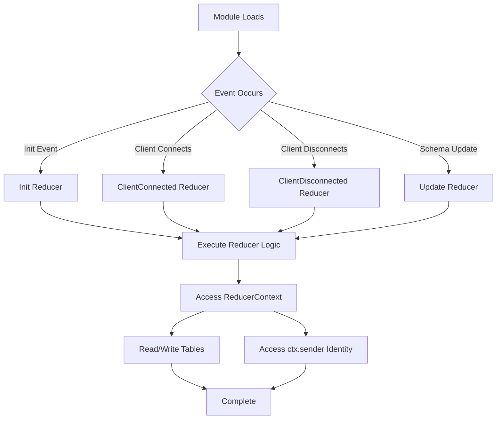

Lifecycle reducers are special types of reducers in SpacetimeDB that execute automatically at specific points in your module's lifetime. Unlike standard reducers that are invoked explicitly by client calls, lifecycle reducers respond to system events such as module initialization and client connections. This mechanism provides a declarative way to handle initialization logic, connection management, and cleanup operations.

Sources: [reducer.rs](crates/bindings-macro/src/reducer.rs#L1-L150), [rt.rs](crates/bindings/src/rt.rs#L1-L150)

## Types of Lifecycle Reducers

SpacetimeDB supports four distinct lifecycle reducer types, each triggered by a specific event in the application lifecycle. These reducers enable you to implement initialization routines, connection tracking, and disconnection handling without manual event coordination.

| Reducer Type | Attribute Name | Trigger Event | Use Case |
|--------------|----------------|---------------|----------|
| **Init** | `init` | Module first loads into database | Initialize tables, seed default data, set up indexes |
| **ClientConnected** | `client_connected` | Client connects to module | Track active users, initialize session state, send welcome messages |
| **ClientDisconnected** | `client_disconnected` | Client disconnects from module | Cleanup session data, record disconnection timestamps, release resources |
| **Update** | `update` | Module schema is updated | Migrate data, validate schema changes, handle version transitions |

Sources: [reducer.rs](crates/bindings-macro/src/reducer.rs#L8-L19)

## Architecture and Execution Flow

Lifecycle reducers integrate into SpacetimeDB's reducer system through a macro-driven registration process. The framework distinguishes lifecycle reducers from standard reducers through metadata, allowing the runtime to invoke them automatically based on system events.



The macro system transforms your lifecycle reducer functions into implementations of the `ReducerInfo` trait, embedding metadata about the lifecycle event type. The runtime uses this metadata to select and invoke the appropriate reducer when corresponding events occur.

Sources: [reducer.rs](crates/bindings-macro/src/reducer.rs#L71-L150), [rt.rs](crates/bindings/src/rt.rs#L60-L78)

## Implementation by Language

Lifecycle reducers have consistent semantics across all supported languages, but the syntax for declaring them varies. The following sections demonstrate implementation patterns for each supported SDK.

### Rust Implementation

In Rust modules, declare lifecycle reducers using the `#[spacetimedb::reducer]` attribute macro with the appropriate lifecycle specifier. The reducer function signature must include `&ReducerContext` as the first parameter, which provides access to the sender's identity and database context.

```rust
use spacetimedb::{Identity, ReducerContext, Table};

#[spacetimedb::table(name = connected, public)]
pub struct Connected {
    identity: Identity,
    timestamp: u64,
}

#[spacetimedb::table(name = disconnected, public)]
pub struct Disconnected {
    identity: Identity,
    timestamp: u64,
}

#[spacetimedb::reducer(client_connected)]
pub fn track_connection(ctx: &ReducerContext) {
    ctx.db.connected().insert(Connected {
        identity: ctx.sender,
        timestamp: spacetimedb::now_micros(),
    });
}

#[spacetimedb::reducer(client_disconnected)]
pub fn track_disconnection(ctx: &ReducerContext) {
    ctx.db.disconnected().insert(Disconnected {
        identity: ctx.sender,
        timestamp: spacetimedb::now_micros(),
    });
}
```

Sources: [lib.rs](modules/sdk-test-connect-disconnect/src/lib.rs#L1-L32), [reducer.rs](crates/bindings-macro/src/reducer.rs#L1-L150)

<CgxTip>The `ctx.sender` field in `ReducerContext` contains the unique `Identity` of the client that triggered the lifecycle event. Use this to correlate connection and disconnection events for the same client across sessions.</CgxTip>

### C# Implementation

C# modules use the `[SpacetimeDB.Reducer]` attribute with a `ReducerKind` enum to specify the lifecycle event type. The implementation follows similar patterns to Rust, with access to the `ReducerContext` and database tables.

```csharp
using SpacetimeDB;

[SpacetimeDB.Table(Name = "connected", Public = true)]
public partial struct Connected
{
    public Identity identity;
    public ulong timestamp;
}

[SpacetimeDB.Table(Name = "disconnected", Public = true)]
public partial struct Disconnected
{
    public Identity identity;
    public ulong timestamp;
}

static partial class Module
{
    [SpacetimeDB.Reducer(ReducerKind.ClientConnected)]
    public static void track_connection(ReducerContext ctx)
    {
        ctx.Db.connected.Insert(new Connected { 
            identity = ctx.Sender,
            timestamp = SpacetimeDB.NowMicros()
        });
    }

    [SpacetimeDB.Reducer(ReducerKind.ClientDisconnected)]
    public static void track_disconnection(ReducerContext ctx)
    {
        ctx.Db.disconnected.Insert(new Disconnected { 
            identity = ctx.Sender,
            timestamp = SpacetimeDB.NowMicros()
        });
    }
}
```

Sources: [Lib.cs](modules/sdk-test-connect-disconnect-cs/Lib.cs#L1-L31)

### TypeScript Implementation

TypeScript modules provide a fluent API for registering lifecycle reducers through the `schema` object. Call the appropriate lifecycle methods (`clientConnected`, `clientDisconnected`, `init`, `update`) with a reducer name and handler function.

```typescript
import { schema, t, table } from 'spacetimedb/server';

const Connected = table(
  { name: 'connected', public: true },
  { identity: t.identity(), timestamp: t.u64() }
);

const Disconnected = table(
  { name: 'disconnected', public: true },
  { identity: t.identity(), timestamp: t.u64() }
);

const spacetimedb = schema(Connected, Disconnected);

spacetimedb.clientConnected('track_connection', ctx => {
  ctx.db.connected.insert({ 
    identity: ctx.sender,
    timestamp: Date.now() * 1000n
  });
});

spacetimedb.clientDisconnected('track_disconnection', ctx => {
  ctx.db.disconnected.insert({ 
    identity: ctx.sender,
    timestamp: Date.now() * 1000n
  });
});
```

Sources: [index.ts](modules/sdk-test-connect-disconnect-ts/src/index.ts#L1-L25)

## Common Use Cases

Lifecycle reducers enable several fundamental patterns in SpacetimeDB applications. Understanding these patterns helps you design modules that properly initialize and manage state across client connections.

### Connection Tracking and Session Management

Track which clients are connected to your module by recording connections in a public table. Other clients can subscribe to this table to see active users in real-time, enabling features like presence indicators, online lists, or player lobbies.

```rust
#[spacetimedb::table(name = active_sessions, public)]
pub struct ActiveSession {
    identity: Identity,
    connected_at: u64,
}

#[spacetimedb::reducer(client_connected)]
pub fn on_client_connect(ctx: &ReducerContext) {
    ctx.db.active_sessions().insert(ActiveSession {
        identity: ctx.sender,
        connected_at: spacetimedb::now_micros(),
    });
}
```

### Initialization and Default Data Seeding

Use the `init` lifecycle reducer to set up initial state when your module first loads. This ensures tables contain required default data before any client interactions occur.

```rust
#[spacetimedb::table(name = settings, public)]
pub struct Settings {
    key: String,
    value: String,
}

#[spacetimedb::reducer(init)]
pub fn initialize_module(ctx: &ReducerContext) {
    // Only insert if settings table is empty
    if ctx.db.settings().iter().next().is_none() {
        ctx.db.settings().insert(Settings {
            key: "max_players".to_string(),
            value: "100".to_string(),
        });
        ctx.db.settings().insert(Settings {
            key: "welcome_message".to_string(),
            value: "Welcome to the server!".to_string(),
        });
    }
}
```

### Cleanup and Resource Management

The `client_disconnected` reducer provides an opportunity to clean up per-client resources, update analytics, or record session duration.

```rust
#[spacetimedb::table(name = session_history, public)]
pub struct SessionHistory {
    identity: Identity,
    connected_at: u64,
    disconnected_at: u64,
    duration_seconds: u32,
}

#[spacetimedb::table(name = temporary_data, public)]
pub struct TemporaryData {
    identity: Identity,
    data: String,
}

#[spacetimedb::reducer(client_disconnected)]
pub fn cleanup_session(ctx: &ReducerContext) {
    // Remove temporary data for disconnected client
    for row in ctx.db.temporary_data().iter() {
        if row.identity == ctx.sender {
            ctx.db.temporary_data().delete(row);
        }
    }
}
```

<CgxTip>Lifecycle reducers execute synchronously and block the associated event (connection, disconnection, initialization) from completing. Keep lifecycle reducer logic efficient to avoid impacting client connection performance.</CgxTip>

## Error Handling and Best Practices

Lifecycle reducers follow the same error handling patterns as standard reducers. Return a `Result<(), impl Display>` to indicate failure, which will propagate to the client for `client_connected` events or be logged for `client_disconnected` and `init` events.

### Error Handling Pattern

```rust
#[spacetimedb::reducer(client_connected)]
pub fn handle_connection(ctx: &ReducerContext) -> Result<(), String> {
    // Validate client connection conditions
    if is_banned(ctx.sender) {
        return Err("Connection rejected: user is banned".to_string());
    }
    
    // Successful connection handling
    ctx.db.active_users().insert(ActiveUser {
        identity: ctx.sender,
        status: "online".to_string(),
    });
    
    Ok(())
}
```

### Best Practices

- **Keep lifecycle reducers lightweight**: Avoid complex computations or expensive database queries in lifecycle reducers, as these events occur frequently during normal operation.
- **Use idempotent operations**: Design `init` reducers to handle repeated executions safely, checking for existing data before inserting.
- **Minimize external dependencies**: Lifecycle reducers should primarily interact with SpacetimeDB tables and the `ReducerContext`.
- **Handle edge cases**: Consider what happens if a client disconnects abruptly—ensure your `client_disconnected` logic handles incomplete state gracefully.

Sources: [reducer.rs](crates/bindings-macro/src/reducer.rs#L71-L150)

## Limitations and Considerations

Lifecycle reducers have specific constraints that distinguish them from standard reducers:

1. **No client arguments**: Lifecycle reducers receive no arguments beyond the `ReducerContext`, as they are triggered by system events rather than client requests.

2. **Execution timing**: Lifecycle reducers execute asynchronously relative to the triggering event in some cases, so don't rely on immediate execution ordering for business-critical logic.

3. **Error visibility**: Errors in `client_disconnected` and `init` reducers are logged server-side but cannot be returned to clients since no client request is in progress.

4. **Concurrent execution**: Multiple `client_connected` or `client_disconnected` events may execute concurrently—ensure your logic is thread-safe if modifying shared state.

## Integration with Other Concepts

Lifecycle reducers interact with several other SpacetimeDB features to create comprehensive application behavior:

- **Public vs Private Tables**: Lifecycle reducers can write to both public and private tables, allowing you to control visibility of connection tracking data.
- **Subscriptions**: Client applications can subscribe to tables populated by lifecycle reducers to receive real-time updates about connection events, enabling presence features.
- **Identity and Authentication**: The `ctx.sender` field provides authenticated client identity, allowing secure per-client tracking in lifecycle reducers.

For deeper understanding of these integrated concepts, explore [Public vs Private Tables](13-public-vs-private-tables) and [Identity and Authentication](18-identity-and-authentication).
