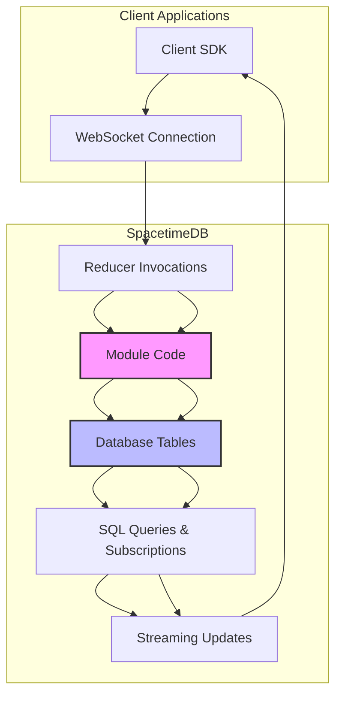
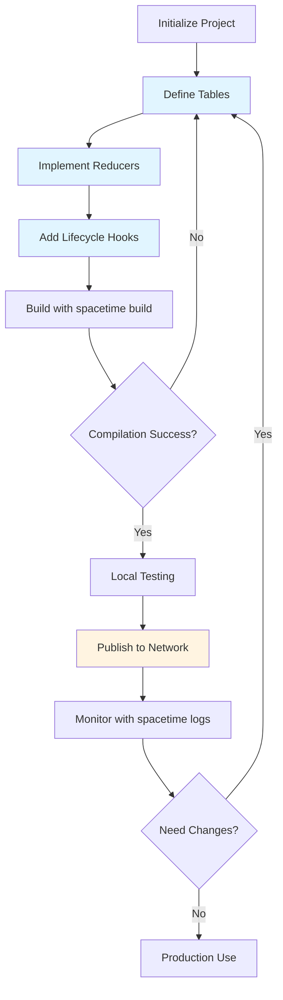

This guide provides a comprehensive overview of developing SpacetimeDB modules in Rust, covering everything from project setup to advanced features like indexing, lifecycle hooks, and error handling. SpacetimeDB modules are WebAssembly-compiled Rust applications that run inside a relational database, combining traditional database tables with server-side business logic.

## Module Architecture Overview

SpacetimeDB Rust modules follow a database-server hybrid architecture where your code runs directly within the database engine. This design eliminates the network latency between application servers and databases while maintaining the familiar Rust development experience.



## Project Setup

To create a new Rust module, you'll need the SpacetimeDB CLI and a WebAssembly-compatible Rust toolchain. The project structure follows standard Cargo conventions with specific configurations for WebAssembly compilation.

### Initial Project Creation

Use the CLI to scaffold a new module project:

```bash
spacetime init --lang rust my-project-directory
```

This creates a Cargo project with the following `Cargo.toml` configuration:

```toml
[package]
name = "spacetime-module"
version = "0.1.0"
edition = "2021"

[lib]
crate-type = ["cdylib"]

[dependencies]
spacetimedb = "1.0.0"
log = "0.4"
```

Sources: [quickstart-chat/Cargo.toml](modules/quickstart-chat/Cargo.toml#L1-L15)

The critical `crate-type = ["cdylib"]` configuration enables compilation to a WebAssembly module, which is required for SpacetimeDB modules.

### Building and Publishing

Compile your module using:

```bash
spacetime build
```

This command automatically handles WebAssembly target installation. To manually install the target:

```bash
rustup target add wasm32-unknown-unknown
```

Publish to the SpacetimeDB network:

```bash
spacetime login
spacetime publish <DATABASE_NAME>
```

Sources: [crates/bindings/README.md](crates/bindings/README.md#L75-L95)

## Defining Tables

Tables are the core data structures in SpacetimeDB modules, defined using the `#[spacetimedb::table]` attribute macro. Each table declaration generates a struct for row data and a table handle for database operations.

### Basic Table Declaration

```rust
#[spacetimedb::table(name = user, public)]
pub struct User {
    #[primary_key]
    #[auto_inc]
    id: u32,
    name: String,
    online: bool,
}
```

Sources: [modules/quickstart-chat/src/lib.rs](modules/quickstart-chat/src/lib.rs#L4-L10)

### Table Access Visibility

Tables can be either public or private, controlling client access:

| Visibility | Description | Macro Attribute |
|------------|-------------|-----------------|
| **Public** | Clients can query and subscribe | `#[table(public)]` |
| **Private** | Server-side only | `#[table(private)]` or default |

```rust
// Public table - accessible to clients
#[spacetimedb::table(name = message, public)]
pub struct Message {
    sender: Identity,
    sent: Timestamp,
    text: String,
}

// Private table - server-side only
#[spacetimedb::table(name = points, private)]
pub struct Point {
    x: i64,
    y: i64,
}
```

Sources: [modules/module-test/src/lib.rs](modules/module-test/src/lib.rs#L31-L35), [modules/quickstart-chat/src/lib.rs](modules/quickstart-chat/src/lib.rs#L12-L17)

### Column Attributes

Table fields support several attributes for constraints and indexing:

| Attribute | Purpose | Types |
|-----------|---------|-------|
| `#[primary_key]` | Primary key constraint | Any type |
| `#[auto_inc]` | Auto-incrementing value | Numeric types only |
| `#[unique]` | Unique constraint | Any type |
| `#[index(btree)]` | Single-column B-tree index | Any type |

```rust
#[spacetimedb::table(name = player)]
pub struct Player {
    #[primary_key]
    #[auto_inc]
    #[unique]
    id: u32,
    #[unique]
    name: String,
    #[index(btree)]
    score: u32,
}
```

Sources: [crates/bindings/src/lib.rs](crates/bindings/src/lib.rs#L233-L258), [modules/module-test/src/lib.rs](modules/module-test/src/lib.rs#L16-L24)

### Multi-Column Indexes

Define indexes spanning multiple columns for complex queries:

```rust
#[spacetimedb::table(
    name = user, 
    public, 
    index(name = popularity_and_username, btree(columns = [popularity, username]))
)]
pub struct User {
    #[auto_inc]
    #[primary_key]
    pub id: u32,
    #[unique]
    pub username: String,
    #[index(btree)]
    pub popularity: u32,
}
```

Sources: [crates/bindings/src/lib.rs](crates/bindings/src/lib.rs#L23-L27)

### Multiple Tables with Same Row Type

You can define multiple tables using the same struct type:

```rust
#[spacetimedb::table(public, name = player)]
#[spacetimedb::table(public, name = logged_out_player)]
pub struct Player {
    #[primary_key]
    identity: Identity,
    #[auto_inc]
    #[unique]
    player_id: u64,
    #[unique]
    name: String,
}
```

Sources: [modules/module-test/src/lib.rs](modules/module-test/src/lib.rs#L67-L75)

## Reducers

Reducers are server-side functions that can be invoked remotely by clients. They are the primary mechanism for modifying database state and implementing business logic.

### Basic Reducer Syntax

```rust
#[spacetimedb::reducer]
pub fn send_message(ctx: &ReducerContext, text: String) -> Result<(), String> {
    let text = validate_message(text)?;
    log::info!("User {}: {text}", ctx.sender);
    ctx.db.message().insert(Message {
        sender: ctx.sender,
        text,
        sent: ctx.timestamp,
    });
    Ok(())
}
```

Sources: [modules/quickstart-chat/src/lib.rs](modules/quickstart-chat/src/lib.rs#L32-L44)

### ReducerContext Parameters

The `ReducerContext` provides essential context for reducer execution:

| Field | Type | Description |
|-------|------|-------------|
| `ctx.sender` | `Identity` | The client invoking the reducer |
| `ctx.timestamp` | `Timestamp` | Current database timestamp |
| `ctx.db` | Database handle | Access to all tables |

Sources: [crates/bindings-macro/src/reducer.rs](crates/bindings-macro/src/reducer.rs#L100-L150)

### Error Handling

Reducers can return `Result` types for error handling:

```rust
#[spacetimedb::reducer]
pub fn set_name(ctx: &ReducerContext, name: String) -> Result<(), String> {
    let name = validate_name(name)?;
    if let Some(user) = ctx.db.user().identity().find(ctx.sender) {
        ctx.db.user().identity().update(User {
            name: Some(name),
            ..user
        });
        Ok(())
    } else {
        Err("Cannot set name for unknown user".to_string())
    }
}

fn validate_name(name: String) -> Result<String, String> {
    if name.is_empty() {
        Err("Names must not be empty".to_string())
    } else {
        Ok(name)
    }
}
```

Sources: [modules/quickstart-chat/src/lib.rs](modules/quickstart-chat/src/lib.rs#L18-L30)

## Lifecycle Reducers

Lifecycle reducers are special functions called at specific points during module operation, enabling initialization and connection management.

### Lifecycle Hook Types

| Hook Type | Macro | Trigger |
|-----------|-------|---------|
| **Init** | `#[reducer(init)]` | Module first published |
| **Connect** | `#[reducer(client_connected)]` | Client connects |
| **Disconnect** | `#[reducer(client_disconnected)]` | Client disconnects |
| **Update** | `#[reducer(update)]` | Module updated |

```rust
#[spacetimedb::reducer(init)]
pub fn init(_ctx: &ReducerContext) {
    // Called when the module is initially published
}

#[spacetimedb::reducer(client_connected)]
pub fn identity_connected(ctx: &ReducerContext) {
    if let Some(user) = ctx.db.user().identity().find(ctx.sender) {
        ctx.db.user().identity().update(User { online: true, ..user });
    } else {
        ctx.db.user().insert(User {
            name: None,
            identity: ctx.sender,
            online: true,
        });
    }
}

#[spacetimedb::reducer(client_disconnected)]
pub fn identity_disconnected(ctx: &ReducerContext) {
    if let Some(user) = ctx.db.user().identity().find(ctx.sender) {
        ctx.db.user().identity().update(User { online: false, ..user });
    }
}
```

Sources: [modules/quickstart-chat/src/lib.rs](modules/quickstart-chat/src/lib.rs#L47-L74)

## Table Operations

The generated table handles provide a comprehensive API for data manipulation through the `Table` trait.

### Inserting Data

```rust
#[spacetimedb::reducer]
pub fn add(ctx: &ReducerContext, name: String, age: u8) {
    ctx.db.person().insert(Person { id: 0, name, age });
}
```

Auto-increment fields automatically generate values when set to zero:

Sources: [modules/module-test/src/lib.rs](modules/module-test/src/lib.rs#L177-L180)

### Querying Data

Iterate over all rows:

```rust
#[spacetimedb::reducer]
pub fn say_hello(ctx: &ReducerContext) {
    for person in ctx.db.person().iter() {
        log::info!("Hello, {}!", person.name);
    }
}
```

Sources: [modules/module-test/src/lib.rs](modules/module-test/src/lib.rs#L182-L188)

Use unique column indexes for direct lookup:

```rust
#[spacetimedb::reducer]
pub fn set_name(ctx: &ReducerContext, name: String) -> Result<(), String> {
    if let Some(user) = ctx.db.user().identity().find(ctx.sender) {
        ctx.db.user().identity().update(User {
            name: Some(name),
            ..user
        });
        Ok(())
    } else {
        Err("Cannot set name for unknown user".to_string())
    }
}
```

Sources: [modules/quickstart-chat/src/lib.rs](modules/quickstart-chat/src/lib.rs#L18-L30)

### Index-Based Filtering

Efficiently query using B-tree indexes:

```rust
#[spacetimedb::reducer]
pub fn list_over_age(ctx: &ReducerContext, age: u8) {
    for person in ctx.db.person().age().filter(age..) {
        log::info!("{} has age {} >= {}", person.name, person.age, age);
    }
}
```

Multi-column index queries:

```rust
// Define multi-column index
#[spacetimedb::table(name = points, private, index(name = multi_column_index, btree(columns = [x, y])))]
pub struct Point {
    x: i64,
    y: i64,
}

// Query using the index
let filtered = ctx.db.points().multi_column_index().filter(0..10);
```

Sources: [modules/module-test/src/lib.rs](modules/module-test/src/lib.rs#L190-L195), [modules/module-test/src/lib.rs](modules/module-test/src/lib.rs#L31-L35)

### Updating Data

Update existing rows using unique columns:

```rust
ctx.db.user().identity().update(User {
    name: Some(new_name),
    ..existing_user
});
```

Sources: [modules/quickstart-chat/src/lib.rs](modules/quickstart-chat/src/lib.rs#L22-L26)

### Deleting Data

Delete by unique column value:

```rust
#[spacetimedb::reducer]
pub fn delete_player(ctx: &ReducerContext, id: u64) -> Result<(), String> {
    if ctx.db.test_e().id().delete(id) {
        Ok(())
    } else {
        Err(format!("No TestE row with id {id}"))
    }
}
```

Delete multiple rows matching a condition:

```rust
#[spacetimedb::reducer]
pub fn delete_players_by_name(ctx: &ReducerContext, name: String) -> Result<(), String> {
    match ctx.db.test_e().name().delete(&name) {
        0 => Err(format!("No TestE row with name {name:?}")),
        num_deleted => {
            log::info!("Deleted {num_deleted} player(s) with name {name:?}");
            Ok(())
        }
    }
}
```

Sources: [modules/module-test/src/lib.rs](modules/module-test/src/lib.rs#L299-L315)

<CgxTip>When deleting rows using indexes, the return value indicates the count of deleted rows. For unique columns, this is always 0 or 1, while B-tree indexes can delete multiple rows.</CgxTip>

### Insert or Update

Insert a new row or update if unique constraint exists:

```rust
#[spacetimedb::reducer]
pub fn add_player(ctx: &ReducerContext, name: String) -> Result<(), String> {
    let inserted = ctx.db.test_e().id().try_insert_or_update(TestE { id: 0, name })?;
    ctx.db.test_e().id().try_insert_or_update(inserted)?;
    Ok(())
}
```

Sources: [modules/module-test/src/lib.rs](modules/module-test/src/lib.rs#L289-L297)

## Data Types

SpacetimeDB supports a rich set of Rust data types through the `SpacetimeType` trait.

### Primitive Types

All standard Rust numeric and string types are supported:

```rust
#[derive(SpacetimeType)]
pub struct EveryPrimitiveStruct {
    a: u8,
    b: u16,
    c: u32,
    d: u64,
    e: u128,
    f: u256,
    g: i8,
    h: i16,
    i: i32,
    j: i64,
    k: i128,
    l: i256,
    m: bool,
    n: f32,
    o: f64,
    p: String,
}
```

Sources: [modules/sdk-test/src/lib.rs](modules/sdk-test/src/lib.rs#L46-L64)

### Special Types

SpacetimeDB provides special types for database operations:

| Type | Description |
|------|-------------|
| `Identity` | Unique client identifier |
| `ConnectionId` | Per-connection identifier |
| `Timestamp` | Database timestamp |
| `TimeDuration` | Time interval |
| `ScheduleAt` | Scheduled reducer timing |

```rust
#[spacetimedb::table(name = has_special_stuff)]
pub struct HasSpecialStuff {
    identity: Identity,
    connection_id: ConnectionId,
}
```

Sources: [modules/sdk-test/src/lib.rs](modules/sdk-test/src/lib.rs#L66-L70), [modules/quickstart-chat/src/lib.rs](modules/quickstart-chat/src/lib.rs#L12-L17)

### Enums

Enums with and without payloads are supported:

```rust
#[derive(SpacetimeType)]
pub enum SimpleEnum {
    Zero,
    One,
    Two,
}

#[derive(SpacetimeType)]
pub enum EnumWithPayload {
    U8(u8),
    U16(u16),
    Str(String),
    Identity(Identity),
}
```

Sources: [modules/sdk-test/src/lib.rs](modules/sdk-test/src/lib.rs#L22-L44)

### Collection Types

Vectors and collections of any supported type:

```rust
#[derive(SpacetimeType)]
pub struct EveryVecStruct {
    a: Vec<u8>,
    b: Vec<String>,
    c: Vec<Identity>,
    d: Vec<Timestamp>,
}
```

Sources: [modules/sdk-test/src/lib.rs](modules/sdk-test/src/lib.rs#L67-L87)

## Scheduled Reducers

Schedule reducers to execute at specific times or intervals, useful for periodic tasks and timeouts.

### Scheduled Table Definition

Define a table for scheduled reducer arguments:

```rust
#[spacetimedb::table(name = repeating_test_arg, scheduled(repeating_test))]
pub struct RepeatingTestArg {
    #[primary_key]
    #[auto_inc]
    scheduled_id: u64,
    scheduled_at: spacetimedb::ScheduleAt,
    prev_time: Timestamp,
}
```

Sources: [modules/module-test/src/lib.rs](modules/module-test/src/lib.rs#L51-L57)

### Scheduled Reducer Implementation

```rust
#[spacetimedb::reducer]
pub fn repeating_test(ctx: &ReducerContext, arg: RepeatingTestArg) {
    let delta_time = ctx
        .timestamp
        .duration_since(arg.prev_time)
        .expect("arg.prev_time is later than ctx.timestamp... huh?");
    log::trace!("Timestamp: {:?}, Delta time: {:?}", ctx.timestamp, delta_time);
}
```

Initialize scheduled tasks in the init reducer:

```rust
#[spacetimedb::reducer(init)]
pub fn init(ctx: &ReducerContext) {
    ctx.db.repeating_test_arg().insert(RepeatingTestArg {
        prev_time: ctx.timestamp,
        scheduled_id: 0,
        scheduled_at: duration!("1000ms").into(),
    });
}
```

Sources: [modules/module-test/src/lib.rs](modules/module-test/src/lib.rs#L159-L171), [modules/module-test/src/lib.rs](modules/module-test/src/lib.rs#L173-L180)

Use the `duration!` macro for time intervals:

```rust
let duration = duration!("1000ms");
```

Sources: [crates/bindings-macro/src/lib.rs](crates/bindings-macro/src/lib.rs#L138-L148)

## Module Development Workflow

The following flowchart illustrates the complete development workflow for SpacetimeDB Rust modules:



## Complete Example: Chat Module

Here's a complete example combining all concepts:

```rust
use spacetimedb::{Identity, ReducerContext, Table, Timestamp};

#[spacetimedb::table(name = user, public)]
pub struct User {
    #[primary_key]
    identity: Identity,
    name: Option<String>,
    online: bool,
}

#[spacetimedb::table(name = message, public)]
pub struct Message {
    sender: Identity,
    sent: Timestamp,
    text: String,
}

#[spacetimedb::reducer(init)]
pub fn init(_ctx: &ReducerContext) {}

#[spacetimedb::reducer(client_connected)]
pub fn identity_connected(ctx: &ReducerContext) {
    if let Some(user) = ctx.db.user().identity().find(ctx.sender) {
        ctx.db.user().identity().update(User { online: true, ..user });
    } else {
        ctx.db.user().insert(User {
            name: None,
            identity: ctx.sender,
            online: true,
        });
    }
}

#[spacetimedb::reducer(client_disconnected)]
pub fn identity_disconnected(ctx: &ReducerContext) {
    if let Some(user) = ctx.db.user().identity().find(ctx.sender) {
        ctx.db.user().identity().update(User { online: false, ..user });
    }
}

#[spacetimedb::reducer]
pub fn set_name(ctx: &ReducerContext, name: String) -> Result<(), String> {
    let name = if name.is_empty() {
        return Err("Names must not be empty".to_string());
    } else {
        name
    };
    
    if let Some(user) = ctx.db.user().identity().find(ctx.sender) {
        log::info!("User {} sets name to {name}", ctx.sender);
        ctx.db.user().identity().update(User {
            name: Some(name),
            ..user
        });
        Ok(())
    } else {
        Err("Cannot set name for unknown user".to_string())
    }
}

#[spacetimedb::reducer]
pub fn send_message(ctx: &ReducerContext, text: String) -> Result<(), String> {
    let text = if text.is_empty() {
        return Err("Messages must not be empty".to_string());
    } else {
        text
    };
    
    log::info!("User {}: {text}", ctx.sender);
    ctx.db.message().insert(Message {
        sender: ctx.sender,
        text,
        sent: ctx.timestamp,
    });
    Ok(())
}
```

Sources: [modules/quickstart-chat/src/lib.rs](modules/quickstart-chat/src/lib.rs#L1-L95)

<CgxTip>Always validate reducer inputs before database operations to maintain data integrity. The `Result` return type allows graceful error handling that clients can process.</CgxTip>

## Best Practices

### Table Design

1. **Use appropriate indexes** on frequently queried columns
2. **Set auto_increment on primary keys** for auto-generated IDs
3. **Mark tables private** when they don't need client access
4. **Use unique constraints** for business-critical uniqueness

### Reducer Implementation

1. **Validate all inputs** before database operations
2. **Return `Result` types** for proper error handling
3. **Use lifecycle reducers** for initialization and cleanup
4. **Log important events** for debugging and monitoring

### Performance Considerations

1. **Prefer index-based queries** over full table scans
2. **Use `try_insert`** instead of `insert` when handling unique constraints
3. **Batch operations** when possible to reduce transaction overhead
4. **Monitor module logs** for performance issues

## Advanced Topics

For more advanced features, explore these related topics:

- **[Understanding Subscriptions](20-understanding-subscriptions)** - Learn how clients receive real-time updates
- **[Identity and Authentication](18-identity-and-authentication)** - Implement secure user identification
- **[Scheduled Reducers and Timers](17-scheduled-reducers-and-timers)** - Build time-based automation
- **[Error Handling and Validation](19-error-handling-and-validation)** - Implement robust error handling
- **[Automatic Schema Migrations](14-automatic-schema-migrations)** - Handle schema evolution seamlessly

## Further Learning

To deepen your understanding of SpacetimeDB development:

1. Review the [complete module examples](modules/) in the repository
2. Study the [bindings crate documentation](crates/bindings/README.md)
3. Explore [client SDK integration](sdks/rust/) for full-stack applications
4. Implement the [C# Module Development Guide](16-c-module-development-guide) for cross-platform modules
