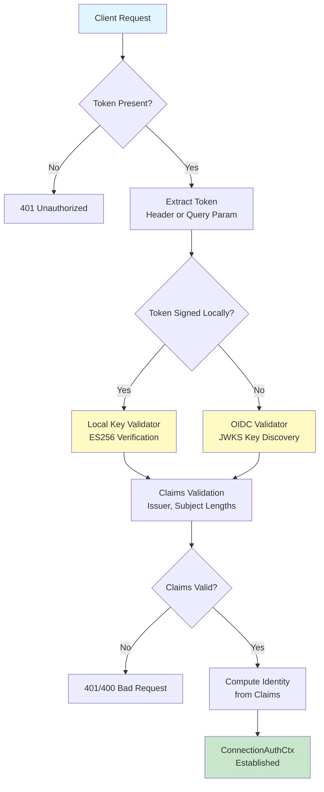
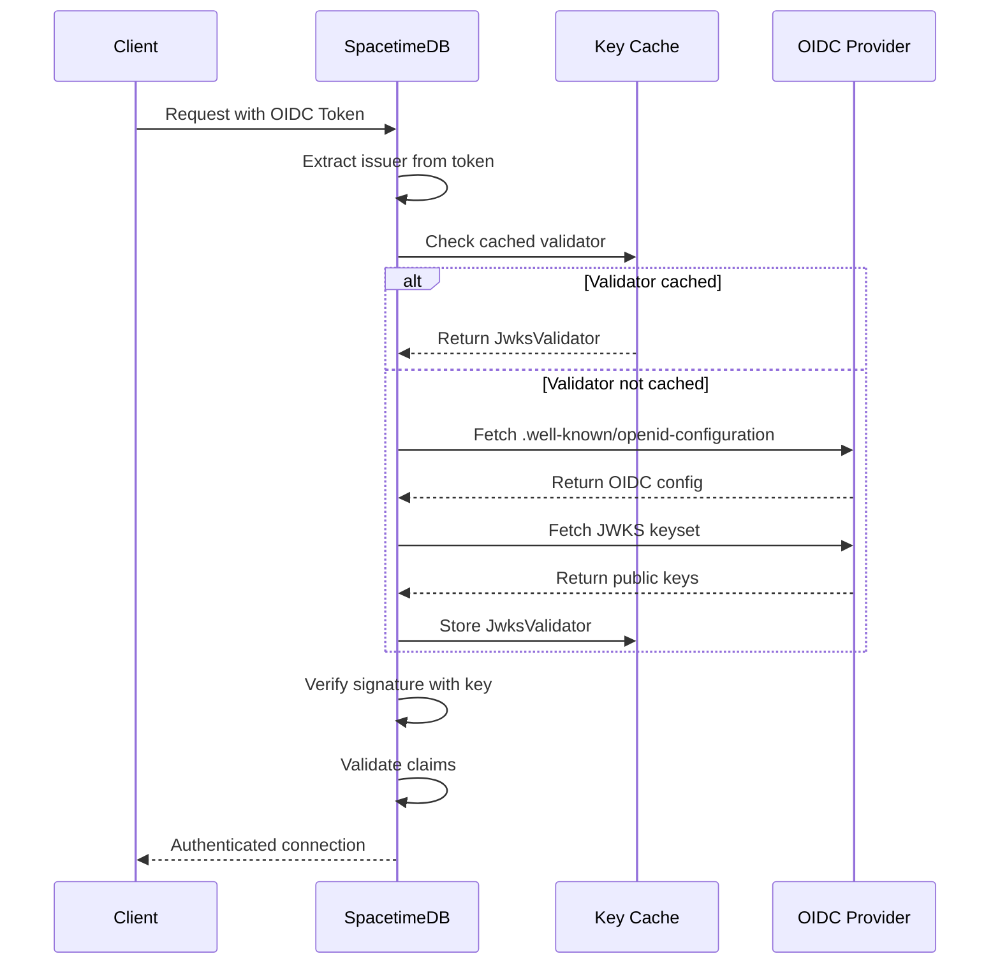

SpacetimeDB provides a comprehensive identity and authentication system built on industry-standard JWT (JSON Web Tokens) with support for both native token management and external authentication providers through OpenID Connect. This system enables secure client identification, authorization, and access control across your distributed applications.

## Core Identity Model

At the foundation of SpacetimeDB's authentication architecture lies a cryptographic identity model where each user is represented by a unique identifier derived from their authentication claims. The identity is deterministically computed from the issuer and subject using the ECDSA P-256 curve, ensuring tamper-proof user identification across all interactions.

Identity claims contain the following core components:

| Claim Field | Type | Description | Constraints |
|-------------|------|-------------|-------------|
| `hex_identity` | Identity | Cryptographically derived identifier | Computed from issuer and subject |
| `sub` (Subject) | String | Unique identifier for the user | 1-128 bytes, non-empty |
| `iss` (Issuer) | String | Entity that issued the token | 1-128 bytes, non-empty |
| `aud` (Audience) | Vec\<String\> | Intended recipients of the token | Optional |
| `iat` | SystemTime | Token issuance timestamp | Unix timestamp |
| `exp` | SystemTime | Token expiration timestamp | Optional |

Sources: [identity.rs](crates/auth/src/identity.rs#L26-L44), [identity.rs](crates/auth/src/identity.rs#L89-L127)

## Authentication Architecture

The authentication system operates through a layered validation pipeline that supports both local token signing and external OIDC providers. The architecture follows a **hybrid approach** where SpacetimeDB can validate tokens signed by its own keys or trust tokens from third-party authentication services.



The validation process enforces critical security constraints: issuer and subject fields must be non-empty strings not exceeding 128 bytes. When a token includes an explicit identity claim, it must match the identity computed from the issuer and subject pair, preventing token manipulation attempts.

Sources: [identity.rs](crates/auth/src/identity.rs#L89-L127), [auth.rs](crates/client-api/src/auth.rs#L65-L78)

## JWT Token Management

### Local Token Generation

SpacetimeDB generates and signs tokens using the ES256 (ECDSA P-256) algorithm, which provides strong cryptographic guarantees with relatively compact token sizes. The system maintains a pair of ECDSA keys for signing and verification, automatically generating them if not present.

<CgxTip>
The ES256 algorithm was chosen over alternatives like RS256 for its smaller key size and token footprint, which is crucial for real-time applications with frequent websocket communication. The 32-byte keys produce more compact tokens compared to RSA's 2048-bit or larger keys.
</CgxTip>

Token creation involves the following steps:

1. **Generate Claims**: Create `SpacetimeIdentityClaims` with issuer, subject, audience, and timestamps
2. **Compute Identity**: Derive the cryptographic identifier from issuer and subject
3. **Sign Token**: Use the private key to create the JWT signature
4. **Return Context**: Provide both the signed token string and the claims object

Sources: [auth.rs](crates/client-api/src/auth.rs#L147-L175), [auth.rs](crates/client-api/src/auth.rs#L177-L193)

### Short-Lived Tokens for Untrusted Contexts

For scenarios where tokens must be embedded in URLs or shared in potentially untrusted environments, SpacetimeDB supports short-lived token generation via the `POST /v1/identity/websocket-token` endpoint. These tokens include an expiration time and are designed for temporary access with reduced security implications if leaked.

The short-lived token mechanism allows you to:

- Generate tokens with custom expiration durations
- Re-sign existing tokens with new expiration times
- Create ephemeral access credentials for specific contexts
- Maintain security while enabling URL-based authentication flows

Sources: [identity.md](docs/docs/http/identity.md#L39-L52), [auth.rs](crates/client-api/src/auth.rs#L203-L213)

## HTTP API Endpoints

The HTTP API provides comprehensive identity management capabilities through the `/v1/identity` namespace. These endpoints enable both programmatic identity creation and administrative management of database ownership.

### Identity Creation

**POST /v1/identity**

Generate a new Spacetime identity with an automatically minted authentication token. This endpoint creates a random UUID subject, assigns it the local issuer identifier, and returns both the computed identity and the signed JWT token.

**Response Format:**
```typescript
{
    "identity": string,  // The computed Spacetime identity
    "token": string      // The JWT token for authentication
}
```

Sources: [identity.md](docs/docs/http/identity.md#L14-L22), [auth.rs](crates/client-api/src/auth.rs#L177-L193)

### Database Ownership Query

**GET /v1/identity/:identity/databases**

Retrieve a list of all database addresses owned by a specific identity. This endpoint is essential for administrative interfaces and multi-database applications where users may own multiple database instances.

**Response Format:**
```typescript
{
    "addresses": array<string>  // Array of database address strings
}
```

Sources: [identity.md](docs/docs/http/identity.md#L76-L88)

### Token Verification

**GET /v1/identity/:identity/verify**

Validate that a provided token corresponds to the specified identity. This endpoint performs signature verification, claims validation, and identity matching, returning appropriate HTTP status codes to indicate verification results.

| Status Code | Condition |
|-------------|-----------|
| 204 No Content | Token valid and matches identity |
| 400 Bad Request | Token valid but doesn't match identity |
| 401 Unauthorized | Token invalid or missing |

Sources: [identity.md](docs/docs/http/identity.md#L90-L104), [auth.rs](crates/client-api/src/auth.rs#L98-L103)

## SpacetimeAuth: OIDC Integration

For applications requiring external authentication providers, SpacetimeDB offers SpacetimeAuth, a hosted OpenID Connect provider service. This integration allows you to leverage third-party identity systems while maintaining seamless integration with SpacetimeDB's authorization model.

### Supported Authentication Methods

| Provider | Type | Use Case |
|----------|------|----------|
| Magic Link | Passwordless | Email-based authentication without passwords |
| Github | OAuth2 | Developer-focused applications |
| Google | OAuth2 | Consumer applications with Google accounts |
| Discord | OAuth2 | Gaming and community applications |
| Twitch | OAuth2 | Streaming and gaming platforms |
| Kick | OAuth2 | Emerging streaming platform |

Sources: [index.md](docs/docs/spacetimeauth/index.md#L1-L101)

### Project Management

SpacetimeAuth organizes authentication resources around **projects**, which serve as logical boundaries for your authentication configuration. Each project maintains independent sets of users, roles, authentication methods, email templates, and theme settings.

Project patterns for common scenarios:

- **Multi-platform apps**: Single project shared between web and mobile clients
- **Environment separation**: Separate projects for dev, staging, and production environments
- **Multi-tenant applications**: Individual projects for different customer applications

Sources: [index.md](docs/docs/spacetimeauth/index.md#L42-L65)

### Role-Based Access Control

Roles enable fine-grained permission management within your application. Each role is represented by a string identifier (e.g., "admin", "moderator", "player") that is included as claims in the issued ID token. Within your reducers, you can inspect these roles to implement conditional authorization logic.

<CgxTip>
When implementing role-based access control, consider defining a role hierarchy in your module code (e.g., admin includes all moderator permissions) to simplify permission checks and reduce code duplication.
</CgxTip>

Sources: [index.md](docs/docs/spacetimeauth/index.md#L75-L85)

## OIDC Token Validation Pipeline

For tokens issued by external OIDC providers (including SpacetimeAuth), SpacetimeDB implements a sophisticated validation pipeline with caching to balance security and performance.

The validation process follows this sequence:



The caching strategy maintains a 5-minute refresh window for public keys with a maximum cache lifetime of 2 hours, providing responsive authentication while ensuring eventual consistency with provider key rotations.

Sources: [token_validation.rs](crates/core/src/auth/token_validation.rs#L182-L198), [token_validation.rs](crates/core/src/auth/token_validation.rs#L226-L238)

## Client Integration

Client applications integrate with SpacetimeDB's authentication system by including tokens in their requests. Tokens can be provided through either HTTP headers or query parameters, with headers taking precedence when both are present.

### Authentication Methods

**Bearer Token Header (Preferred):**
```
Authorization: Bearer <your-jwt-token>
```

**Query Parameter (Fallback):**
```
?token=<your-jwt-token>
```

The credential extraction process automatically handles both methods, allowing flexible integration across different client environments and use cases.

Sources: [auth.rs](crates/client-api/src/auth.rs#L23-L78)

### Connection Authentication Context

Once validated, authentication information is available throughout your application via the `ConnectionAuthCtx` structure, which provides:

- **Claims**: The validated `SpacetimeIdentityClaims` object
- **JWT Payload**: The raw JSON payload as a string for inspection

This context is automatically established by the authentication middleware and is accessible in your reducers and other request handlers, enabling permission checks and user-specific logic.

Sources: [identity.rs](crates/auth/src/identity.rs#L9-L13), [auth.rs](crates/client-api/src/auth.rs#L84-L103)

## Security Considerations

### Key Management

SpacetimeDB automatically generates and manages ECDSA P-256 key pairs for local token signing. The keys are stored in PEM format, with the public key available for client verification via the `GET /v1/identity/public-key` endpoint. Key rotation is supported through configuration changes, though clients must obtain the new public key to validate tokens signed after rotation.

Sources: [mod.rs](crates/core/src/auth/mod.rs#L12-L46), [mod.rs](crates/core/src/auth/mod.rs#L49-L70)

### Token Security Best Practices

1. **Use HTTPS**: Always transmit tokens over encrypted connections
2. **Validate expiration**: Reject tokens that have expired (check `exp` claim)
3. **Limit token lifespan**: Use short expiration times for high-security contexts
4. **Secure storage**: Never store tokens in client-side storage vulnerable to XSS
5. **Verify issuer**: Ensure tokens originate from trusted issuers
6. **Rotate keys regularly**: Establish a key rotation schedule for production deployments

Sources: [identity.md](docs/docs/http/identity.md#L39-L52), [token_validation.rs](crates/core/src/auth/token_validation.rs#L245-L254)

## Next Steps

- **Error Handling and Validation**: Learn how to handle authentication errors gracefully and validate user inputs with [Error Handling and Validation](19-error-handling-and-validation)
- **Rust Client SDK Reference**: Explore authentication methods in the Rust client SDK with [Rust Client SDK Reference](24-rust-client-sdk-reference)
- **TypeScript Client SDK Reference**: Integrate authentication in TypeScript applications using the [TypeScript Client SDK Reference](26-typescript-client-sdk-reference)
