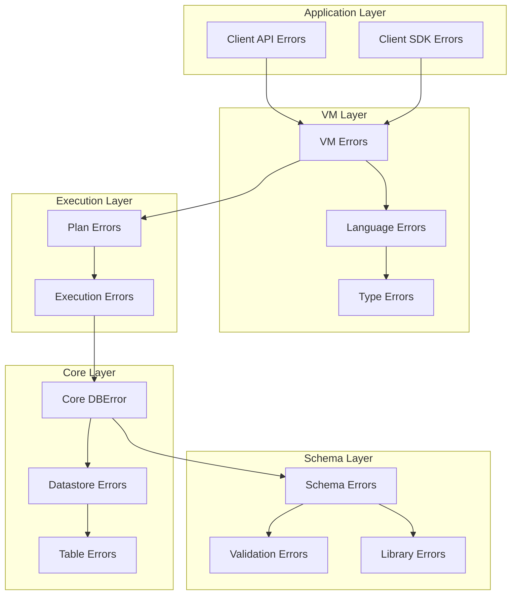
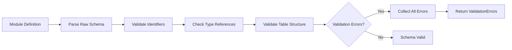

This page provides a comprehensive guide to error handling and validation mechanisms in SpacetimeDB. Understanding these systems is crucial for building robust modules that properly communicate failures and maintain data integrity across the database-server hybrid architecture.

## Error Architecture Overview

SpacetimeDB implements a layered error handling system that separates concerns across different subsystems while providing consistent error propagation and reporting. The architecture follows a hierarchical approach where low-level errors are wrapped and enriched with context as they propagate through the system.



This layered approach ensures that errors are handled at the appropriate abstraction level while preserving diagnostic information for debugging and user feedback.

Sources: [error.rs](crates/core/src/error.rs#L86-L150), [errors.rs](crates/vm/src/errors.rs#L36-L54)

## Core Error Types

### DBError: The Central Error Hub

`DBError` serves as the primary error type in SpacetimeDB's core layer, aggregating errors from various subsystems. It uses Rust's `thiserror` crate for automatic error message formatting and `enum_as_inner` for easy pattern matching and conversion.

The main variants include:

- **LibError**: Errors from schema and type system operations
- **Buffer**: Binary encoding/decoding errors from the BSATN format
- **Datastore**: Database operations and persistence errors
- **Sequence**: Auto-increment sequence management errors
- **Schema**: Schema definition and validation errors
- **IoError**: File system and I/O operation errors
- **VmError**: Virtual machine execution errors
- **VmUser**: User-facing errors from reducer execution
- **Subscription**: Query subscription errors
- **SqlParser/Plan**: SQL query parsing and planning errors

Sources: [error.rs](crates/core/src/error.rs#L86-L150)

### User-Facing Errors: ErrorLang

`ErrorLang` represents errors that can occur during reducer or query execution and are designed to be communicated to end-users. It includes:

- **ErrorKind**: Categorization including `Custom`, `Compiler`, `TypeMismatch`, `Db`, `Query`, `Duplicated`, `Invalid`, `NotFound`, `Params`, `OutOfBounds`, `Timeout`, `Unauthorized`
- **msg**: Optional human-readable error message
- **context**: Optional structured context providing additional details about which record was invalid or not found

```rust
#[derive(Error, Debug, Clone, PartialEq, Eq)]
pub struct ErrorLang {
    pub kind: ErrorKind,
    pub msg: Option<String>,
    pub context: Option<Vec<ErrorCtx>>,
}
```

The `ErrorCtx` structure provides key-value pairs for structured error context, enabling precise error localization.

Sources: [errors.rs](crates/vm/src/errors.rs#L56-L114)

## Validation System

### ValidationErrors: Multi-Error Collection

SpacetimeDB uses a streaming error collection pattern via `ErrorStream<ValidationError>` to accumulate multiple validation issues during module compilation and schema analysis. This approach allows reporting all errors simultaneously rather than failing on the first error encountered.

The `ValidationError` enum covers diverse validation scenarios:

| Category | Variants | Purpose |
|----------|----------|---------|
| **Naming Conflicts** | `DuplicateName`, `DuplicateTypeName`, `DuplicateLifecycle`, `DuplicateFunctionName` | Prevent ambiguous entity references |
| **Schema Structure** | `UnnamedColumn`, `RepeatedPrimaryKey`, `OneAutoInc`, `DuplicateColumns` | Ensure proper table definition |
| **Type System** | `TypeHasIncorrectOrdering`, `ColumnDefMalformed`, `InvalidProductTypeRef` | Validate type consistency |
| **Constraints** | `HashIndexUnsupported`, `UniqueConstraintWithoutIndex`, `DirectIndexOnBadType` | Enforce constraint validity |
| **Sequences** | `InvalidSequenceColumnType`, `InvalidSequenceRange` | Validate auto-increment configuration |
| **Views & Procedures** | `InvalidViewReturnType`, `IncorrectScheduledFunctionParams` | Check function signatures |
| **Row-Level Security** | `InvalidRowLevelQuery` | Validate RLS query syntax |

Sources: [error.rs](crates/schema/src/error.rs#L21-L141)

### Schema Validation Flow

Schema validation occurs during module deployment and follows a structured process:



<CgxTip>The validation system accumulates all errors before reporting, allowing developers to fix multiple issues in a single iteration. This contrasts with fail-fast validation that would require multiple deployment attempts.</CgxTip>

Sources: [validate.rs](crates/schema/src/def/validate.rs#L1-L8)

## Database Operation Errors

### DatastoreError

`DatastoreError` represents errors occurring during database operations and includes:

- **TableError**: Table creation, lookup, and modification errors
- **IndexError**: Index creation and query errors
- **SequenceError**: Auto-increment sequence management
- **ReadViaBsatnError**: Binary format deserialization errors
- **Snapshot**: State snapshot operations

Sources: [error.rs](crates/datastore/src/error.rs#L16-L34)

### TableError Variants

`TableError` covers table-specific operations with variants for:

- **System**: Attempting to create tables with reserved `st_` prefix
- **Exist**: Duplicate table names
- **NotFound**: Missing table references
- **ColumnWithoutName**: Unnamed columns in table definition
- **InvalidSchema**: Corrupted or invalid table schema
- **RowInvalidType**: Row data doesn't match table type
- **RowDecodeError**: Failed to deserialize row data
- **DuplicateColumnName**: Column name conflicts
- **ColumnNotFound**: Invalid column references
- **DecodeField**: Type mismatch during field decoding
- **Duplicate**: Unique constraint violations
- **ChangeColumnsError**: Altering columns with invalid operations

Sources: [error.rs](crates/datastore/src/error.rs#L36-L86)

## Execution and Query Errors

### PlanError

`PlanError` represents errors during SQL query planning and optimization:

- **Unsupported**: Features not yet implemented
- **UnknownTable**: Referenced non-existent tables
- **UnknownField**: Invalid column references
- **AmbiguousField**: Field appears in multiple joined tables
- **Unstructured**: Generic planning errors
- **DatabaseInternal**: Errors from underlying database operations
- **Relation**: Errors in relational algebra expressions
- **VmError**: Virtual machine planning errors
- **TypeCheck**: Type system validation failures

Sources: [error.rs](crates/core/src/error.rs#L50-L76)

### SubscriptionError

For real-time subscription management, `SubscriptionError` handles:

- **NotFound**: Missing indexes for subscription queries
- **Empty**: Empty query strings
- **SideEffect**: Subscriptions cannot include data modifications
- **Unsupported**: Unsupported query patterns in subscriptions
- **Multiple**: Subscribing to multiple queries in one call

Sources: [error.rs](crates/core/src/error.rs#L36-L48)

## Error Propagation Patterns

SpacetimeDB uses Rust's `From` trait extensively for automatic error conversion between layers. This pattern allows lower-level errors to be transparently converted to higher-level error types while preserving the original cause.

### Conversion Hierarchy

```rust
// Example conversion chain
impl From<TableError> for DatastoreError;
impl From<DatastoreError> for DBError;
impl From<DBError> for PlanError;
impl From<PlanError> for DBError;  // Circular for context wrapping
impl From<ErrorVm> for ErrorLang;
impl From<ErrorType> for ErrorLang;
```

### Context Wrapping

The `DBError::WithSql` variant demonstrates error context enrichment:

```rust
#[error("{error}, executing: `{sql}`")]
WithSql {
    #[source]
    error: Box<DBError>,
    sql: Box<str>,
}
```

This pattern wraps any `DBError` with the SQL query that caused it, significantly improving debuggability.

Sources: [error.rs](crates/core/src/error.rs#L141-L145)

## Runtime Error Handling

### V8 Module Errors

For JavaScript/V8 modules, the system provides specialized error handling:

- **ExceptionValue**: Typed wrapper for V8 exception values
- **IntoException**: Trait for converting Rust errors to JS exceptions
- **TypeError**: Creates JS `TypeError` exceptions
- **RangeError**: Creates JS `RangeError` exceptions
- **StringTooLongError**: Handles strings exceeding V8's length limits
- **ArrayTooLongError**: Handles arrays exceeding V8's size limits

The V8 error system bridges Rust's type-safe error handling with JavaScript's exception model, ensuring that errors from module execution are properly propagated to clients.

Sources: [error.rs](crates/core/src/host/v8/error.rs#L11-L100)

### Transaction Error Handling

Transaction operations in the locking datastore use a state-aware error handling pattern where errors are collected during transaction execution and either committed or rolled back based on the error type. This ensures ACID properties are maintained even when errors occur during complex operations.

Sources: [datastore.rs](crates/datastore/src/locking_tx_datastore/)

## Best Practices for Error Handling

### When Writing Reducers

1. **Use Appropriate Error Types**: Return `Result<T, String>` for simple cases or define custom error types for complex validation
2. **Provide Context**: Include relevant identifiers and values in error messages
3. **Validate Early**: Check preconditions at the beginning of reducers
4. **Handle Constraint Violations**: Be prepared for unique constraint violations and other data integrity errors

### Client-Side Error Handling

When handling errors from SpacetimeDB operations:

1. **Check Error Kind**: Use `ErrorKind` to categorize errors programmatically
2. **Extract Context**: Parse structured error context when available
3. **Handle Transient Errors**: Distinguish between permanent (validation, unauthorized) and transient (timeout, database) errors
4. **Log Diagnostic Information**: Capture SQL queries and error context for debugging

### Validation Strategies

1. **Pre-Validation**: Validate input before sending to SpacetimeDB when possible
2. **Schema Design**: Design schemas that make invalid states unrepresentable
3. **Constraint Usage**: Leverage database constraints for data integrity
4. **Error Aggregation**: Collect multiple validation errors for better user experience

<CgxTip>Use the structured error context in `ErrorLang` to provide detailed information about which specific record or field caused a validation failure. This enables clients to show precise error messages in UI forms and data entry interfaces.</CgxTip>

## Error Type Reference

The following table summarizes the primary error types across SpacetimeDB's architecture:

| Error Type | Crate | Purpose | Common Use Cases |
|------------|-------|---------|-----------------|
| `DBError` | core | Central error hub | All database operations |
| `ErrorLang` | vm | User-facing errors | Reducer execution, queries |
| `ValidationErrors` | schema | Multi-error collection | Schema validation, module compilation |
| `DatastoreError` | datastore | Database operations | Table/index management, transactions |
| `TableError` | table | Table-specific operations | Row operations, schema changes |
| `PlanError` | core | Query planning | SQL query preparation |
| `SubscriptionError` | core | Subscription management | Real-time subscriptions |
| `AuthError` | schema | Authorization | Access control, RLS |

## Related Documentation

For deeper understanding of related topics:

- [Tables and Data Modeling](10-tables-and-data-modeling) - Learn how schema design affects validation
- [Reducers: Server-Side Logic](11-reducers-server-side-logic) - Error handling patterns in reducer development
- [SQL Queries for Real-Time Data](21-sql-queries-for-real-time-data) - Query error handling
- [Identity and Authentication](18-identity-and-authentication) - Authorization errors and security
- [Rust Module Development Guide](15-rust-module-development-guide) - Error handling patterns in Rust modules
