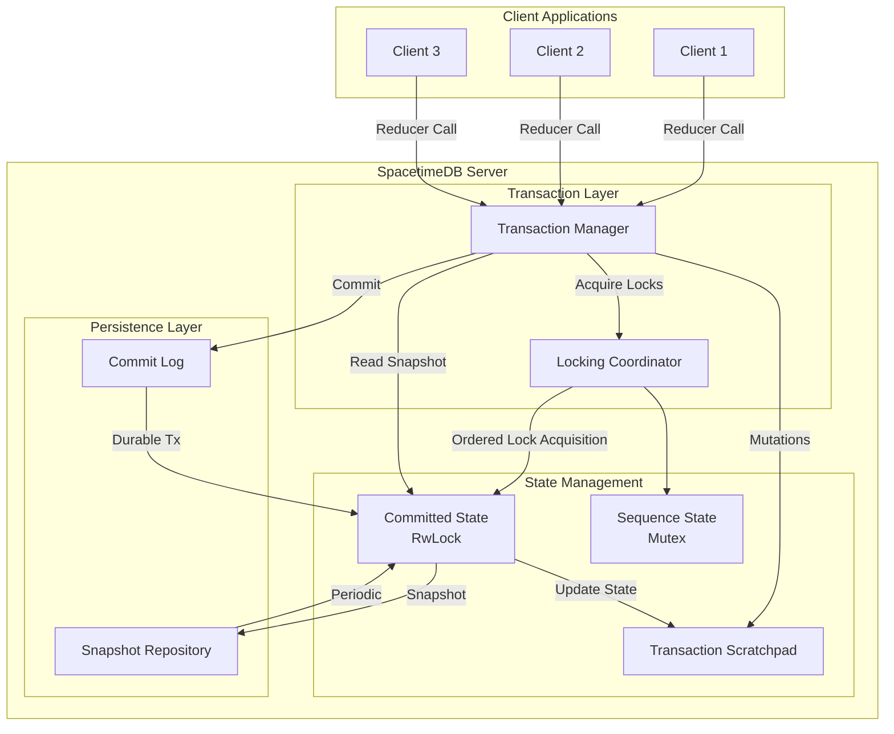
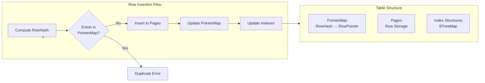
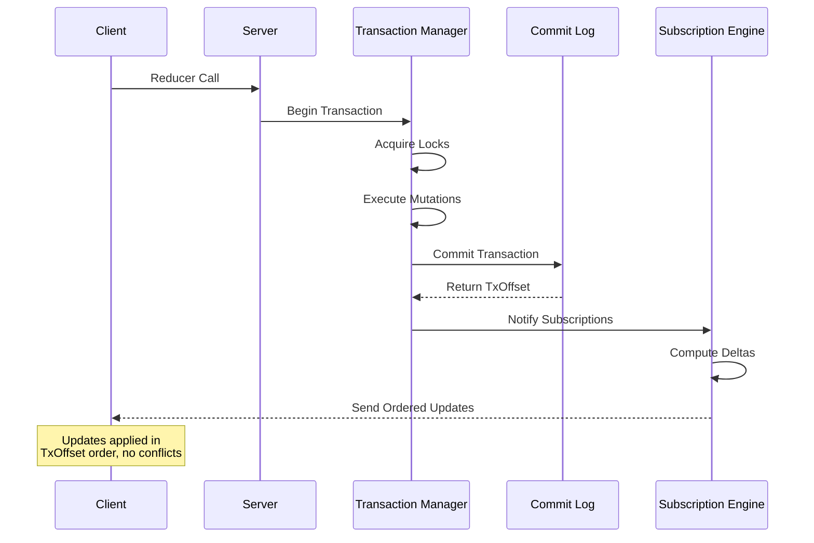

SpacetimeDB's consistency model is built on a centralized, sequential transaction processing architecture with strong ACID guarantees. By leveraging a single authoritative source of truth—the server's in-memory database with Write-Ahead Logging (WAL)—SpacetimeDB eliminates the complexity of distributed consensus protocols while providing deterministic conflict-free replication to clients through ordered event streams.

## Transaction Isolation Guarantees

SpacetimeDB implements a comprehensive isolation level hierarchy that determines the degree to which transactions are protected from concurrent operations. The isolation levels are ordered from weakest to strongest protections, with the enum variant order being significant for isolation level comparisons.

Sources: [traits.rs](crates/datastore/src/traits.rs#L17-L129)

| Isolation Level | Dirty Reads | Non-Repeatable Reads | Phantom Reads | Write Skew |
|-----------------|-------------|---------------------|---------------|------------|
| ReadUncommitted | Allowed | Allowed | Allowed | Allowed |
| ReadCommitted | Prevented | Allowed | Allowed | Allowed |
| RepeatableRead | Prevented | Prevented | Allowed | Allowed |
| Snapshot | Prevented | Prevented | Prevented | Allowed |
| Serializable | Prevented | Prevented | Prevented | Prevented |

**Snapshot Isolation** provides the foundation for most read operations in SpacetimeDB. When a transaction begins, it receives a consistent snapshot of the database state as it existed at transaction start time. This ensures all reads within the transaction observe the same committed state, preventing dirty reads, non-repeatable reads, and phantom reads. However, snapshot isolation does not prevent write skew anomalies—where concurrent transactions read the same data and make decisions that lead to mutually inconsistent modifications.

Sources: [traits.rs](crates/datastore/src/traits.rs#L80-L95)

**Serializable Isolation** represents the highest guarantee, where transactions execute with the illusion of being the only transaction running in the system. This level effectively serializes access to the database. Correct implementations either permit only one transaction at a time or track reads to ensure data read by one transaction hasn't been modified by another before commit.

<CgxTip>SpacetimeDB's transaction isolation design prioritizes consistency guarantees over relaxed isolation performance. Even at lower isolation levels, the datastore maintains all database consistency constraints including referential integrity, uniqueness constraints, and check constraints.</CgxTip>

## Centralized Transaction Processing Architecture

The consistency model relies on a centralized transaction processing pipeline where all mutations flow through a single point of coordination. This architecture eliminates the possibility of write-write conflicts at the source by enforcing a strict serialization order.



Sources: [datastore.rs](crates/datastore/src/locking_tx_datastore/datastore.rs#L60-L89)

### Lock-Based Concurrency Control

The locking mechanism enforces a strict acquisition order to prevent deadlocks: memory → committed_state → sequence_state. All locking operations are encapsulated within the datastore to ensure consistent ordering throughout the application.

Sources: [datastore.rs](crates/datastore/src/locking_tx_datastore/datastore.rs#L60-L89)

**Read-Only Transactions (`TxId`)** hold a shared lock on the committed state, allowing multiple concurrent readers. Each read transaction receives a consistent view of the database as of its start time, with the lock preventing concurrent mutable transactions from committing while reads are in progress.

Sources: [tx.rs](crates/datastore/src/locking_tx_datastore/tx.rs#L16-L42)

**Mutable Transactions (`MutTxId`)** hold an exclusive write lock on the committed state and a mutex on the sequence state. This ensures that only one mutable transaction can modify the database at a time, inherently preventing write-write conflicts. The transaction writes to a scratchpad state first, then atomically commits to the committed state.

Sources: [mut_tx.rs](crates/datastore/src/locking_tx_datastore/mut_tx.rs#L105-L140)

<CgxTip>The lock acquisition order is documented as the "most delicate function in the entire codebase" and should not be changed without thorough understanding of the deadlock implications.</CgxTip>

## Durability and Transaction Ordering

Transaction durability is managed through a monotonic transaction offset system that provides both ordering guarantees and persistence assurances.

### Transaction Offsets

The `TxOffset` serves as a monotonically increasing counter of all transactions submitted to the durability layer, starting from zero. While the implementation may contain gaps, it guarantees that a higher transaction offset implies durability of all smaller offsets.

Sources: [lib.rs](crates/durability/src/lib.rs#L24-L66)

```rust
pub type TxOffset = u64;
```

This offset-based system provides a simple yet powerful consistency primitive: when a client receives confirmation that transaction offset N is durable, it can trust that all transactions with offsets 0 through N-1 are also durable and have been applied in order.

### Write-Ahead Logging Architecture

The commitlog implements a segmented write-ahead log that provides non-blocking transaction persistence. Transactions are written to segments with configurable sizes, and segments are rotated as needed.

Sources: [commitlog.rs](crates/commitlog/src/commitlog.rs#L19-L58)

The log structure consists of:
- **Head Segment**: The active segment currently being written to
- **Tail Segments**: Historical segments containing committed transactions
- **Epochs**: Version markers that segment the log for recovery purposes

Each commit includes an epoch identifier, allowing the system to segment the log and support features like point-in-time recovery.

Sources: [commitlog.rs](crates/commitlog/src/commitlog.rs#L60-L110)

### Durability API

The durability layer provides a non-blocking `append_tx` method that accepts transaction payloads without waiting for confirmation of stable storage. This decouples transaction submission from persistence completion, allowing the system to accept new transactions even when storage is temporarily unavailable.

Sources: [lib.rs](crates/durability/src/lib.rs#L91-L110)

The `durable_tx_offset` method returns a `DurableOffset` handle that can be queried for the current durable offset or used to wait for a specific offset to become durable. This enables clients to implement their own consistency guarantees by waiting for appropriate offsets.

## In-Memory Consistency Mechanisms

Beyond transaction-level isolation, SpacetimeDB implements several in-memory mechanisms that ensure data consistency at the row and table levels.

### Row-Level Deduplication

Tables enforce set semantics through a `PointerMap`, which maintains a mapping from row hashes to row pointers. This structure prevents duplicate rows from being stored, ensuring that each unique combination of values can exist only once in a table.

Sources: [table.rs](crates/table/src/table.rs#L89-L140)



When a table has no unique constraints defined, the `PointerMap` serves as the primary mechanism for enforcing uniqueness. If the table does have unique indexes, those indexes inherently prevent duplicate rows, making the `PointerMap` redundant.

### Unique Constraint Enforcement

Unique constraints are enforced through specialized index structures that prevent duplicate key values. When a unique index exists for a set of columns, any insert or update that would create a duplicate key value is rejected.

Sources: [table.rs](crates/table/src/table.rs#L115-L140)

The system supports multiple unique indexes per table, each covering different column combinations. When inserting a row, all unique indexes are checked before the insert proceeds. If any unique constraint violation is detected, the entire transaction fails.

### Sequence State Management

Auto-incrementing sequences maintain their own isolated state protected by a dedicated mutex. This ensures that sequence values are allocated atomically without conflicts, even when multiple transactions simultaneously insert rows that depend on sequences.

Sources: [datastore.rs](crates/datastore/src/locking_tx_datastore/datastore.rs#L67-L89)

The sequence state is rebuilt from the committed state after replaying transactions from the commit log, ensuring that sequence allocation resumes from the correct position after recovery.

## Subscription-Based Conflict-Free Replication

Client-side consistency is maintained through a subscription mechanism that incrementally computes and propagates changes. Unlike operational transformation (OT) or conflict-free replicated data types (CRDTs), SpacetimeDB achieves conflict-free client synchronization through deterministic delta computation based on server-side transaction ordering.

Sources: [lib.rs](crates/subscription/src/lib.rs#L18-L110)

### Delta Computation Algorithm

The subscription system computes the difference between two database states (before and after a transaction) using a mathematical framework for incremental view maintenance. For a join between tables R and S, the delta is derived as:

```
V  = R × S
V' = R' × S'
dv = R'ds(+) U dr(+)S' U dr(+)ds(-) U dr(-)ds(+)
```

Where:
- `R, S` = original table states
- `R', S'` = new table states  
- `dr(+), dr(-)` = rows inserted/deleted in R
- `ds(+), ds(-)` = rows inserted/deleted in S

Sources: [lib.rs](crates/subscription/src/lib.rs#L62-L110)

This mathematical decomposition allows the system to compute the exact rows to be inserted into or removed from a subscribed view without re-evaluating the entire query.

### Deterministic Update Ordering

Clients receive updates in the exact order determined by the server's `TxOffset` sequence. Since all transactions commit to a single authoritative log, there is no ambiguity about which transaction "won" a conflict—higher offsets simply happened later in the global order.

This deterministic ordering means clients never need to resolve conflicts locally. When they receive an update, they can apply it directly knowing that it represents the authoritative state as determined by the server.

Sources: [lib.rs](crates/durability/src/lib.rs#L24-L66)



### Subscription Fragments

The subscription system compiles query plans into fragments that compute inserts and deletes separately. For simple single-table subscriptions, this results in one insert plan and one delete plan. For joins, the system generates multiple fragments to handle all combinations of delta operations across the joined tables.

Sources: [lib.rs](crates/subscription/src/lib.rs#L22-L60)

Each fragment operates on the committed state view and delta stores, ensuring that clients receive only the minimal set of changes needed to maintain their subscribed view in sync with the server.

## Recovery and State Reconstruction

SpacetimeDB's durability model includes robust recovery mechanisms that ensure consistency across restarts.

### Commit Log Replay

When a database initializes, it replays transactions from the commit log to reconstruct the database state. The replay process uses a special decoder that applies transactions in order to the committed state.

Sources: [datastore.rs](crates/datastore/src/locking_tx_datastore/datastore.rs#L137-L156)

After replaying all transactions, the system calls `rebuild_state_after_replay` to rebuild indexes and sequence state. This two-phase process is necessary because inserting rows into system tables during replay doesn't trigger the same side effects as runtime operations (e.g., creating a table by inserting into `st_tables` doesn't actually create the in-memory table structure).

Sources: [datastore.rs](crates/datastore/src/locking_tx_datastore/datastore.rs#L109-L126)

### Snapshot-Based Recovery

For faster recovery, SpacetimeDB supports periodic snapshots that capture the entire database state at a specific transaction offset. When restoring from a snapshot, the system:

1. Constructs all tables referenced by the snapshot
2. Populates tables with rows from the snapshot
3. Builds a blob store with all referenced large objects
4. Skips index and sequence construction (deferred until after commit log replay)
5. Replays any transactions committed after the snapshot's offset

Sources: [datastore.rs](crates/datastore/src/locking_tx_datastore/datastore.rs#L160-L221)

The snapshot recovery process explicitly avoids building indexes during replay because index operations during the initial bootstrap (TX 0) would fail. This careful ordering ensures successful recovery in all scenarios.

## Consistency Trade-offs and Considerations

SpacetimeDB's consistency model makes specific trade-offs optimized for real-time applications with a central authoritative server.

### No Distributed Consensus Overhead

By avoiding distributed consensus protocols like Raft or Paxos, SpacetimeDB achieves higher throughput and lower latency for write operations. The trade-off is that the server represents a single point of failure and potential bottleneck. This architecture is well-suited for applications where a central database server is already part of the deployment model.

### Strong Consistency vs. Availability

The system prioritizes strong consistency over availability in certain scenarios. When a mutable transaction holds the write lock on committed state, new mutable transactions must wait. This can impact write throughput under high concurrency. However, read-only transactions can continue concurrent with mutable transactions (subject to their lock wait time).

Sources: [tx.rs](crates/datastore/src/locking_tx_datastore/tx.rs#L16-L42)

### Eventual Consistency at Client Level

While the server maintains strong consistency, clients may experience temporary inconsistency due to network latency or buffering. The subscription system eventually delivers all updates, but clients may briefly observe stale data. This is intentional for performance—clients don't need to block waiting for acknowledgments before proceeding with local operations.

## Practical Implications for Developers

Understanding SpacetimeDB's consistency model has important implications for application design:

### Transaction Design

- **Keep transactions short**: Holding write locks for extended periods blocks other mutable transactions
- **Avoid long-running reads**: Although read transactions can run concurrently, extremely long reads can delay garbage collection and impact performance
- **Design for idempotency**: Although the system prevents write-write conflicts, designing reducers to be idempotent makes them more resilient to retry scenarios

### Subscription Optimization

- **Use targeted queries**: Narrow subscription queries reduce the delta computation overhead and network bandwidth
- **Leverage indexes**: Proper indexing ensures subscription evaluation can use index scans instead of full table scans
- **Handle out-of-order delivery gracefully**: While updates are ordered by TxOffset, network conditions can temporarily disrupt delivery order

### Reducer Implementation

- **Validate before mutating**: Since conflicts are rare (due to serialization), validators that check preconditions before making changes can avoid transaction rollbacks
- **Use constraints for invariants**: Database constraints (unique, foreign key, check) provide efficient enforcement of invariants without requiring custom validation logic
- **Monitor lock wait times**: Excessive lock wait times indicate contention and may suggest the need for architectural changes

## Next Steps

To deepen your understanding of SpacetimeDB's architecture and consistency model:

- **[Understanding Subscriptions](20-understanding-subscriptions)** - Learn more about how subscriptions work and how to optimize them for your use case
- **[In-Memory Architecture and WAL](29-in-memory-architecture-and-wal)** - Explore the technical details of how the commit log and WAL system operate
- **[Query Optimization](31-query-optimization)** - Understand how to structure queries to work efficiently with SpacetimeDB's execution engine
