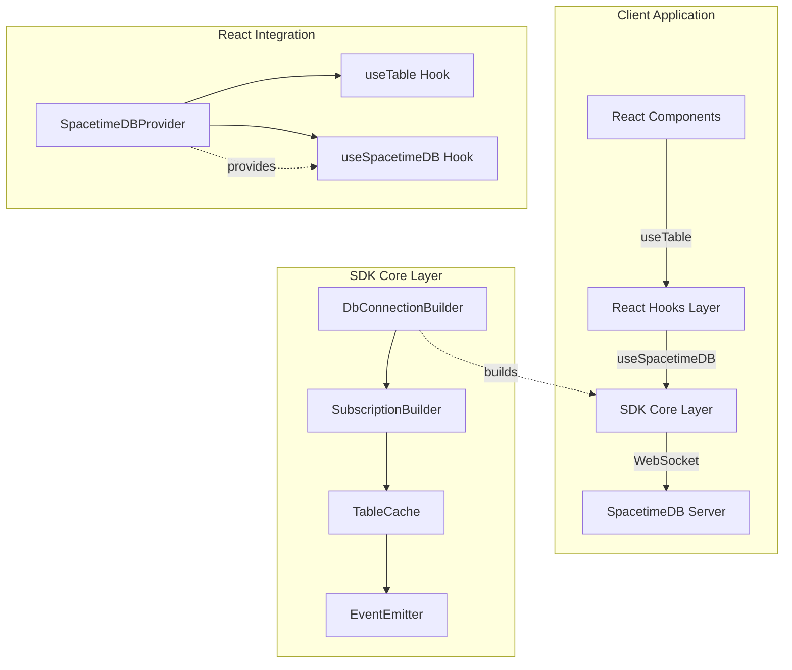
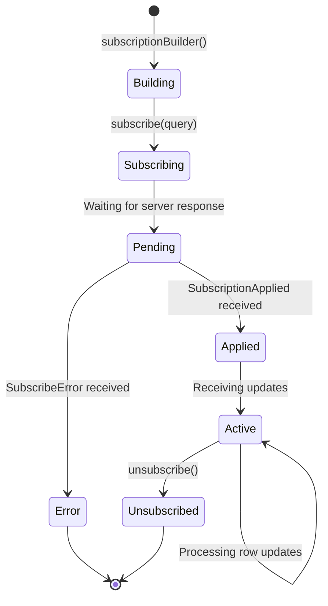

The SpacetimeDB TypeScript Client SDK provides a comprehensive, type-safe interface for interacting with SpacetimeDB from client applications. It enables real-time data synchronization, reducer invocation, and seamless integration with modern TypeScript/JavaScript environments including browsers, Node.js, React, Next.js, Deno, and Cloudflare Workers.

## Architecture Overview

The SDK follows a modular architecture with three main entry points designed for different use cases. The client SDK handles WebSocket-based connections with automatic reconnection, compression support, and a reactive subscription model. The React integration provides hooks-based APIs for seamless React component integration, while the server library offers type-safe table definitions and reducer implementations for server-side modules.



Sources: [package.json](crates/bindings-typescript/package.json#L1-L191), [README.md](crates/bindings-typescript/README.md#L1-L119)

## Installation

Install the SDK using your preferred package manager. The SDK is available on NPM as `spacetimedb`.

```bash
npm add spacetimedb
```

For Node.js versions 18-21, you must install `undici` as a peer dependency for WebSocket support:

```bash
npm add spacetimedb undici
```

Node.js 22 and later support WebSocket natively without additional dependencies. The SDK works with browser bundlers like Vite, Parcel, and rsbuild, as well as server-side runtimes including Deno, Bun, Next.js, Remix, and Cloudflare Workers.

Sources: [README.md](crates/bindings-typescript/README.md#L7-L18), [package.json](crates/bindings-typescript/package.json#L155-L163)

## Core SDK Concepts

### DbConnection and Connection Builder

The `DbConnectionBuilder` provides a fluent API for configuring and establishing database connections. The builder pattern allows chaining configuration methods before calling `build()` to create the connection.

**Builder Configuration Methods:**

| Method | Parameter | Description | Default |
|--------|-----------|-------------|---------|
| `withUri(uri)` | `string \| URL` | WebSocket server URI | Required |
| `withModuleName(name)` | `string` | Module name or address | Required |
| `withToken(token)` | `string \| undefined` | Authentication token | Optional |
| `withCompression(comp)` | `'gzip' \| 'none'` | Compression algorithm | `'gzip'` |
| `withLightMode(enabled)` | `boolean` | Reduces network data transfer | `false` |
| `withConfirmedReads(enabled)` | `boolean` | Waits for durable writes | Server default |
| `onConnect(callback)` | `(conn, identity, token) => void` | Connection success handler | Optional |
| `onConnectError(callback)` | `(ctx, error) => void` | Connection error handler | Optional |
| `onDisconnect(callback)` | `(error?) => void` | Disconnection handler | Optional |

Sources: [db_connection_builder.ts](crates/bindings-typescript/src/sdk/db_connection_builder.ts#L1-L264)

<CgxTip>Enable `lightMode` when bandwidth is constrained or initial data load is large. This mode reduces payload sizes but may require more fine-grained subscription management for optimal performance.</CgxTip>

### DbContext Interface

The `DbContext` interface represents an active database connection and provides access to database tables, reducers, and subscription management.

```typescript
interface DbContext<DBView, Reducers, SetReducerFlags> {
  db: DBView;                      // Type-safe access to database tables
  reducers: Reducers;              // Invokable reducer functions
  setReducerFlags: SetReducerFlags; // Reducer flag configuration
  isActive: boolean;               // Connection status
  subscriptionBuilder(): SubscriptionBuilderImpl<DBView, Reducers, SetReducerFlags>;
  disconnect(): void;              // Close the connection
}
```

Sources: [db_context.ts](crates/bindings-typescript/src/sdk/db_context.ts#L1-L36)

## Connection Establishment

Establishing a connection requires generating module bindings for your database using the SpacetimeDB CLI. The generated bindings provide type-safe access to your tables and reducers.

```typescript
import { DbConnection } from './module_bindings';

const connection = DbConnection.builder()
  .withUri('ws://localhost:3000')
  .withModuleName('chat_module')
  .withToken('optional-auth-token')
  .onConnect((conn, identity, token) => {
    console.log('Connected with identity:', identity.toHexString());
    // Save token for reconnection
    localStorage.setItem('stdb_token', token);
  })
  .onConnectError((ctx, error) => {
    console.error('Connection error:', error);
  })
  .onDisconnect((error) => {
    console.log('Disconnected', error ? `with error: ${error}` : '');
  })
  .build();
```

The `onConnect` callback receives the connection instance, a unique `Identity` object representing the client, and an authentication token. The identity can be converted to a hexadecimal string using `toHexString()` for display or storage purposes. The token should be persisted for future connections to maintain the same identity across sessions.

Sources: [README.md](crates/bindings-typescript/README.md#L23-L44), [db_connection_builder.ts](crates/bindings-typescript/src/sdk/db_connection_builder.ts#L160-L169)

## Subscriptions and Real-Time Data

Subscriptions enable real-time data synchronization from the server to the client. The subscription builder allows registering callbacks for lifecycle events and executing SQL queries.

### Subscription Lifecycle



### Subscription Builder API

```typescript
const subscription = connection.subscriptionBuilder()
  .onApplied((ctx) => {
    console.log('Subscription applied, initial rows loaded');
    console.log('Player count:', ctx.db.player.count());
  })
  .onError((ctx, error) => {
    console.error('Subscription error:', error);
  })
  .subscribe('SELECT * FROM player WHERE level > 10');

// Later, unsubscribe to stop receiving updates
subscription.unsubscribe();
```

The `onApplied` callback fires when the server acknowledges the subscription and sends the initial dataset. The context object provides access to all rows loaded into the client cache as a result of the subscription. The `onError` callback handles failures during subscription creation or unexpected subscription termination.

Sources: [subscription_builder_impl.ts](crates/bindings-typescript/src/sdk/subscription_builder_impl.ts#L1-L277)

### Table Event Handlers

For generated table bindings, you can register callbacks for row-level events directly on table handles:

```typescript
connection.db.player.onInsert((ctx, player) => {
  console.log('New player:', player.name, 'Level:', player.level);
});

connection.db.player.onDelete((ctx, player) => {
  console.log('Player deleted:', player.name);
});

connection.db.player.onUpdate((ctx, oldPlayer, newPlayer) => {
  console.log('Player updated:', oldPlayer.name, 'Level:', oldPlayer.level, '→', newPlayer.level);
});
```

These callbacks provide typed access to the affected rows, enabling reactive UI updates without manual subscription management.

Sources: [README.md](crates/bindings-typescript/README.md#L53-L59)

## Reducer Invocation

Reducers are server-side functions that can be invoked from the client. The SDK generates typed reducer functions that map directly to your module's reducers.

```typescript
// Call a simple reducer
connection.reducers.createPlayer({ name: 'Alice', level: 1 });

// Call a reducer with complex arguments
connection.reducers.movePlayer({ 
  playerId: playerId, 
  x: 100, 
  y: 200 
});

// Reducers can be awaited (if they return values)
const result = await connection.reducers.getPlayerStats({ playerId });
console.log('Stats:', result);
```

Reducer calls are sent to the server via the WebSocket connection and executed server-side with access to the database state and caller identity.

Sources: [README.md](crates/bindings-typescript/README.md#L61-L65)

## React Integration

The SDK provides React-specific utilities for seamless integration with React applications. These are available via the `spacetimedb/react` subpath.

### SpacetimeDBProvider

Wrap your application with `SpacetimeDBProvider` to make the connection available throughout the component tree:

```tsx
import { SpacetimeDBProvider } from 'spacetimedb/react';
import { DbConnection } from './module_bindings';

const connectionBuilder = DbConnection.builder()
  .withUri('ws://localhost:3000')
  .withModuleName('chat_module')
  .onConnect((conn, identity, token) => {
    conn.subscriptionBuilder().subscribe('SELECT * FROM message');
  });

ReactDOM.createRoot(document.getElementById('root')!).render(
  <React.StrictMode>
    <SpacetimeDBProvider connectionBuilder={connectionBuilder}>
      <App />
    </SpacetimeDBProvider>
  </React.StrictMode>
);
```

Sources: [SpacetimeDBProvider.ts](crates/bindings-typescript/src/react/SpacetimeDBProvider.ts#L1-L39), [README.md](crates/bindings-typescript/README.md#L72-L99)

### useTable Hook

The `useTable` hook subscribes to a table and provides reactive access to its rows. It supports filtering and event callbacks.

```tsx
import { useTable, where, eq } from 'spacetimedb/react';

function MessageList({ channelId }: { channelId: number }) {
  const { rows: messages, state } = useTable<DbConnection, Message>(
    'message',
    where(eq('channelId', channelId)),
    {
      onInsert: (msg) => console.log('New message:', msg.content),
      onDelete: (msg) => console.log('Deleted message:', msg.content),
      onUpdate: (oldMsg, newMsg) => console.log('Message edited'),
    }
  );

  if (state === 'loading') return <div>Loading messages...</div>;

  return (
    <div>
      {messages.map((msg) => (
        <div key={msg.id}>{msg.content}</div>
      ))}
    </div>
  );
}
```

**Filtering Expression Types:**

| Expression | Function | Description |
|------------|----------|-------------|
| `eq(column, value)` | Equality | Match exact value |
| `and(...exprs)` | Conjunction | All conditions must be true |
| `or(...exprs)` | Disjunction | Any condition must be true |

The hook returns a `Snapshot` object with `rows` (readonly array) and `state` (`'loading'` or `'ready'`). The state transitions from loading to ready once the initial subscription data is received.

Sources: [useTable.ts](crates/bindings-typescript/src/react/useTable.ts#L1-L437)

### useSpacetimeDB Hook

Access the connection instance and invoke reducers from within components:

```tsx
import { useSpacetimeDB } from 'spacetimedb/react';

function SendMessage() {
  const conn = useSpacetimeDB<DbConnection>();
  const [content, setContent] = useState('');

  const handleSubmit = () => {
    if (content.trim()) {
      conn.reducers.postMessage({ content });
      setContent('');
    }
  };

  return (
    <div>
      <input value={content} onChange={(e) => setContent(e.target.value)} />
      <button onClick={handleSubmit}>Send</button>
    </div>
  );
}
```

Sources: [react/index.ts](crates/bindings-typescript/src/react/index.ts#L1-L4)

## Event System

The SDK uses an event-driven architecture for handling database updates and reducer executions. Events are dispatched through an `EventEmitter` and processed by registered callbacks.

### Event Types

```typescript
type Event<Reducer> =
  | { tag: 'Reducer'; value: ReducerEvent<Reducer> }
  | { tag: 'SubscribeApplied' }
  | { tag: 'UnsubscribeApplied' }
  | { tag: 'Error'; value: Error }
  | { tag: 'UnknownTransaction' };
```

### Reducer Events

Reducer events contain detailed information about reducer execution:

```typescript
interface ReducerEvent<Reducer> {
  timestamp: number;              // When reducer started (Unix timestamp ms)
  status: UpdateStatus;          // 'Committed', 'Failed', or 'InsufficientEnergy'
  callerIdentity: Identity;      // Who invoked the reducer
  callerConnectionId?: ConnectionId; // Connection ID (null for scheduled reducers)
  energyConsumed?: bigint;       // Energy consumed in eV (optional)
  reducer: Reducer;               // Reducer name and arguments
}
```

Sources: [event.ts](crates/bindings-typescript/src/sdk/event.ts#L1-L9), [reducer_event.ts](crates/bindings-typescript/src/sdk/reducer_event.ts#L1-L46)

### Event Context Types

The SDK provides context types for different event scenarios:

```typescript
// General event context with database access
interface EventContextInterface<DBView, Reducers, SetReducerFlags, Reducer> {
  db: DBView;
  reducers: Reducers;
  setReducerFlags: SetReducerFlags;
  isActive: boolean;
  event: Event<Reducer>;
}

// Reducer-specific context
interface ReducerEventContextInterface<DBView, Reducers, SetReducerFlags, Reducer> {
  db: DBView;
  reducers: Reducers;
  setReducerFlags: SetReducerFlags;
  event: ReducerEvent<Reducer>;
}

// Subscription event context (no event field)
interface SubscriptionEventContextInterface<DBView, Reducers, SetReducerFlags> {
  db: DBView;
  reducers: Reducers;
  setReducerFlags: SetReducerFlags;
}
```

Sources: [event_context.ts](crates/bindings-typescript/src/sdk/event_context.ts#L1-L42)

## Client Cache and Table Operations

The `TableCache` class manages client-side data storage for subscribed tables, providing efficient updates and event emission.

### Cache Operations

The cache processes operations in batches for performance, handling inserts, deletes, and updates while maintaining reference counts for rows across multiple subscriptions.

```typescript
interface Operation<RowType> {
  type: 'insert' | 'delete';
  rowId: ComparablePrimitive;  // Primary key or row encoding
  row: RowType;
}

interface TableUpdate<RowType> {
  tableName: string;
  operations: Operation<RowType>[];
}
```

The cache automatically deduplicates operations based on primary keys, merging consecutive inserts and deletes of the same row into update operations when appropriate.

Sources: [table_cache.ts](crates/bindings-typescript/src/sdk/table_cache.ts#L1-L335)

<CgxTip>For tables without primary keys, the SDK encodes the entire row as the row ID. This is less efficient than primary-key-based identification. Always define primary keys on your tables for optimal client-side performance.</CgxTip>

## Type System and Module Bindings

The SDK generates TypeScript bindings from your SpacetimeDB module schema, providing compile-time type safety for all database operations.

### Generated Types

For a server-side table definition like this:

```typescript
// Server-side module
import { table, t } from 'spacetimedb/server';

export const Player = table({
  name: 'Player',
  public: true,
}, {
  id: t.u64().autoIncrement(),
  name: t.string(),
  level: t.u32(),
});
```

The generated client bindings include:

```typescript
// Generated client bindings
export interface Player {
  id: bigint;
  name: string;
  level: number;
}

export interface DbConnection extends DbContext<DbView, Reducers, SetReducerFlags> {}

export interface DbView {
  player: TableHandle<'player'> & {
    onInsert(cb: (ctx: EventContext, row: Player) => void): void;
    onDelete(cb: (ctx: EventContext, row: Player) => void): void;
    onUpdate(cb: (ctx: EventContext, oldRow: Player, newRow: Player) => void): void;
  };
}

export interface Reducers {
  createPlayer(args: { name: string; level: number }): void;
  updateLevel(args: { playerId: bigint; newLevel: number }): void;
}
```

Sources: [table.ts](crates/bindings-typescript/src/server/table.ts#L1-L150), [sdk-test-ts/src/index.ts](modules/sdk-test-ts/src/index.ts#L1-L200)

## Environment-Specific Considerations

### Browser Environment

The SDK uses the native WebSocket API in browsers. Compression is handled via a custom `WebsocketDecompressAdapter` that decompresses gzip payloads as they arrive over the connection.

### Node.js Environment

For Node.js 18-21, the `undici` package provides WebSocket support. Node.js 22+ includes native WebSocket support. The SDK automatically detects the environment and uses the appropriate implementation.

### Server-Side Rendering

The `SpacetimeDBProvider` builds the connection when mounted. For SSR frameworks like Next.js, you may need to conditionally render the provider only on the client side to prevent WebSocket connection attempts during server rendering.

```tsx
'use client';

import { SpacetimeDBProvider } from 'spacetimedb/react';
import { DbConnection } from './module_bindings';

export function Providers({ children }: { children: React.ReactNode }) {
  const connectionBuilder = DbConnection.builder()
    .withUri('ws://localhost:3000')
    .withModuleName('my_module');

  return (
    <SpacetimeDBProvider connectionBuilder={connectionBuilder}>
      {children}
    </SpacetimeDBProvider>
  );
}
```

Sources: [websocket_decompress_adapter.ts](crates/bindings-typescript/src/sdk/websocket_decompress_adapter.ts), [README.md](crates/bindings-typescript/README.md#L15-L18)

## Error Handling and Best Practices

### Connection Errors

Handle connection errors through the `onConnectError` callback:

```typescript
DbConnection.builder()
  .onConnectError((ctx, error) => {
    if (error.message.includes('authentication')) {
      // Clear invalid token and prompt for re-authentication
      localStorage.removeItem('stdb_token');
    } else {
      // Implement exponential backoff for reconnection
      setTimeout(() => {
        ctx.reconnect();
      }, Math.pow(2, ctx.retryCount) * 1000);
    }
  });
```

### Subscription Errors

Subscribe errors occur when the query is invalid or the server rejects the subscription:

```typescript
connection.subscriptionBuilder()
  .onError((ctx, error) => {
    console.error('Subscription failed:', error.message);
    // Implement fallback or retry logic
  })
  .subscribe('SELECT * FROM invalid_table');
```

### Performance Best Practices

- **Batch subscriptions**: Subscribe to all required tables in a single query when possible
- **Use primary keys**: Always define primary keys on tables for efficient client caching
- **Filter server-side**: Use SQL WHERE clauses to limit data transfer
- **Enable light mode**: Reduce payload sizes when bandwidth is constrained
- **Manage subscription scope**: Unsubscribe from data no longer needed

## API Reference Summary

### Core Exports

| Export | Description |
|--------|-------------|
| `DbConnection` | Main connection interface (generated) |
| `DbConnectionBuilder` | Connection configuration builder |
| `DbContext` | Database context interface |
| `Identity` | Client identity type |
| `ConnectionId` | Connection identifier type |
| `Timestamp` | Timestamp type |

### React Exports

| Export | Description |
|--------|-------------|
| `SpacetimeDBProvider` | React context provider |
| `useSpacetimeDB` | Access connection in components |
| `useTable` | Subscribe to table data |
| `where`, `eq`, `and`, `or` | Filter expression builders |

### Server Exports (`spacetimedb/server`)

| Export | Description |
|--------|-------------|
| `table` | Define database tables |
| `schema` | Create module schema |
| `t` | Type builders (t.string, t.u32, etc.) |
| `reducer` | Define reducer functions |

Sources: [package.json](crates/bindings-typescript/package.json#L45-L75), [sdk/index.ts](crates/bindings-typescript/src/sdk/index.ts#L1-L6)

## Next Steps

- Explore [Understanding Subscriptions](20-understanding-subscriptions) to learn about subscription patterns and optimization strategies
- Review [React Integration Guide](27-unity-integration-guide) for deeper React-specific patterns
- Study [Identity and Authentication](18-identity-and-authentication) for secure connection management
- See [Rust Client SDK Reference](24-rust-client-sdk-reference) for comparison with the Rust SDK
- Read [SQL Queries for Real-Time Data](21-sql-queries-for-real-time-data) for advanced querying techniques
