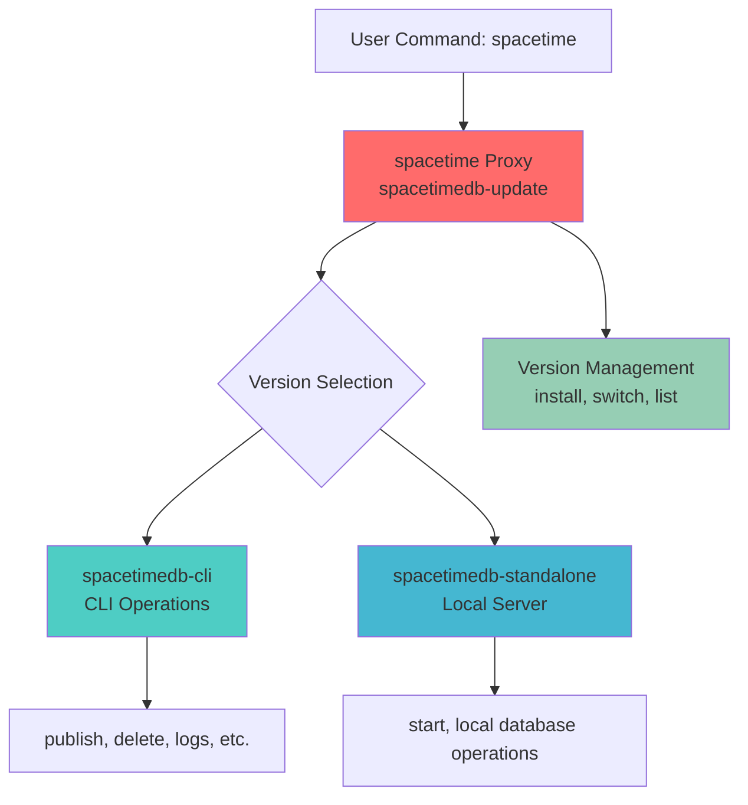
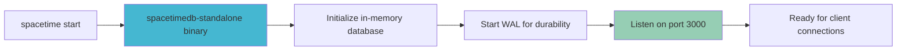

The SpacetimeDB CLI is your primary interface for managing databases, deploying modules, and orchestrating the entire development workflow. This guide will walk you through the installation process for your platform and get you ready to start building real-time applications.

## Understanding the CLI Architecture

The SpacetimeDB CLI system consists of three interconnected binaries that work together to provide a seamless development experience. The architecture follows a version-management pattern where a lightweight proxy (`spacetime`) delegates to version-specific binaries (`spacetimedb-cli` and `spacetimedb-standalone`).



<CgxTip>
The `spacetime` command is actually a proxy to `spacetimedb-update`, which manages version switching. This design allows you to maintain multiple SpacetimeDB versions simultaneously and switch between them effortlessly using `spacetime version use <version>`.</CgxTip>

## Installation Methods Overview

SpacetimeDB provides three installation approaches, each suited to different use cases and development environments:

| Method | Best For | Complexity | Offline Capable | Update Mechanism |
|--------|----------|------------|-----------------|------------------|
| **Script Installation** | Quick start, production deployment | Low | No | Automatic via `spacetime` |
| **Docker** | Containerized workflows, testing | Low | Yes (with local image) | Manual image pull |
| **Build from Source** | Custom modifications, bleeding-edge features | High | Yes | Manual rebuild |


## Installing via Script (Recommended)

The script-based installation is the fastest path to getting SpacetimeDB running on your machine. The scripts automatically download the appropriate binaries for your platform and set up the version management system.

### macOS Installation

For macOS users, the installation process is streamlined into a single command:

```bash
curl -sSf https://install.spacetimedb.com | sh
```

This command will:
1. Download the latest Spacetime binaries
2. Install them to `~/.local/bin` and `~/.local/share/spacetime/bin/`
3. Add the `spacetime` command to your PATH
4. Configure version management

Sources: [README.md](README.md#L73-L78)

### Linux Installation

Linux users follow the identical installation process:

```bash
curl -sSf https://install.spacetimedb.com | sh
```

The script handles distribution differences automatically and sets up the appropriate directory structure for your Linux environment.

Sources: [README.md](README.md#L80-L85)

### Windows Installation

Windows users have two installation paths: native PowerShell or Windows Subsystem for Linux (WSL).

#### Native PowerShell Installation

For native Windows development:

```powershell
iwr https://windows.spacetimedb.com -useb | iex
```

This PowerShell command will:
- Download Windows-specific binaries
- Install to `%USERPROFILE%\AppData\Local\SpacetimeDB\`
- Configure the system PATH for global access

#### WSL Installation

If you prefer working in a Linux-like environment on Windows, follow the Linux installation instructions within your WSL terminal.

Sources: [README.md](README.md#L87-L92)

## Installation Verification

After completing the installation, verify that SpacetimeDB is correctly installed:

```bash
spacetime --version
```

This should display version information similar to:
```
spacetimedb tool version 1.0.0; commit abc123def456
```

If you see the version output, your installation is successful. If you receive a "command not found" error, ensure that the installation directory is in your system PATH.

## Understanding Version Management

SpacetimeDB's version system allows you to maintain multiple versions simultaneously, which is crucial for testing across different releases or managing compatibility requirements.

### Listing Available Versions

```bash
spacetime version list
```

This command displays all installed versions and marks the currently active version.

### Switching Versions

```bash
spacetime version use <version>
```

Replace `<version>` with the version string you want to activate (e.g., `1.0.0`). The proxy will redirect all subsequent `spacetime` commands to the specified version.

Sources: [crates/cli/src/subcommands/version.rs](crates/cli/src/subcommands/version.rs#L1-L50), [README.md](README.md#L130-L136)

## CLI Directory Structure

Understanding where SpacetimeDB stores its files helps with troubleshooting and configuration management.

### Unix-like Systems (macOS, Linux)

```
~/.local/bin/
└── spacetime                    # Version proxy (spacetimedb-update)

~/.local/share/spacetime/
├── bin/
│   └── 1.0.0/
│       ├── spacetimedb-cli      # CLI binary for version 1.0.0
│       └── spacetimedb-standalone # Local server for version 1.0.0
└── config/
    └── cli.toml                 # CLI configuration
```

### Windows

```
%USERPROFILE%\AppData\Local\SpacetimeDB\
├── spacetime.exe                # Version proxy (spacetimedb-update)
├── bin\
│   └── 1.0.0\
│       ├── spacetimedb-cli.exe
│       └── spacetimedb-standalone.exe
└── config\
    └── cli.toml
```

Sources: [crates/paths](crates/paths), [README.md](README.md#L110-L128)

## First Steps After Installation

Once your CLI is installed, you can immediately start using SpacetimeDB's core features.

### Starting a Local Database

Launch a local SpacetimeDB instance for development:

```bash
spacetime start
```

The standalone server starts on port `3000` by default and runs in the foreground. You can customize the listening address with `--listen-addr`.



<CgxTip>
Standalone mode runs in the foreground, making it ideal for development and debugging. For production deployments, consider running it as a background service or using Docker containerization.</CgxTip>

Sources: [crates/cli/src/subcommands/start.rs](crates/cli/src/subcommands/start.rs#L1-L50), [docs/docs/getting-started.md](docs/docs/getting-started.md#L1-L15)

### Authentication Setup

SpacetimeDB uses GitHub authentication to manage database ownership and prevent unauthorized access:

```bash
spacetime login
```

This command opens a browser window where you authenticate with GitHub. After authentication, your identity token is stored locally and used for operations that require authorization, such as publishing databases to SpacetimeDB's cloud service.

Sources: [docs/docs/getting-started.md](docs/docs/getting-started.md#L16-L24)

## Building from Source

Building from source is recommended only when you need features that haven't been released yet or when contributing to SpacetimeDB development.

### Prerequisites

**All Platforms:**
- Rust toolchain with `cargo`
- `wasm32-unknown-unknown` target: `rustup target add wasm32-unknown-unknown`

**Windows Additional Requirements:**
- Strawberry Perl (for OpenSSL dependency)
- Git for Windows (recommended) or native PowerShell

Sources: [README.md](README.md#L95-L110), [README.md](README.md#L160-L170)

### Build and Installation Process

**macOS and Linux:**

```bash
# Clone the repository
git clone https://github.com/clockworklabs/SpacetimeDB
cd SpacetimeDB

# Build all required binaries
cargo build --locked --release -p spacetimedb-standalone -p spacetimedb-update -p spacetimedb-cli

# Create directory structure
mkdir -p ~/.local/bin
export STDB_VERSION="$(./target/release/spacetimedb-cli --version | sed -n 's/.*spacetimedb tool version \([0-9.]*\);.*/\1/p')"
mkdir -p ~/.local/share/spacetime/bin/$STDB_VERSION

# Install binaries
cp target/release/spacetimedb-update ~/.local/bin/spacetime
cp target/release/spacetimedb-cli ~/.local/share/spacetime/bin/$STDB_VERSION
cp target/release/spacetimedb-standalone ~/.local/share/spacetime/bin/$STDB_VERSION

# Add to PATH and set version
export PATH="$HOME/.local/bin:$PATH"
spacetime version use $STDB_VERSION
```

**Windows (PowerShell):**

```powershell
# Clone the repository
git clone https://github.com/clockworklabs/SpacetimeDB
cd SpacetimeDB

# Build binaries
cargo build --locked --release -p spacetimedb-standalone -p spacetimedb-update -p spacetimedb-cli

# Create directory structure
$stdbDir = "$HOME\AppData\Local\SpacetimeDB"
$stdbVersion = & ".\target\release\spacetimedb-cli" --version | Select-String -Pattern 'spacetimedb tool version ([0-9.]+);' | ForEach-Object { $_.Matches.Groups[1].Value }
New-Item -ItemType Directory -Path "$stdbDir\bin\$stdbVersion" -Force | Out-Null

# Install binaries
Copy-Item "target\release\spacetimedb-update.exe" "$stdbDir\spacetime.exe"
Copy-Item "target\release\spacetimedb-cli.exe" "$stdbDir\bin\$stdbVersion\"
Copy-Item "target\release\spacetimedb-standalone.exe" "$stdbDir\bin\$stdbVersion\"

# Add to PATH and set version
spacetime version use $stdbVersion
```

Sources: [README.md](README.md#L112-L160), [README.md](README.md#L172-L195)

## Troubleshooting Common Installation Issues

### Command Not Found

If `spacetime --version` returns "command not found":

1. **Verify Installation Directory:**
   - Unix: Check `~/.local/bin` exists and contains `spacetime`
   - Windows: Check `%USERPROFILE%\AppData\Local\SpacetimeDB` exists and contains `spacetime.exe`

2. **Update PATH:**
   - Unix (add to `~/.bashrc` or `~/.zshrc`): `export PATH="$HOME/.local/bin:$PATH"`
   - Windows: Add `%USERPROFILE%\AppData\Local\SpacetimeDB` to system PATH

3. **Refresh Shell:**
   - Open a new terminal session after modifying PATH

### Permission Denied

If you encounter permission errors during installation:

- Unix systems: Ensure you have write permissions for `~/.local/bin` and `~/.local/share/spacetime/`
- Windows: Run PowerShell as Administrator if installing to system directories

### Windows Build Failures

If building from source fails on Windows:

1. Verify Strawberry Perl is installed and accessible: `which perl` should return `/c/Strawberry/perl/bin/perl`
2. Ensure OpenSSL binary is available: `which openssl` should return a valid path
3. Check that Cargo is in your PATH: `which cargo`

Sources: [README.md](README.md#L95-L110), [crates/update/src/main.rs](crates/update/src/main.rs#L1-L10)

## CLI Command Overview

The SpacetimeDB CLI provides a comprehensive set of commands for database management:

| Category | Commands | Purpose |
|----------|----------|---------|
| **Database Operations** | `publish`, `delete`, `logs`, `describe` | Create, manage, and inspect databases |
| **Data Interaction** | `sql`, `call`, `subscribe` | Query data, invoke reducers, set up subscriptions |
| **Project Management** | `init`, `build`, `generate` | Initialize projects, build modules, generate client code |
| **Authentication** | `login`, `logout` | Manage GitHub authentication |
| **Server Management** | `start`, `server` | Start local instances, manage server connections |
| **Utilities** | `version`, `list`, `energy` | Manage versions, list databases, check energy budgets |

Sources: [docs/docs/cli-reference.md](docs/docs/cli-reference.md#L1-L100)

## What's Next?

After successfully installing the SpacetimeDB CLI, you're ready to begin your development journey. Here are the recommended next steps:

1. **[Quick Start](2-quick-start)** - Follow a hands-on tutorial to create your first SpacetimeDB database and connect a client
2. **[Running with Docker](4-running-with-docker)** - Learn how to run SpacetimeDB in containerized environments
3. **[Building from Source](5-building-from-source)** - Detailed guide for compiling SpacetimeDB from the repository
4. **[Understanding the Database-Server Hybrid Architecture](9-understanding-the-database-server-hybrid-architecture)** - Deep dive into SpacetimeDB's unique architecture

For a complete overview of available documentation, explore the [Overview](1-overview) page.

Sources: [README.md](README.md#L220-L250), [docs/docs/index.md](docs/docs/index.md#L1-L30)

## Additional Resources

- **Official Documentation:** https://spacetimedb.com/docs
- **Installation Page:** https://spacetimedb.com/install
- **GitHub Repository:** https://github.com/clockworklabs/SpacetimeDB
- **Discord Community:** https://discord.gg/spacetimedb

The CLI is your gateway to building real-time, multiplayer applications with SpacetimeDB. Whether you're developing games, collaborative tools, or chat applications, the CLI provides everything you need to manage the complete application lifecycle from development to deployment.
