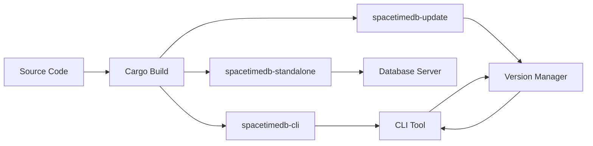
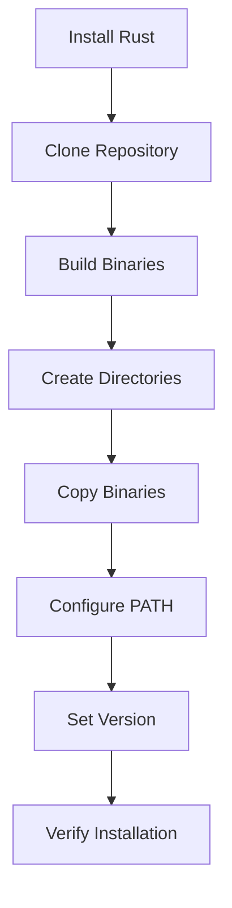

This guide explains how to build SpacetimeDB from source code. Building from source is recommended when you need access to unreleased features from the `master` branch or want to contribute to development. For production use, follow the [official installation instructions](3-installing-spacetimedb-cli).

## Architecture Overview

SpacetimeDB is a Rust-based database-server hybrid that compiles into multiple components:


The build process generates three main binaries that work together:
- `spacetimedb-standalone`: The database server that hosts your modules
- `spacetimedb-cli`: The command-line interface for managing SpacetimeDB
- `spacetimedb-update`: Handles version management and updates



Sources: [rust-toolchain.toml](/rust-toolchain.toml#L1-L9), [Cargo.toml](/Cargo.toml#L1-L52), [crates/standalone/src/lib.rs](/crates/standalone/src/lib.rs#L1-L50)

## Prerequisites

Before building SpacetimeDB, ensure your system meets these requirements:

### Common Requirements

| Requirement | Version | Purpose |
|-------------|---------|---------|
| Rust | 1.90.0 | Programming language for core build |
| Cargo | Latest | Package manager |
| WASM Target | wasm32-unknown-unknown | WebAssembly module compilation |
| Git | Latest | Version control for cloning |

Sources: [rust-toolchain.toml](/rust-toolchain.toml#L1-L9), [Cargo.toml](/Cargo.toml#L58-L62)

### Platform-Specific Requirements

<CgxTip>The `wasm32-unknown-unknown` target is essential for building SpacetimeDB modules that run in WebAssembly. Without it, you cannot compile or deploy modules.</CgxTip>

| Platform | Additional Dependencies | Notes |
|----------|------------------------|-------|
| **macOS/Linux** | Standard build tools | Xcode Command Line Tools on macOS |
| **Windows** | Strawberry Perl, OpenSSL | Git for Windows recommended |

Sources: [README.md](/README.md#L143-L153), [Dockerfile](/Dockerfile#L6-L14)

## Building on macOS and Linux

The build process for Unix-like systems follows a straightforward workflow:



### Step 1: Install Rust and Required Components

First, install Rust if you haven't already:

```bash
curl https://sh.rustup.rs -sSf | sh
```

After installation, add the WASM target required for module compilation:

```bash
rustup target add wasm32-unknown-unknown
```

### Step 2: Clone the Repository

Clone the SpacetimeDB source code:

```bash
git clone https://github.com/clockworklabs/SpacetimeDB
cd SpacetimeDB
```

### Step 3: Build the Binaries

Build all three required binaries in release mode:

```bash
cargo build --locked --release -p spacetimedb-standalone -p spacetimedb-update -p spacetimedb-cli
```

The `--locked` flag ensures reproducible builds by using the exact dependency versions from `Cargo.lock`. The `-p` flags specify which workspace members to build from the [Cargo.toml workspace](/Cargo.toml#L3-L46).

### Step 4: Install the Binaries

Create the necessary directory structure and copy the built binaries:

```bash
# Create directories
mkdir -p ~/.local/bin
export STDB_VERSION="$(./target/release/spacetimedb-cli --version | sed -n 's/.*spacetimedb tool version \([0-9.]*\);.*/\1/p')"
mkdir -p ~/.local/share/spacetime/bin/$STDB_VERSION

# Install the update binary to main location
cp target/release/spacetimedb-update ~/.local/bin/spacetime

# Install versioned binaries
cp target/release/spacetimedb-cli ~/.local/share/spacetime/bin/$STDB_VERSION
cp target/release/spacetimedb-standalone ~/.local/share/spacetime/bin/$STDB_VERSION
```

### Step 5: Configure Your PATH

Add the SpacetimeDB binary directory to your PATH environment variable. Add this line to your shell configuration (`~/.bashrc`, `~/.zshrc`, or `~/.profile`):

```bash
export PATH="$HOME/.local/bin:$PATH"
```

**Important**: After adding this line, open a new terminal session for the changes to take effect.

### Step 6: Set the Active Version

Configure SpacetimeDB to use the version you just built:

```bash
# In a new shell session
spacetime version use $STDB_VERSION

# Or list available versions if STDB_VERSION is not set
spacetime version list
```

### Step 7: Verify Installation

Confirm the installation was successful:

```bash
spacetime --version
```

You should see output similar to: `spacetimedb tool version 1.6.0; [commit hash]`

Sources: [README.md](/README.md#L126-L161), [Cargo.toml](/Cargo.toml#L67-L69)

## Building on Windows

Windows builds require additional setup due to Perl and OpenSSL dependencies.

### Step 1: Install Prerequisites

1. **Install Strawberry Perl**: Download from [strawberryperl.com](https://strawberryperl.com/). This provides the required Perl executable.

2. **Verify OpenSSL**: Git for Windows includes OpenSSL. Verify your installation:

```powershell
# In Git for Windows shell
which perl    # Should show: /c/Strawberry/perl/bin/perl
which openssl # Should show: /mingw64/bin/openssl
which cargo   # Should show your cargo path
```

3. **Install .NET SDK 8.0**: Required for C# binding compilation. SpacetimeDB uses .NET 8.0.100 as specified in [global.json](/global.json#L1-L7).

Sources: [README.md](/README.md#L143-L153), [Dockerfile](/Dockerfile#L23-L27), [global.json](/global.json#L1-L7)

### Step 2: Clone and Build

```powershell
# Clone SpacetimeDB
git clone https://github.com/clockworklabs/SpacetimeDB
cd SpacetimeDB

# Build and install the CLI
cargo build --locked --release -p spacetimedb-standalone -p spacetimedb-update -p spacetimedb-cli
```

### Step 3: Install the Binaries

```powershell
# Create directories
$stdbDir = "$HOME\AppData\Local\SpacetimeDB"
$stdbVersion = & ".\target\release\spacetimedb-cli.exe" --version | Select-String -Pattern 'spacetimedb tool version ([0-9.]+);' | ForEach-Object { $_.Matches.Groups[1].Value }
New-Item -ItemType Directory -Path "$stdbDir\bin\$stdbVersion" -Force | Out-Null

# Install the update binary
Copy-Item "target\release\spacetimedb-update.exe" "$stdbDir\spacetime.exe"
Copy-Item "target\release\spacetimedb-cli.exe" "$stdbDir\bin\$stdbVersion\"
Copy-Item "target\release\spacetimedb-standalone.exe" "$stdbDir\bin\$stdbVersion\"
```

### Step 4: Configure PATH

Add `$HOME\AppData\Local\SpacetimeDB` to your system PATH environment variable through Windows System Properties or use:

```powershell
# Add to current session (add to System Environment Variables for persistence)
$env:PATH += ";$HOME\AppData\Local\SpacetimeDB"
```

### Step 5: Set and Verify Version

```powershell
spacetime version use $stdbVersion
spacetime --version
```

Sources: [README.md](/README.md#L143-L180)

## Testing Your Build

After building, you can verify that all components work correctly by running the test suite:

```bash
# Run all tests
cargo test --all

# Run comprehensive test suite including smoketests
tools/run-all-tests.sh
```

The test suite includes:
- Rust unit tests across all workspace crates
- Integration tests
- Smoke tests
- C# binding tests (if .NET is installed)

Sources: [tools/run-all-tests.sh](/tools/run-all-tests.sh#L1-L30)

## Building Documentation

If you want to build and test the documentation locally:

```bash
# Install Node.js (>=18.0.0) and pnpm (>=9.0.0)
cd docs
pnpm install
pnpm build
```

This builds the documentation site that serves content at spacetimedb.com/docs.

Sources: [docs/README.md](/docs/README.md#L8-L38), [package.json](/package.json#L1-L29)

## Alternative: Building with Docker

If you prefer containerized builds or need a reproducible environment:

```bash
docker-compose build
docker-compose up -d
```

This creates a development environment with SpacetimeDB running on port 3000 and includes volume mounts for hot-reloading during development.

Sources: [docker-compose.yml](/docker-compose.yml#L1-L55), [Dockerfile](/Dockerfile#L1-L57)

## Troubleshooting

### Common Issues

| Issue | Solution |
|-------|----------|
| **Rust version mismatch** | Ensure Rust 1.90.0 is installed: `rustup install 1.90.0 && rustup default 1.90.0` |
| **WASM target missing** | Add target: `rustup target add wasm32-unknown-unknown` |
| **Perl not found (Windows)** | Install Strawberry Perl from strawberryperl.com |
| **Build timeout** | Increase timeout or try `cargo build` without `--release` for faster debug builds |
| **Memory issues** | Ensure adequate RAM (8GB+ recommended) and close other applications |

<CgxTip>If you encounter build errors related to `librusty_v8` on macOS, try building with Nix using the provided [flake.nix](/flake.nix#L1-L30) configuration, which handles this dependency correctly.</CgxTip>

### Platform-Specific Debugging

**Linux/macOS**:
- Check Rust installation: `rustc --version` and `cargo --version`
- Verify WASM target: `rustup target list --installed`
- Check dependencies: `ldd target/release/spacetimedb-cli` (Linux only)

**Windows**:
- Verify Strawberry Perl location matches expected path
- Ensure Git for Windows is in your PATH
- Check .NET SDK: `dotnet --version`

Sources: [flake.nix](/flake.nix#L1-L30), [Cargo.toml](/Cargo.toml#L58-L62)

## Project Structure

Understanding the workspace structure helps with targeted builds:

```
SpacetimeDB/
├── crates/              # Core Rust crates
│   ├── cli/            # Command-line interface
│   ├── standalone/     # Standalone database server
│   ├── update/         # Version management
│   └── ...             # 25+ other crates
├── modules/            # Example modules
├── sdks/               # Client SDKs (Rust, C#, Unreal)
├── docs/               # Documentation source
└── tools/              # Build and testing utilities
```

You can build individual crates if needed:
```bash
cargo build --release -p spacetimedb-core
cargo build --release -p spacetimedb-lib
```

Sources: [Cargo.toml](/Cargo.toml#L3-L46), [crates/cli/src/main.rs](/crates/cli/src/main.rs#L1-L50)

## Next Steps

After successfully building from source:

1. **Learn the architecture**: Explore [Understanding the Database-Server Hybrid Architecture](9-understanding-the-database-server-hybrid-architecture) to understand SpacetimeDB's design principles.

2. **Start developing modules**: Follow the [Rust Module Development Guide](15-rust-module-development-guide) or [C# Module Development Guide](16-c-module-development-guide) to create your first module.

3. **Try the quickstart**: Build and run the [quickstart-chat](https://github.com/clockworklabs/SpacetimeDB/tree/master/modules/quickstart-chat) example module to see SpacetimeDB in action.

4. **Explore client SDKs**: Check the client SDK references for [Rust](24-rust-client-sdk-reference), [C#](25-c-client-sdk-reference), or [TypeScript](26-typescript-client-sdk-reference).

5. **Consider Docker**: For production deployments, explore [Running with Docker](4-running-with-docker) as an alternative to source builds.

Building from source gives you complete control over your SpacetimeDB environment and access to the latest features. Happy developing!
